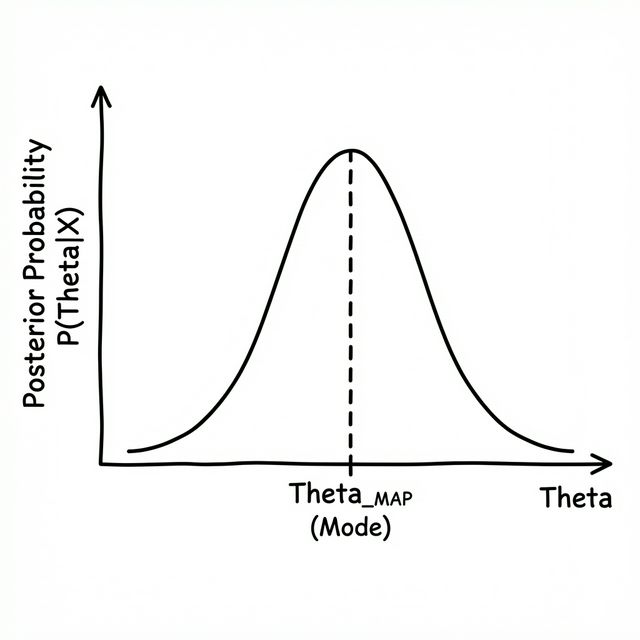

# 绪论

## 一、 核心两大流派与研究方向

- **频率派 (Frequentist) → 统计机器学习 (Statistical Machine Learning)**
  - 侧重于模型优化、正则化以及对已知数据的拟合。
- **贝叶斯派 (Bayesian) → 概率图模型 (Probabilistic Graphical Models, PGM)**
  - 侧重于先验概率的引入、后验推断以及变量间的依赖关系。

---

## 二、 推荐教材 (Books)

### 1. 入门与进阶经典

- **《统计学习方法》 — 李航**
  - *特点：* 专注"十二章、十个算法"，是国内公认的统计机器学习敲门砖。
- **《机器学习》（西瓜书） — 周志华**
  - *特点：* 内容全面，结构严谨，适合建立完整的学科体系。

### 2. 国际泰斗级著作 (英文原著及译本)

- **PRML (*Pattern Recognition and Machine Learning*) — Christopher Bishop**
  - *核心：* 回归、分类、神经网络、核方法、概率分布及近似推断。
- **MLAPP (*Machine Learning: A Probabilistic Perspective*) — Kevin Murphy**
  - *特点：* "百科全书"式著作，内容详尽。
- **ESL (*The Elements of Statistical Learning*) — Hastie, Tibshirani & Friedman**
  - *特点：* 频率派的巅峰之作，侧重统计理论。
- **Deep Learning (*花书*) — Ian Goodfellow 等**
  - *中文版：* 由张志华团队翻译。

---

## 三、 推荐视频课程 (Videos)

### 1. 台湾大学经典

- **林轩田 (Hsuan-Tien Lin)**
  - **《机器学习基石》 (Machine Learning Foundations)**：侧重 VC Theory、线性模型等。
  - **《机器学习技法》 (Machine Learning Techniques)**：涵盖 SVM、决策树、随机森林及神经网络 Deep Learning。
- **李宏毅 (Hung-yi Lee)**
  - **ML 2017 / MLDS 2018**：以通俗易懂著称，适合快速上手前沿技术。

### 2. 学院派深度理论

- **张志华 (Zhihua Zhang)**
  - **《机器学习导论》**：侧重频率派视角。
  - **《统计机器学习》**：深入贝叶斯派视角，探讨模型背后的数学逻辑。
- **徐亦达 (Yida Xu)**
  - **《概率图模型》**：深入讲解贝叶斯推断、GitHub 上有配套的详细笔记 (notes)。

### 3. 斯坦福公开课

- **Andrew Ng (吴恩达)**
  - **CS229 (2017)**：最经典的机器学习入门课程，连接了统计理论与实际工程应用。

---

## 四、 频率派 vs 贝叶斯派：数学表述

### 1. 基本符号定义

- **数据 (Data)**：有$N$个样本，每个样本的维度为$p$， 可以记作$X = (x_1, x_2, \ldots, x_N)^T$ ，为 $N \times p$ 矩阵

$$
X = \begin{pmatrix}
x_{11} & x_{12} & \cdots & x_{1p} \\
x_{21} & x_{22} & \cdots & x_{2p} \\
\vdots & \vdots & \ddots & \vdots \\
x_{N1} & x_{N2} & \cdots & x_{Np}
\end{pmatrix}_{N \times p}
$$

- **参数 (Parameter)**： $\theta$未知，需要估计出来

- **概率模型**： $x \sim p(x|\theta)$

### 2. 频率派 (Frequentist) 观点

- $\theta$ 是**未知的常量**（固定但未知）
- $X$ 是**随机变量** (random variable)
- 目标：通过**最大似然估计 (MLE)** 找到最优参数

$$
\theta_{MLE} = \arg\max_{\theta} \log P(X|\theta)
$$

**原理解释：**

其中 $\log P(X|\theta)$ 被称为**对数似然函数 (Log-Likelihood Function)**，常记为 $L(\theta)$。

假设数据样本 $X$ 是**独立同分布 (i.i.d.)** 的，即 $x_i \sim p(x|\theta)$，则联合概率分布可展开为边缘概率的乘积：
$$
P(X|\theta) = \prod_{i=1}^{N} p(x_i|\theta)
$$

取对数将乘积转换为求和，即得：

$$
L(\theta) = \log \left( \prod_{i=1}^{N} p(x_i|\theta) \right) = \sum_{i=1}^{N} \log p(x_i|\theta)
$$

### 3. 贝叶斯派 (Bayesian) 观点

**核心理念：**
贝叶斯派认为 $p(x|\theta)$ 中的参数 $\theta$ **不是一个固定的常数**，而是一个**随机变量**。

这意味着 $\theta$ 本身也满足一个概率分布，即预设的**先验分布 (Prior)** $\theta \sim p(\theta)$。

根据贝叶斯定理，结合观测数据 $X$，参数的**后验分布 (Posterior)** 可以写成：

$$
p(\theta|X) = \frac{p(X|\theta) \cdot p(\theta)}{p(X)} \propto p(X|\theta) \cdot p(\theta)
$$

- **$p(\theta|X)$ (后验)**：在看到数据 $X$ 后，我们对参数 $\theta$ 的新认识。
- **$p(X|\theta)$ (似然)**：我们的模型分布，即给定参数下数据出现的概率。
- **$p(\theta)$ (先验)**：在看数据之前，我们认为参数 $\theta$ 长什么样。
- **$p(X)$**：归一化常数（分母），$P(X) = \int_{\theta} P(X|\theta)P(\theta) d\theta$。
    - **解释**：注意分母 $P(X)$ 与 $\theta$ 无关（是对 $\theta$ 积分掉了），对于 $\theta$ 来说是一个常数。因此，我们在比较不同 $\theta$ 的后验概率大小时，只需要关注分子即可，即 **后验 $\propto$ 似然 $\times$ 先验**。

#### 3.1 最大后验估计 (MAP)

为了求出一个具体的 $\theta$ 值作为估计，我们可以寻找让后验概率 $p(\theta|X)$ 最大的那个 $\theta$，这被称为 **最大后验估计 (Maximum A Posteriori, MAP)**：

$$
\theta_{MAP} = \operatorname*{argmax}_{\theta} p(\theta|X) = \operatorname*{argmax}_{\theta} p(X|\theta) \cdot p(\theta)
$$

> **注意**：
> 1.  如图所示，**MAP 估计** 就是寻找后验概率密度函数曲线的**最高点（峰值/Mode）**对应的 $\theta$ 值。
> 2.  第二个等号是因为分母 $p(X) = \int p(X|\theta)p(\theta)d\theta$ 与 $\theta$ 无关，在求最大值时可以忽略。
> 3.  **求解 $\theta_{MAP}$ 后**，如果我们要得到完整的后验分布，可以再计算分母的积分进行归一化。

#### 3.2 贝叶斯预测 (Bayesian Prediction)

贝叶斯派不仅仅满足于估计出一个参数值 $\theta$（点估计），不仅仅是用 $\theta_{MAP}$ 来预测。

贝叶斯派更侧重于**利用整个后验分布**来进行预测。

给定观测数据 $X$ ，预测新样本 $\tilde{x}$ 的概率分布 $p(\tilde{x}|X)$ ：

$$
p(\tilde{x}|X) = \int_{\theta} p(\tilde{x}, \theta | X) d\theta = \int_{\theta} p(\tilde{x}|\theta) p(\theta|X) d\theta
$$

- **公式推导解释**：
    1.  **引入 $\theta$**：我们无法直接从旧数据 $X$ 推出新数据 $\tilde{x}$，必须通过参数 $\theta$ 这个“桥梁”。
    2.  **加法法则 (Sum Rule)**：(中间项 $\int p(\tilde{x}, \theta | X) d\theta$)。我们先考虑 $\tilde{x}$ 和 $\theta$ 同时发生的联合概率，然后把所有可能的 $\theta$ 都加起来（积分），就只剩下了 $\tilde{x}$ 的概率。
    3.  **乘法法则 (Product Rule)**：联合概率 $p(\tilde{x}, \theta | X)$ 可以拆解为 $p(\tilde{x} | \theta) \times p(\theta | X)$。
        *   这里利用了**独立性**：一旦知道了参数 $\theta$，新样本 $\tilde{x}$ 就只取决于 $\theta$，与旧数据 $X$ 没关系了，所以 $p(\tilde{x}|\theta, X)$ 简化为 $p(\tilde{x}|\theta)$。

- **含义**：我们不再依赖某一个具体的 $\theta$，而是把**每一个可能的 $\theta$** 带入模型 $p(\tilde{x}|\theta)$ 算出预测结果，然后按照该参数的后验概率 $p(\theta|X)$ 进行加权求和（积分）。即：
    - **被乘数** $p(\tilde{x}|\theta)$：模型在特定参数下的预测。
    - **乘数** $p(\theta|X)$：该参数在当前数据下的可信度（权重）。

---

### 4. 小结：频率派 vs 贝叶斯派 (Summary)

频率派和贝叶斯派分别导出了机器学习领域的两大算法体系：

1.  **频率派 → 统计机器学习 (Statistical Machine Learning)**
    -   **核心观点**：参数 $\theta$ 是未知的常量，数据是随机变量。
    -   **核心操作**：**最优化 (Optimization)**。无论是 MLE 还是各种 Loss Function 的设计，最终都归结为解一个最优化问题。
    -   **代表算法**：SVM, 神经网络 (Standard NN), 线性回归等。

2.  **贝叶斯派 → 概率图模型 (Probabilistic Graphical Models)**
    -   **核心观点**：参数 $\theta$ 是随机变量，数据是固定的观测。
    -   **核心操作**：**求积分 (Integration)**。无论是计算分母 $p(X)$ 还是进行贝叶斯预测，都涉及到对参数空间的积分。
    -   **求解难点**：积分通常很难算出解析解，因此**采样积分方法**（如 **MCMC**）和 **变分推断** 占有极其重要的地位。
    -   **代表算法**：LDA, HMM, Gaussian Processes 等。

| 特性 | 频率派 (Frequentist) | 贝叶斯派 (Bayesian) |
| :--- | :--- | :--- |
| **看待参数 $\theta$** | 未知常量 | 随机变量 (Random Variable) |
| **核心范式** | Model + Loss Function + Algorithm | Probabilistic Model + Inference (Computing Posterior) |
| **主要数学工具** | **最优化理论 (Calculus/Optimization)** | **积分与采样 (Integration/MCMC)** |
