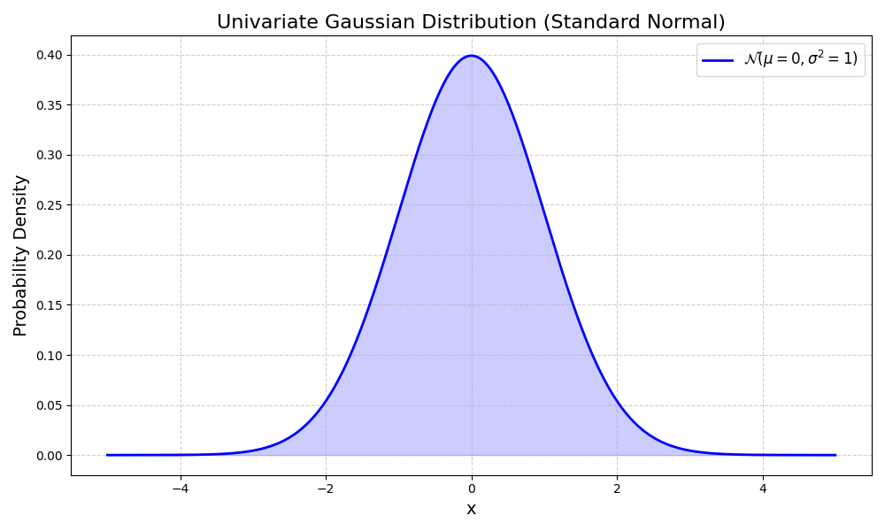
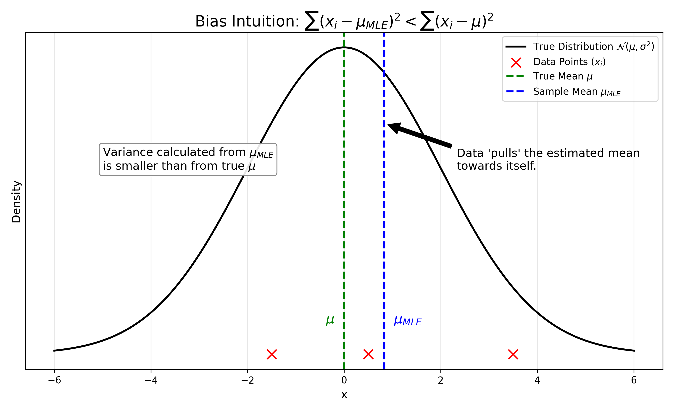
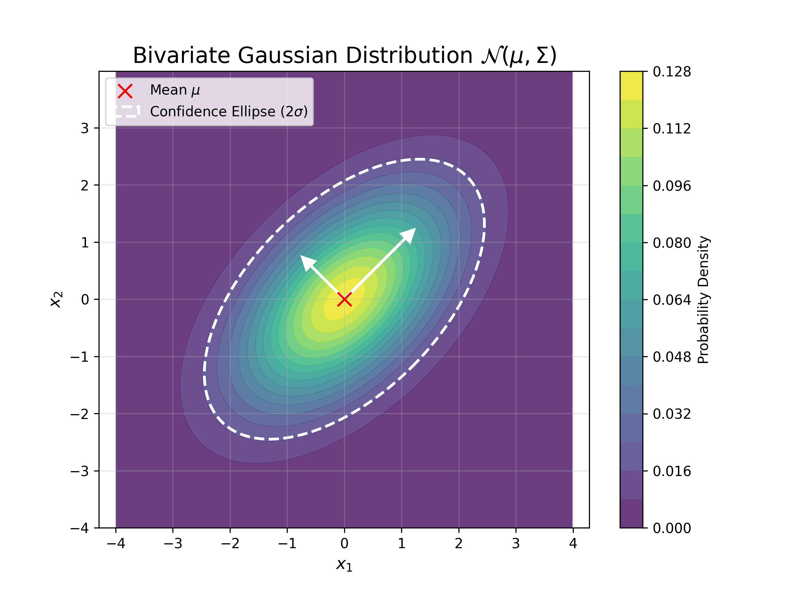
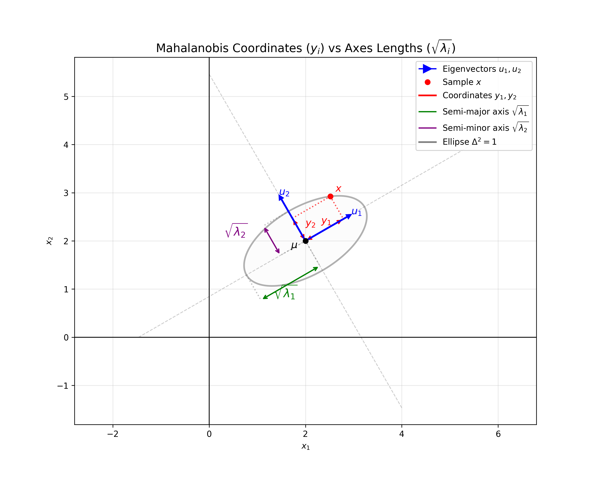
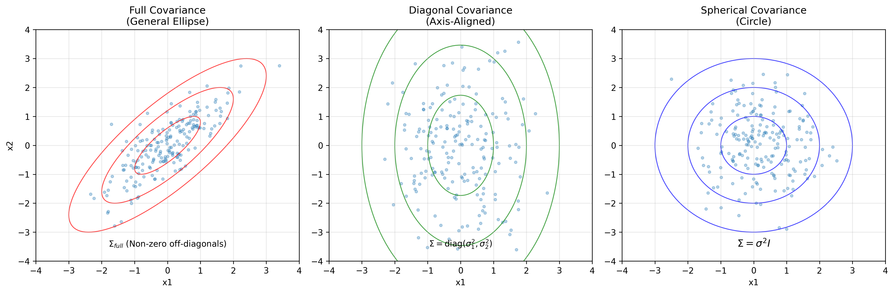
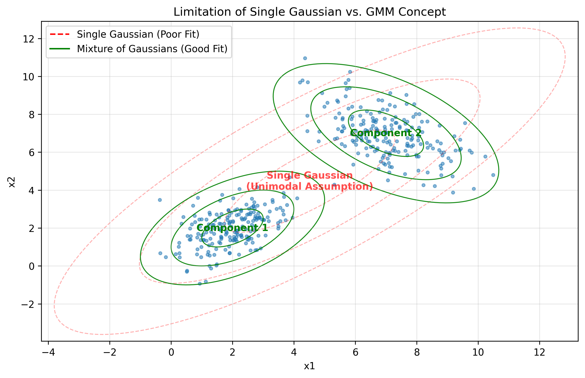

# 高斯分布 (Gaussian Distribution)

高斯分布（Gaussian Distribution），又称为正态分布（Normal Distribution），是机器学习及统计学中最重要的分布之一。

本章我们将推导高斯分布参数的**极大似然估计 (Maximum Likelihood Estimation, MLE)**。

---

## 1. 极大似然估计 (MLE) 与高斯分布定义

### 1.1 问题设定
假设我们有一组数据 $Data: X = (x_1, x_2, \ldots, x_N)^T = \begin{pmatrix} x_1^T \\ x_2^T \\ \vdots \\ x_N^T \end{pmatrix}_{N \times p}$。
其中每个样本 $x_i \in \mathbb{R}^p$。
我们假设这些数据是**独立同分布 (i.i.d.)** 的，且服从参数为 $\theta$ 的高斯分布 $x_i \sim \mathcal{N}(\mu, \Sigma)$。

### 1.2 高斯分布定义

**一元高斯分布 ($p=1$)**：
参数 $\theta = (\mu, \sigma^2)$，概率密度函数 (PDF) 为：
$$
p(x|\mu, \sigma^2) = \frac{1}{\sqrt{2\pi}\sigma} \exp\left( -\frac{(x-\mu)^2}{2\sigma^2} \right)
$$

**多元高斯分布 ($p>1$)**：
参数 $\theta = (\mu, \Sigma)$，概率密度函数 (PDF) 为：
$$
p(x|\mu, \Sigma) = \frac{1}{(2\pi)^{p/2}|\Sigma|^{1/2}} \exp\left( -\frac{1}{2}(x-\mu)^T \Sigma^{-1} (x-\mu) \right)
$$

### 1.3 MLE 目标
我们的目标是找到 $\theta_{MLE}$ 使得观测数据的似然最大：
$$
\theta_{MLE} = \operatorname*{argmax}_{\theta} P(X|\theta)
$$

---

## 2. 一元高斯分布 ($p=1$)

为了简化推导，我们**令 $p=1$**，此时参数为 $\theta = (\mu, \sigma^2)$。

### 2.1 对数似然函数
$$
\begin{aligned}
L(\theta) &= \log P(X|\theta) = \sum_{i=1}^{N} \log p(x_i|\theta) \\
&= \sum_{i=1}^{N} \log \left( \frac{1}{\sqrt{2\pi}\sigma} \exp\left( -\frac{(x_i-\mu)^2}{2\sigma^2} \right) \right) \\
&= \sum_{i=1}^{N} \left[ -\log(\sqrt{2\pi}\sigma) - \frac{(x_i-\mu)^2}{2\sigma^2} \right]
\end{aligned}
$$

### 2.2 推导 $\mu_{MLE}$ 及其统计意义

我们需要求解：
$$
\mu_{MLE} = \operatorname*{argmax}_{\mu} L(\mu, \sigma^2)
$$

**步骤 1：对 $\mu$ 求偏导**

我们要找到能让 $L$ 最大的 $\mu$，所以对 $\mu$ 求偏导。
注意：第一项 $\log(\sqrt{2\pi}\sigma)$ 与 $\mu$ 无关，求导为 0。

$$
\begin{aligned}
\frac{\partial L}{\partial \mu} &= \frac{\partial}{\partial \mu} \sum_{i=1}^{N} \left( - \frac{(x_i-\mu)^2}{2\sigma^2} \right) \\
&= - \frac{1}{2\sigma^2} \sum_{i=1}^{N} \frac{\partial}{\partial \mu} (x_i-\mu)^2
\end{aligned}
$$

根据链式法则 $\frac{d}{dx} f(g(x)) = f'(g(x))g'(x)$，$(x_i-\mu)^2$ 对 $\mu$ 的导数是 $2(x_i-\mu) \cdot (-1)$。

$$
\frac{\partial L}{\partial \mu} = - \frac{1}{2\sigma^2} \sum_{i=1}^{N} 2(x_i-\mu)(-1) = \frac{1}{\sigma^2} \sum_{i=1}^{N} (x_i-\mu)
$$

**步骤 2：令导数为 0 并求解**

$$
\frac{1}{\sigma^2} \sum_{i=1}^{N} (x_i-\mu) = 0
$$

由于 $\sigma^2 \neq 0$，我们可以直接去掉常数系数：
$$
\sum_{i=1}^{N} (x_i-\mu) = 0
$$

拆开求和符号：
$$
N\mu = \sum_{i=1}^{N} x_i
$$

$$
\mu_{MLE} = \frac{1}{N} \sum_{i=1}^{N} x_i
$$

**统计意义：无偏估计 (Unbiased Estimator)**

我们来验证 $\mu_{MLE}$ 是否是无偏的，即计算其期望 $E[\mu_{MLE}]$：

$$
\begin{aligned}
E[\mu_{MLE}] &= E\left[ \frac{1}{N} \sum_{i=1}^{N} x_i \right] \\
&= \frac{1}{N} \sum_{i=1}^{N} E[x_i] \\
&= \frac{1}{N} \sum_{i=1}^{N} \mu \quad (\text{因为 } x_i \sim \mathcal{N}(\mu, \sigma^2)) \\
&= \frac{1}{N} \cdot N \cdot \mu \\
&= \mu
\end{aligned}
$$

**结论**：$E[\mu_{MLE}] = \mu$，所以 $\mu_{MLE}$ 是**无偏估计**。

### 2.3 推导 $\sigma^2_{MLE}$ 及其统计意义

现在我们求解：
$$
\sigma^2_{MLE} = \operatorname*{argmax}_{\sigma^2} L(\mu_{MLE}, \sigma^2)
$$

**步骤 1：重写对数似然函数**

$$
L = \sum_{i=1}^{N} \left[ -\frac{1}{2}\log \sigma^2 - \frac{(x_i-\mu)^2}{2\sigma^2} \right] + C
$$
$$
L = -\frac{N}{2}\log \sigma^2 - \frac{1}{2\sigma^2} \sum_{i=1}^{N} (x_i-\mu)^2 + C
$$

**步骤 2：对 $\sigma^2$ 求导**

我们把 $\sigma^2$ 看作一个整体变量（或者设 $s = \sigma^2$）。

$$
\frac{\partial L}{\partial \sigma^2} = -\frac{N}{2} \frac{1}{\sigma^2} - \frac{1}{2} \sum_{i=1}^{N} (x_i-\mu)^2 \cdot (-1)(\sigma^2)^{-2}
$$

$$
\frac{\partial L}{\partial \sigma^2} = -\frac{N}{2\sigma^2} + \frac{1}{2(\sigma^2)^2} \sum_{i=1}^{N} (x_i-\mu)^2
$$

**步骤 3：令导数为 0 并求解**

$$
-\frac{N}{2\sigma^2} + \frac{1}{2(\sigma^2)^2} \sum_{i=1}^{N} (x_i-\mu)^2 = 0
$$

两边同乘 $2(\sigma^2)^2$（假设 $\sigma^2 > 0$）：
$$
-N\sigma^2 + \sum_{i=1}^{N} (x_i-\mu)^2 = 0
$$

$$
N\sigma^2 = \sum_{i=1}^{N} (x_i-\mu)^2
$$

$$
\sigma^2_{MLE} = \frac{1}{N} \sum_{i=1}^{N} (x_i - \mu)^2
$$

**统计意义：有偏估计 (Biased Estimator)**

我们将 $\sigma^2_{MLE}$ 展开：
$$
\begin{aligned}
\sigma^2_{MLE} &= \frac{1}{N} \sum_{i=1}^{N} (x_i - \mu_{MLE})^2 \\
&= \frac{1}{N} \sum_{i=1}^{N} (x_i^2 - 2x_i\mu_{MLE} + \mu_{MLE}^2) \\
&= \frac{1}{N} \sum_{i=1}^{N} x_i^2 - \frac{2}{N}\mu_{MLE}\sum_{i=1}^{N} x_i + \frac{1}{N}\sum_{i=1}^{N}\mu_{MLE}^2 \\
&= \frac{1}{N} \sum_{i=1}^{N} x_i^2 - 2\mu_{MLE}^2 + \mu_{MLE}^2 \quad (\text{因为 } \sum x_i = N\mu_{MLE}) \\
&= \frac{1}{N} \sum_{i=1}^{N} x_i^2 - \mu_{MLE}^2
\end{aligned}
$$

接下来求期望 $E[\sigma^2_{MLE}]$：
$$
\begin{aligned}
E[\sigma^2_{MLE}] &= E\left[ \frac{1}{N} \sum_{i=1}^{N} x_i^2 - \mu_{MLE}^2 \right] \\
&= E\left[ \frac{1}{N} \sum_{i=1}^{N} x_i^2 \right] - E[\mu_{MLE}^2] \\
&= \frac{1}{N} \sum_{i=1}^{N} E[x_i^2] - E[\mu_{MLE}^2]
\end{aligned}
$$

利用方差公式 $Var(X) = E[X^2] - (E[X])^2 \implies E[X^2] = Var(X) + (E[X])^2$：

1.对于 $x_i$：
$$E[x_i^2] = Var(x_i) + (E[x_i])^2 = \sigma^2 + \mu^2$$

2.对于 $\mu_{MLE}$：
$$Var(\mu_{MLE}) = Var\left( \frac{1}{N}\sum x_i \right) = \frac{1}{N^2}\sum Var(x_i) = \frac{1}{N^2} \cdot N\sigma^2 = \frac{\sigma^2}{N}$$
$$E[\mu_{MLE}^2] = Var(\mu_{MLE}) + (E[\mu_{MLE}])^2 = \frac{\sigma^2}{N} + \mu^2$$

代入期望公式：
$$
\begin{aligned}
E[\sigma^2_{MLE}] &= (\sigma^2 + \mu^2) - \left( \frac{\sigma^2}{N} + \mu^2 \right) \\
&= \sigma^2 - \frac{1}{N}\sigma^2 \\
&= \frac{N-1}{N} \sigma^2
\end{aligned}
$$

**结论**：由于 $E[\sigma^2_{MLE}] \neq \sigma^2$，所以 $\sigma^2_{MLE}$ 是**有偏估计**。它倾向于低估真实的方差。

如果要得到无偏估计，我们需要使用样本方差公式（除以 $N-1$）：
$$
\hat{\sigma}^2 = \frac{1}{N-1} \sum_{i=1}^{N} (x_i - \mu_{MLE})^2
$$

### 2.4 直观解释：为什么 $\sigma^2_{MLE}$ 是有偏的？

<!-- Generated by scripts/generate_ch02_bias_plot.py -->

1.  **样本均值 vs 真实均值**：$\mu_{MLE}$ 是根据当前样本计算出来的“中心”，它会自然地向样本点“靠拢”。
2.  **误差最小化**：对于任意一组数据，$\sum(x_i - a)^2$ 在 $a = \mu_{MLE}$ 时取最小值。也就是说：
    $$
    \sum_{i=1}^{N} (x_i - \mu_{MLE})^2 < \sum_{i=1}^{N} (x_i - \mu)^2
    $$
    （除非 $\mu_{MLE}$ 恰好等于 $\mu$）。
3.  **结果偏小**：我们在计算方差时使用了“更近”的 $\mu_{MLE}$ 而不是真实的 $\mu$，导致计算出的平方和偏小，从而低估了真实的方差。
4.  **修正**：为了补偿这个低估，我们将分母从 $N$ 改为 $N-1$，从而得到稍大一点的无偏估计 $\hat{\sigma}^2$。

---

## 3. 多元高斯分布 (Multivariate Gaussian Distribution)

接下来我们将从一维推广到多维情况 ($p > 1$)。

### 3.1 定义

对于 $p$ 维随机向量 $x = (x_1, x_2, \ldots, x_p)^T \in \mathbb{R}^p$，若其服从多元高斯分布，我们记作：
$$
x \sim \mathcal{N}(\mu, \Sigma)
$$

其中：
*   $\mu \in \mathbb{R}^p$ 是均值向量 (Mean Vector)。
*   $\Sigma \in \mathbb{R}^{p \times p}$ 是协方差矩阵 (Covariance Matrix)，且 $\Sigma$ 必须是**对称正定 (Symmetric Positive Definite)** 或半正定的。

概率密度函数 (PDF) 为：
$$
p(x|\mu, \Sigma) = \frac{1}{(2\pi)^{p/2}|\Sigma|^{1/2}} \exp\left( -\frac{1}{2}(x-\mu)^T \Sigma^{-1} (x-\mu) \right)
$$

### 3.2 几何解释与马氏距离 (Mahalanobis Distance)

指数部分的一项非常关键：
$$
\Delta^2 = (x-\mu)^T \Sigma^{-1} (x-\mu)
$$
这一项被称为 $x$ 到均值 $\mu$ 的**马氏距离 (Mahalanobis Distance)** 的平方。

<!-- Generated by scripts/generate_ch02_multivariate_plot.py -->

*   **形状控制**：协方差矩阵 $\Sigma$ 决定了分布的形状（椭圆的方向和长短轴）。
    *   特征向量 (Eigenvectors) 决定了椭圆的主轴方向。
    *   特征值 (Eigenvalues) 决定了数据在主轴方向上的分散程度（方差）。
*   **退化为欧氏距离**：如果 $\Sigma = I$（单位矩阵），则：
    $$
    (x-\mu)^T I^{-1} (x-\mu) = (x-\mu)^T (x-\mu) = \sum_{j=1}^{p} (x_j - \mu_j)^2
    $$
    此时马氏距离就变成了标准的**欧氏距离 (Euclidean Distance)**，分布形状为正圆（或超球体）。

### 3.3 协方差矩阵的特征值分解 (Eigendecomposition)

协方差矩阵 $\Sigma$ 是对称正定（或半正定）矩阵，因此可以进行**特征值分解 (Eigendecomposition)**（也称为谱分解）。

$$
\begin{aligned}
\Sigma &= U \Lambda U^T \\
&= (u_1, u_2, \ldots, u_p) \begin{pmatrix} \lambda_1 & \cdots & 0 \\ \vdots & \ddots & \vdots \\ 0 & \cdots & \lambda_p \end{pmatrix} \begin{pmatrix} u_1^T \\ u_2^T \\ \vdots \\ u_p^T \end{pmatrix} \\
&= (u_1 \lambda_1, u_2 \lambda_2, \ldots, u_p \lambda_p) \begin{pmatrix} u_1^T \\ u_2^T \\ \vdots \\ u_p^T \end{pmatrix} \\
&= \sum_{i=1}^{p} u_i \lambda_i u_i^T
\end{aligned}
$$

其中：
*   $U = (u_1, u_2, \ldots, u_p)$ 是正交矩阵 ($UU^T = U^TU = I$)，其列向量 $u_i$ 是 $\Sigma$ 的**特征向量 (Eigenvectors)**（即我们图中的主轴方向）。
*   $\Lambda = \operatorname{diag}(\lambda_1, \ldots, \lambda_p)$ 是对角矩阵，对角元素 $\lambda_i$ 是对应的**特征值 (Eigenvalues)**（即数据在对应方向上的方差）。

**逆矩阵的分解**：
由于 $\Sigma$ 正定，其逆矩阵 $\Sigma^{-1}$（精度矩阵 Precision Matrix）存在，且可以分解为：
$$
\Sigma^{-1} = (U \Lambda U^T)^{-1} = (U^T)^{-1} \Lambda^{-1} U^{-1} = U \Lambda^{-1} U^T = \sum_{i=1}^{p} u_i \frac{1}{\lambda_i} u_i^T
$$

**马氏距离的分解**：
将 $\Sigma^{-1}$ 代入马氏距离公式 $\Delta^2 = (x-\mu)^T \Sigma^{-1} (x-\mu)$：

$$
\begin{aligned}
\Delta^2 &= (x-\mu)^T \left( \sum_{i=1}^{p} u_i \frac{1}{\lambda_i} u_i^T \right) (x-\mu) \\
&= \sum_{i=1}^{p} (x-\mu)^T u_i \frac{1}{\lambda_i} u_i^T (x-\mu)
\end{aligned}
$$

定义 $y_i = (x-\mu)^T u_i$，这表示数据点 $x$ 在特征向量 $u_i$ 方向上的**投影长度**（去中心化后）。由于 $(x-\mu)^T u_i$ 是标量，等于 $u_i^T (x-\mu)$。

$$
\Delta^2 = \sum_{i=1}^{p} y_i \frac{1}{\lambda_i} y_i = \sum_{i=1}^{p} \frac{y_i^2}{\lambda_i}
$$

**几何意义**：
马氏距离本质上是将数据投影到主轴方向 ($y_i$)，然后用该方向的标准差 ($\sqrt{\lambda_i}$) 进行标准化。
$$
\sum_{i=1}^{p} \left( \frac{y_i}{\sqrt{\lambda_i}} \right)^2
$$
这就解释了为什么当 $\Sigma \neq I$ 时，分布呈现椭圆形状：我们在不同的方向上有着不同的“尺子”（方差 $\lambda_i$）。

**实例：二维高斯分布 ($p=2$)**

为了更具象化，我们设 $p=2$，此时 $\Sigma$ 有特征值 $\lambda_1, \lambda_2$ (对应特征向量 $u_1, u_2$)。马氏距离 $\Delta^2$ 可以写成：
$$
\Delta^2 = \frac{y_1^2}{\lambda_1} + \frac{y_2^2}{\lambda_2}
$$
其中 $y_1 = (x-\mu)^T u_1, y_2 = (x-\mu)^T u_2$ 分别是向量 $x-\mu$ 在方向 $u_1, u_2$ 上的**投影长度**。

若我们要画出等高线（例如 $\Delta^2 = 1$），这就是一个**椭圆方程**：
$$
\frac{y_1^2}{(\sqrt{\lambda_1})^2} + \frac{y_2^2}{(\sqrt{\lambda_2})^2} = 1
$$

<!-- Generated by scripts/generate_ch02_mahalanobis_geometry.py -->

这个椭圆的主轴方向即为 $u_1, u_2$，半轴长分别为 $\sqrt{\lambda_1}, \sqrt{\lambda_2}$。
*   如果 $\lambda_1 > \lambda_2$，椭圆在 $u_1$ 方向更“长”。
*   如果 $\lambda_1 = \lambda_2$，椭圆退化为圆。

**如果 $\Delta^2 = r$ (不同的半径)**：
若令 $\Delta^2 = r$（或者距离 $\Delta = \sqrt{r}$），方程变为：
$$
\frac{y_1^2}{(\sqrt{r\lambda_1})^2} + \frac{y_2^2}{(\sqrt{r\lambda_2})^2} = 1
$$
此时椭圆的半轴长变为 $\sqrt{r\lambda_1}$ 和 $\sqrt{r\lambda_2}$。
这表明：
1.  **同心椭圆**：改变 $r$ 会生成一系列中心相同、形状（长宽比）相同但**按比例缩放**的椭圆。
2.  **等概率密度**：每一个 $r$ 值对应一条**等高线**（Contour）。
    *   $r$ 越小，椭圆越小，对应的概率密度越高（接近峰值）。
    *   $r$ 越大，椭圆越大，对应的概率密度越低（远离中心）。

**两个公式的联系 (Relation to PDF)**：

我们在 3.1 节定义的概率密度函数可以写成：
$$
p(x|\mu, \Sigma) = \frac{1}{(2\pi)^{p/2}|\Sigma|^{1/2}} \exp\left( -\frac{1}{2} \Delta^2 \right)
$$
而在本节我们导出了 $\Delta^2 = \frac{y_1^2}{\lambda_1} + \frac{y_2^2}{\lambda_2} = r$。

代入后得到：
$$
p(r) \propto \exp\left( -\frac{1}{2} r \right)
$$
这揭示了**几何形状与概率密度的直接关系**：
*   **左边公式 (椭圆方程)**：$\frac{y_1^2}{\lambda_1} + \frac{y_2^2}{\lambda_2} = r$ 描述了所有距离均值“同样远”的点构成的轨迹（等高线）。
*   **右边公式 (PDF)**：$p(x)$ 的值完全由这个距离 $r$ 决定。只要 $r$ 相同，概率密度 $p(x)$ 就相同。

这样，马氏距离的**几何等高线**（椭圆）与高斯分布的**概率等高线**（3D钟形曲面的截面）是完全一致的。

**3D 视角：概率曲面与等高线**

如果我们把 $x_1, x_2$ 作为水平坐标，把概率密度 $p(x)$ 作为垂直坐标 $y$（或 $z$ 轴），那么二维高斯分布在三维空间中看起来像是一个**立体的钟形曲面 (Bell Surface)**。

1.  **曲面高度**：曲面上每一点的高度 $p(x)$ 代表该点的概率密度。均值 $\mu$ 处的概率密度最大，曲面最高。
2.  **截面 (等高线)**：如果我们用一把水平的刀在某个高度 $h$ 切一刀，切下来的截面边缘就是一个椭圆。
    *   这个椭圆上的所有点具有相同的“高度”（概率密度），也对应相同的马氏距离 $\Delta^2$。
    *   这就是所谓的**等高线 (Contour Line)**。
3.  **投影**：将这些截面椭圆垂直**投影**到 $x_1-x_2$ 平面上，就得到了我们在前面画的同心椭圆图。
    *   这就是为什么我们通常用二维平面上的椭圆来表示高斯分布：它们实际上是立体高斯钟形曲面的“俯视图”。

---

### 3.4 协方差矩阵的性质与局限性

**参数数量与简化**

在实际应用中，特别是当维度 $p$ 很高时，完全协方差矩阵带来的计算和存储开销是非常大的。

<!-- Generated by scripts/generate_ch02_covariance_types.py -->

1.  **完全协方差矩阵 (Full Covariance Matrix)**
    *   $\Sigma$ 是 $p \times p$ 的对称矩阵，其独立参数个数为 $\frac{p(p+1)}{2}$，大致是 $O(p^2)$ 级别。
    *   加上均值 $\mu$ 的 $p$ 个参数，总参数量随维度平方增长。
    *   **几何形状**：任意方向的椭圆。

2.  **对角协方差矩阵 (Diagonal Covariance Matrix)**
    *   假设特征之间相互独立，即 $\Sigma = \operatorname{diag}(\sigma_1^2, \ldots, \sigma_p^2)$。
    *   参数个数降低为 $p$ 个。
    *   **几何形状**：轴对齐的椭圆（长轴平行于坐标轴）。
    *   **应用**：朴素贝叶斯 (Naive Bayes)、因子分析 (Factor Analysis) 通常假设这种形式。

3.  **各向同性协方差矩阵 (Isotropic / Spherical Covariance Matrix)**
    *   假设所有方向方差相同，即 $\Sigma = \sigma^2 I$。
    *   参数个数仅为 1 个 ($\sigma^2$)。
    *   **几何形状**：正圆（或超球体）。
    *   **应用**：K-Means 聚类隐含假设了这种形式，这也与概率主成分分析 (Probabilistic PCA, PPCA) 相关。

**单高斯模型的局限性**

虽然高斯分布性质优良，但它有一个显著的局限性：**单峰性 (Unimodality)**。
*   它只能通过一个“中心” ($\mu$) 和一个“形状” ($\Sigma$) 来描述数据。
*   对于包含多个聚类（Cluster）或复杂形状的数据分布，单高斯模型无法有效拟合。

**例如**：假设数据分布在两个分离的区域（如下图手绘草图所示），单高斯模型只能强行用一个巨大的椭圆覆盖两者，这显然是不准确的。

<!-- Generated by scripts/generate_ch02_gmm_concept.py -->

**高斯混合模型 (Gaussian Mixture Model, GMM)**

为了解决单高斯的局限性，我们引入**高斯混合模型 (GMM)**。

*   **核心思想**：通过线性组合多个高斯分布来拟合复杂数据。
    $$
    P(x) = \sum_{k=1}^{K} \pi_k \mathcal{N}(x|\mu_k, \Sigma_k)
    $$
*   这就像是用多个不同大小、位置和形状的“高斯积木”搭建出一个复杂的分布形状。
*   理论上，只要 $K$ 足够大，GMM 可以逼近任意连续的概率密度函数。

---

### 3.5 边缘与条件分布

当我们处理高维变量时，经常需要关注其中一部分变量的性质（边缘分布），或者在观测到一部分变量后推断另一部分变量（条件分布）。高斯分布的一个重要性质是：**其边缘分布和条件分布仍然是高斯分布**。

**定义与分块 (Partitioning)**

假设 $x \sim \mathcal{N}(\mu, \Sigma)$，我们将 $x$ 分割为两部分 $x_a$ ($m$ 维) 和 $x_b$ ($n$ 维)，其中 $m+n=p$。

$$
x = \begin{pmatrix} x_a \\ x_b \end{pmatrix}, \quad \mu = \begin{pmatrix} \mu_a \\ \mu_b \end{pmatrix}
$$

对应的协方差矩阵 $\Sigma$ 也可以分块：

$$
\Sigma = \begin{pmatrix} \Sigma_{aa} & \Sigma_{ab} \\ \Sigma_{ba} & \Sigma_{bb} \end{pmatrix}
$$

其中：
*   $\Sigma_{aa} = Cov(x_a, x_a)$ 是 $x_a$ 内部的协方差 ($m \times m$)。
*   $\Sigma_{bb} = Cov(x_b, x_b)$ 是 $x_b$ 内部的协方差 ($n \times n$)。
*   $\Sigma_{ab} = Cov(x_a, x_b)$ 是 $x_a$ 和 $x_b$ 之间的协方差 ($m \times n$)。注意 $\Sigma_{ba} = \Sigma_{ab}^T$。

我们的目标是求出以下四个概率分布：
$$
P(x_a), P(x_b), P(x_a|x_b), P(x_b|x_a)
$$

**线性变换性质 (Linear Transformation)**

已知 $x \sim \mathcal{N}(\mu, \Sigma)$，若 $y = Ax + B$ (其中 $A \in \mathbb{R}^{q \times p}$)，则 $y$ 也服从高斯分布：

$$
y \sim \mathcal{N}(A\mu + B, A\Sigma A^T)
$$

其期望与方差的推导如下：

*   **期望 (Expectation)**:
    $$
    E[y] = E[Ax + B] = A E[x] + B = A \mu + B
    $$

*   **方差 (Variance)**:
    $$
    \begin{aligned}
    Var[y] &= Var[Ax + B] \\
    &= Var[Ax] + Var[B] \\
    &= A \cdot Var[x] \cdot A^T \\
    &= A \cdot \Sigma \cdot A^T
    \end{aligned}
    $$

**边缘分布推导 (Derivation of Marginal Distribution)**

利用上述线性变换定理，我们可以很容易地推导出边缘分布 $x_a$。

构造变换矩阵 $A$ 为：
$$
A = \begin{pmatrix} I_m & 0_n \end{pmatrix}
$$
其中 $I_m$ 是 $m \times m$ 的单位矩阵，$0_n$ 是 $m \times n$ 的零矩阵。

则 $x_a$ 可以表示为 $x$ 的线性变换：
$$
x_a = Ax = \begin{pmatrix} I_m & 0_n \end{pmatrix} \begin{pmatrix} x_a \\ x_b \end{pmatrix}
$$

根据定理，期望为：
$$
E[x_a] = A E[x] = \begin{pmatrix} I_m & 0_n \end{pmatrix} \begin{pmatrix} \mu_a \\ \mu_b \end{pmatrix} = \mu_a
$$

方差为：
$$
\begin{aligned}
Var[x_a] &= A \Sigma A^T \\
&= \begin{pmatrix} I_m & 0_n \end{pmatrix} \begin{pmatrix} \Sigma_{aa} & \Sigma_{ab} \\ \Sigma_{ba} & \Sigma_{bb} \end{pmatrix} \begin{pmatrix} I_m \\ 0_n \end{pmatrix} \\
&= \begin{pmatrix} \Sigma_{aa} & \Sigma_{ab} \end{pmatrix} \begin{pmatrix} I_m \\ 0_n \end{pmatrix} \\
&= \Sigma_{aa}
\end{aligned}
$$

故得证：$x_a \sim \mathcal{N}(\mu_a, \Sigma_{aa})$，同理可得：$x_b \sim \mathcal{N}(\mu_b, \Sigma_{bb})$。

**条件分布推导 (Derivation of Conditional Distribution)**

为了推导 $x_b|x_a$，我们**构造一个新的辅助变量** $x_{b \cdot a}$。

**构造原理 (Construction Principle)**：
我们的目标是构造一个 $x_b$ 和 $x_a$ 的线性组合，使得该组合与 $x_a$ **不相关**（即去相关/正交化）。

*   **为什么要构造不相关的变量？**
    因为对于高斯分布，**不相关等价于独立**。一旦 $x_{b \cdot a}$ 与 $x_a$ 独立，那么 $x_{b \cdot a}$ 的条件分布 $P(x_{b \cdot a}|x_a)$ 就等于其边缘分布 $P(x_{b \cdot a})$。这大大简化了问题的求解，使我们可以先求出简单的辅助变量分布，再通过线性变换还原回目标变量 $x_b|x_a$。

这类似于 Gram-Schmidt 正交化过程。通过让 $Cov(x_b - A x_a, x_a) = 0$，我们可以解出系数矩阵 $A = \Sigma_{ba}\Sigma_{aa}^{-1}$。

令：
$$
\begin{cases}
x_{b \cdot a} = x_b - \Sigma_{ba}\Sigma_{aa}^{-1}x_a \\
\mu_{b \cdot a} = \mu_b - \Sigma_{ba}\Sigma_{aa}^{-1}\mu_a \\
\Sigma_{bb \cdot a} = \Sigma_{bb} - \Sigma_{ba}\Sigma_{aa}^{-1}\Sigma_{ab}
\end{cases}
$$

这同样可以看作是 $x$ 的线性变换 $x_{b \cdot a} = Ax$，其中变换矩阵为：
$$
A = \begin{pmatrix} -\Sigma_{ba}\Sigma_{aa}^{-1} & I_n \end{pmatrix}
$$

$$
x_{b \cdot a} = \begin{pmatrix} -\Sigma_{ba}\Sigma_{aa}^{-1} & I_n \end{pmatrix} \begin{pmatrix} x_a \\ x_b \end{pmatrix}
$$

**计算期望与方差**：

*   **期望**：
    $$
    \begin{aligned}
    E[x_{b \cdot a}] &= \mu_b - \Sigma_{ba}\Sigma_{aa}^{-1}\mu_a \\
    &\triangleq \mu_{b \cdot a}
    \end{aligned}
    $$

*   **方差**：
    利用公式 $Var[Ax] = A \Sigma A^T$：
    $$
    \begin{aligned}
    Var[x_{b \cdot a}] &= \begin{pmatrix} -\Sigma_{ba}\Sigma_{aa}^{-1} & I_n \end{pmatrix} \begin{pmatrix} \Sigma_{aa} & \Sigma_{ab} \\ \Sigma_{ba} & \Sigma_{bb} \end{pmatrix} \begin{pmatrix} -\Sigma_{aa}^{-1}\Sigma_{ab} \\ I_n \end{pmatrix} \\
    &= \begin{pmatrix} 0 & \Sigma_{bb} - \Sigma_{ba}\Sigma_{aa}^{-1}\Sigma_{ab} \end{pmatrix} \begin{pmatrix} -\Sigma_{aa}^{-1}\Sigma_{ab} \\ I_n \end{pmatrix} \\
    &= \Sigma_{bb} - \Sigma_{ba}\Sigma_{aa}^{-1}\Sigma_{ab} \\
    &\triangleq \Sigma_{bb \cdot a} \quad (\text{Schur Complement})
    \end{aligned}
    $$

**利用独立性质求解条件分布**：

我们可以证明 $x_{b \cdot a}$ 与 $x_a$ 是不相关的（对于高斯分布即独立的），其分布为：
$$
x_{b \cdot a} \sim \mathcal{N}(\mu_{b \cdot a}, \Sigma_{bb \cdot a})
$$

对于 $x_b|x_a$，根据构造公式：
$$
x_b = x_{b \cdot a} + \Sigma_{ba}\Sigma_{aa}^{-1}x_a
$$

在给定 $x_a$ 的条件下：

*   **期望**：
    $$
    E[x_b | x_a] = \mu_{b \cdot a} + \Sigma_{ba}\Sigma_{aa}^{-1}x_a
    $$
    （注意：上式代入 $\mu_{b \cdot a}$ 定义后即等于 $\mu_b + \Sigma_{ba}\Sigma_{aa}^{-1}(x_a - \mu_a)$）

*   **方差**：
    $$
    Var[x_b | x_a] = Var[x_{b \cdot a}] = \Sigma_{bb \cdot a}
    $$

因此，我们得到最终结果：
$$
x_b|x_a \sim \mathcal{N}(\mu_{b \cdot a} + \Sigma_{ba}\Sigma_{aa}^{-1}x_a, \Sigma_{bb \cdot a})
$$

同理，对于 $x_a|x_b$：
$$
x_a|x_b \sim \mathcal{N}(\mu_{a \cdot b} + \Sigma_{ab}\Sigma_{bb}^{-1}x_b, \Sigma_{aa \cdot b})
$$
其中：
*   $\mu_{a \cdot b} = \mu_a - \Sigma_{ab}\Sigma_{bb}^{-1}\mu_b$
*   $\Sigma_{aa \cdot b} = \Sigma_{aa} - \Sigma_{ab}\Sigma_{bb}^{-1}\Sigma_{ba}$

---

### 3.6 线性高斯模型 (Linear Gaussian Model)

**线性高斯模型**是指这样一类系统：变量之间存在线性关系，并且这种关系受到高斯噪声的影响。即一个变量是另一个变量的线性变换加上高斯噪声。

它是许多复杂概率模型的基础构件，例如：
*   **因子分析 (Factor Analysis, FA)**
*   **概率主成分分析 (Probabilistic PCA, PPCA)**
*   **卡尔曼滤波 (Kalman Filter)** (线性动态系统)

通过掌握线性高斯模型的性质，我们可以推导出这些高级算法的核心更新公式。

**问题定义 (Question Definition)**

已知线性高斯系统：
1.  **先验分布**: $P(x) = \mathcal{N}(x | \mu, \Lambda^{-1})$，其中 $\Lambda$ 是精度矩阵 (Precision Matrix)，即 $\Lambda = \Sigma^{-1}$。
2.  **条件分布**: $P(y|x) = \mathcal{N}(y | Ax + b, L^{-1})$。

这等价于线性关系：
$$
y = Ax + b + \epsilon
$$
其中噪声 $\epsilon \sim \mathcal{N}(0, L^{-1})$，且 $x$ 与 $\epsilon$ 相互独立 ($x \perp \epsilon$)。

求：$P(y)$，$P(x|y)$。

**1. 求解 $P(y)$**

我们利用期望和方差的性质来求解 $y$ 的边缘分布。

*   **期望**：
    $$
    E[y] = E[Ax + b + \epsilon] = E[Ax + b] + E[\epsilon] = A\mu + b
    $$
*   **方差**：
    由于 $x$ 与 $\epsilon$ 独立，方差具有可加性：
    $$
    Var[y] = Var[Ax + b + \epsilon] = Var[Ax + b] + Var[\epsilon] = A \Lambda^{-1} A^T + L^{-1}
    $$

因此：
$$
P(y) \sim \mathcal{N}(y | A\mu + b, L^{-1} + A\Lambda^{-1}A^T)
$$

**2. 求解 $P(x|y)$**

为了求解反向条件概率 $P(x|y)$，我们利用3.5的结论。首先构造联合分布 $P(z)$，其中 $z = \begin{pmatrix} x \\ y \end{pmatrix}$。

$$
z \sim \mathcal{N}\left( \begin{pmatrix} E[x] \\ E[y] \end{pmatrix}, \begin{pmatrix} Var[x] & Cov(x, y) \\ Cov(y, x) & Var[y] \end{pmatrix} \right)
$$

已知：
*   $E[x] = \mu$
*   $E[y] = A\mu + b$
*   $Var[x] = \Lambda^{-1}$
*   $Var[y] = L^{-1} + A\Lambda^{-1}A^T$

我们需要计算互协方差 $Cov(x, y)$ (记为 $\Delta$)：
$$
\begin{aligned}
\Delta = Cov(x, y) &= E[(x - E[x])(y - E[y])^T] \\
&= E[(x - \mu)(Ax + b + \epsilon - (A\mu + b))^T] \\
&= E[(x - \mu)(A(x - \mu) + \epsilon)^T] \\
&= E[(x - \mu)(x - \mu)^T A^T + (x - \mu)\epsilon^T] \\
&= E[(x - \mu)(x - \mu)^T] A^T + E[(x - \mu)]E[\epsilon^T] \quad (\text{因 } x \perp \epsilon) \\
&= Var[x] A^T + 0 \\
&= \Lambda^{-1} A^T
\end{aligned}
$$

于是联合分布的协方差矩阵为：
$$
\Sigma = \begin{pmatrix} \Lambda^{-1} & \Lambda^{-1}A^T \\ A\Lambda^{-1} & L^{-1} + A\Lambda^{-1}A^T \end{pmatrix}
$$

现在我们已知联合分布，可直接利用 3.5 的结论求解 $P(x|y)$ (对应 $P(x_a|x_b)$ 的形式，这里 $x \leftrightarrow x_a, y \leftrightarrow x_b$)：

$$
P(x|y) \sim \mathcal{N}(\mu_{x|y}, \Sigma_{x|y})
$$

代入公式：
$$
\begin{aligned}
\mu_{x|y} &= \mu + \Sigma_{xy}\Sigma_{yy}^{-1}(y - \mu_y) \\
&= \mu + \Lambda^{-1}A^T(L^{-1} + A\Lambda^{-1}A^T)^{-1}(y - A\mu - b)
\end{aligned}
$$

$$
\begin{aligned}
\Sigma_{x|y} &= \Sigma_{xx} - \Sigma_{xy}\Sigma_{yy}^{-1}\Sigma_{yx} \\
&= \Lambda^{-1} - \Lambda^{-1}A^T(L^{-1} + A\Lambda^{-1}A^T)^{-1}A\Lambda^{-1}
\end{aligned}
$$
