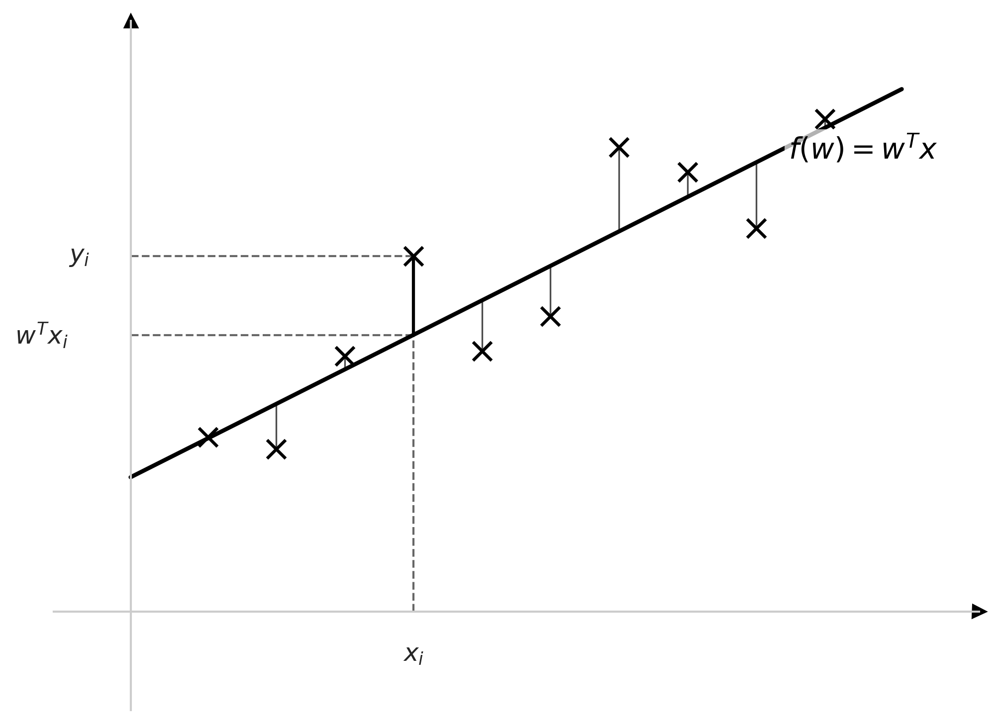
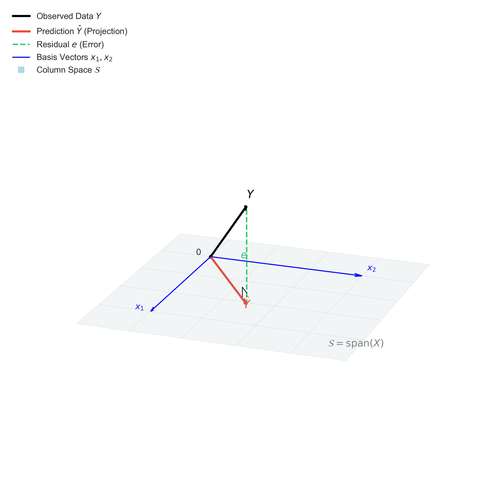

# 线性回归 (Linear Regression)

线性回归是机器学习中最基础的模型之一。本章我们将从最小二乘法 (Least Squares) 出发，介绍线性回归的定义、矩阵形式以及几何意义。

---

## 1. 最小二乘法 (Least Squares Estimation)

### 1.1 几何视角：最小二乘法 (Geometric View: Least Squares)

对于线性回归问题，我们有一组观测数据 $D = \{(x_1, y_1), (x_2, y_2), \ldots, (x_N, y_N)\}$。
*   $x_i \in \mathbb{R}^p$：第 $i$ 个样本的输入特征。
*   $y_i \in \mathbb{R}$：第 $i$ 个样本的输出标签。
*   $N$：样本总数。
*   $p$：特征维度。

我们的目标是寻找一个线性函数 $f(w) = w^T x$，使其能够尽可能准确地预测目标值 $y$。

<!-- Generated by scripts/generate_ch03_linear_regression_plot.py -->
*(图示：一维线性回归拟合示意图。图中展示了数据点 $(x_i, y_i)$ 与拟合直线 $f(w) = w^T x$ 之间的关系。)*

**核心概念**：
如图中所示，对于任意一个样本点 $x_i$ (例如图中标注的 $x_i$)：
*   **真实值 (Label)**：$y_i$ 是数据中记录的真实标签。
*   **预测值 (Prediction)**：$f(x_i) = w^T x_i$ 是模型给出的预测结果。
*   **残差 (Residual)**：真实值与预测值之间的垂直距离 $e_i = y_i - w^T x_i$。

为了量化模型的优劣，我们采用**最小二乘法 (Least Squares Estimation, LSE)**，即最小化所有样本点残差的平方和 (Residual Sum of Squares, RSS)：

$$
L(w) = \sum_{i=1}^{N} (y_i - f(w))^2 = \sum_{i=1}^{N} (y_i - w^T x_i)^2 = ||Y - Xw||^2
$$

我们的优化目标是找到最优参数 $\hat{w}$：
$$
\hat{w} = \operatorname*{argmin}_w L(w)
$$

### 1.2 矩阵形式 (Matrix Format)

为了方便计算，我们将数据写成矩阵形式。

定义：
*   **设计矩阵 (Design Matrix)** $X \in \mathbb{R}^{N \times p}$：

    $$
    X = (x_1, x_2, \ldots, x_N)^T = \begin{pmatrix} x_1^T \\ x_2^T \\ \vdots \\ x_N^T \end{pmatrix} = \begin{pmatrix} x_{11} & x_{12} & \cdots & x_{1p} \\ x_{21} & x_{22} & \cdots & x_{2p} \\ \vdots & \vdots & \ddots & \vdots \\ x_{N1} & x_{N2} & \cdots & x_{Np} \end{pmatrix}

    $$
*   **标签向量 (Label Vector)** $Y \in \mathbb{R}^{N \times 1}$：

    $$
    Y = \begin{pmatrix} y_1 \\ y_2 \\ \vdots \\ y_N \end{pmatrix}

    $$

此时，损失函数可以重写为：
$$
\begin{aligned}
L(w) &= (Xw - Y)^T (Xw - Y) \\
&= (w^T X^T - Y^T) (Xw - Y) \\
&= w^T X^T X w - w^T X^T Y - Y^T X w + Y^T Y \\
&= w^T X^T X w - 2w^T X^T Y + Y^T Y
\end{aligned}
$$

**求解**：
对 $w$ 求偏导并令其为 0：
$$
\frac{\partial L(w)}{\partial w} = 2 X^T X w - 2 X^T Y = 0
$$

得到正规方程 (Normal Equation)：
$$
X^T X w = X^T Y
$$

若 $X^T X$ 可逆，则最优解为：
### 1.3 几何解释：列空间投影 (Geometric View: Column Space Projection)

除了 1.1 节中在数据空间 (Data Space) 的直观理解外，最小二乘法在**样本空间 (Sample Space)** 中有一个更为深刻的几何解释。

我们将 $Y$ 和 $X$ 的每一列都看作是 $\mathbb{R}^N$ 空间中的向量。
*   $Y \in \mathbb{R}^N$：观测向量。
*   $X = [x^{(1)}, x^{(2)}, \ldots, x^{(p)}]$：设计矩阵的 $p$ 个列向量，每个 $x^{(j)} \in \mathbb{R}^N$。

这 $p$ 个列向量张成了一个子空间 (Subspace)，称为**列空间 (Column Space)**，记为 $\mathcal{S} = \text{span}(X)$。

我们的模型预测值是 $\hat{Y} = Xw = x^{(1)}w_1 + \cdots + x^{(p)}w_p$。
这意味着，**预测向量 $\hat{Y}$ 必须落在 $X$ 的列空间 $\mathcal{S}$ 内**。

**目标**：
寻找一个 $w$，使得预测向量 $\hat{Y}$ 与真实向量 $Y$ 之间的欧氏距离 $||Y - \hat{Y}||$ 最小。

<!-- Generated by scripts/generate_ch03_least_squares_projection.py -->
*(图示：最小二乘法的几何投影。$\hat{Y}$ 是 $Y$ 在列空间 $\text{span}(X)$ 上的正交投影，残差 $e$ 垂直于该平面。)*

**正交投影 (Orthogonal Projection)**：
几何上非常明显，当 $\hat{Y}$ 是 $Y$ 在子空间 $\mathcal{S}$ 上的**正交投影**时，距离最小。
此时，残差向量 $e = Y - \hat{Y}$ (即 $Y - Xw$) 必须垂直于子空间中的任意向量。

即残差垂直于 $X$ 的每一列：
$$
(x^{(j)})^T (Y - Xw) = 0, \quad \forall j=1,\ldots,p
$$

写成矩阵形式就是：
$$
X^T (Y - Xw) = 0
$$

这导出了正规方程：
$$
X^T Y = X^T X w
$$

若 $X^T X$ 可逆，则：
$$
\hat{w} = (X^T X)^{-1} X^T Y
$$

**投影矩阵 (Projection Matrix)**：
如果我们把 $\hat{w}$ 代回预测公式，可以得到预测向量 $\hat{Y}$ 与 $Y$ 的线性关系：
$$
\hat{Y} = X \hat{w} = X (X^T X)^{-1} X^T Y = H Y
$$
其中矩阵 $H = X (X^T X)^{-1} X^T$ 被称为**帽子矩阵 (Hat Matrix)** 或投影矩阵，它的作用是将任意向量 $Y$ 投影到 $X$ 的列空间中。

### 1.4 概率视角：极大似然估计 (Probabilistic View: MLE)

除了直观的几何解释，最小二乘法还可以从概率论的角度导出。
我们假设目标值 $y$ 与输入 $x$ 之间的关系如下：
$$
y = f(w) + \varepsilon = w^T x + \varepsilon
$$
其中误差项 $\varepsilon$ 服从**高斯分布 (Gaussian Distribution)**，且独立同分布 (i.i.d.)，均值为 0，方差为 $\sigma^2$：
$$
\varepsilon \sim \mathcal{N}(0, \sigma^2)
$$

这意味着，给定输入 $x$ 和参数 $w$，目标值 $y$ 也服从高斯分布：
$$
y | x; w \sim \mathcal{N}(w^T x, \sigma^2)
$$
其概率密度函数为：
$$
p(y|x; w) = \frac{1}{\sqrt{2\pi}\sigma} \exp\left\{ -\frac{(y - w^T x)^2}{2\sigma^2} \right\}
$$

**极大似然估计 (Maximum Likelihood Estimation, MLE)**：
为了估计参数 $w$，我们希望找到一组参数，使得观测数据 $Y$ 出现的概率最大。
似然函数定义为所有样本概率密度的乘积：
$$
L(w) = p(Y|X; w) = \prod_{i=1}^{N} p(y_i|x_i; w)
$$

为了方便计算，通常取**对数似然 (Log-Likelihood)**：
$$
\begin{aligned}
\ell(w) &= \log L(w) = \sum_{i=1}^{N} \log p(y_i|x_i; w) \\
&= \sum_{i=1}^{N} \log \left( \frac{1}{\sqrt{2\pi}\sigma} \exp\left\{ -\frac{(y_i - w^T x_i)^2}{2\sigma^2} \right\} \right) \\
&= \sum_{i=1}^{N} \left( \log \frac{1}{\sqrt{2\pi}\sigma} - \frac{(y_i - w^T x_i)^2}{2\sigma^2} \right) \\
&= N \log \frac{1}{\sqrt{2\pi}\sigma} - \frac{1}{2\sigma^2} \sum_{i=1}^{N} (y_i - w^T x_i)^2
\end{aligned}
$$

我们的目标是**最大化**对数似然函数 $\ell(w)$：
$$
\hat{w}_{MLE} = \operatorname*{argmax}_w \ell(w)
$$
去掉常数项（第一项与 $w$ 无关），最大化 $\ell(w)$ 等价于**最小化**第二项中的平方和部分：
$$
\hat{w}_{MLE} = \operatorname*{argmin}_w \frac{1}{2\sigma^2} \sum_{i=1}^{N} (y_i - w^T x_i)^2 = \operatorname*{argmin}_w \sum_{i=1}^{N} (y_i - w^T x_i)^2
$$

**结论：LSE $\iff$ MLE**

在高斯噪声假设 ($noise \sim \mathcal{N}(0, \sigma^2)$) 下，极大似然估计 (MLE) 等价于最小二乘法 (LSE)。

$$
\operatorname*{argmin}_w \underbrace{\sum_{i=1}^{N} ||w^T x_i - y_i||_2^2}_{LSE} \iff \operatorname*{argmax}_w \underbrace{\log \prod_{i=1}^{N} p(y_i|x_i; w)}_{MLE}
$$

这证明了最小二乘法不仅仅是直观上的“拟合距离最小”，在统计学上它也是高斯噪声假设下的最优参数估计。

---

## 2. 正则化 (Regularization)

在实际应用中，如果样本数量 $N$ 远大于特征维度 $p$ ($N \gg p$)，最小二乘法通常能工作得很好。
但在某些情况下（例如样本量不足，或特征维度过高），模型容易出现**过拟合 (Overfitting)**。

**解决过拟合的常见方法**：
1.  **增加数据量** (More Data)。
2.  **特征选择/特征提取** (Feature Selection / Extraction)，例如 PCA。
3.  **正则化** (Regularization)。

### 2.1 正则化框架 (Regularization Framework)

正则化的核心思想是在损失函数中引入一个**惩罚项 (Penalty Term)**，以约束模型的复杂度。
通用的优化目标可以写为：
$$
\hat{w} = \operatorname*{argmin}_w \left[ L(w) + \lambda P(w) \right]
$$
*   $L(w)$：原始损失函数 (Loss)，例如 $\sum ||w^T x_i - y_i||^2$。
*   $P(w)$：惩罚项 (Penalty)，用于限制参数 $w$ 的大小。
*   $\lambda$：正则化系数 (Regularization Coefficient)，用于平衡“拟合程度”与“模型复杂度”。

常见的两种正则化：
1.  **L1 正则化 (Lasso)**：

  $$
  P(w) = ||w||_1 = \sum |w_j|
  $$
2.  **L2 正则化 (Ridge / 岭回归)**：

  $$
  P(w) = ||w||_2^2 = w^T w
  $$

这也常被称为**权重衰减 (Weight Decay)**。

### 2.2 岭回归 (Ridge Regression)

**损失函数定义**：
$$
J(w) = \sum_{i=1}^{N} (y_i - w^T x_i)^2 + \lambda w^T w
$$
写成矩阵形式：
$$
J(w) = (Xw - Y)^T (Xw - Y) + \lambda w^T w
$$

**求解最优参数**：
对 $w$ 求导并令其为 0：
$$
\begin{aligned}
\frac{\partial J(w)}{\partial w} &= 2 X^T X w - 2 X^T Y + 2 \lambda w \\
&= 2 (X^T X + \lambda I) w - 2 X^T Y = 0
\end{aligned}
$$

**求解最优解 $\hat{w}$**：
我们希望最小化 $J(w)$，因此对 $w$ 求导并令其为 0：
$$
\frac{\partial J(w)}{\partial w} = 2 (X^T X + \lambda I) w - 2 X^T Y = 0
$$

整理得到岭回归的解析解：
$$
\hat{w}_{Ridge} = (X^T X + \lambda I)^{-1} X^T Y
$$

**岭回归的意义：**

*   **解决不可逆问题**：即使 $X^T X$ 不可逆（如 $N < p$），加上 $\lambda I$ ($\lambda > 0$) 后矩阵 $(X^T X + \lambda I)$ 变得正定且可逆。
*   **权重衰减 (Weight Decay)**：$\lambda$ 越大，惩罚项越大，迫使参数 $w$ 的模长越小（趋向于 0），从而降低模型复杂度，防止过拟合。

### 2.3 贝叶斯视角：最大后验估计 (Bayesian View: MAP)

岭回归也可以从贝叶斯统计的角度导出。
我们不再把 $w$看作一个固定的未知参数，而是看作一个随机变量，并假设它服从**高斯先验分布 (Gaussian Prior)**：
$$
w \sim \mathcal{N}(0, \sigma_0^2 I)
$$
即 $p(w) \propto \exp\left\{ -\frac{||w||^2}{2\sigma_0^2} \right\}$。

根据贝叶斯公式，后验概率 (Posterior) 为：
$$
p(w|y) = \frac{p(y|w) \cdot p(w)}{p(y)}
$$
其中 $p(y|w)$ 是似然函数，$p(y)$ 是归一化常数（与 $w$ 无关）。

**最大后验估计 (Maximum A Posteriori, MAP)**：
我们要找到使得后验概率最大的 $w$：
$$
\begin{aligned}
\hat{w}_{MAP} &= \operatorname*{argmax}_w p(w|y) \\
&= \operatorname*{argmax}_w p(y|w) \cdot p(w) \\
&= \operatorname*{argmax}_w [ \log p(y|w) + \log p(w) ]
\end{aligned}
$$

代入高斯似然和高斯先验：
*   **似然函数 (Likelihood)** $y | w \sim \mathcal{N}(w^T x, \sigma^2)$：

    $$
    p(y|w) = \prod_{i=1}^{N} \frac{1}{\sqrt{2\pi}\sigma} \exp\left\{ -\frac{(y_i - w^T x_i)^2}{2\sigma^2} \right\}

    $$
*   **先验概率 (Prior)** $w \sim \mathcal{N}(0, \sigma_0^2 I)$：

    $$
    p(w) = \frac{1}{(2\pi \sigma_0^2)^{p/2}} \exp\left\{ -\frac{||w||^2}{2\sigma_0^2} \right\}

    $$

取对数：
$$
\begin{aligned}
\log p(y|w) &= \sum_{i=1}^{N} \left( \log \frac{1}{\sqrt{2\pi}\sigma} - \frac{(y_i - w^T x_i)^2}{2\sigma^2} \right) \propto -\frac{1}{2\sigma^2} \sum_{i=1}^{N} (y_i - w^T x_i)^2 \\
\log p(w) &= \log \frac{1}{(2\pi \sigma_0^2)^{p/2}} - \frac{||w||^2}{2\sigma_0^2} \propto -\frac{1}{2\sigma_0^2} ||w||^2
\end{aligned}
$$

忽略常数项，最大化对数后验等价于：
$$
\hat{w}_{MAP} = \operatorname*{argmax}_w \left[ -\frac{1}{2\sigma^2} \sum_{i=1}^{N} (y_i - w^T x_i)^2 - \frac{1}{2\sigma_0^2} ||w||^2 \right]
$$
等价于**最小化**负号后的内容：
$$
\hat{w}_{MAP} = \operatorname*{argmin}_w \left[ \sum_{i=1}^{N} (y_i - w^T x_i)^2 + \frac{\sigma^2}{\sigma_0^2} ||w||^2 \right]
$$

**结论**：
这正是岭回归的损失函数，其中正则化系数 $\lambda$ 对应于噪声方差与先验方差的比值：
$$
\lambda = \frac{\sigma^2}{\sigma_0^2}
$$
*   $\sigma_0^2$ 越小（先验越强，越确信 $w$ 接近 0），则 $\lambda$ 越大，正则化越强。
