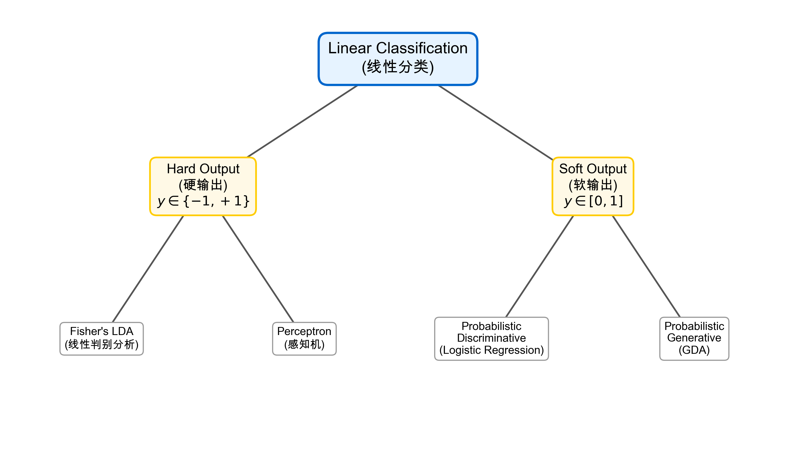
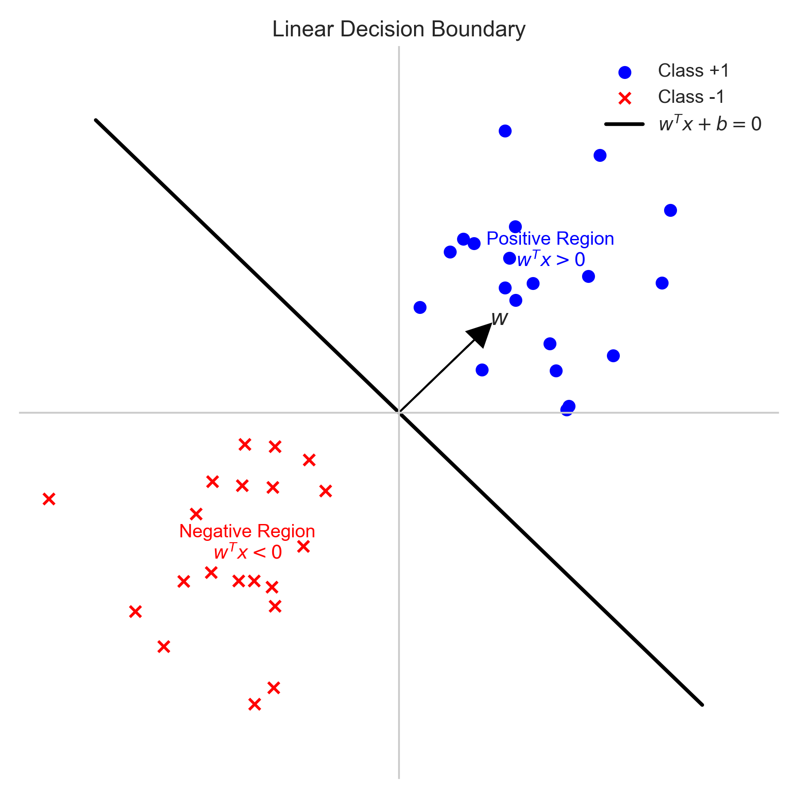
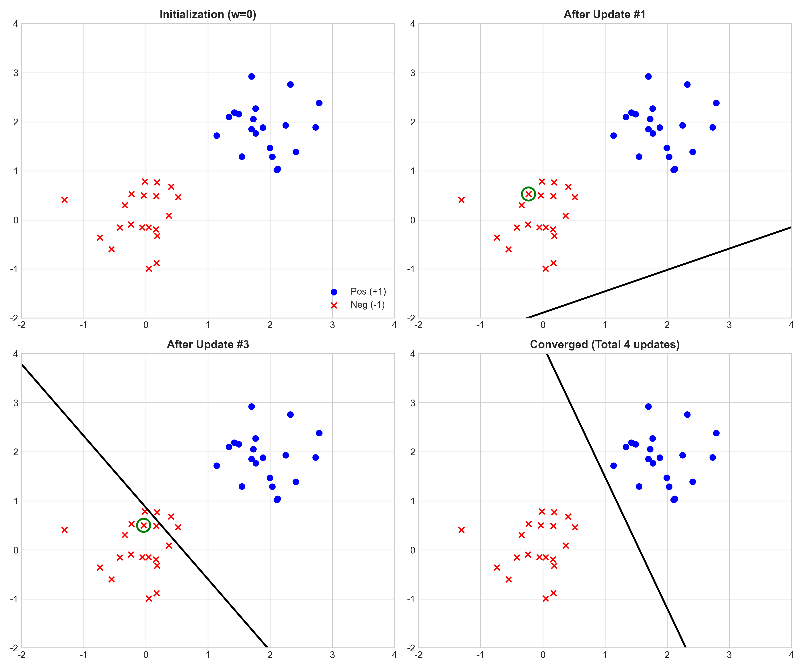
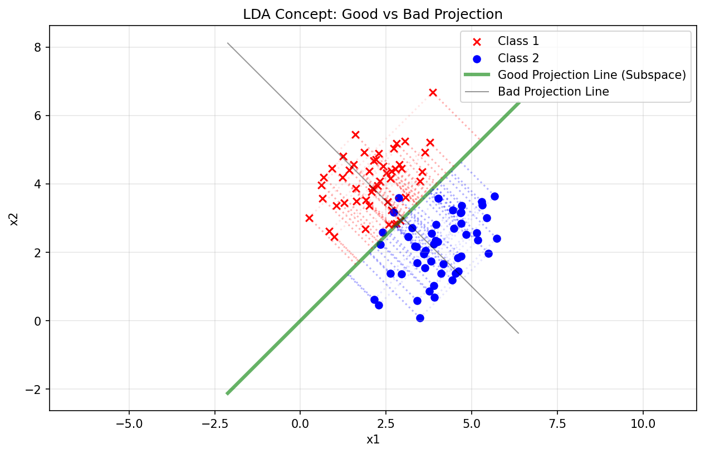
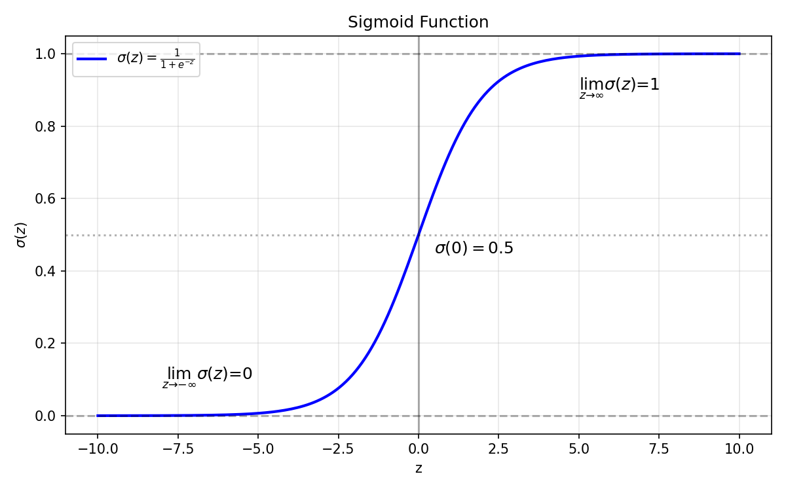
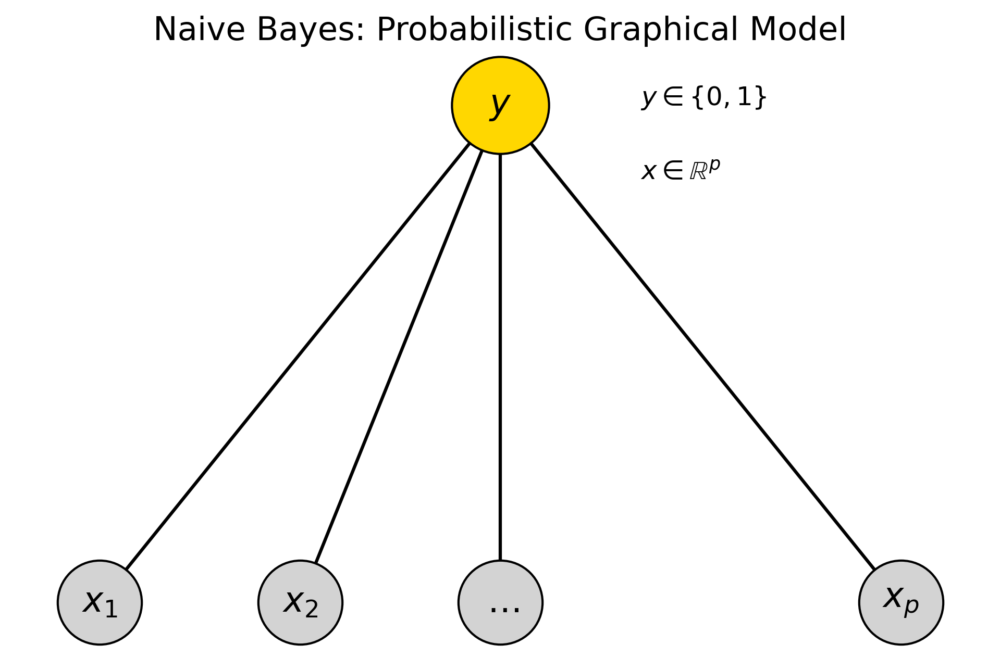

# 线性分类

## 1. 背景与分类 (Background & Taxonomy)

线性分类是线性回归在分类问题上的推广。
其核心思想是通过一个**线性模型** $f(w, b) = w^T x + b$ 提取特征信息，然后根据输出的形式不同，可以分为**硬分类**和**软分类**。

### 1.1 知识图谱 (Mindmap)

根据输出形式（Hard vs Soft）以及建模方式（Generative vs Discriminative），常见的线性分类算法归纳如下：

<!-- Generated by scripts/generate_ch04_concept_map.py -->
*(图示：线性分类算法体系。根据输出形式分为硬输出和软输出，根据建模方式分为生成式和判别式。)*

**(1) 硬输出 (Hard Output)**:
*   输出直接为离散的类别标签 $y \in \{-1, +1\}$。
*   典型算法：
    *   **线性判别分析 (Fisher's LDA)**：寻找最佳投影方向，使得类间方差最大、类内方差最小。
    *   **感知机 (Perceptron)**：错误驱动 (Error Driven) 的算法，通过不断修正误分类点来寻找分离超平面。

**(2) 软输出 (Soft Output)**:
*   输出为属于某一类的概率 $P(Y=1|X) \in [0, 1]$。
*   典型算法：
    *   **概率判别模型 (Probabilistic Discriminative)**：直接对 $P(Y|X)$ 建模，例如 **逻辑回归 (Logistic Regression)**。
    *   **概率生成模型 (Probabilistic Generative)**：先对 $P(X|Y)$ 和 $P(Y)$ 建模，再通过贝叶斯公式推导 $P(Y|X)$，例如 **高斯判别分析 (GDA)**。

### 1.2 线性回归与线性分类的关系

线性分类模型通常可以看作是线性回归模型加上一个**激活函数 (Activation Function)** $f$：
$$
y = f(w^T x + b)
$$
*   **线性回归**：$f(z) = z$ (Identity)，输出范围 $(-\infty, +\infty)$。
*   **线性分类**：
    *   **硬分类**：$f(z) = \text{sign}(z)$ (阶跃函数)，输出 $\{+1, -1\}$。
    *   **软分类**：$f(z) = \sigma(z)$ (Sigmoid 等)，输出概率 $[0, 1]$。

反之，激活函数的逆函数 $f^{-1}$ 被称为**链接函数 (Link Function)**。
例如在逻辑回归中，链接函数是 Logit 函数：$\text{logit}(p) = \log \frac{p}{1-p} = w^T x + b$。

### 1.3 线性判别函数 (Linear Discriminant Function)

对于二分类问题，决策边界 (Decision Boundary) 由线性方程 $w^T x + b = 0$ 确定。

**几何意义**：
*   **决策边界**：是一个超平面 (Hyperplane)。
*   **权重向量 $w$**：是该超平面的法向量，指向正类 ($y=+1$) 的一侧。
*   **距离**：任意点 $x$ 到超平面的有向距离为 $r = \frac{w^T x + b}{||w||}$。

*(图示：线性决策边界 $w^T x + b = 0$ 将空间分为正负两部分。)*

## 2. 感知机 (Perceptron)

### 2.1 算法详解 (Algorithm Detail)

**1. 历史背景 (History)**
*   **起源**: 感知机 (Perceptron) 由 **Frank Rosenblatt** 于 1957 年提出，是神经网络的鼻祖。
*   **硬件**: 1960 年，Rosenblatt 建造了 **Mark I Perceptron** 硬件，这不仅是算法，更是第一台基于神经网络的计算机。
*   **低谷**: 1969 年，Marvin Minsky 和 Seymour Papert 出版著作《Perceptrons》，证明了单层感知机无法解决 **XOR (异或)** 问题（非线性问题），导致神经网络研究进入了长达十年的“寒冬”。

**2. 模型定义 (Model Definition)**
感知机是一个二类分类的线性判别模型：
$$
f(x) = \text{sign}(w \cdot x + b)
$$
*   输入空间：$x \in \mathcal{X} \subseteq \mathbb{R}^n$
*   输出空间：$y \in \mathcal{Y} = \{+1, -1\}$
*   参数：$w \in \mathbb{R}^n$ (权重), $b \in \mathbb{R}$ (偏置)。

**3. 策略 (Strategy): 损失函数推导**
我们需要定义一个 Loss Function 来衡量模型的好坏。
*   **直观想法**: 最小化误分类点的总数 $\sum I(y_i \neq f(x_i))$。但这不可导 (NP-hard)，无法用梯度下降求解。
*   **感知机选择**: 最小化**误分类点到超平面的总距离**。

任意样本点 $x_0$ 到超平面 $S: w \cdot x + b = 0$ 的距离为：
$$
\frac{1}{||w||} |w \cdot x_0 + b|
$$
对于**误分类点** $(x_i, y_i)$，有 $-y_i(w \cdot x_i + b) > 0$。
忽略缩放因子 $\frac{1}{||w||}$（不影响误分类点的判断），感知机的损失函数定义为所有误分类点 $M$ 的函数间隔之和：
$$
L(w, b) = - \sum_{x_i \in M} y_i (w \cdot x_i + b)
$$
*   该函数连续、分段线性、且是凸函数 (Convex)，易于优化。

**4. 算法 (Algorithm): 随机梯度下降 (SGD)**
我们需要最小化 $L(w, b)$。对其求偏导：
$$
\nabla_w L = - \sum_{x_i \in M} y_i x_i, \quad \nabla_b L = - \sum_{x_i \in M} y_i
$$
采用**随机梯度下降 (SGD)**，每次随机选取一个误分类点 $(x_i, y_i)$ 进行更新：
$$
\begin{aligned}
w &\leftarrow w + \eta y_i x_i \\
b &\leftarrow b + \eta y_i
\end{aligned}
$$
其中 $\eta$ ($0 < \eta \le 1$) 是学习率。
*   **直观解释**: 当一个正样本 ($y=+1$) 被误分类（$w \cdot x < 0$），我们将 $w$ 加上 $\eta x$，使得 $w \cdot x$ 增大，从而试图越过 0 纠正错误；反之亦然。

**5. 收敛性 (Convergence Theorem)**
感知机算法的一个重要理论保证是 **Novikoff 定理 (1962)**：
*   **前提**: 若数据集 $T = \{(x_1, y_1), ..., (x_N, y_N)\}$ 是**线性可分**的。
*   **结论**: 经过有限次迭代 $k$，感知机算法必定收敛。
*   **上界**: 误分类次数 $k$ 满足不等式：
    $$
    k \le \left( \frac{R}{\gamma} \right)^2
    $$
    其中 $R = \max_i ||x_i||$ 是输入向量的最大模长，$\gamma$ 是数据集的**几何间隔 (Geometric Margin)**。
    *   这说明收敛速度只与数据的分布（R 和 $\gamma$）有关，而与数据维度无关。哪怕维度很高，只要分得足够开（$\gamma$ 大），收敛就很快。

### 2.2 训练过程可视化 (Training Process Visualization)

感知机的学习过程是一个不断调整决策边界的过程。
下图展示了算法在二维线性可分数据上的训练过程：
1.  **Initialization**: 初始状态（随机或零初始化）。
2.  **Update**: 发现误分类点（高亮绿色圈出的点），更新权重 vector $w$，决策边界随之移动。
3.  **Converged**: 最终找到一个超平面将所有正负样本完全分开。

*(图示：感知机训练过程快照。从初始状态开始，通过错误驱动不断修正决策边界，直到所有样本分类正确。)*

## 3. 线性判别分析 (Linear Discriminant Analysis, LDA)

### 3.1 问题定义 (Problem Definition)

给定数据集 $X = (x_1, x_2, \dots, x_N)^T \in \mathbb{R}^{N \times p}$，对应标签 $Y = (y_1, y_2, \dots, y_N)^T \in \{+1, -1\}^N$。
我们将数据集划分为两类：
*   $X_{c1} = \{ x_i \mid y_i = +1 \}$，样本数为 $N_1$。
*   $X_{c2} = \{ x_i \mid y_i = -1 \}$，样本数为 $N_2$。
其中 $N_1 + N_2 = N$。

### 3.2 核心思想 (Core Idea)

LDA 的核心思想是**降维 (Dimensionality Reduction)** 和 **分类**。我们希望找到一个投影方向 $w$，将所有样本投影到该方向（一维直线）上，使得投影后的点满足：
**“类内小，类间大” (Small Intra-class Variance, Large Inter-class Variance)**。

*   **类内小**：同类样本投影后尽可能密集，方差尽可能小。
*   **类间大**：不同类样本的中心点投影后尽可能远离。

<!-- Generated by scripts/generate_ch04_lda_plot.py -->
*(图示：LDA 投影示意。好的投影直线（绿色实线）能让两类数据清晰分开；坏的投影直线（黑色实线）则会导致数据重叠。)*

### 3.3 模型推导 (Derivation)

定义投影后的标量 $z_i = w^T x_i$。

#### 1. 均值 (Means)
*   类 $c1$ 的原始均值：$\bar{x}_1 = \frac{1}{N_1} \sum_{i \in c1} x_i$
*   类 $c2$ 的原始均值：$\bar{x}_2 = \frac{1}{N_2} \sum_{i \in c2} x_i$
*   投影后的均值：
    $$
    \bar{z}_1 = \frac{1}{N_1} \sum_{i \in c1} w^T x_i = w^T \bar{x}_1
    $$
    $$
    \bar{z}_2 = w^T \bar{x}_2
    $$
*   **类间距离**：$(\bar{z}_1 - \bar{z}_2)^2$。我们需要最大化它。

#### 2. 方差 (Variances)
*   投影后类 $c1$ 的方差 (Scatter)：
    $$
    S_1 = \sum_{i \in c1} (z_i - \bar{z}_1)^2 = \sum_{i \in c1} (w^T x_i - w^T \bar{x}_1)^2
    $$
*   投影后类 $c2$ 的方差：
    $$
    S_2 = \sum_{i \in c2} (z_i - \bar{z}_2)^2
    $$
*   **类内方差和**：$S_1 + S_2$。我们需要最小化它。

#### 3. 目标函数与矩阵推导 (Objective & Matrix Derivation)
我们将上述三个因素组合，得到 **Fisher 判别准则 (Fisher Discriminant Criterion)**：

**分子推导 (Numerator)**: 类间方差
$$
\begin{aligned}
(\bar{z}_1 - \bar{z}_2)^2 &= (w^T \bar{x}_1 - w^T \bar{x}_2)^2 \\
&= (w^T (\bar{x}_1 - \bar{x}_2))^2 \\
&= w^T (\bar{x}_1 - \bar{x}_2) (\bar{x}_1 - \bar{x}_2)^T w \\
&= w^T S_b w
\end{aligned}
$$
其中定义 **类间散度矩阵 (Between-class Scatter Matrix)**：
$$
S_b = (\bar{x}_1 - \bar{x}_2)(\bar{x}_1 - \bar{x}_2)^T
$$

**分母推导 (Denominator)**: 类内方差
以 $S_1$ 为例：
$$
\begin{aligned}
S_1 &= \sum_{i \in c1} (z_i - \bar{z}_1)^2 \\
&= \sum_{i \in c1} (w^T x_i - w^T \bar{x}_1)^2 \\
&= \sum_{i \in c1} (w^T (x_i - \bar{x}_1)) (w^T (x_i - \bar{x}_1))^T \\
&= w^T \left[ \sum_{i \in c1} (x_i - \bar{x}_1)(x_i - \bar{x}_1)^T \right] w \\
&= w^T S_{c1} w
\end{aligned}
$$
同理 $S_2 = w^T S_{c2} w$。
定义 **类内散度矩阵 (Within-class Scatter Matrix)** $S_w = S_{c1} + S_{c2}$，则分母为：
$$
S_1 + S_2 = w^T S_{c1} w + w^T S_{c2} w = w^T (S_{c1} + S_{c2}) w = w^T S_w w
$$

**最终目标函数 (Final Objective)**:
$$
J(w) = \frac{(\bar{z}_1 - \bar{z}_2)^2}{S_1 + S_2} = \frac{w^T S_b w}{w^T S_w w}
$$
我们的目标是找到最优的 $w$：
$$
\hat{w} = \arg \max_w J(w)
$$
这就转化为求解 **广义瑞利商 (Generalized Rayleigh Quotient)** 的极值问题。

### 3.4 求解最优 $w$ (Solving for Optimal w)

我们需要最大化 $J(w)$，对其求导并令其为 0：
$$
\frac{\partial J(w)}{\partial w} = \frac{\partial}{\partial w} \left( \frac{w^T S_b w}{w^T S_w w} \right) = 0
$$
利用商的求导法则（$(u/v)' = (u'v - uv')/v^2$）：
$$
\frac{ (w^T S_w w) \cdot (2 S_b w) - (w^T S_b w) \cdot (2 S_w w) }{(w^T S_w w)^2} = 0
$$
分母不为 0，且忽略常数 2，整理得：
$$
(w^T S_w w) S_b w = (w^T S_b w) S_w w
$$
注意到 $w^T S_w w$ 和 $w^T S_b w$ 都是标量 (Scalars)。令 $\lambda = \frac{w^T S_b w}{w^T S_w w}$ 为广义特征值，则有：
$$
S_b w = \lambda S_w w
$$
这就是 **广义特征值问题 (Generalized Eigenvalue Problem)**。
如果 $S_w$ 可逆，两边同乘 $S_w^{-1}$：
$$
S_w^{-1} S_b w = \lambda w
$$

**进一步简化**:
回忆 $S_b = (\bar{x}_1 - \bar{x}_2)(\bar{x}_1 - \bar{x}_2)^T$。
代入 $S_b w$：
$$
S_b w = (\bar{x}_1 - \bar{x}_2) \underbrace{(\bar{x}_1 - \bar{x}_2)^T w}_{\text{Scalar } k}
$$
这意味着 $S_b w$ 的方向总是平行于 $(\bar{x}_1 - \bar{x}_2)$。
代回原广义特征方程，我们可以看出 $S_w w$ 的方向必须与 $S_b w$ 平行，也就是与 $(\bar{x}_1 - \bar{x}_2)$ 平行：
$$
S_w w \propto (\bar{x}_1 - \bar{x}_2)
$$
两边同乘 $S_w^{-1}$，得到最优投影方向：
$$
\hat{w} \propto S_w^{-1} (\bar{x}_1 - \bar{x}_2)
$$

**几何解释**:
*   如果类内协方差矩阵是对角阵且各向同性 ($S_w \propto I$)，则 $S_w^{-1} \propto I$，此时 $\hat{w} \propto (\bar{x}_1 - \bar{x}_2)$。即投影方向就是两个均值中心的连线方向。
*   但在一般情况下，我们需要用 $S_w^{-1}$ 对方向进行修正，以消除数据的相关性影响（相当于做白化处理）。

## 4. 逻辑回归 (Logistic Regression)

逻辑回归虽然即使名字里有“回归”，但它实际上是一个**分类模型**。它通过引入 Sigmoid 函数将线性输出转化为概率。

### 4.1 模型定义 (Model Definition)

*   **数据 (Data)**: $\{(x_i, y_i)\}_{i=1}^N$，其中 $x_i \in \mathbb{R}^p$，$y_i \in \{0, 1\}$ (注意这里标签通常定义为 0/1)。
*   **Sigmoid 函数**:
    $$
    \sigma(z) = \frac{1}{1 + e^{-z}}
    $$
    *   性质：
        *   $z \to \infty, \sigma(z) \to 1$
        *   $z \to -\infty, \sigma(z) \to 0$
        *   $z = 0, \sigma(z) = 0.5$
        *   $\sigma: \mathbb{R} \to (0, 1)$

<!-- Generated by scripts/generate_ch04_sigmoid_plot.py -->
*(图示：Sigmoid 函数曲线，将任意实数映射到 (0, 1) 区间，作为概率解释。)*

*   **概率模型**:
    我们将线性模型的输出 $w^T x$ 通过 Sigmoid 函数映射为概率 $P(Y=1|X)$：
    $$
    \begin{cases}
    P(Y=1|x) = \sigma(w^T x) = \frac{1}{1 + e^{-w^T x}} \triangleq p_1 \\
    P(Y=0|x) = 1 - P(Y=1|x) = \frac{e^{-w^T x}}{1 + e^{-w^T x}} \triangleq p_0
    \end{cases}
    $$
    令 $\psi(x; w) = \sigma(w^T x)$，则可以将上述两个式子合并为：
    $$
    P(Y=y|x) = p_1^y p_0^{1-y} = [\psi(x; w)]^y [1 - \psi(x; w)]^{1-y}
    $$

### 4.2 极大似然估计 (MLE)

我们需要估计参数 $w$，常用的方法是 **极大似然估计 (Maximum Likelihood Estimation, MLE)**。

目标是最大化似然函数 (Likelihood)：
$$
\hat{w} = \arg \max_w \log P(Y|X)
$$
假设样本独立同分布 (i.i.d.)，则：
$$
\begin{aligned}
\log P(Y|X) &= \log \prod_{i=1}^N P(y_i|x_i) \\
&= \sum_{i=1}^N \log P(y_i|x_i) \\
&= \sum_{i=1}^N \log \left( p_1^{y_i} p_0^{1-y_i} \right) \\
&= \sum_{i=1}^N \left( y_i \log p_1 + (1-y_i) \log p_0 \right)
\end{aligned}
$$
代入 $p_1 = \psi(x_i; w)$ 和 $p_0 = 1 - \psi(x_i; w)$：
$$
\hat{w} = \arg \max_w \sum_{i=1}^N \left[ y_i \log \psi(x_i; w) + (1-y_i) \log (1 - \psi(x_i; w)) \right]
$$

### 4.3 交叉熵 (Cross Entropy)

极大似然估计 (Max Likelihood) 等价于 **最小化负对数似然 (Minimizing Negative Log-Likelihood, NLL)**。
$$
L(w) = - \sum_{i=1}^N \left[ y_i \log \psi(x_i; w) + (1-y_i) \log (1 - \psi(x_i; w)) \right]
$$
这一项正是 **交叉熵 (Cross Entropy)** 损失函数。
$$
\text{MLE} \iff \min \text{Cross Entropy}
$$
*   这解释了为什么逻辑回归使用交叉熵作为损失函数：它是从概率模型的极大似然估计推导出来的自然结果。

## 5. 高斯判别分析 (Gaussian Discriminant Analysis, GDA)

高斯判别分析 (GDA) 是一种 **生成式模型 (Generative Model)**。与逻辑回归直接对 $P(Y|X)$ 建模不同，GDA 先对 $P(X|Y)$ 和 $P(Y)$ 建模，然后利用贝叶斯公式进行分类。

### 5.1 模型定义 (Model Definition)

*   **数据**: $\{(x_i, y_i)\}_{i=1}^N$，其中 $x_i \in \mathbb{R}^p$，$y_i \in \{0, 1\}$。
*   **生成模型思路**:
    $$
    P(y|x) = \frac{P(x|y)P(y)}{P(x)} \propto P(x|y)P(y)
    $$
    *   Posterior $\propto$ Likelihood $\times$ Prior
*   **预测**:
    $$
    \hat{y} = \arg \max_{y \in \{0, 1\}} P(y|x) = \arg \max_y P(y) P(x|y)
    $$

*   **假设 (Assumptions)**:
    1.  **先验概率 (Prior)** $P(y)$ 服从伯努利分布 (Bernoulli)：
        $$
        y \sim \text{Bernoulli}(\phi) \Rightarrow P(y) = \phi^y (1-\phi)^{1-y}
        $$
        即 $P(y=1) = \phi, P(y=0) = 1-\phi$。
    2.  **条件概率 (likelihood)** $P(x|y)$ 服从高斯分布 (Gaussian)：
        *   $x|y=1 \sim \mathcal{N}(\mu_1, \Sigma)$
        *   $x|y=0 \sim \mathcal{N}(\mu_2, \Sigma)$
        *   **注意**: 这里假设两类共享同一个协方差矩阵 $\Sigma$。
        *   可以将两者合并写为：
            $$
            P(x|y) = \mathcal{N}(x|\mu_1, \Sigma)^y \mathcal{N}(x|\mu_2, \Sigma)^{1-y}
            $$

### 5.2 模型求解：极大似然估计 (Model Solving: MLE)

我们需要估计的参数集合为 $\theta = (\phi, \mu_1, \mu_2, \Sigma)$。
目标是最大化联合概率的对数似然函数 (Log-Likelihood)：

$$
\begin{aligned}
L(\theta) &= \log \prod_{i=1}^N P(x_i, y_i) \\
&= \sum_{i=1}^N \log \left( P(x_i|y_i) P(y_i) \right) \\
&= \sum_{i=1}^N \left[ \log P(x_i|y_i) + \log P(y_i) \right] \\
&= \sum_{i=1}^N \left[ \log \left( \mathcal{N}(x_i|\mu_1, \Sigma)^{y_i} \cdot \mathcal{N}(x_i|\mu_2, \Sigma)^{1-y_i} \right) + \log \left( \phi^{y_i} (1-\phi)^{1-y_i} \right) \right] \\
&= \sum_{i=1}^N \left[ \log \mathcal{N}(x_i|\mu_1, \Sigma)^{y_i} + \log \mathcal{N}(x_i|\mu_2, \Sigma)^{1-y_i} + \log \phi^{y_i}(1-\phi)^{1-y_i} \right] \\
&= \sum_{i=1}^N \left[ y_i \log \mathcal{N}(x_i|\mu_1, \Sigma) + (1-y_i) \log \mathcal{N}(x_i|\mu_2, \Sigma) + y_i \log \phi + (1-y_i) \log (1-\phi) \right]
\end{aligned}
$$

我们可以将 $L(\theta)$ 分解为三个部分，分别对应不同的参数：
$$
L(\theta) = \underbrace{\sum_{i=1}^N y_i \log \mathcal{N}(x_i|\mu_1, \Sigma)}_{\text{涉及 } \mu_1, \Sigma} + \underbrace{\sum_{i=1}^N (1-y_i) \log \mathcal{N}(x_i|\mu_2, \Sigma)}_{\text{涉及 } \mu_2, \Sigma} + \underbrace{\sum_{i=1}^N \left[ y_i \log \phi + (1-y_i) \log (1-\phi) \right]}_{\text{涉及 } \phi}
$$

记为 $L(\theta) = L_1(\mu_1, \Sigma) + L_2(\mu_2, \Sigma) + L_3(\phi)$。

#### 1. 求解 $\phi$ (Solving for $\phi$)

只考虑 $L_3(\phi)$：
$$
L_3(\phi) = \sum_{i=1}^N \left( y_i \log \phi + (1-y_i) \log (1-\phi) \right)
$$
对 $\phi$ 求偏导并令其为 0：
$$
\begin{aligned}
\frac{\partial L_3}{\partial \phi} &= \sum_{i=1}^N \left( y_i \frac{1}{\phi} - (1-y_i) \frac{1}{1-\phi} \right) \\
&= \frac{1}{\phi} \sum_{i=1}^N y_i - \frac{1}{1-\phi} \sum_{i=1}^N (1-y_i) \\
&= 0
\end{aligned}
$$
令 $N_1 = \sum_{i=1}^N y_i$ (正样本数)，$N_2 = \sum_{i=1}^N (1-y_i) = N - N_1$ (负样本数)。
$$
\begin{aligned}
\frac{N_1}{\phi} &= \frac{N_2}{1-\phi} \\
N_1 (1-\phi) &= N_2 \phi \\
N_1 - N_1 \phi &= (N - N_1) \phi \\
N_1 &= N \phi \\
\Rightarrow \hat{\phi} &= \frac{N_1}{N}
\end{aligned}
$$
结论：$\hat{\phi}$ 就是训练集中正样本的比例。

#### 2. 求解 $\mu_1$ (Solving for $\mu_1$)

只考虑 $L_1(\mu_1, \Sigma)$，它包含了所有 $y_i=1$ 的样本。
$$
L_1(\mu_1) = \sum_{i: y_i=1} \log \mathcal{N}(x_i|\mu_1, \Sigma)
$$
展开高斯分布的对数形式：
$$
\log \mathcal{N}(x_i|\mu_1, \Sigma) = \log \left( \frac{1}{(2\pi)^{p/2} |\Sigma|^{1/2}} \exp \left( -\frac{1}{2} (x_i - \mu_1)^T \Sigma^{-1} (x_i - \mu_1) \right) \right)
$$
忽略与 $\mu_1$ 无关的常数项，目标函数简化为：
$$
\Delta(\mu_1) = \sum_{i: y_i=1} \left( -\frac{1}{2} (x_i - \mu_1)^T \Sigma^{-1} (x_i - \mu_1) \right)
$$
对 $\mu_1$ 求梯度。利用矩阵求导公式 $\frac{\partial}{\partial x} (x-a)^T A (x-a) = (A + A^T)(x-a)$，这里 $\Sigma^{-1}$ 是对称矩阵，所以导数为 $2\Sigma^{-1}(x_i - \mu_1)$。
$$
\begin{aligned}
\nabla_{\mu_1} \Delta &= \sum_{i: y_i=1} -\frac{1}{2} \cdot 2 \Sigma^{-1} (\mu_1 - x_i) \\
&= \sum_{i: y_i=1} \Sigma^{-1} (x_i - \mu_1) \\
&= \Sigma^{-1} \left( \sum_{i: y_i=1} x_i - \sum_{i: y_i=1} \mu_1 \right)
\end{aligned}
$$
令梯度为 0（由于 $\Sigma^{-1}$ 正定可逆，可直接消去）：
$$
\begin{aligned}
\sum_{i: y_i=1} x_i - N_1 \hat{\mu}_1 &= 0 \\
\hat{\mu}_1 &= \frac{1}{N_1} \sum_{i: y_i=1} x_i
\end{aligned}
$$
结论：$\hat{\mu}_1$ 是所有正样本的均值。

#### 3. 求解 $\mu_2$ (Solving for $\mu_2$)

同理，利用 $L_2(\mu_2, \Sigma)$ 可得：
$$
\hat{\mu}_2 = \frac{1}{N_2} \sum_{i: y_i=0} x_i
$$
结论：$\hat{\mu}_2$ 是所有负样本的均值。

#### 4. 求解 $\Sigma$ (Solving for $\Sigma$)

为了求解 $\Sigma$，我们需要同时考虑 $L_1(\mu_1, \Sigma)$ 和 $L_2(\mu_2, \Sigma)$ 中包含 $\Sigma$ 的项。
$$
\begin{aligned}
L(\Sigma) &= \sum_{i: y_i=1} \log \mathcal{N}(x_i|\mu_1, \Sigma) + \sum_{i: y_i=0} \log \mathcal{N}(x_i|\mu_2, \Sigma) \\
&= \sum_{i \in G_1} \left( -\frac{1}{2} \log |\Sigma| - \frac{1}{2} (x_i - \mu_1)^T \Sigma^{-1} (x_i - \mu_1) \right) \\
&+ \sum_{i \in G_2} \left( -\frac{1}{2} \log |\Sigma| - \frac{1}{2} (x_i - \mu_2)^T \Sigma^{-1} (x_i - \mu_2) \right) + C
\end{aligned}
$$
其中 $G_1 = \{x_i | y_i=1\}$，样本数为 $N_1$；$G_2 = \{x_i | y_i=0\}$，样本数为 $N_2$。$N = N_1 + N_2$。

合并 $\log |\Sigma|$ 项：
$$
-\frac{N_1}{2} \log |\Sigma| - \frac{N_2}{2} \log |\Sigma| = -\frac{N}{2} \log |\Sigma|
$$

对于二次项，利用 **迹的性质 (Trace Trick)**：对于标量 $a$，有 $a = \text{tr}(a)$。
$$
\sum_{i \in G_1} (x_i - \mu_1)^T \Sigma^{-1} (x_i - \mu_1) = \text{tr} \left( \sum_{i \in G_1} (x_i - \mu_1)(x_i - \mu_1)^T \Sigma^{-1} \right)
$$
定义两类的**样本协方差矩阵 (Sample Covariance Matrix)**（注意这里为了对应推导，分母取 $N$ 或 $N_k$ 视具体定义而定，我们定义 $S_1, S_2$ 如下）：
$$
S_1 = \frac{1}{N_1} \sum_{i \in G_1} (x_i - \mu_1)(x_i - \mu_1)^T
$$
$$
S_2 = \frac{1}{N_2} \sum_{i \in G_2} (x_i - \mu_2)(x_i - \mu_2)^T
$$
则上述迹的项可以写为 $N_1 \text{tr}(S_1 \Sigma^{-1})$ 和 $N_2 \text{tr}(S_2 \Sigma^{-1})$。

代回 $L(\Sigma)$：
$$
\begin{aligned}
L(\Sigma) &= -\frac{N}{2} \log |\Sigma| - \frac{1}{2} \left[ N_1 \text{tr}(S_1 \Sigma^{-1}) + N_2 \text{tr}(S_2 \Sigma^{-1}) \right] \\
&= -\frac{N}{2} \log |\Sigma| - \frac{1}{2} \text{tr} \left( (N_1 S_1 + N_2 S_2) \Sigma^{-1} \right)
\end{aligned}
$$

对 $\Sigma$ 求导并令其为 0：
$$
\frac{\partial L}{\partial \Sigma} = -\frac{N}{2} \Sigma^{-1} - \frac{1}{2} \left( - \Sigma^{-1} (N_1 S_1 + N_2 S_2) \Sigma^{-1} \right) = 0
$$
两边同乘 $\Sigma$ 并整理：
$$
\begin{aligned}
-N I + \Sigma^{-1} (N_1 S_1 + N_2 S_2) &= 0 \\
N \Sigma &= N_1 S_1 + N_2 S_2
\end{aligned}
$$

最终得到最优估计：
$$
\hat{\Sigma} = \frac{1}{N} (N_1 S_1 + N_2 S_2)
$$
**结论**：$\hat{\Sigma}$ 是两类样本协方差矩阵的加权平均。这保证了 GDA 在假设两类协方差相同时的参数估计一致性。

## 6. 朴素贝叶斯分类器 (Naive Bayes Classifier)

### 6.1 核心思想 (Core Idea)

朴素贝叶斯 (Naive Bayes) 是最简单的 **生成式模型 (Generative Model)** 之一。
它的核心在于 **“朴素” (Naive)** 假设：**条件独立性假设 (Conditional Independence Assumption)**。

*   **动机**: 在 GDA 中，我们假设 $P(x|y)$ 服从高斯分布，参数量随特征维度 $p$ 的平方增长（主要是协方差矩阵 $\Sigma$ 的 $p^2$ 项）。为了简化运算和减少参数，我们假设给定类别 $y$ 后，特征 $x$ 的各个维度 $x_1, x_2, \dots, x_p$ 相互独立。

### 6.2 概率图模型 (Probabilistic Graphical Model)

朴素贝叶斯是最简单的概率有向图模型：
*   $y$ 是父节点（类别）。
*   $x_1, x_2, \dots, x_p$ 是子节点（特征），它们之间没有连接，表明在给定 $y$ 的情况下相互独立。

<!-- Generated by scripts/generate_ch04_naive_bayes_pgm.py -->
*(图示：朴素贝叶斯的概率图模型。给定 $y$，所有 $x_j$ 相互独立。)*

### 6.3 模型推导 (Formulation)

根据贝叶斯公式和独立性假设：
$$
\begin{aligned}
\hat{y} &= \arg \max_y P(y|x) \\
&= \arg \max_y \frac{P(x, y)}{P(x)} \\
&= \arg \max_y \frac{P(y) P(x|y)}{P(x)} \\
&\propto \arg \max_y P(y) P(x|y)
\end{aligned}
$$
由于 $x \in \mathbb{R}^p$ 的各个维度在给定 $y$ 下独立：
$$
P(x|y) = \prod_{j=1}^p P(x_j|y)
$$
因此：
$$
\hat{y} = \arg \max_{y \in \{0, 1\}} P(y) \prod_{j=1}^p P(x_j|y)
$$

### 6.4 分布假设 (Distribution Assumptions)

根据 $x_j$ 的数据类型不同，$P(x_j|y)$ 可以服从不同的分布：

1.  **$x_j$ 是离散变量 (Discrete)**:
    *   $x_j \sim \text{Categorical Distribution}$ (多项分布/分类分布)。
    *   例如文本分类中单词出现与否。

2.  **$x_j$ 是连续变量 (Continuous)**:
    *   $x_j \sim \text{Gaussian Distribution}$ (高斯分布)。
    *   即 $x_j|y=k \sim \mathcal{N}(\mu_{jk}, \sigma_{jk}^2)$。
    *   这实际上是 GDA 的一种特殊情况：当 GDA 的协方差矩阵 $\Sigma$ 被限制为**对角矩阵 (Diagonal Matrix)** 时，GDA 就退化为高斯朴素贝叶斯 (Gaussian Naive Bayes)。

