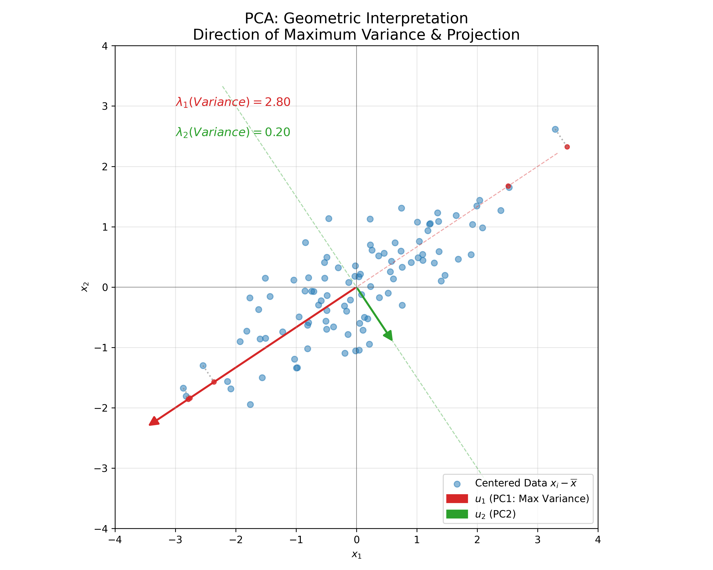
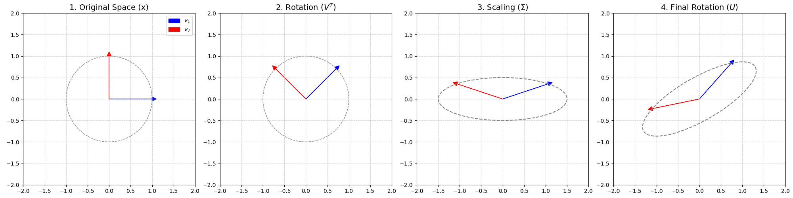
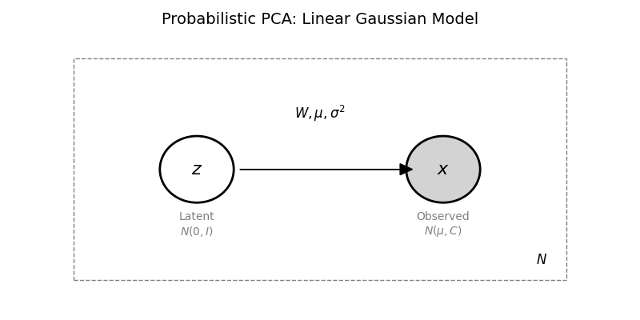

# 降维 (Dimensionality Reduction)

## 1. 背景 (Background)

### 1.1 维度灾难 (Curse of Dimensionality)

在处理高维数据时，我们经常会遇到所谓的“维度灾难”。

+ **数据稀疏性 (Data Sparsity)**: 随着维度增加，数据在空间中会变得越来越稀疏。
+ **几何性质 (Geometric Properties)**: 高维空间中的几何性质与低维空间大相径庭。

### 1.2 过拟合 (Overfitting) 与 降维动机

维度增加往往会导致过拟合 (Overfitting)。

$$
\begin{aligned}
\text{Data Amount} \uparrow & \longrightarrow \text{Overfitting} \downarrow \\
\text{Dimension} \uparrow & \longrightarrow \text{Overfitting} \uparrow
\end{aligned}
$$

为了解决过拟合问题，我们可以采用：
1. **正则化 (Regularization)**
2. **降维 (Dimensionality Reduction)**

降维方法主要分为：
+ **直接降维 (Feature Selection)**: 例如 LASSO。
+ **线性降维 (Linear Dimensionality Reduction)**: PCA, MDS, FDA 等。
+ **非线性降维 (Non-linear Dimensionality Reduction)**: 流形学习 (Manifold Learning)，如 Isomap, LLE。

### 1.3 几何直观 (Geometric Intuition)

为了直观理解维度灾难，我们考察高维空间中超球体与超立方体的体积关系。

#### 1.3.1 超球体与超立方体体积比

考虑一个边长为 $1$ 的 $D$ 维超立方体，并在其中内切一个半径为 $0.5$ 的 $D$ 维超球体。

+ **超立方体体积**: $V_{cube} = 1^D = 1$
+ **超球体体积**: $V_{sphere} = K \cdot (0.5)^D$，其中 $K$ 是与维度有关的常数 ($K = \frac{\pi^{D/2}}{\Gamma(D/2+1)}$)。

当维度 $D \to \infty$ 时：

$$
\lim_{D \to \infty} \frac{V_{sphere}}{V_{cube}} = \lim_{D \to \infty} \frac{K \cdot (0.5)^D}{1} = 0
$$

这意味着在高维空间中，超球体的体积相对于外接超立方体几乎可以忽略不计。绝大部分体积集中在超立方体的“角”上。

#### 1.3.2 球壳体积占比 (Shell Volume Concentration)

考虑一个半径 $r=1$ 的 $D$ 维超球体，以及一个厚度为 $\epsilon$ 的球壳。
+ **外部球体体积 (Total)**: $V_{total} = K \cdot 1^D = K$
+ **内部球体体积 (Internal)**: $V_{internal} = K \cdot (1-\epsilon)^D$
+ **球壳体积 (Shell)**: $V_{shell} = V_{total} - V_{internal} = K - K(1-\epsilon)^D$

球壳体积占总体积的比例：

$$
\frac{V_{shell}}{V_{total}} = \frac{K - K(1-\epsilon)^D}{K} = 1 - (1-\epsilon)^D
$$

由于 $0 < \epsilon < 1$，当 $D \to \infty$ 时，$(1-\epsilon)^D \to 0$。因此：

$$
\lim_{D \to \infty} \frac{V_{shell}}{V_{total}} = 1
$$

这表明在**高维空间中，几乎所有的体积都集中在球体的表面薄壳上**。

## 2. 预备知识 (Prerequisites)

在深入研究降维算法之前，我们需要定义数据的表示以及均值和协方差的矩阵形式。

### 2.1 数据表示 (Data Representation)

假设我们要处理的数据集 $X$ 包含 $N$ 个样本，每个样本有 $p$ 个特征。

$$
X = (x_1, x_2, \cdots, x_N)^T_{N \times p} = \begin{pmatrix} x_1^T \\ x_2^T \\ \vdots \\ x_N^T \end{pmatrix} = \begin{pmatrix} x_{11} & x_{12} & \cdots & x_{1p} \\ x_{21} & x_{22} & \cdots & x_{2p} \\ \vdots & \vdots & \ddots & \vdots \\ x_{N1} & x_{N2} & \cdots & x_{Np} \end{pmatrix}_{N \times p}
$$
其中，$x_i \in \mathbb{R}^p$ 是一个列向量 ($p \times 1$)，代表第 $i$ 个样本。

### 2.2 样本均值 (Sample Mean)

样本均值 $\bar{x}$($p \times 1$) 定义为所有样本的算术平均：

$$
\bar{x} = \frac{1}{N} \sum_{i=1}^N x_i
$$

**矩阵形式**:

为了将其写成矩阵形式，我们引入全 1 向量 $1_N = (1, 1, \cdots, 1)^T_{N \times 1}$。

$$
\bar{x} = \frac{1}{N} (x_1, x_2, \cdots, x_N) \begin{pmatrix} 1 \\ 1 \\ \vdots \\ 1 \end{pmatrix} = \frac{1}{N} X^T 1_N
$$

### 2.3 样本协方差 (Sample Covariance)

样本协方差矩阵 $S$($p \times p$) 定义为：

$$
S = \frac{1}{N} \sum_{i=1}^N (x_i - \bar{x})(x_i - \bar{x})^T
$$

**矩阵形式推导**:
我们的目标是将 $\sum (x_i - \bar{x})(x_i - \bar{x})^T$ 写成矩阵乘法形式。
首先，构造中心化数据矩阵 (Centered Data Matrix)：
$$
\begin{aligned}
\text{Centered Data}^T &= (x_1 - \bar{x}, x_2 - \bar{x}, \cdots, x_N - \bar{x}) \\
&= (x_1, x_2, \cdots, x_N) - (\bar{x}, \bar{x}, \cdots, \bar{x}) \\
&= X^T - \bar{x} (1, 1, \cdots, 1) \\
&= X^T - \bar{x} 1_N^T \\
&= X^T - (\frac{1}{N} X^T 1_N) 1_N^T \\
&= X^T (I_N - \frac{1}{N} 1_N 1_N^T)
\end{aligned}
$$

我们定义 **中心化矩阵 (Centering Matrix) $H$**:

$$
H = I_N - \frac{1}{N} 1_N 1_N^T
$$

$H$ 具有以下重要性质：
1. **对称性**: $H^T = (I_N - \frac{1}{N} 1_N 1_N^T)^T = I_N - \frac{1}{N} (1_N 1_N^T)^T = H$

2.  **幂等性**: $H^2 = H \cdot H = H$
    
    *   证明:
    
    $$
    \begin{aligned}
    H^2 &= (I_N - \frac{1}{N} 1_N 1_N^T)(I_N - \frac{1}{N} 1_N 1_N^T) \\
    &= I_N - \frac{2}{N} 1_N 1_N^T + \frac{1}{N^2} 1_N (1_N^T 1_N) 1_N^T \\
    &= I_N - \frac{2}{N} 1_N 1_N^T + \frac{1}{N^2} 1_N (N) 1_N^T \quad (\because 1_N^T 1_N = N) \\
    &= I_N - \frac{2}{N} 1_N 1_N^T + \frac{1}{N} 1_N 1_N^T \\
    &= I_N - \frac{1}{N} 1_N 1_N^T = H
    \end{aligned}
    $$

*   推论: $H^n = H$

回到协方差矩阵的推导：
$$
\begin{aligned}
S &= \frac{1}{N} \sum_{i=1}^N (x_i - \bar{x})(x_i - \bar{x})^T \\
&= \frac{1}{N} (x_1-\bar{x}, \cdots, x_N-\bar{x}) (x_1-\bar{x}, \cdots, x_N-\bar{x})^T \\
&= \frac{1}{N} (X^T H) (X^T H)^T \\
&= \frac{1}{N} X^T H H^T X \\
&= \frac{1}{N} X^T H^2 X \quad (\because H=H^T) \\
&= \frac{1}{N} X^T H X \quad (\because H^2=H)
\end{aligned}
$$

**结论**: 样本协方差矩阵可以简洁地表示为

$$
S = \frac{1}{N} X^T H X
$$

## 3. 主成分分析 (Principal Component Analysis, PCA)

PCA 是一种**线性降维**方法，它试图将高维数据投影到低维空间，同时尽可能保留数据的**方差 (Variance)**。

### 3.1 核心思想：最大方差理论 (Maximum Variance Formulation)

假设我们将数据从 $p$ 维降至 $q$ 维 ($q < p$)。
为了简化问题，我们先考虑将数据投影到 **1 个维度** 上（即寻找一个投影方向）。

假设投影方向为单位向量 $u_1 \in \mathbb{R}^p$，且满足 $\|u_1\| = 1$（即 $u_1^T u_1 = 1$）。

对于任意样本 $x_i$，其在方向 $u_1$ 上的投影长度（标量）为：
$$
z_i = u_1^T x_i
$$
(注：这里也可以写成 $x_i^T u_1$)

我们的目标是：**找到一个方向 $u_1$，使得投影后的数据 $z_1, z_2, \cdots, z_N$ 的方差最大。**
直观上，方差大意味着数据分布得越“散”，保留的信息（差异性）就越多。

#### 3.1.1 投影数据的方差

投影后数据 $\{z_i\}$ 的均值为：
$$
\bar{z} = \frac{1}{N} \sum_{i=1}^N z_i = \frac{1}{N} \sum_{i=1}^N u_1^T x_i = u_1^T \left( \frac{1}{N} \sum_{i=1}^N x_i \right) = u_1^T \bar{x}
$$

投影后数据的方差为：
$$
\begin{aligned}
Var(z) &= \frac{1}{N} \sum_{i=1}^N (z_i - \bar{z})^2 \\
&= \frac{1}{N} \sum_{i=1}^N (u_1^T x_i - u_1^T \bar{x})^2 \\
&= \frac{1}{N} \sum_{i=1}^N (u_1^T (x_i - \bar{x}))^2 \\
&= \frac{1}{N} \sum_{i=1}^N \left( u_1^T (x_i - \bar{x}) \right) \left( (x_i - \bar{x})^T u_1 \right) \quad (\text{标量的转置等于自身}) \\
&= u_1^T \left( \frac{1}{N} \sum_{i=1}^N (x_i - \bar{x})(x_i - \bar{x})^T \right) u_1 \\
&= u_1^T S u_1
\end{aligned}
$$

其中 $S$ 就是我们在 2.3 节推导出的**样本协方差矩阵**。

#### 3.1.2 优化问题求解

我们的目标变为求解以下约束优化问题：

$$
\begin{cases}
\max_{u_1} \quad u_1^T S u_1 \\
\text{s.t.} \quad u_1^T u_1 = 1
\end{cases}
$$

利用拉格朗日乘子法 (Lagrange Multipliers)，构造拉格朗日函数：
$$
L(u_1, \lambda) = u_1^T S u_1 - \lambda (u_1^T u_1 - 1)
$$

对 $u_1$ 求导并令其为 0：
$$
\frac{\partial L}{\partial u_1} = 2 S u_1 - 2 \lambda u_1 = 0
$$

化简得：
$$
S u_1 = \lambda u_1
$$

**结论**：

1.  **特征值问题**: 最优投影方向 $u_1$ 必须是协方差矩阵 $S$ 的**特征向量 (Eigenvector)**。
2.  **最大方差**: 将 $S u_1 = \lambda u_1$ 代入目标函数：

    $$
    Var(z) = u_1^T S u_1 = u_1^T (\lambda u_1) = \lambda (u_1^T u_1) = \lambda
    $$
这意味着投影后的方差就等于对应的**特征值 (Eigenvalue)** $\lambda$。

为了使方差最大，我们应该选择**最大的特征值**对应的特征向量作为第一个主成分方向。

<!-- Generated by scripts/generate_ch05_pca_visuals.py -->

图示：数据被投影到主成分方向（红色箭头 $u_1$）上。可以看出，数据在 $u_1$ 方向上的分布（方差）远大于在 $u_2$ 方向上的分布。

### 3.2 最小重构代价 (Minimum Reconstruction Cost)

PCA 有另一种等价的解释：**最小化重构代价 (Reconstruction Cost)**。
即：如果我们试图用低维空间的数据重构回高维空间，PCA 能够使得重构后的数据与原始数据之间的距离（误差）最小。

#### 3.2.1 定义重构

假设我们有一组**完全标准正交基 (Complete Orthonormal Basis)** $u_1, u_2, \cdots, u_p$。
任意中心化的样本 $x_i$ 都可以由这组基完全重构：
$$
x_i = \sum_{k=1}^p (x_i^T u_k) u_k
$$

现在我们进行降维，只保留前 $q$ 个基向量，丢弃剩下的 $p-q$ 个。
重构后的样本 $\hat{x}_i$ 为：
$$
\hat{x}_i = \sum_{k=1}^q (x_i^T u_k) u_k
$$
(注：丢弃的部分被视为噪声或无关信息，通常用 0 或均值填充，这里因已中心化，故为 0)

#### 3.2.2 损失函数 (Loss Function)

我们的目标是最小化所有样本的重构误差之和（均方误差）：
$$
J = \frac{1}{N} \sum_{i=1}^N \| x_i - \hat{x}_i \|^2
$$

将 $x_i$ 和 $\hat{x}_i$ 的公式代入：
$$
x_i - \hat{x}_i = \sum_{k=q+1}^p (x_i^T u_k) u_k
$$
这表示误差仅由**被丢弃的维度** ($q+1$ 到 $p$) 贡献。

计算平方范数：
$$
\begin{aligned}
\| x_i - \hat{x}_i \|^2 &= \left\| \sum_{k=q+1}^p (x_i^T u_k) u_k \right\|^2 \\
&= \sum_{k=q+1}^p (x_i^T u_k)^2 \quad (\text{由勾股定理/正交性})
\end{aligned}
$$

#### 3.2.3 最小化代价的推导 (Derivation of Minimum Cost)

将上述结果代入损失函数 $J$：
$$
\begin{aligned}
J &= \frac{1}{N} \sum_{i=1}^N \sum_{k=q+1}^p (x_i^T u_k)^2 \\
&= \sum_{k=q+1}^p \frac{1}{N} \sum_{i=1}^N (u_k^T x_i) (x_i^T u_k) \\
&= \sum_{k=q+1}^p u_k^T \left( \frac{1}{N} \sum_{i=1}^N x_i x_i^T \right) u_k \\
&= \sum_{k=q+1}^p u_k^T S u_k
\end{aligned}
$$

我们希望最小化这个代价 $J$。同时，我们需要满足约束条件：对于所有的 $k$， $u_k$ 必须是单位向量，即 $u_k^T u_k = 1$ (且互相正交，虽然正交约束在拉格朗日求解中会自动满足对称矩阵特征向量的性质)。

形式化为约束优化问题：
$$
\begin{cases}
\min_{\{u_k\}} \quad \sum_{k=q+1}^p u_k^T S u_k \\
\text{s.t.} \quad u_k^T u_k = 1, \quad k = q+1, \cdots, p
\end{cases}
$$

**利用拉格朗日乘子法求解**:

构造拉格朗日函数：
$$
L(u_{q+1}, \cdots, u_p, \lambda_{q+1}, \cdots, \lambda_p) = \sum_{k=q+1}^p u_k^T S u_k - \sum_{k=q+1}^p \lambda_k (u_k^T u_k - 1)
$$

对每一个 $u_k$ 求偏导并令其为 0：
$$
\frac{\partial L}{\partial u_k} = 2 S u_k - 2 \lambda_k u_k = 0
$$

化简得：
$$
S u_k = \lambda_k u_k
$$

这说明：此时的**最优解 $u_k$ 必须是协方差矩阵 $S$ 的特征向量**，而对应的拉格朗日乘子 $\lambda_k$ 就是其**特征值**。

将这就结果代入目标函数 $J$：
$$
J = \sum_{k=q+1}^p u_k^T S u_k = \sum_{k=q+1}^p u_k^T (\lambda_k u_k) = \sum_{k=q+1}^p \lambda_k (u_k^T u_k) = \sum_{k=q+1}^p \lambda_k
$$

**结论**：
重构代价 $J$ 等于**被丢弃的那部分特征向量对应的特征值之和**。

为了使 $J$ **最小**，我们需要让 $\sum_{k=q+1}^p \lambda_k$ 最小。

这意味着我们丢弃的特征值应该是**最小的**那 $p-q$ 个。

反之，保留的特征值应该是**最大的**那 $q$ 个。

这从另一个角度严格证明了 PCA 的核心逻辑：**保留最大方差方向 (Largest Eigenvalues) $\iff$ 最小化重构误差 (Smallest Discarded Eigenvalues)**。

### 3.3 推广至 q 维

如果我们要降维到 $q$ 维 ($q > 1$)，我们需要寻找 $q$ 个正交的单位向量 $u_1, u_2, \cdots, u_q$。
类似地，可以证明：
*   第 $k$ 主成分方向 $u_k$ 是 $S$ 的第 $k$ 大特征值对应的特征向量。
*   第 $k$ 维的投影方差等于第 $k$ 大特征值 $\lambda_k$。

### 3.4 算法步骤

1.  **中心化**: 对所有样本进行中心化处理，即 $x_i \leftarrow x_i - \bar{x}$。
2.  **计算协方差矩阵**: $S = \frac{1}{N} X^T X$ (注意这里 $X$ 是中心化后的数据)。
3.  **特征值分解**: 对 $S$ 进行特征值分解，得到特征值 $\lambda_1 \ge \lambda_2 \ge \cdots \ge \lambda_p$ 及其对应的特征向量 $u_1, u_2, \cdots, u_p$。
4.  **选取主成分**: 选取前 $q$ 个最大的特征值对应的特征向量，组成投影矩阵 $W = (u_1, u_2, \cdots, u_q)_{p \times q}$。
5.  **投影**: 将数据投影到低维空间：

    $$
    Z = X W
    $$
其中 $Z$ 是 $N \times q$ 的矩阵，即降维后的数据。

## 4. PCA 与 SVD (Relationship with SVD)

在实际计算中，我们通常不直接计算协方差矩阵 $S$ 然后做特征分解，而是直接对中心化的数据矩阵 $X$ 进行 **奇异值分解 (Singular Value Decomposition, SVD)**。

### 4.1 SVD 定义与几何解释

#### 4.1.1 定义

对于任意一个 $N \times p$ 的矩阵 $A$（在 PCA 中通常指中心化后的数据矩阵 $\tilde{X}$），**奇异值分解 (Singular Value Decomposition, SVD)** 将其分解为三个矩阵的乘积：

$$
A = U \Sigma V^T
$$

其中：

1.  **$U$ (Left Singular Vectors)**: $N \times N$ 的**正交矩阵** ($U^T U = I_N$)。
    *   $U$ 的列向量 $u_i$ 称为**左奇异向量**。
    *   它们是 $A A^T$ 的特征向量。
2.  **$\Sigma$ (Singular Values)**: $N \times p$ 的**对角矩阵** (非对角线元素为 0)。
    *   对角线元素 $\sigma_i \ge 0$ 称为**奇异值**，通常按降序排列：$\sigma_1 \ge \sigma_2 \ge \cdots \ge 0$。
    *   非零奇异值是 $A^T A$ (或 $A A^T$) 特征值的平方根，即 $\sigma_i = \sqrt{\lambda_i(A^T A)}$。
3.  **$V$ (Right Singular Vectors)**: $p \times p$ 的**正交矩阵** ($V^T V = I_p$)。
    *   $V$ 的列向量 $v_i$ 称为**右奇异向量**。
    *   它们是 $A^T A$ 的特征向量。

#### 4.1.2 几何解释 (Geometric Interpretation)

SVD 揭示了矩阵变换 $Ax$ 的几何本质。对于任意向量 $x$，线性变换 $Ax = U \Sigma V^T x$ 可以分解为三个简单的步骤：

1.  **旋转 (Rotation)**: $V^T x$。
    *   由于 $V$ 是正交矩阵，$V^T$ 代表坐标系的旋转（或反射），不改变向量的长度。
2.  **缩放 (Scaling)**: $\Sigma (V^T x)$。
    *   $\Sigma$ 是对角矩阵，代表沿坐标轴方向的缩放。奇异值 $\sigma_i$ 决定了在第 $i$ 个方向上的伸缩倍数。
3.  **旋转 (Rotation)**: $U (\Sigma V^T x)$。
    *   最后，$U$ 再进行一次旋转，将缩放后的向量映射到最终的方向。

**直观理解**：
可以将 SVD 理解为：**"将一个单位球变换为一个超椭球"**。
*   $V^T$ 旋转单位球。
*   $\Sigma$ 将单位球拉伸成椭球，半轴长度对应奇异值 $\sigma_i$。
*   $U$ 将椭球旋转到合适的位置。

<!-- Generated by scripts/generate_ch05_svd_visuals.py -->

*(图示：SVD 的几何分解过程。1. 原始单位圆；2. $V^T$ 旋转坐标系；3. $\Sigma$ 沿坐标轴拉伸，变成了椭圆；4. $U$ 再次旋转得到最终结果。)*

### 4.2 联系

我们来看 $S$ 的特征分解：
$$
S = \frac{1}{N} \tilde{X}^T \tilde{X}
$$

将 SVD 代入：
$$
\begin{aligned}
S &= \frac{1}{N} (U \Sigma V^T)^T (U \Sigma V^T) \\
&= \frac{1}{N} V \Sigma^T U^T U \Sigma V^T \\
&= \frac{1}{N} V \Sigma^T \Sigma V^T \quad (\because U^T U = I) \\
&= V \left( \frac{1}{N} \Sigma^T \Sigma \right) V^T
\end{aligned}
$$

注意到 $\Sigma^T \Sigma$ 是一个 $p \times p$ 的对角矩阵，其对角元素为 $\sigma_i^2$。
这正是 $S$ 的特征值分解形式 $S = V \Lambda V^T$！

**结论**:

1.  **特征向量**: $S$ 的特征向量矩阵 $V$ 也就是 $\tilde{X}$ 的**右奇异向量矩阵** $V$。
2.  **特征值**: $S$ 的特征值 $\lambda_i$ 与 $\tilde{X}$ 的奇异值 $\sigma_i$ 存在如下关系：

    $$
    \lambda_i = \frac{\sigma_i^2}{N}
    $$
3.  **主成分坐标 (Score)**: 投影后的数据 $Z = \tilde{X} V = (U \Sigma V^T) V = U \Sigma$。

### 4.3 两个矩阵的对偶性 (Duality: Covariance Matrix vs Gram Matrix)

我们定义另一个矩阵 $T$，称为 **Gram Matrix** (有时也称为内积矩阵)：
$$
T = H X X^T H^T = (H X) (H X)^T = \tilde{X} \tilde{X}^T
$$
注意：$S$ 是 $p \times p$ 维，而 $T$ 是 $N \times N$ 维。

我们将 SVD ($HX = U \Sigma V^T$) 代入 $T$：
$$
\begin{aligned}
T &= (U \Sigma V^T) (U \Sigma V^T)^T \\
&= U \Sigma V^T V \Sigma^T U^T \\
&= U \Sigma \Sigma^T U^T \quad (\because V^T V = I) \\
&= U (\Sigma \Sigma^T) U^T
\end{aligned}
$$

这里 $\Sigma \Sigma^T$ 是一个 $N \times N$ 的对角矩阵，其对角元素前 $p$ 个为 $\sigma_i^2$ (假设 $N > p$)。

**对比 $S$ 和 $T$**:
*   **$S$ (协方差矩阵)**:
    *   特征分解: $S = V (\frac{1}{N} \Sigma^T \Sigma) V^T$
    *   特征向量: $V$ (右奇异向量) $\rightarrow$ 对应 **Principal Components (主成分方向)**
    *   特征值: $\lambda_i = \sigma_i^2 / N$
*   **$T$ (Gram 矩阵)**:
    *   特征分解: $T = U (\Sigma \Sigma^T) U^T$
    *   特征向量: $U$ (左奇异向量) $\rightarrow$ 对应 **Principal Coordinates (主坐标)**
    *   特征值: $\sigma_i^2$ ($T$ 的特征值是 $S$ 特征值的 $N$ 倍)

这揭示了 $S$ 和 $T$ 共享相同的非零特征值（差一个系数 $N$），并且分别对应 SVD 的左右奇异向量。

### 4.4 主坐标分析 (Principal Coordinate Analysis, PCoA)

这种对偶性引出了另一种降维思路：**主坐标分析 (PCoA)**，有时也被称为**多维缩放 (Multidimensional Scaling, MDS)**（特指 Metric MDS）。

#### 4.4.1 核心思想

*   **PCA (主成分分析)**: 关注**特征 (Features)**。通过协方差矩阵 $S = X^T X$ ($p \times p$) 寻找特征空间中的主方向 $V$，然后将数据投影到这些方向上。
*   **PCoA (主坐标分析)**: 关注**样本间的距离 (Distances)**。通过内积矩阵 (Gram Matrix) $T = X X^T$ ($N \times N$) 直接寻找样本在低维空间中的坐标 $Z$。

#### 4.4.2 推导与计算

我们知道降维后的坐标矩阵为 $Z = X V$。
利用 SVD ($X = U \Sigma V^T$)，我们可以推导 $Z$ 的另一种表达形式：

$$
Z = (U \Sigma V^T) V = U \Sigma \underbrace{V^T V}_{I} = U \Sigma
$$

这意味着，我们不需要知道投影方向 $V$，只需要知道 $U$ 和 $\Sigma$ 就可以求出 $Z$。
而 $U$ 和 $\Sigma$ 正是 $T = X X^T$ 的特征分解结果：
$$
T = X X^T = (U \Sigma V^T) (U \Sigma V^T)^T = U \Sigma^2 U^T
$$

**PCoA 算法步骤**:
1.  计算距离矩阵或内积矩阵 $T = X X^T$。（如果只给定了距离矩阵 $D$，可以通过 $T = -\frac{1}{2} H D^2 H$ 转换得到）。
2.  对 $T$ 进行特征分解：$T = U \Lambda U^T$。
3.  计算奇异值矩阵 $\Sigma = \sqrt{\Lambda}$。
4.  直接得到主坐标：$Z = U \Sigma$。

#### 4.4.3 PCA vs PCoA 对比

| 特性 (Feature) | PCA (主成分分析) | PCoA (主坐标分析) |
| :--- | :--- | :--- |
| **关注点** | 数据的方差 (Variance) | 样本间的距离/相似度 (Distance) |
| **核心矩阵** | 协方差矩阵 $S$ ($p \times p$) | Gram 矩阵 / 距离矩阵 $T$ ($N \times N$) |
| **输出** | 主成分方向 (Loadings) + 投影坐标 | 主坐标 (Scores) |
| **适用场景** | 特征维度 $p$ 小于样本量 $N$ ($p < N$); 需要解释特征权重 | 样本量 $N$ 小于特征维度 $p$ ($N \ll p$); 或只有距离矩阵没有原始特征 |
| **等价性** | 当使用欧氏距离 (Euclidean Distance) 时，PCoA 等价于 PCA。 | |

**总结**:
如果特征维度极高（例如基因数据，$p \approx 10000, N \approx 100$），或者我们无法获得原始特征 $X$ 而只有样本间的距离矩阵（例如城市间的距离），PCoA 是更自然的选择。

## 5. 概率主成分分析 (Probabilistic PCA, P-PCA)

传统的 PCA 是从**最大方差**或**最小重构误差**的角度推导的线性代数方法。虽然有效，但它缺乏概率模型的解释。
Tipping 和 Bishop 在 1999 年提出了 **Probabilistic PCA (P-PCA)**，将其构建为一个**线性高斯模型 (Linear Gaussian Model)**。

### 5.1 模型定义 (Model Definition)

P-PCA 假设观测数据 $x \in \mathbb{R}^p$ 是由低维隐变量 $z \in \mathbb{R}^q$ ($q < p$) 通过线性变换加上噪声生成的。

*   **隐变量 (Latent Variable)**:

    $$
    z \sim \mathcal{N}(0, I_q)
    $$

*   **生成过程 (Generative Process)**:

    $$
    x = Wz + \mu + \varepsilon
    $$

*   **噪声 (Noise)**:

    $$
    \varepsilon \sim \mathcal{N}(0, \sigma^2 I_p), \quad \varepsilon \perp z
    $$

*   **参数**:
    *   $W \in \mathbb{R}^{p \times q}$：载荷矩阵 (Factor Loading Matrix)。
    *   $\mu \in \mathbb{R}^p$：数据均值。
    *   $\sigma^2$：各向同性噪声方差。

<!-- Generated by scripts/generate_ch05_ppca_pgm.py -->

### 5.2 概率分布 (Distributions)

根据线性高斯模型的性质，我们可以推导出 $x$ 的条件分布和边缘分布。

#### 1. 条件分布 $P(x|z)$
给定隐变量 $z$，由于 $x$ 是 $z$ 的线性变换加上高斯噪声，因此 $x|z$ 也服从高斯分布：

$$
E[x|z] = E[Wz + \mu + \varepsilon | z] = Wz + \mu + E[\varepsilon] = Wz + \mu
$$

$$
Var[x|z] = Var[Wz + \mu + \varepsilon | z] = Var[\varepsilon] = \sigma^2 I_p
$$

即：

$$
x|z \sim \mathcal{N}(Wz + \mu, \sigma^2 I_p)
$$

#### 2. 边缘分布 $P(x)$
由于 $z$ 是高斯分布，$x|z$ 是高斯分布，因此边缘分布 $P(x)$ 也是高斯分布。

$$
E[x] = E[Wz + \mu + \varepsilon] = W E[z] + \mu + E[\varepsilon] = \mu
$$

$$
Var[x] = Var[Wz + \mu + \varepsilon] = W Var[z] W^T + Var[\varepsilon] = W I W^T + \sigma^2 I = W W^T + \sigma^2 I
$$

即：

$$
x \sim \mathcal{N}(\mu, W W^T + \sigma^2 I)
$$

这就把 PCA 建模成了一个受限的高斯分布（协方差矩阵结构受限）。

### 5.3 后验分布与推断 (Inference)

在 P-PCA 中，**降维**对应于求隐变量 $z$ 的后验分布 $P(z|x)$。也就是即给定观测数据 $x$，推断其隐含的低维表示 $z$。

我们可以通过构造联合分布 $P(x, z)$ 并利用高斯分布的条件概率公式（参见 Ch02 Section 3.5）来推导。

#### 1. 构造联合分布 (Joint Distribution)

我们将 $z$ 和 $x$ 拼成一个联合向量 $\begin{pmatrix} z \\ x \end{pmatrix}$。由于 $z$ 和 $x|z$ 都是高斯分布，联合分布也是高斯分布：

$$
\begin{pmatrix} z \\ x \end{pmatrix} \sim \mathcal{N}\left( \begin{pmatrix} \mu_z \\ \mu_x \end{pmatrix}, \begin{pmatrix} \Sigma_{zz} & \Sigma_{zx} \\ \Sigma_{xz} & \Sigma_{xx} \end{pmatrix} \right)
$$

我们需要计算各部分统计量：

*   **均值**:
    *   $\mu_z = 0$
    *   $\mu_x = E[Wz + \mu + \varepsilon] = \mu$
*   **协方差**:
    *   $\Sigma_{zz} = I$ (先验方差)
    *   $\Sigma_{xx} = WW^T + \sigma^2 I$ (观测方差，见 5.2 节)
    *   $\Sigma_{xz} = Cov(x, z) = E[(x-\mu)(z-0)^T] = E[(Wz+\varepsilon)z^T] = W E[zz^T] + E[\varepsilon z^T] = W I + 0 = W$
    *   $\Sigma_{zx} = \Sigma_{xz}^T = W^T$

于是联合分布为：
$$
\begin{pmatrix} z \\ x \end{pmatrix} \sim \mathcal{N}\left( \begin{pmatrix} 0 \\ \mu \end{pmatrix}, \begin{pmatrix} I & W^T \\ W & WW^T + \sigma^2 I \end{pmatrix} \right)
$$

#### 2. 条件分布求解 (Derivation)

根据高斯条件分布公式：
$$
z|x \sim \mathcal{N}(\mu_{z|x}, \Sigma_{z|x})
$$
其中：
$$
\mu_{z|x} = \mu_z + \Sigma_{zx} \Sigma_{xx}^{-1} (x - \mu_x)
$$
$$
\Sigma_{z|x} = \Sigma_{zz} - \Sigma_{zx} \Sigma_{xx}^{-1} \Sigma_{xz}
$$

代入各个矩阵：

**均值 $\mu_{z|x}$**:
$$
\begin{aligned}
\mu_{z|x} &= 0 + W^T (WW^T + \sigma^2 I)^{-1} (x - \mu) \\
&= M^{-1} W^T (x - \mu)
\end{aligned}
$$
(注：这里利用了矩阵恒等式 $W^T (WW^T + \sigma^2 I)^{-1} = (W^T W + \sigma^2 I)^{-1} W^T$，令 $M = W^T W + \sigma^2 I$)。

**方差 $\Sigma_{z|x}$**:
$$
\begin{aligned}
\Sigma_{z|x} &= I - W^T (WW^T + \sigma^2 I)^{-1} W \\
&= \sigma^2 M^{-1}
\end{aligned}
$$
(注：利用 Woodbury 矩阵恒等式可得 $I - W^T (WW^T + \sigma^2 I)^{-1} W = (I + \sigma^{-2} W^T W)^{-1} = \sigma^2 (\sigma^2 I + W^T W)^{-1} = \sigma^2 M^{-1}$)。

#### 3. 最终结果

我们得到与前面一致的结论：

$$
\left\{
\begin{aligned}
\mu_{z|x} &= M^{-1} W^T (x - \mu) \\
\Sigma_{z|x} &= \sigma^2 M^{-1}
\end{aligned}
\right.
$$

这里 $M = W^T W + \sigma^2 I$。
*   均值 $\mu_{z|x}$ 即为降维后的坐标（对应 PCA 中的投影）。
*   当 $\sigma^2 \to 0$ 时，P-PCA 退化为标准 PCA。

### 5.4 学习 (Learning)

我们需要从数据中估计参数 $\theta = \{W, \mu, \sigma^2\}$。通常使用 **EM 算法 (Expectation-Maximization)**：

*   **E-step**: 计算隐变量 $z$ 的后验分布 $P(z|x)$ 的统计量（均值和方差）。
*   **M-step**: 最大化对数似然函数 $E_{z|x}[\log P(x, z)]$，更新参数 $W, \mu, \sigma^2$。
