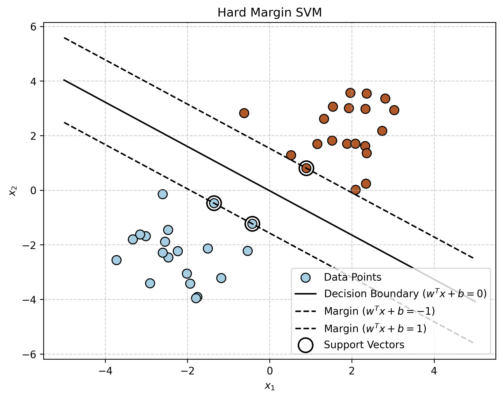
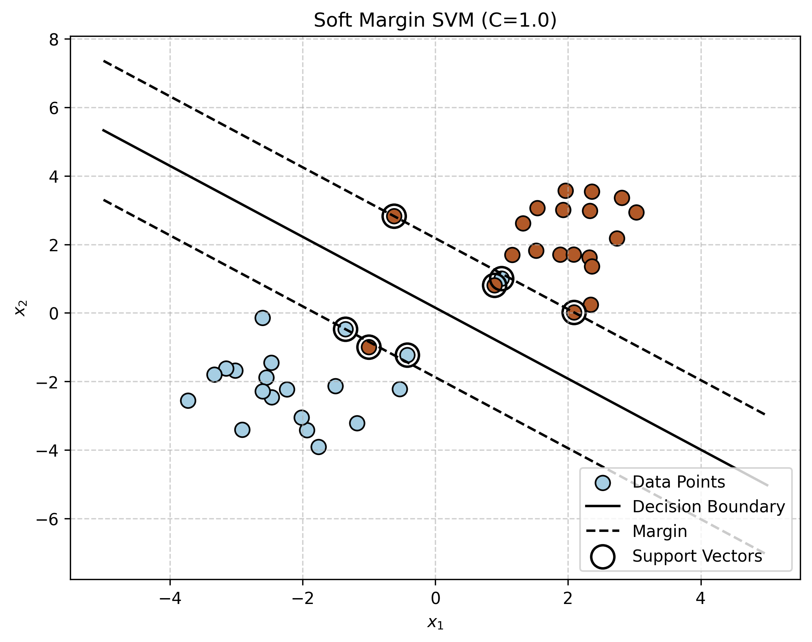
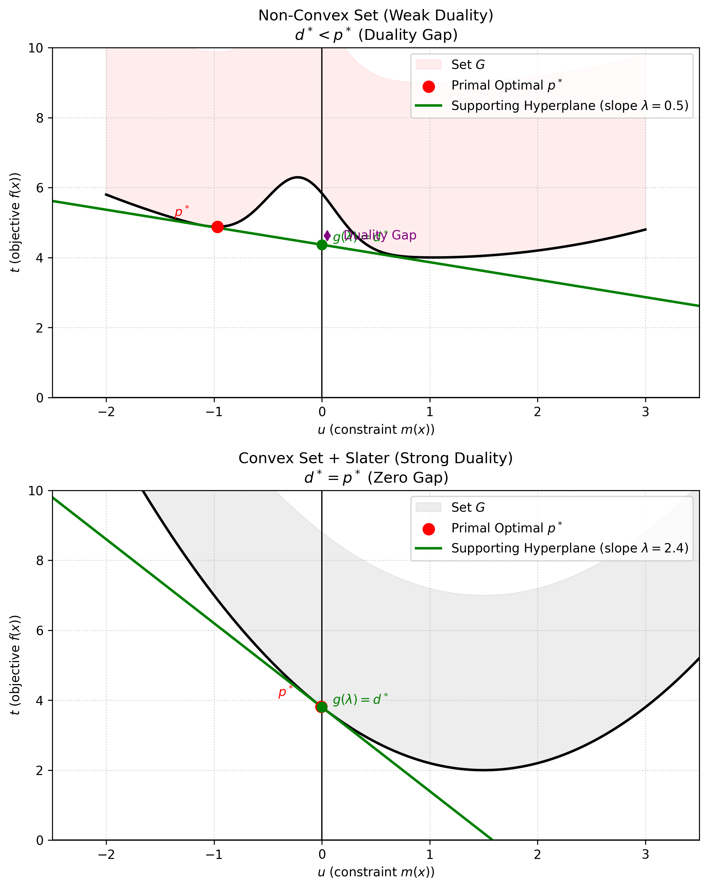

# 支持向量机 (Support Vector Machine)

SVM 有三宝：**间隔 (Margin)**、**对偶 (Duality)**、**核技巧 (Kernel Trick)**。

SVM 的主要变体：
- **Hard Margin SVM**: 线性可分 (Linearly Separable)
- **Soft Margin SVM**: 线性不可分 (Linearly Non-separable) -> 允许一点错误
- **Kernel SVM**: 非线性 (Non-linear)

## 1. Hard Margin SVM

### 1. 模型定义 (Model Definition)

给定数据集 $D = \{(x_i, y_i)\}_{i=1}^N$，其中 $x_i \in \mathbb{R}^p$, $y_i \in \{-1, 1\}$。

我们的目标是找到一个分离超平面 (Separating Hyperplane)：
$$
w^T x + b = 0
$$
使得正样本和负样本被正确分开，并且间隔最大化。
分类决策函数为：
$$
f(x) = \text{sign}(w^T x + b)
$$

### 2. 几何间隔 (Geometric Margin)

对于任意一点 $(x_i, y_i)$，它到超平面的距离为：
$$
\text{distance} = \frac{1}{||w||} |w^T x_i + b|
$$

为了使得分类正确，我们需要 $y_i(w^T x_i + b) > 0$。因此距离可以写为：
$$
\frac{1}{||w||} y_i(w^T x_i + b)
$$

**最大间隔分类器 (Max Margin Classifier)** 的目标是找到 $w, b$，使得所有点到超平面的最小距离最大化：
$$
\max_{w, b} \underbrace{\min_{x_i} \frac{1}{||w||} y_i(w^T x_i + b)}_{\text{margin}(w, b)}
$$

### 3. 约束优化 (Constrained Optimization)

上述问题可以重写为：
$$
\max_{w, b} \frac{1}{||w||} \min_{i=1,\dots,N} y_i(w^T x_i + b)
$$

由于 $w, b$ 同时缩放 $\lambda$ 倍，超平面不变，距离也不变。我们可以固定函数间隔：
$$
\min_{i=1,\dots,N} y_i(w^T x_i + b) = 1
$$
这样约束条件变为：
$$
y_i(w^T x_i + b) \ge 1, \quad \forall i=1,\dots,N
$$

此时问题简化为：
$$
\max_{w, b} \frac{1}{||w||} \quad s.t. \ y_i(w^T x_i + b) \ge 1
$$

等价于最小化 $||w||^2$：
$$
\begin{aligned}
\min_{w, b} \quad & \frac{1}{2} w^T w \\
s.t. \quad & y_i(w^T x_i + b) \ge 1, \quad i=1,\dots,N
\end{aligned}
$$

这是一个**凸二次规划 (Convex Quadratic Programming, QP)** 问题。

### 4. 可视化 (Visualization)

<!-- Generated by scripts/generate_ch06_hard_margin.py -->

图示说明：

- 实线 ($w^T x + b = 0$) 是决策边界。
- 虚线 ($w^T x + b = \pm 1$) 是间隔边界。
- 落在虚线上的点即为**支持向量 (Support Vectors)**。

## 2. 对偶问题 (Dual Problem)

为了便于引入**核函数 (Kernel Function)**，我们通常求解 SVM 的对偶问题。

### 1. 拉格朗日函数 (Lagrangian Function)

对于原始问题 (Primal Problem)：
$$
\begin{aligned}
\min_{w, b} \quad & \frac{1}{2} w^T w \\
s.t. \quad & 1 - y_i(w^T x_i + b) \le 0, \quad i=1,\dots,N
\end{aligned}
$$

引入拉格朗日乘子 $\lambda_i \ge 0$ (Lagrange Multipliers)，构建拉格朗日函数：
$$
\mathcal{L}(w, b, \lambda) = \frac{1}{2} w^T w + \sum_{i=1}^N \lambda_i (1 - y_i(w^T x_i + b))
$$

原始问题等价于：
$$
\min_{w, b} \max_{\lambda \ge 0} \mathcal{L}(w, b, \lambda)
$$
(如果约束不满足，max 这一项会变成无穷大；如果满足，max 为 0，即原目标函数)

### 2. 对偶形式 (Dual Formulation)

根据**强对偶性 (Strong Duality)** (满足 Slater 条件，且为凸优化)，我们可以交换 min 和 max 的顺序：
$$
\max_{\lambda \ge 0} \min_{w, b} \mathcal{L}(w, b, \lambda)
$$

**第一步：求 min $\mathcal{L}(w, b, \lambda)$ (关于 $w, b$ 求偏导)**
$$
\begin{aligned}
\frac{\partial \mathcal{L}}{\partial w} &= w - \sum_{i=1}^N \lambda_i y_i x_i = 0 \implies w = \sum_{i=1}^N \lambda_i y_i x_i \\
\frac{\partial \mathcal{L}}{\partial b} &= - \sum_{i=1}^N \lambda_i y_i = 0 \implies \sum_{i=1}^N \lambda_i y_i = 0
\end{aligned}
$$

**第二步：代回 $\mathcal{L}$，求 max**
将 $w = \sum \lambda_i y_i x_i$ 代入 $\mathcal{L}$：
$$
\begin{aligned}
\mathcal{L} &= \frac{1}{2} (\sum_{i=1}^N \lambda_i y_i x_i)^T (\sum_{j=1}^N \lambda_j y_j x_j) + \sum_{i=1}^N \lambda_i - \sum_{i=1}^N \lambda_i y_i ((\sum_{j=1}^N \lambda_j y_j x_j)^T x_i + b) \\
&= \frac{1}{2} \sum_{i=1}^N \sum_{j=1}^N \lambda_i \lambda_j y_i y_j x_i^T x_j + \sum_{i=1}^N \lambda_i - \sum_{i=1}^N \sum_{j=1}^N \lambda_i \lambda_j y_i y_j x_i^T x_j - b \underbrace{\sum_{i=1}^N \lambda_i y_i}_{0} \\
&= -\frac{1}{2} \sum_{i=1}^N \sum_{j=1}^N \lambda_i \lambda_j y_i y_j x_i^T x_j + \sum_{i=1}^N \lambda_i
\end{aligned}
$$

**最终对偶问题 (Dual Problem):**
$$
\begin{aligned}
\max_{\lambda} \quad & -\frac{1}{2} \sum_{i=1}^N \sum_{j=1}^N \lambda_i \lambda_j y_i y_j x_i^T x_j + \sum_{i=1}^N \lambda_i \\
s.t. \quad & \sum_{i=1}^N \lambda_i y_i = 0 \\
& \lambda_i \ge 0, \quad i=1,\dots,N
\end{aligned}
$$
通常我们会转化为 min 问题解 QP：
$$
\min_{\lambda} \quad \frac{1}{2} \sum_{i=1}^N \sum_{j=1}^N \lambda_i \lambda_j y_i y_j x_i^T x_j - \sum_{i=1}^N \lambda_i
$$

### 3. 求解对偶问题 (Solving the Dual Problem)

如何求出最优的 $\lambda^*$？这是一个标准的 QP 问题，有两种主要解法：

#### 方法 1: 通用 QP 求解器 (General QP Solver)
对于小规模数据 (N 较小)，我们可以直接使用现成的 QP 求解库 (如 `cvxopt`, `scikit-learn` 内部使用的 `libsvm`)。
我们只需要将问题转化为标准 QP 格式：
$$
\min_{\lambda} \quad \frac{1}{2} \lambda^T P \lambda + q^T \lambda \quad s.t. \ G \lambda \le h, \ A \lambda = b
$$
其中 $P_{ij} = y_i y_j x_i^T x_j$。

#### 方法 2: SMO 算法 (Sequential Minimal Optimization)
对于大规模数据，通用 QP 求解器效率太低 (矩阵 $P$ 维度为 $N \times N$)。
SMO 是一种高效的**坐标下降 (Coordinate Descent)** 算法。

**核心思想**：
每次只优化**两个**变量 $\lambda_i, \lambda_j$，固定其他变量。
- 为什么是两个？因为有约束 $\sum \lambda_k y_k = 0$。如果只改变一个 $\lambda_i$，等式约束就会被破坏。所以至少需要同时改变两个。
- 两个变量的 QP 问题有**解析解 (Closed-form solution)**，非常快。
- 循环迭代直到收敛。

### 4. KKT 条件 (KKT Conditions)

对于凸优化问题 (如 SVM)，若满足 Slater 条件 (这也是 SVM 的情况)，则 **强对偶性 (Strong Duality)** 成立。
此时，原问题的最优解 $w^*, b^*$ 和对偶问题的最优解 $\lambda^*$ 必须满足 **Karush-Kuhn-Tucker (KKT)** 条件。

KKT 条件是连接 primal 和 dual 的桥梁，它包含四组方程：

1.  **平稳性 (Stationarity)**:
    $$
    \nabla_w \mathcal{L} = w^* - \sum_{i=1}^N \lambda_i^* y_i x_i = 0 \implies \boxed{w^* = \sum_{i=1}^N \lambda_i^* y_i x_i}
    $$
    $$
    \nabla_b \mathcal{L} = - \sum_{i=1}^N \lambda_i^* y_i = 0 \implies \sum_{i=1}^N \lambda_i^* y_i = 0
    $$
    **直观理解**: 最优权重 $w^*$ 其实是训练数据的**线性组合**。这非常重要，因为这意味着我们在预测新样本时，只需要计算它和训练样本的点积 (Kernel Trick 的基础)。

2.  **原始可行性 (Primal Feasibility)**:
    $$
    y_i(w^{*T} x_i + b^*) - 1 \ge 0
    $$
    **直观理解**: 最终找到的分类超平面必须正确分类所有训练样本，且满足间隔约束 (margin $\ge 1$)。

3.  **对偶可行性 (Dual Feasibility)**:
    $$
    \lambda_i^* \ge 0
    $$
    **直观理解**: 这是拉格朗日乘子的固有约束。

4.  **互补松弛性 (Complementary Slackness)** (最关键):
    $$
    \lambda_i^* (1 - y_i(w^{*T} x_i + b^*)) = 0
    $$
    **直观理解**: 这个式子告诉我们要么 $\lambda_i^*=0$，要么括号里为 0。这意味着：
    - **非支持向量**: 如果样本 $i$ 被正确分类且远离边界 ($y_i(\dots) > 1$)，那么括号里不为 0，为了让乘积为 0，必须 $\lambda_i^* = 0$。这种样本对模型**没有任何影响**。
    - **支持向量**: 如果样本 $i$ 恰好在间隔边界上 ($y_i(\dots) = 1$)，那么括号里为 0，此时 $\lambda_i^*$ **可以大于 0**。这些样本就是**支持向量 (Support Vectors)**。

    这就是 SVM 的**稀疏性 (Sparsity)**：模型只由少数个支持向量决定！

### 4. 解的恢复 (Solution Recovery)

既然我们解出了 $\lambda^*$，如何得到 $w^*$ 和 $b^*$ 呢？

**第一步：求 $w^*$**
直接利用平稳性条件：
$$
w^* = \sum_{i=1}^N \lambda_i^* y_i x_i
$$
注意：只有支持向量的 $\lambda_i^* > 0$，非支持向量项为 0，所以计算量很小。

**第二步：求 $b^*$**
我们需要利用支持向量的性质。
任选一个**支持向量** $(x_k, y_k)$ (即满足 $\lambda_k^* > 0$)，它一定在间隔边界上，即：
$$
y_k(w^{*T} x_k + b^*) = 1
$$
我们两边同时乘以 $y_k$ (利用 $y_k^2 = 1$ 的性质)：
$$
y_k^2(w^{*T} x_k + b^*) = y_k \implies w^{*T} x_k + b^* = y_k
$$
移项得到：
$$
b^* = y_k - w^{*T} x_k
$$
**数值稳定性 (Numerical Stability)**:
理论上任意一个支持向量都可以求出同一个 $b^*$。但在计算机求解时会有数值误差。为了更稳健，我们通常取所有支持向量求出的 $b^*$ 的平均值：
$$
b^* = \frac{1}{|S|} \sum_{k \in S} (y_k - w^{*T} x_k)
$$
其中 $S = \{i \mid \lambda_i^* > 0\}$ 是所有支持向量的集合。

## 3. Soft Margin SVM

### 1. 动机 (Motivation)
现实中绝大多数数据都不是完美的 linearly separable。如果强行用 Hard Margin，要么无解，要么过拟合 (对噪声敏感)。
Soft Margin SVM 允许一点点错误，通过 **松弛变量 (Slack Variable)** $\xi_i$ 来实现。

### 2. Hinge Loss 与 松弛变量
我们引入 **Hinge Loss**：
$$
L(y, f(x)) = \max(0, 1 - y f(x))
$$
令 $\xi_i = \max(0, 1 - y_i(w^T x_i + b))$。
- 如果被正确分类且还在间隔外 ($y_i(\dots) \ge 1$)，Loss = 0 ($\xi_i=0$)。
- 如果在间隔内 ($0 < y_i(\dots) < 1$)，Loss = $1 - y_i(\dots)$ ($0 < \xi_i < 1$)。
- 如果被错误分类 ($y_i(\dots) < 0$)，Loss > 1 ($\xi_i > 1$)。

### 3. 原始问题 (Primal Problem)
Soft Margin SVM 的目标是最小化 $||w||^2$ 和 总误差 $\sum \xi_i$ 的加权和：
$$
\begin{aligned}
\min_{w, b, \xi} \quad & \frac{1}{2} w^T w + C \sum_{i=1}^N \xi_i \\
s.t. \quad & y_i(w^T x_i + b) \ge 1 - \xi_i, \quad i=1,\dots,N \\
& \xi_i \ge 0
\end{aligned}
$$
其中 $C > 0$ 是惩罚参数：
- **C 很大**: 对错误容忍度低 $\to$ Hard Margin。
- **C 很小**: 对错误容忍度高 $\to$ 间隔更宽 (Underfitting 风险)。

<!-- Generated by scripts/generate_ch06_soft_margin.py -->

## 4. 约束优化问题 (Constrained Optimization)

我们来形式化地讨论 SVM 背后的数学原理：约束优化问题。

### 4.1 原问题与对偶问题 (Primal & Dual Problem)

**1. 原问题 (Primal Problem)**
一般化的约束优化问题定义如下：
$$
\begin{aligned}
\min_{x \in \mathbb{R}^p} \quad & f(x) \\
s.t. \quad & m_i(x) \le 0, \quad i=1,\dots,M \\
& n_j(x) = 0, \quad j=1,\dots,N
\end{aligned}
$$

**2. 拉格朗日函数 (Lagrangian Function)**
引入拉格朗日乘子 $\lambda_i \ge 0$ 和 $\nu_j$ (无约束)，构建拉格朗日函数：
$$
\mathcal{L}(x, \lambda, \nu) = f(x) + \sum_{i=1}^M \lambda_i m_i(x) + \sum_{j=1}^N \nu_j n_j(x)
$$

原问题的无约束形式：
$$
p^* = \min_x \max_{\lambda, \nu; \lambda_i \ge 0} \mathcal{L}(x, \lambda, \nu)
$$
(若 $x$ 违反约束，$\max \mathcal{L} \to \infty$；若满足约束，$\max \mathcal{L} = f(x)$。因此 $\min \max$ 等价于求满足约束的 $f(x)$ 最小值)

**3. 对偶问题 (Dual Problem)**
交换 $\min$ 和 $\max$ 的顺序：
$$
d^* = \max_{\lambda, \nu; \lambda_i \ge 0} \min_x \mathcal{L}(x, \lambda, \nu)
$$
注意：$\min_x \mathcal{L}$ 总是一个关于 $\lambda, \nu$ 的**凹函数 (Concave)**，即使原问题非凸。

**4. 弱对偶性 (Weak Duality)**
对任意优化问题，弱对偶性总是成立：
$$
d^* \le p^*
$$
证明利用了 Min-Max 不等式：$\min_x \mathcal{L} \le \mathcal{L} \le \max_{\lambda, \nu} \mathcal{L}$。

### 4.2 强对偶性与几何解释 (Strong Duality & Geometry)

**1. 对偶性的几何解释**
定义集合 $G = \{ (u, t) \mid u = m(x), t = f(x), x \in D \}$。
- $p^*$ 是集合 $G$ 在 $u \le 0$ 区域内的最低点。
- $d^*$ 是斜率为 $-\lambda$ 的支撑超平面在 $t$ 轴上的最大截距。

<!-- Generated by scripts/generate_ch06_duality_geometry.py -->

- **Top (Non-Convex)**: 支撑超平面无法接触到 $p^*$ (有凹坑)，导致 **Duality Gap ($d^* < p^*$)**。
- **Bottom (Convex)**: 支撑超平面恰好切于 $p^*$，实现 **Strong Duality ($d^* = p^*$)**。

**2. Slater 条件 (Slater's Condition)**
对于凸优化问题，**Slater 条件**是强对偶性成立的充分条件。
- **严格 Slater**: 存在 $\hat{x}$ 使得 $m_i(\hat{x}) < 0$ (所有不等式严格成立)。
- **放松 Slater (Relaxed)**: 如果部分约束是仿射的 (Affine)，则这些约束只需满足 $\le 0$ (可行) 即可。
- **SVM** 的约束全是仿射的，所以只要有解就满足强对偶性。

### 4.3 KKT 条件 (KKT Conditions)

如果 $x^*$ 是原问题最优解，$(\lambda^*, \nu^*)$ 是对偶问题最优解，且满足强对偶性，则必须满足 **KKT 条件**：

1.  **可行性 (Primal Feasibility)**: $m_i(x^*) \le 0, \ n_j(x^*) = 0$
2.  **对偶可行性 (Dual Feasibility)**: $\lambda_i^* \ge 0$
3.  **互补松弛性 (Complementary Slackness)**: \
    $\lambda_i^* m_i(x^*) = 0$ (即 $\lambda_i^*=0$ 或 $m_i(x^*)=0$)
4.  **平稳性 (Stationarity)**: $\nabla_x \mathcal{L}(x^*, \lambda^*, \nu^*) = 0$

这是我们求解 SVM 的核心依据。

