# 概率图 (Probabilistic Graphical Model)

## 1. 概览与基础 (Overview & Fundamentals)

### 1.1 概率图模型体系 (PGM Framework)
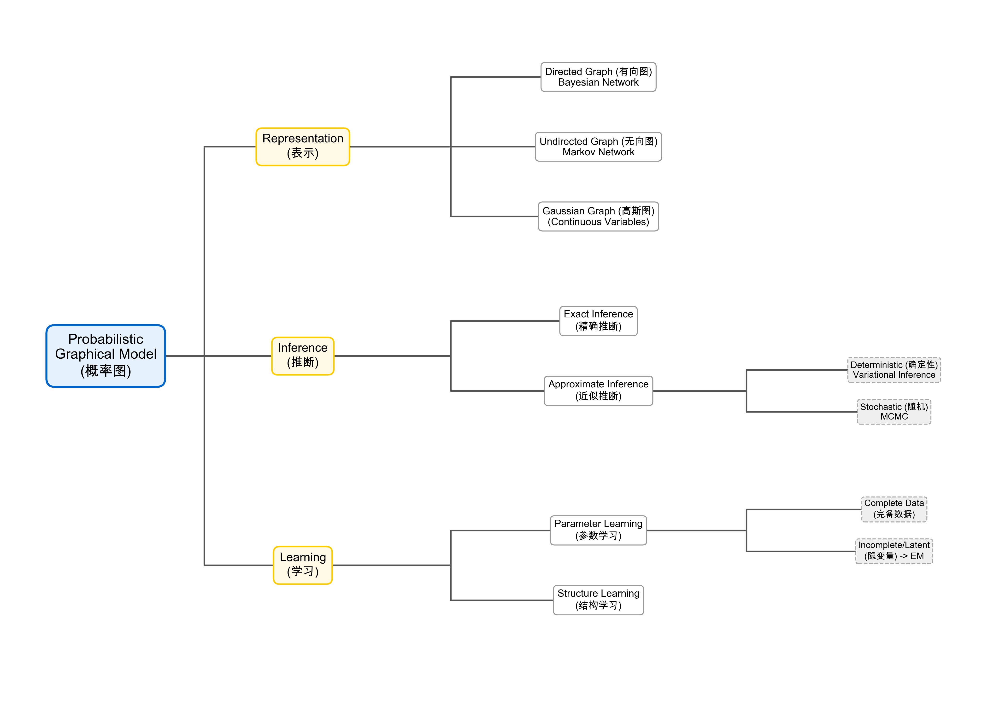

概率图模型是用图论 (Graph Theory) 的方法来表示变量之间的条件独立性。

#### 1.1.1 表示 (Representation)
*   **有向图 (Directed Graph)**: Bayesian Network (贝叶斯网络)
*   **无向图 (Undirected Graph)**: Markov Network (马尔可夫网络)
*   **高斯图 (Gaussian Graph)**: 针对连续变量
    *   Gaussian Bayesian Network (高斯贝叶斯网络)
    *   Gaussian Markov Network (高斯马尔可夫网络)

#### 1.1.2 推断 (Inference)
推断主要指在给定观测数据的情况下，计算某些变量的后验概率或边缘概率。
*   **精确推断 (Exact Inference)**
*   **近似推断 (Approximate Inference)**
    *   **确定性近似 (Deterministic Approximation)**: 变分推断 (Variational Inference)
    *   **随机近似 (Stochastic Approximation)**: MCMC (Markov Chain Monte Carlo)

#### 1.1.3 学习 (Learning)
*   **参数学习 (Parameter Learning)**
    *   完备数据 (Complete Data)
    *   不完备数据 (Incomplete Data) / 隐变量 (Latent Variables) -> **EM 算法**
*   **结构学习 (Structure Learning)**

### 1.2 理论背景 (Theoretical Background)

**1.2.1 高维随机变量 (High-dimensional Random Variables)**
对于一个 $p$ 维随机向量 $X = (x_1, x_2, \dots, x_p)$，我们需要关注其联合概率分布 $P(x_1, x_2, \dots, x_p)$。
通常关注两个基本问题：
1.  **边缘概率 (Marginal Probability)**: $P(x_i)$
2.  **条件概率 (Conditional Probability)**: $P(x_j | x_i)$

**1.2.2 运算规则 (Rules)**
*   **加法法则 (Sum Rule)**:
    $$
    P(x_1) = \int P(x_1, x_2) dx_2
    $$
*   **乘法法则 (Product Rule)**:
    $$
    P(x_1, x_2) = P(x_1) P(x_2|x_1) = P(x_2) P(x_1|x_2)
    $$
*   **链式法则 (Chain Rule)**:
    $$
    P(x_1, x_2, \dots, x_p) = \prod_{i=1}^p P(x_i | x_1, x_2, \dots, x_{i-1})
    $$
*   **贝叶斯法则 (Bayesian Rule)**:
    $$
    P(x_2|x_1) = \frac{P(x_1, x_2)}{P(x_1)} = \frac{P(x_1, x_2)}{\int P(x_1, x_2) dx_2} = \frac{P(x_2)P(x_1|x_2)}{\int P(x_2)P(x_1|x_2) dx_2}
    $$

**1.2.3 困境与简化 (Dilemma & Simplification)**
**困境**: 当维度 $p$ 很高时，计算量会变得非常复杂，直接计算 $P(x_1, x_2, \dots, x_p)$ 是几乎不可能的 (Computationally Intractable)。

**简化**: 为了解决这个问题，我们需要引入假设来简化模型，核心思想是 **独立性 (Independence)**。

1.  **相互独立 (Mutual Independence)**:
    假设所有变量相互独立，则有：
    $$
    P(X) = \prod_{i=1}^p P(x_i)
    $$
    应用例子: **Naive Bayes (朴素贝叶斯)**
    $$
    P(x|y) = \prod_{i=1}^p P(x_i|y)
    $$

2.  **马尔可夫性质 (Markov Property)**:
    假设当前状态只依赖于前一个状态:
    $$
    x_j \perp x_{i+1} | x_i, \quad j < i
    $$
    应用例子: **HMM (Hidden Markov Model)** (齐次马尔可夫假设 First-order Markov assumption)

3.  **条件独立性 (Conditional Independence)**:
    这是概率图模型的核心。
    $$
    X_A \perp X_B | X_C
    $$
    其中 $X_A, X_B, X_C$ 是集合且不相交。意味着在给定 $X_C$ 的情况下，$X_A$ 和 $X_B$ 是独立的。

## 2. 贝叶斯网络 (Bayesian Network)

贝叶斯网络是一种**有向无环图 (DAG)**，用于表示变量之间的条件独立性。

### 2.1 因子分解 (Factorization)

1.  **链式法则 (Chain Rule)**:
    一般情况下，联合概率可以写成：
    $$
    P(x_1, x_2, \dots, x_p) = P(x_1) \cdot \prod_{i=2}^p P(x_i | x_{1:i-1})
    $$

2.  **条件独立性 (Conditional Independence)**:
    在贝叶斯网络中，我们利用条件独立性假设：
    $$
    X_A \perp X_C | X_B
    $$
    即在给定父节点集合 $x_{pa(i)}$ 的条件下，$x_i$ 独立于其非后代节点。

3.  **因子分解 (Factorization)**:
    基于上述假设，联合概率分布简化为：
    $$
    P(x_1, x_2, \dots, x_p) = \prod_{i=1}^p P(x_i | x_{pa(i)})
    $$
    其中 $x_{pa(i)}$ 是 $x_i$ 的父节点集合 (Parent Set)。这大大简化了联合分布的表示。

### 2.2 D-Separation (有向分离)

D-Separation 是判断贝叶斯网络中条件独立性的核心方法。我们通过三种基本结构来理解这种性质：

1.  **Tail-to-Tail (共同父节点)**:
    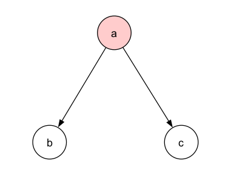
    结构: $c \leftarrow a \rightarrow b$
    *   若 $a$ **未被观测**，则 path 是通的，$b, c$ 不独立。
    *   若 $a$ **被观测**，则 path 被阻断 (blocked)，$c \perp b | a$。

2.  **Head-to-Tail (顺序结构)**:
    
    结构: $a \rightarrow b \rightarrow c$
    *   若 $b$ **未被观测**，则 path 是通的，$a, c$ 不独立。
    *   若 $b$ **被观测**，则 path 被阻断，$a \perp c | b$。

3.  **Head-to-Head (共同子节点 / V-structure)**:
    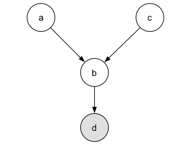
    结构: $a \rightarrow b \leftarrow c$ (且有后代 $d$, 即 $b \rightarrow d$)
    这是最特殊的情况，默认情况下 $a \perp c$。
    *   若 $b$ (或其后代 $d$) **未被观测**，则 path 天然被阻断 (blocked)，$a \perp c$ (边缘独立)。
    *   若 $b$ (或其后代 $d$) **被观测**，则 path 被连通 (unblocked)，$a, c$ 不再独立 (Explaining Away)。

### 2.3 马尔可夫性质 (Markov Properties)

贝叶斯网络中的D-Separation性质可以总结为更一般的马尔可夫性质：

1.  **全局马尔可夫性质 (Global Markov Property)**:
    这是D-Separation的直接推论。如果在图中，节点集合 $X_A$ 和 $X_C$ 被节点集合 $X_B$ 也就是观测变量集合所分离 (D-separated)，则 $X_A \perp X_C | X_B$。
    这意味着对于任何从 $X_A$ 中节点到 $X_C$ 中节点的路径，如果该路径在给定 $X_B$ 的条件下被阻断 (Blocked)，那么 $X_A$ 和 $X_C$ 是条件独立的。
    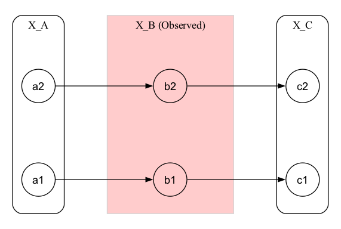

2.  **局部马尔可夫性质 (Local Markov Property)**:
    一个节点 $x_i$ 在给定其父节点 $x_{pa(i)}$ 的条件下，独立于其所有非后代节点 (Non-descendants)。
    $$
    x_i \perp x_{NonDescendants(i)} | x_{pa(i)}
    $$
    这告诉我们，一旦知道了父节点的值，节点 $x_i$ 的状态就与其祖先节点或其他非后代节点无关了。父节点“屏蔽”了来自非后代节点的影响。

3.  **马尔可夫毯 (Markov Blanket)**:
    马尔可夫毯是指一个节点 $x_i$ 的最小条件独立集合。即在给定马尔可夫毯的条件下，$x_i$ 独立于网络中所有其他节点。
    $$
    x_i \perp x_{-i} | \text{Blanket}(x_i)
    $$

    我们通过条件概率来看其组成：
    $$
    P(x_i | x_{-i}) = \frac{P(x_i, x_{-i})}{P(x_{-i})} = \frac{P(x)}{\int P(x) dx_i} = \frac{\prod_{j=1}^p P(x_j | x_{pa(j)})}{\int \prod_{j=1}^p P(x_j | x_{pa(j)}) dx_i}
    $$
    在这个乘积项中，只有包含 $x_i$ 的项不能被约掉，这些项是：
    *   $P(x_i | x_{pa(i)})$ (自身作为子节点)
    *   $P(x_k | x_{pa(k)})$ 其中 $x_i \in x_{pa(k)}$ (自身作为父节点)

    因此，这也是为什么 **Markov Blanket** 包含：
    *   **父节点 (Parents)**
    *   **子节点 (Children)**
    *   **子节点的其他父节点 (Spouses / Co-parents)**

    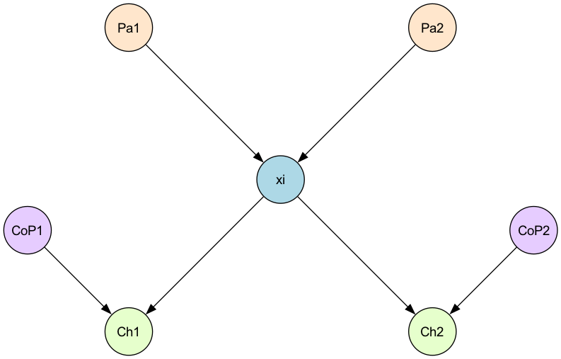

### 2.4 具体模型 (Concrete Models)

贝叶斯网络按照变量的类型（离散/连续）和时间属性，可以分为不同的模型：

#### 2.4.1 单一变量 / 静态模型 (Static Models)

1.  **Naive Bayes (朴素贝叶斯)**:
    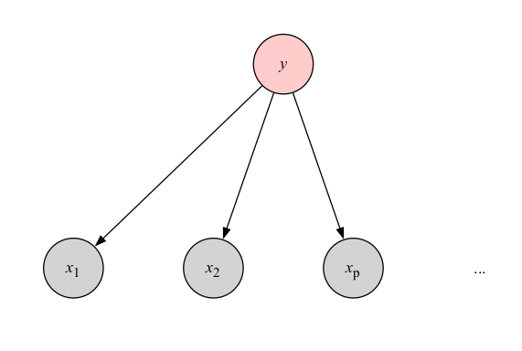
    *   **假设**: 在给定 $y$ 的条件下，特征 $x_i$ 之间相互独立。
    *   **结构**: $y \rightarrow x_1, y \rightarrow x_2, \dots, y \rightarrow x_p$
    *   **公式**: $P(x|y) = \prod_{i=1}^p P(x_i | y)$
    *   **应用**: 分类问题 (Classification)。

2.  **Mixture of Gaussians (GMM, 高斯混合模型)**:
    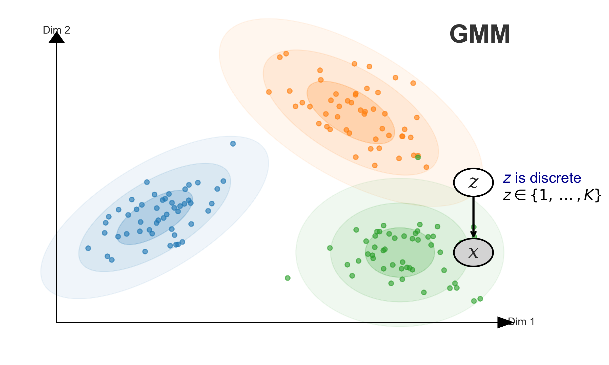
    *   **结构**: 离散隐变量 $z$ (Z is discrete, e.g., $z \in \{1, \dots, K\}$) 指向连续观测变量 $x$。
    *   **含义**: 数据可以看作是由 $K$ 个高斯分布混合而成。
    *   **应用**: 聚类 (Clustering), 密度估计。

#### 2.4.2 动态模型 / 时间序列 (Dynamic Models)

当引入时间维度时，模型变得更加复杂：

1.  **HMM (Hidden Markov Model, 隐马尔可夫模型)**:
    *   **状态**: 离散 (Discrete State)。
    *   **观测**: 可以是离散或连续。
    *   **结构**: 状态序列形成马尔可夫链。

2.  **LDS (Linear Dynamical System, 线性动态系统)**:
    *   又称 **Kalman Filter (卡尔曼滤波)**。
    *   **状态**: 连续 (Continuous State)。
    *   **假设**: 线性变换 + 高斯噪声。

3.  **Particle Filter (粒子滤波)**:
    *   用于非高斯、非线性 (Non-Gaussian, Non-Linear) 的情况。

## 3. 马尔可夫网络 (Markov Network)

马尔可夫网络（Markov Random Field, MRF）是基于无向图的概率图模型。

### 3.1 条件独立性 (Conditional Independence)

在马尔可夫网络中，条件独立性的定义相对简单，主要体现在三个方面：

1.  **全局马尔可夫性质 (Global Markov Property)**:
    给定分离集 $X_B$，若 $X_A$ 和 $X_C$ 被 $X_B$ 分离（即所有路径都经过 $X_B$），则 $X_A \perp X_C | X_B$。
    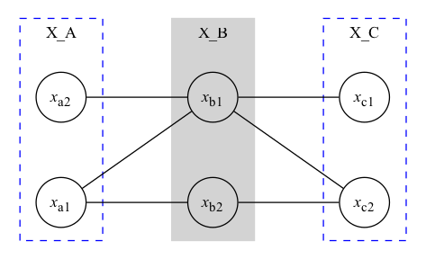

2.  **局部马尔可夫性质 (Local Markov Property)**:
    一个节点 $x_i$ 在给定其邻居节点 (Neighbors) 的条件下，独立于网络中的所有其他节点。在MRF中，节点的邻居就是其马尔可夫毯。
    $$
    x_i \perp x_{-\{i, \text{neighbors}(i)\}} | x_{\text{neighbors}(i)}
    $$
    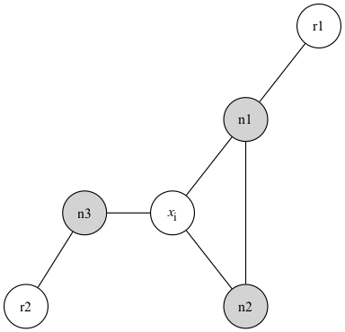

3.  **成对马尔可夫性质 (Pairwise Markov Property)**:
    对于任意两个非相邻节点 $x_i, x_j$，在给定所有其他节点的条件下，它们是条件独立的。
    $$
    x_i \perp x_j | x_{-\{i, j\}} \quad \text{if } i, j \text{ not connected}
    $$
    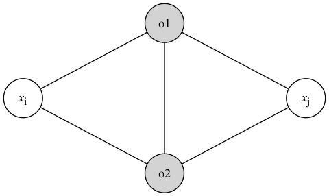

**定理**: 根据 Hammersley-Clifford 定理，对于正分布 (Positive Distribution)，这三个性质是等价的：
$$
\text{Global} \iff \text{Local} \iff \text{Pairwise}
$$

### 3.2 因子分解 (Factorization)

无向图没有由果溯因的直观解释，因此我们不能像贝叶斯网络那样使用条件概率来分解。相反，我们使用 **团 (Clique)** 的概念。

#### 3.2.1 团与最大团 (Cliques & Maximal Cliques)
*   **团 (Clique)**: 图中节点的子集，其中任意两个节点之间都有边连接（全连接子图）。
*   **最大团 (Maximal Clique)**: 不能再添加任何节点使其仍为团的团。

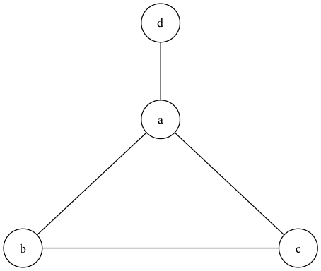
在上图中，$\{a, b, c\}$ 是一个最大团，$\{a, d\}$ 也是一个最大团。

#### 3.2.2 势函数与分布 (Potential Functions & Distribution)
我们将联合概率分布分解为最大团上的势函数 (Potential Function) 的乘积。

$$
P(x) = \frac{1}{Z} \prod_{i=1}^K \psi_i(x_{C_i})
$$

其中：
*   $C_i$ 是第 $i$ 个最大团。
*   $x_{C_i}$ 是该团中的最大团随机变量集合。
*   $\psi_i(x_{C_i})$ 是势函数 (Potential Function)，**必须为正** ($\psi_i \ge 0$)。
*   $Z$ 是配分函数 (Partition Function)，用于归一化：
    $$
    Z = \sum_x \prod_{i=1}^K \psi_i(x_{C_i}) = \sum_{x_1, \dots, x_p} \prod_{i=1}^K \psi_i(x_{C_i})
    $$

这个分解方式保证了上述的马尔可夫性质。根据 **Hammersley-Clifford 定理**，一个正分布 (Positive Distribution) 满足全局马尔可夫性质当且仅当它可以被分解为最大团上的因子乘积形式。

### 3.3 Gibbs 分布 (Gibbs Distribution)

由于势函数 $\psi(x_{C_i})$ 必须为正，通常我们将其定义为指数形式：

$$
\psi(x_{C_i}) = \exp\{-E(x_{C_i})\}
$$

其中 $E(x_{C_i})$ 称为 **能量函数 (Energy Function)**。

这样，$P(x)$ 称为 **Gibbs Distribution (Gibbs 分布)** 或 **Boltzmann Distribution (玻尔兹曼分布)**。其推导如下：

$$
\begin{aligned}
P(x) &= \frac{1}{Z} \prod_{i=1}^K \psi(x_{C_i}) \\
     &= \frac{1}{Z} \prod_{i=1}^K \exp\{-E(x_{C_i})\} \\
     &= \frac{1}{Z} \exp \left\{ -\sum_{i=1}^K E(x_{C_i}) \right\}
\end{aligned}
$$

这与 **指数族分布 (Exponential Family)** 有着密切联系：

$$
P(x) = h(x) \cdot \exp\{\eta^T \phi(x) - A(\eta)\} = \frac{1}{Z(\eta)} h(x) \exp\{\eta^T \phi(x)\}
$$

实际上，根据 **最大熵原理 (Maximum Entropy Principle)**，在给定约束条件下，熵最大的分布就是指数族分布 (Gibbs 分布)。

$$
\text{最大熵原理} \implies \text{指数族分布 (Gibbs 分布)}
$$

## 4. 推断 (Inference)

### 4.1 总体介绍 (Introduction)

推断是概率图模型中的核心问题之一。这一节我们主要介绍推断的基本任务、方法分类以及一个具体的 HMM 示例。

#### 4.1.1 推断任务 (Inference Tasks)
给定一个概率模型 $P(x)$ 和观测数据 $x_B$ (Observed)，我们通常关心以下几类问题：

1.  **求概率**: 计算联合概率 $P(x) = P(x_1, \dots, x_p)$。
2.  **边缘概率 (Marginal Probability)**: 计算某一变量或变量子集的边缘分布。
    $$
    P(x_i) = \sum_{x_{\setminus i}} P(x)
    $$
3.  **条件概率 (Conditional Probability)**: 计算在观测变量下的条件分布。
    $$
    P(x_A | x_B) = \frac{P(x_A, x_B)}{P(x_B)}
    $$
4.  **MAP 推断 (Maximum A Posteriori Inference)**: 寻找最可能的隐变量状态。
    $$
    \hat{z} = \arg\max_z P(z|x) \propto \arg\max_z P(z, x)
    $$

#### 4.1.2 推断方法分类 (Classification of Inference Methods)

推断算法主要分为两大类：

1.  **精确推断 (Exact Inference)**:
    *   **Variable Elimination (VE, 变量消除)**: 通用算法，但对于复杂图效率较低。
    *   **Belief Propagation (BP, 信念传播)**:
        *   也称为 **Sum-Product Algorithm**。
        *   主要针对 **树结构 (Tree Structure)** 有效。
    *   **Junction Tree Algorithm (联合树算法)**:
        *   将普通图转化为树结构进行推断。

2.  **近似推断 (Approximate Inference)**:
    *   **Loop Belief Propagation (Loopy BP)**: 针对有环图 (Loopy Graph) 的近似算法。
    *   **Monte Carlo Inference (蒙特卡洛推断)**:
        *   Importance Sampling (重要性采样)
        *   MCMC (Markov Chain Monte Carlo)
    *   **Variational Inference (变分推断)**: 将推断问题转化为优化问题。

#### 4.1.3 隐马尔可夫模型示例 (HMM Example)

HMM 是一个典型的动态贝叶斯网络 (Dynamic Bayesian Network)。

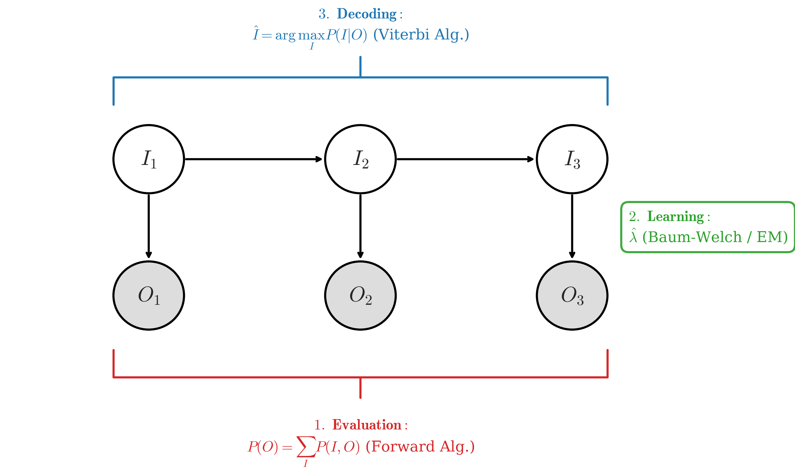

在 HMM 中，我们面临三个经典的推断问题：

1.  **Evaluation (评估)**:
    *   计算观测序列出现的概率 $P(O)$。
    *   由于直接求和 $P(O) = \sum_I P(I, O)$ 指数级复杂度，通常使用 **Forward Algorithm (前向算法)**。

2.  **Learning (学习)**:
    *   在给定观测序列 $O$ 的情况下，估计模型参数 $\lambda$。
    *   使用 **Baum-Welch Algorithm** (也就是 EM 算法)。

3.  **Decoding (解码)**:
    *   在给定观测序列 $O$ 的情况下，寻找最可能的隐状态序列 $I$。
    *   $$
        \hat{I} = \arg\max_I P(I|O)
        $$
    *   使用 **Viterbi Algorithm (维特比算法)**，这是一种动态规划 (Dynamic Programming)。

### 4.2 变量消除 (Variable Elimination)

变量消除 (Variable Elimination, VE) 是一种精确推断算法，其核心思想是利用 **乘法对加法的分配律 (Distributive Law)** 将求和符号推入到乘积内部，从而减少计算量。

$$
ab + ac = a(b+c)
$$

我们将求和步骤看作是“消除”某个变量的过程。

#### 4.2.1 链式示例 (Chain Example)

考虑一个简单的链式结构：

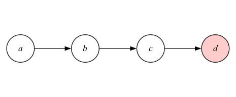

假设所有变量 $a, b, c, d \in \{0, 1\}$ 均为离散随机变量。我们的目标是计算 **边缘概率 $P(d)$**。

1.  **Naive Approach (朴素做法)**:
    直接对联合概率进行全概率公式求和：
    $$
    P(d) = \sum_{a,b,c} P(a,b,c,d) = \sum_a \sum_b \sum_c P(a)P(b|a)P(c|b)P(d|c)
    $$
    这种做法需要遍历所有 $a,b,c$ 的组合，计算复杂度高。

2.  **Variable Elimination (变量消除做法)**:
    我们可以调整求和顺序，将与某些变量无关的项移出求和符号：

    $$
    \begin{aligned}
    P(d) &= \sum_c P(d|c) \sum_b P(c|b) \sum_a P(a)P(b|a) \\
         &= \sum_c P(d|c) \sum_b P(c|b) \underbrace{\left[ \sum_a P(a)P(b|a) \right]}_{\phi_a(b)} \\
         &= \sum_c P(d|c) \underbrace{\left[ \sum_b P(c|b) \phi_a(b) \right]}_{\phi_b(c)} \\
         &= \underbrace{\sum_c P(d|c) \phi_b(c)}_{\phi_c(d)}
    \end{aligned}
    $$

    这里我们将中间结果定义为 **因子 (Factor)** 或 **势函数** $\phi(\cdot)$。
    *   首先消除 $a$：计算 $\phi_a(b) = \sum_a P(a)P(b|a)$。
    *   然后消除 $b$：计算 $\phi_b(c) = \sum_b P(c|b)\phi_a(b)$。
    *   最后消除 $c$：计算 $\phi_c(d) = \sum_c P(d|c)\phi_b(c)$。

    最终得到 $P(d) = \phi_c(d)$。这种方法极大地降低了计算复杂度。

#### 4.2.2 缺点 (Disadvantages)

虽然 VE 算法通过利用图的结构减少了计算量，但它仍存在两个主要缺点：
1.  **重复计算 (Redundant Computation)**:
    如果在计算 $P(d)$ 之后，我们还想计算 $P(c)$，VE 算法需要重新从头进行一遍计算，之前的中间结果无法直接复用。
2.  **排序问题 (Ordering Problem)**:
    消除变量的顺序对计算复杂度有很大影响。
    *   寻找最优消除顺序是一个 **NP-Hard** 问题。
    *   对于树形结构，可以找到多项式时间的最优顺序；但对于一般图，这是一个难点。

### 4.3 Belief Propagation (信念传播)

#### 4.3.1 Motivation & Structure (动机与结构)

**Motivation**:
上一节介绍的 **Variable Elimination (VE)** 虽然是精确推断，但存在明显的**重复计算**问题。如果我们需要计算所有节点的边缘概率 $P(x_i)$，对于每个节点都需要重新运行一遍 VE 算法，这非常低效。

**Belief Propagation (BP)**，也称为 **Sum-Product Algorithm**，正是为了解决这个问题。它的核心思想是**复用中间计算结果**（即“消息”），从而高效地计算所有边缘概率。

**From Chain to Tree**:
考虑一个简单的树形结构（如下所示），中心节点 $b$ 连接着 $a, c, d$ ($a - b - \{c, d\}$)。

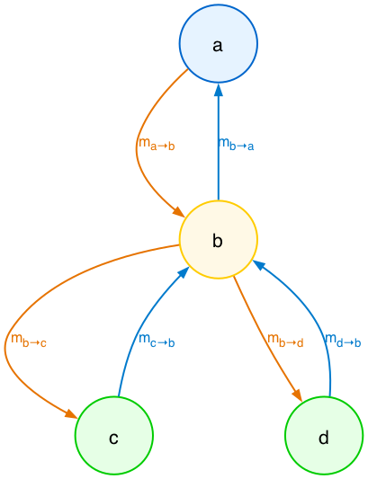

在这个树结构中，联合概率分布可以因子分解为：
$$
P(a,b,c,d) = \frac{1}{Z} \psi_a(a) \psi_b(b) \psi_c(c) \psi_d(d) \cdot \psi_{ab}(a,b) \psi_{bc}(b,c) \psi_{bd}(b,d)
$$
其中 $\psi_i(x_i)$ 是节点势函数，$\psi_{ij}(x_i, x_j)$ 是边势函数。

#### 4.3.2 Message Passing & Belief (消息传递与信念)

BP 算法通过在节点之间传递“消息” (Message) 来通过局部计算获取全局信息。定义 $m_{j \to i}(x_i)$ 为从节点 $j$ 传给节点 $i$ 的消息。

1.  **消息更新规则 (Sum-Product Rule)**:
    节点 $j$ 传给 $i$ 的消息，等于 $j$ 的自身势函数、边势函数以及所有其他邻居 $k$ 传给 $j$ 的消息的乘积，再对 $x_j$ 进行求和。
    $$
    m_{j \to i}(x_i) = \sum_{x_j} \psi_{ij}(x_i, x_j) \psi_j(x_j) \prod_{k \in NB(j) \setminus i} m_{k \to j}(x_j)
    $$
    例如：$m_{b \to a}(x_a) = \sum_{x_b} \psi_{ab}(x_a, x_b) \psi_b(x_b) \cdot m_{c \to b}(x_b) \cdot m_{d \to b}(x_b)$

2.  **信念计算 (Belief Calculation)**:
    当消息传递完成后，节点的边缘概率（Belief）正比于其自身势函数与所有传入消息的乘积：
    $$
    P(x_i) \propto \psi_i(x_i) \prod_{k \in NB(i)} m_{k \to i}(x_i)
    $$

> **Note**: 对于**链式结构**，BP 等价于 **Forward-Backward Algorithm**。

#### 4.3.3 Algorithm Implementation (算法实现)

我们可以将 BP 算法理解为 **Variable Elimination + Caching** (核心洞察: 直接求 $m_{ij} \Rightarrow P(x_i)$)。

**1. 序列化实现 (Sequential Implementation)**:
适用于树结构，通常分为两个阶段：
*   **Collect Message (收集)**: 从叶子节点向根节点传递 ($Leaves \to Root$)。
*   **Distribute Message (分发)**: 从根节点向叶子节点传递 ($Root \to Leaves$)。
通过这两步，我们可以得到图中任意两个相邻节点之间的双向消息 $m_{ij}$，从而计算所有节点的边缘概率。

**2. 并行实现 (Parallel Implementation)**:
不需要选定根节点，所有节点同时（或异步）更新消息。
*   **并行机制**: $m_{i \to j}^t(x_j) \leftarrow \sum_{x_i} \psi_{ij} \psi_i \prod m_{k \to i}^{t-1}$
*   **收敛性**:
    *   **树结构**: 保证收敛到精确解。
    *   **一般图 (有环)**: 变身为 **Loopy Belief Propagation**。这是近似推断，不保证收敛，但通常能得到很好的近似解 (e.g., Turbo Codes)。

### 4.4 Max-Product Algorithm (最大和算法)

在前两节（VE, BP），我们的目标通常是计算边缘概率 $P(x_i)$ (Sum-Product)。
但有时我们更关心**联合概率最大的那个配置** (Most Likely Configuration)，即 **MAP 推断 (Maximum A Posteriori)**：

$$
x^* = \arg\max_{x} P(x_1, x_2, \dots, x_p)
$$

**Max-Product Algorithm** 就是为了解决这个问题。它的结构与 Sum-Product (BP) 几乎完全相同，唯一的区别是将 **求和 ($\sum$)** 替换为 **求最大值 ($\max$)**。

#### 4.4.1 消息传递规则 (Message Passing Rule)

对于 $m_{j \to i}$，我们不再对 $x_j$ 求和，而是寻找使得乘积最大的 $x_j$：

$$
m_{j \to i}(x_i) = \max_{x_j} \left( \psi_{ij}(x_i, x_j) \psi_j(x_j) \prod_{k \in NB(j) \setminus i} m_{k \to j}(x_j) \right)
$$

*   **直观理解**: 节点 $j$ 告诉节点 $i$：“如果你取值为 $x_i$，那么在我的子树中，我能找到的最佳配置给出的最大‘得分’是多少。”

#### 4.4.2 甚至 Viterbi (Relation to Viterbi)

如果图是一个**链式结构 (Chain)** (如 HMM)，那么 **Max-Product Algorithm** 等价于 **Viterbi Algorithm**。
*   Sum-Product $\Leftrightarrow$ Forward-Backward
*   Max-Product $\Leftrightarrow$ Viterbi

#### 4.4.3 解码与回溯 (Decoding & Backtracking)

仅仅算出最大的概率是不够的，我们需要找到对应的 $x^*$。
这通常通过记录“谁最大”来实现：
1.  **Forward (Max)**: 在计算消息 $m_{j \to i}$ 时，记录哪个 $x_j$ 取得了最大值：
    $$ \phi_{j \to i}(x_i) = \arg\max_{x_j} (\dots) $$
2.  **Backward (Backtracking)**: 从根节点开始，根据记录的 $\phi$ 回溯找出最佳路径。

> **Max-Sum Algorithm**:
> 在实际计算中，为了避免数值下溢 (underflow)，通常对概率取对数 ($\log$)。
> 因为 $\log(ab) = \log a + \log b$，而且 $\log$ 是单调递增函数（不改变 $\max$ 的位置），乘积变成了求和。
> $$\max \prod \Rightarrow \max \sum (\log \psi)$$
> 这就是 **Max-Sum Algorithm**。

## 5. Concept Supplement (概念补充)

### 5.1 Factor Graph (因子图)

**Motivation**:
在前文中我们分别讨论了有向图 (Bayesian Network) 和无向图 (Markov Network)。它们有不同的因子分解方式：
*   **Directed**: $P(x) = \prod P(x_i | x_{pa(i)})$
*   **Undirected**: $P(x) = \frac{1}{Z} \prod \psi_C(x_C)$ (基于最大团)

**Factor Graph** 提供了一个**统一的视角 (Unified View)**，并且允许**更细粒度的因子分解 (Fine-grained Factorization)**。

#### 5.1.1 Definition (定义)

因子图是一个**二部图 (Bipartite Graph)**，由两类节点组成：
1.  **Variable Nodes (变量节点)**: 圆形，代表随机变量 $x_s$。
2.  **Factor Nodes (因子节点)**: 方形，代表函数/因子 $f_s$。

联合概率分布表示为所有因子的乘积：
$$ P(x) = \prod_s f_s(x_s) $$

#### 5.1.2 Moralization (道德化)

为了将有向图转换为因子图（或无向图），我们需要处理“V-结构” (Explain Away) 带来的依赖问题。
*   **过程**: 对于每一个节点，将其所有父节点之间连接起来 (**Marrying the parents**)，然后去掉箭头的方向。
*   **结果**: 得到的无向图称为 **Moral Graph (道德图)**。
*   **意义**: 道德化后的图保证了父节点之间的依赖关系在无向图中得以体现，从而使得可以在此基础上构建因子图或进行 Junction Tree 变换。

#### 5.1.3 Decomposition Comparison (分解对比)

因子图的一个主要优势是可以打破“最大团”的限制，对函数进行更细致的分解。

*   **Undirected Graph (Left)**: 必须基于最大团 (Maximal Clique) 分解。对于三角形 $a,b,c$，势函数必须是 $\psi(a,b,c)$。
*   **Factor Graph (Right)**:
    *   (b) **Coarse**: 可以对应最大团，用一个因子 $f(a,b,c)$ 表示。
    *   (c) **Fine**: 如果 $\psi(a,b,c)$ 本身可以分解为 $\phi(a,b)\phi(b,c)\phi(a,c)$，因子图可以明确表示这种**成对 (Pairwise)** 关系，而普通无向图无法在图结构上区分这两种情况。

### 5.2 Moral Graph (道德图)

**Motivation**:
如果我们想将有向图 ($G$) 转化为无向图 ($H$)，以便使用 Junction Tree 等通用推断算法，我们不能简单地去掉箭头。因为有向图中的 **V-结构 (V-Structure, Head-to-Head)** 蕴含了复杂的依赖关系（观测子节点会导致父节点相关），如果直接去掉箭头，这种依赖关系就丢失了。

**Algorithm (Moralization / 道德化)**:
1.  **Marrying Parents (联姻)**: 对于图 $G$ 中每一个节点 $x_i$，将其所有父节点 $Parent(x_i)$ 两两相连。
2.  **Drop Arrows (去向)**: 将所有有向边改为无向边。
得到的无向图称为原图的 **Moral Graph**，记为 $M(G)$。

**Examples**:
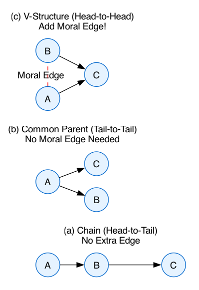
1.  **(a) Chain**: $A \to B \to C \Rightarrow A - B - C$. (No extra edge).
2.  **(b) Common Parent**: $B \leftarrow A \to C \Rightarrow B - A - C$. (No extra edge).
3.  **(c) V-Structure**: $A \to C \leftarrow B$.
    *   在有向图中，$A \perp B$ (Unconditionally)，但 $A \not\perp B | C$。
    *   为了在无向图中保留 potential $\psi(A,B,C)$，我们需要 $A,B,C$ 形成一个团。
    *   **Solution**: 连接 $A-B$ (Moral Edge，红色虚线)，使得 $\{A, B, C\}$ 成为一个团。

**Equivalence**:
$$ D\text{-sep}(X, Y | Z)_G \iff Sep(X, Y | Z)_{M(G)} $$
即：原图中的 D-Separation 等价于道德图中的普通图分离 (Graph Separation)。

> **Note**: 道德化后的图可能会丢失一些独立性信息（即变得“更稠密”），但绝不会引入错误的独立性假设。它是原图独立性的一个 **I-Map** (Independence Map)。
