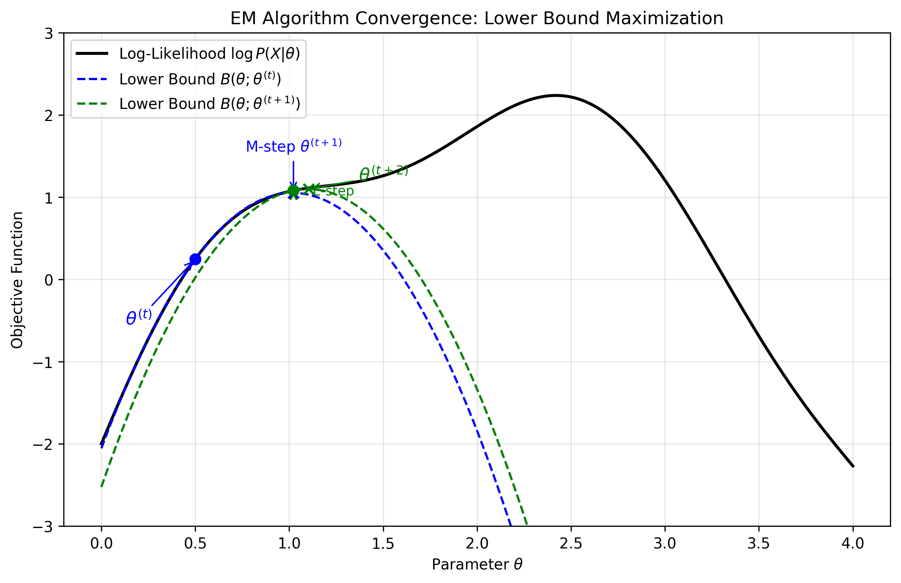
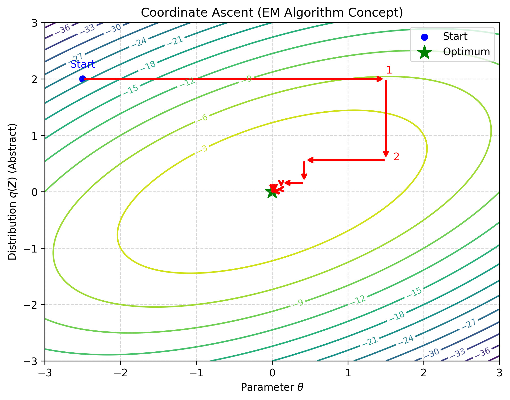

# EM算法 (Expectation-Maximization Algorithm)

## 1. EM算法收敛性 (Convergence of EM Algorithm)

EM算法是一种迭代算法，用于含有隐变量 (Latent Variables) 的概率模型参数估计。其目标是最大化观测数据 $X$ 的对数似然函数 (Log-Likelihood)。

### 1.1 基础定义 (Basic Definitions)

*   **符号系统 (Ntation)**:
    *   $X$: 观测数据 (Observed Data)
    *   $Z$: 隐变量 (Unobserved Data / Latent Variable)
    *   $(X, Z)$: 完整数据 (Complete Data)
    *   $\theta$: 参数 (Parameter)

*   **MLE**: 最大似然估计 (Maximum Likelihood Estimation)
    $$
    \theta_{MLE} = \arg\max_\theta \log P(X|\theta)
    $$

*   **EM 算法公式 (EM Formula)**:
    $$
    \theta^{(t+1)} = \arg\max_\theta \int_Z \log P(X, Z|\theta) \cdot P(Z|X, \theta^{(t)}) dZ
    $$

*   **步骤分解 (Steps)**:
    1.  **E-step (Expectation)**:
        计算基于当前参数 $\theta^{(t)}$ 下隐变量 $Z$ 的后验分布，构建对数似然的期望函数 (Q函数)：
        $$
        P(Z|X, \theta^{(t)}) \to E_{Z|X, \theta^{(t)}} [\log P(X, Z|\theta)]
        $$
    2.  **M-step (Maximization)**:
        最大化上述期望函数以获得新的参数估计 $\theta^{(t+1)}$：
        $$
        \theta^{(t+1)} = \arg\max_\theta Q(\theta, \theta^{(t)}) = \arg\max_\theta E_{Z|X, \theta^{(t)}} [\log P(X, Z|\theta)]
        $$

我们希望证明 EM 算法的迭代能够保证似然函数单调递增，即：
$$
\log P(X|\theta^{(t+1)}) \ge \log P(X|\theta^{(t)})
$$

### 1.2 似然函数的分解 (Decomposition of Log-Likelihood)

根据条件概率公式 $P(Z|X, \theta) = \frac{P(X,Z|\theta)}{P(X|\theta)}$，我们可以写出：
$$
\log P(X|\theta) = \log P(X, Z|\theta) - \log P(Z|X, \theta)
$$

对等式两边关于隐变量 $Z$ 的后验分布 $P(Z|X, \theta^{(t)})$ 求期望（积分）：

**左边 (LHS)**:
$$
\begin{aligned}
\int_Z P(Z|X, \theta^{(t)}) \log P(X|\theta) dZ &= \log P(X|\theta) \int_Z P(Z|X, \theta^{(t)}) dZ \\
&= \log P(X|\theta) \cdot 1 \\
&= L(\theta)
\end{aligned}
$$
(注：左边与 $Z$ 无关，积分值为1)

**右边 (RHS)**:
$$
\begin{aligned}
\int_Z P(Z|X, \theta^{(t)}) \log P(X, Z|\theta) dZ - \int_Z P(Z|X, \theta^{(t)}) \log P(Z|X, \theta) dZ
\end{aligned}
$$
我们将这两项分别定义为 $Q$ 和 $H$：
*   **Q function**: $Q(\theta, \theta^{(t)}) = \int_Z P(Z|X, \theta^{(t)}) \log P(X, Z|\theta) dZ$
*   **H function**: $H(\theta, \theta^{(t)}) = \int_Z P(Z|X, \theta^{(t)}) \log P(Z|X, \theta) dZ$

因此得到了核心分解式：
$$
L(\theta) = Q(\theta, \theta^{(t)}) - H(\theta, \theta^{(t)})
$$

### 1.3 收敛性证明 (Proof)

下图展示了 EM 算法通过不断构建和最大化下界函数（Lower Bound）来逼近对数似然函数的过程：

我们要比较 $\theta^{(t+1)}$ 和 $\theta^{(t)}$ 处的似然函数值：
$$
L(\theta^{(t+1)}) - L(\theta^{(t)}) = [Q(\theta^{(t+1)}, \theta^{(t)}) - Q(\theta^{(t)}, \theta^{(t)})] - [H(\theta^{(t+1)}, \theta^{(t)}) - H(\theta^{(t)}, \theta^{(t)})]
$$

**第一项 (Q-term)**:
由于 EM 算法的 M-step 定义为 $\theta^{(t+1)} = \arg\max_\theta Q(\theta, \theta^{(t)})$，显然有：
$$
Q(\theta^{(t+1)}, \theta^{(t)}) \ge Q(\theta^{(t)}, \theta^{(t)})
$$

**第二项 (H-term)**:
我们考察 $H$ 函数的差值：
$$
\begin{aligned}
H(\theta^{(t+1)}, \theta^{(t)}) - H(\theta^{(t)}, \theta^{(t)}) &= \int_Z P(Z|X, \theta^{(t)}) \left[ \log P(Z|X, \theta^{(t+1)}) - \log P(Z|X, \theta^{(t)}) \right] dZ \\
&= \int_Z P(Z|X, \theta^{(t)}) \log \frac{P(Z|X, \theta^{(t+1)})}{P(Z|X, \theta^{(t)})} dZ
\end{aligned}
$$
利用 **Jensen's Inequality** (对于凹函数 $\log x$，有 $E[\log x] \le \log E[x]$)：
$$
\begin{aligned}
\int_Z P(Z|X, \theta^{(t)}) \log \frac{P(Z|X, \theta^{(t+1)})}{P(Z|X, \theta^{(t)})} dZ &\le \log \left( \int_Z P(Z|X, \theta^{(t)}) \frac{P(Z|X, \theta^{(t+1)})}{P(Z|X, \theta^{(t)})} dZ \right) \\
&= \log \left( \int_Z P(Z|X, \theta^{(t+1)}) dZ \right) \\
&= \log 1 \\
&= 0
\end{aligned}
$$
所以：
$$
H(\theta^{(t+1)}, \theta^{(t)}) \le H(\theta^{(t)}, \theta^{(t)})
$$
即 $H$ 项在从 $\theta^{(t)}$ 更新到 $\theta^{(t+1)}$ 时是**减小**（或不变）的。
由于 $L(\theta)$ 中 $H$ 项前是负号，这意味着 $H$ 的减小会增加 $L$。

**结论**:
$$
L(\theta^{(t+1)}) - L(\theta^{(t)}) \ge 0 \implies L(\theta^{(t+1)}) \ge L(\theta^{(t)})
$$
每次迭代，似然函数都会单调增加，直到收敛到局部最优解。

## 2. 公式的导出 (Formula Export)

我们有两种主要的方法来推导 EM 算法的迭代公式。

### 2.1 方法一：Jensen 不等式 (Jensen's Inequality)

目标是最大化对数似然函数 $\log P(X|\theta)$。我们可以引入隐变量 $Z$ 的分布 $q(Z)$ 来对目标函数进行变换：

$$
\begin{aligned}
\log P(X|\theta) &= \log \int_Z P(X, Z|\theta) dZ \\
&= \log \int_Z \frac{P(X, Z|\theta)}{q(Z)} \cdot q(Z) dZ \\
&= \log E_{q(Z)} \left[ \frac{P(X, Z|\theta)}{q(Z)} \right]
\end{aligned}
$$

由于 $\log(x)$ 是 **凹函数 (Concave Function)**，根据 Jensen 不等式 ($f(E[x]) \ge E[f(x)]$ for concave $f$)：

$$
\log E_{q(Z)} \left[ \frac{P(X, Z|\theta)}{q(Z)} \right] \ge E_{q(Z)} \left[ \log \frac{P(X, Z|\theta)}{q(Z)} \right]
$$

这一项被称为 **ELBO (Evidence Lower Bound)**：
$$
\text{ELBO} = \int_Z q(Z) \log \frac{P(X, Z|\theta)}{q(Z)} dZ
$$

**等号成立条件 (Condition for Equality)**:
Jensen 不等式取等号当且仅当随机变量是常数，即:
$$
\frac{P(X, Z|\theta)}{q(Z)} = C \text{ (Constant)}
$$
这推导出 $q(Z) = \frac{1}{C} P(X, Z|\theta)$。
利用概率密度归一化性质 $\int_Z q(Z) dZ = 1$ 来求解 $C$：
$$
\begin{aligned}
1 &= \int_Z \frac{1}{C} P(X, Z|\theta) dZ \\
C &= \int_Z P(X, Z|\theta) dZ = P(X|\theta)
\end{aligned}
$$
(即常数 $C$ 就是边缘概率/似然函数)

代回原式得到：
$$
q(Z) = \frac{P(X, Z|\theta)}{P(X|\theta)} = P(Z|X, \theta)
$$

### 2.2 方法二：对数似然分解 (Decomposition)

我们也可以直接利用恒等变换分解对数似然函数。
首先写出恒等变换：
$$
\log P(X|\theta) = \log \frac{P(X, Z|\theta)}{P(Z|X, \theta)} = \log \frac{P(X, Z|\theta)/q(Z)}{P(Z|X, \theta)/q(Z)}
$$

对等式两边关于分布 $q(Z)$ 求期望（积分）：

**左边 (LHS)**:
$$
\int_Z q(Z) \log P(X|\theta) dZ = \log P(X|\theta) \cdot \int_Z q(Z) dZ = \log P(X|\theta)
$$

**右边 (RHS)**:
$$
\begin{aligned}
\int_Z q(Z) \log \left( \frac{P(X, Z|\theta)}{q(Z)} \frac{q(Z)}{P(Z|X, \theta)} \right) dZ &= \underbrace{\int_Z q(Z) \log \frac{P(X, Z|\theta)}{q(Z)} dZ}_{\text{ELBO}} - \underbrace{\int_Z q(Z) \log \frac{q(Z)}{P(Z|X, \theta)}}_{\text{KL}(q || P)} dZ \\
&= \text{ELBO} + KL(q(Z) || P(Z|X, \theta))
\end{aligned}
$$

其中：
1.  **ELBO (Evidence Lower Bound)**:
    $$
    \text{ELBO} = \int_Z q(Z) \log \frac{P(X, Z|\theta)}{q(Z)} dZ
    $$
2.  **KL Divergence (KL 散度)**:
    $$
    KL(q || p) = \int_Z q(Z) \log \frac{q(Z)}{P(Z|X, \theta)} dZ \ge 0
    $$

**结论**:
$$
\log P(X|\theta) = \text{ELBO} + KL(q || p)
$$
由于 $KL \ge 0$，再次得到了 $\log P(X|\theta) \ge \text{ELBO}$。

在 EM 算法中，我们交替优化 ELBO：
*   **E-step**: 当 $q(Z) = P(Z|X, \theta^{(t)})$ 时，$KL=0$，ELBO 触碰到对数似然函数。
*   **M-step**: 固定 $q(Z)$，最大化 ELBO 以提升下界。
    $$
    \begin{aligned}
    \theta^{(t+1)} &= \arg\max_\theta \text{ELBO} \\
    &= \arg\max_\theta \int_Z P(Z|X, \theta^{(t)}) \log \frac{P(X, Z|\theta)}{P(Z|X, \theta^{(t)})} dZ \\
    &= \arg\max_\theta \int_Z P(Z|X, \theta^{(t)}) \log P(X, Z|\theta) dZ - \underbrace{\int_Z P(Z|X, \theta^{(t)}) \log P(Z|X, \theta^{(t)}) dZ}_{\text{const w.r.t } \theta} \\
    &= \arg\max_\theta E_{Z|X, \theta^{(t)}} [\log P(X, Z|\theta)]
    \end{aligned}
    $$

这导出了标准的 EM 更新公式。

## 3. 广义 EM (Generalized EM)

我们通常将 EM 算法理解为对目标函数的坐标上升优化。为了更清晰地表述这一点，我们将 ELBO 定义为一个关于 $q$ 和 $\theta$ 的二元函数：

$$
L(q, \theta) = \text{ELBO} = \int_Z q(Z) \log \frac{P(X, Z|\theta)}{q(Z)} dZ
$$

根据之前的推导：
$$
\log P(X|\theta) = L(q, \theta) + KL(q || P(Z|X, \theta))
$$
由于 $KL \ge 0$，这是一个明显的下界：
$$
\log P(X|\theta) \ge L(q, \theta)
$$

### 3.1 坐标上升法 (Coordinate Ascent)

EM 算法的迭代过程实际上是 **坐标上升法 (Coordinate Ascent)**，即在 $L(q, \theta)$ 曲面上交替固定一个变量最大化另一个变量：

$$
\hat{\theta} = \arg\max_\theta L(q, \theta)
$$

1.  **E-step**: 固定 $\theta^{(t)}$，关于 $q$ 最大化 $L$：
    $$
    q^{(t+1)} = \arg\max_q L(q, \theta^{(t)})
    $$
    *   在标准 EM 中，这个最大化有解析解：$q^{(t+1)} = P(Z|X, \theta^{(t)})$。
    *   此时 $KL(q||p)=0$，下界 $L$ 触碰到目标函数 $\log P(X|\theta)$。

2.  **M-step**: 固定 $q^{(t+1)}$，关于 $\theta$ 最大化 $L$：
    $$
    \theta^{(t+1)} = \arg\max_\theta L(q^{(t+1)}, \theta)
    $$
    这等价于最大化期望完整对数似然。

这与 **梯度上升法 (Gradient Ascent)** 不同，后者是同时对所有参数及其梯度方向进行更新。

### 3.2 函数 $L(q, \theta)$ 的展开与熵

我们可以将 $L(q, \theta)$ 展开为：
$$
\begin{aligned}
L(q, \theta) &= \int_Z q(Z) \log P(X, Z|\theta) - \log q(Z) dZ \\
&= E_q [\log P(X, Z|\theta)] + H[q]
\end{aligned}
$$

其中 $H[q]$ 是分布 $q$ 的**熵 (Entropy)**。M-step 中只需要最大化第一项，因为熵与 $\theta$ 无关。

### 3.3 广义 EM 的变体 (Variations)

当 E-step 无法求出精确的后验分布 $P(Z|X, \theta)$ 时，我们可以采用近似方法，只要能提升 $L(q, \theta)$ 即可：

*   **VBEM / VEM (Variational Bayesian EM)**: 使用变分推断来近似后验分布 $q(Z)$。
*   **MCEM (Monte Carlo EM)**: 在 E-step 中使用蒙特卡洛采样来近似期望。
