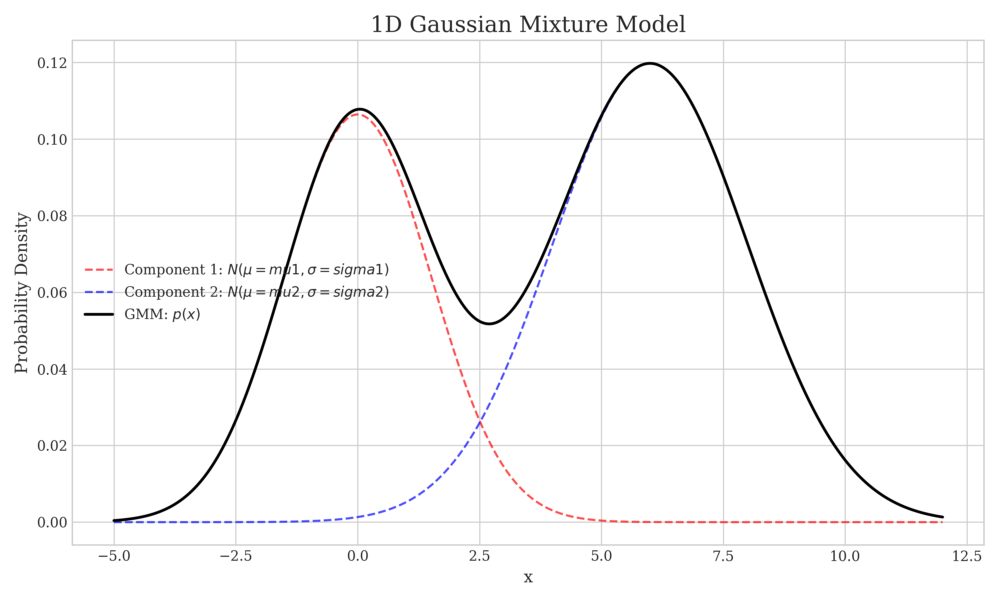
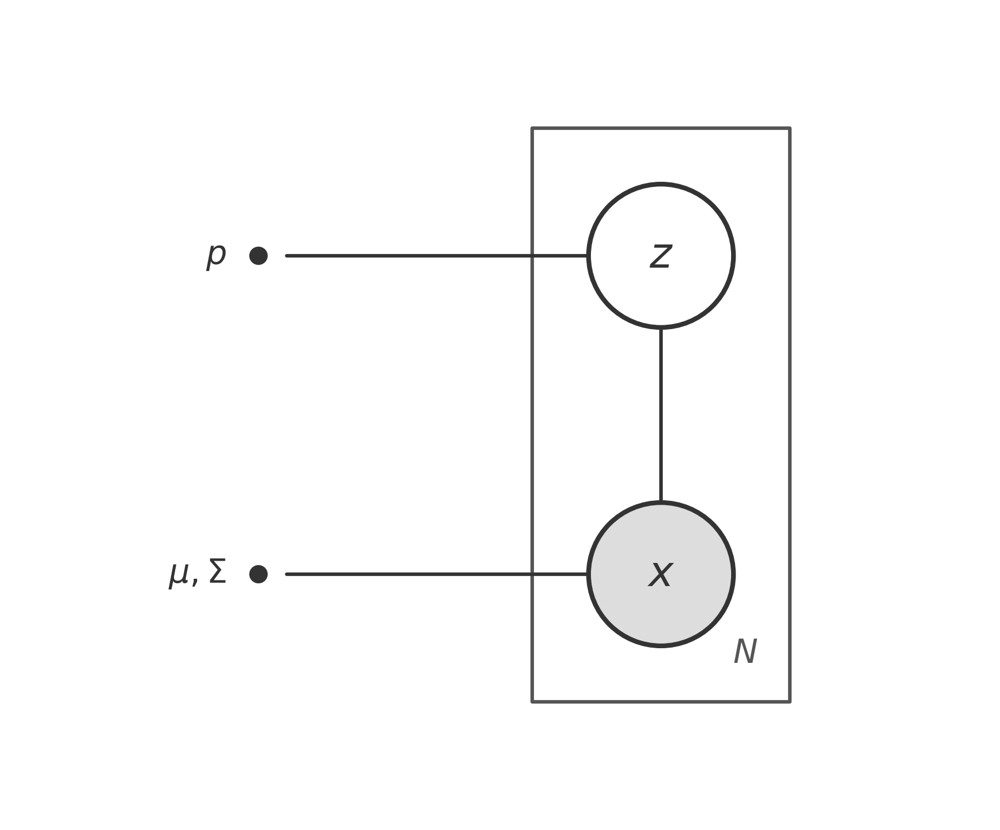
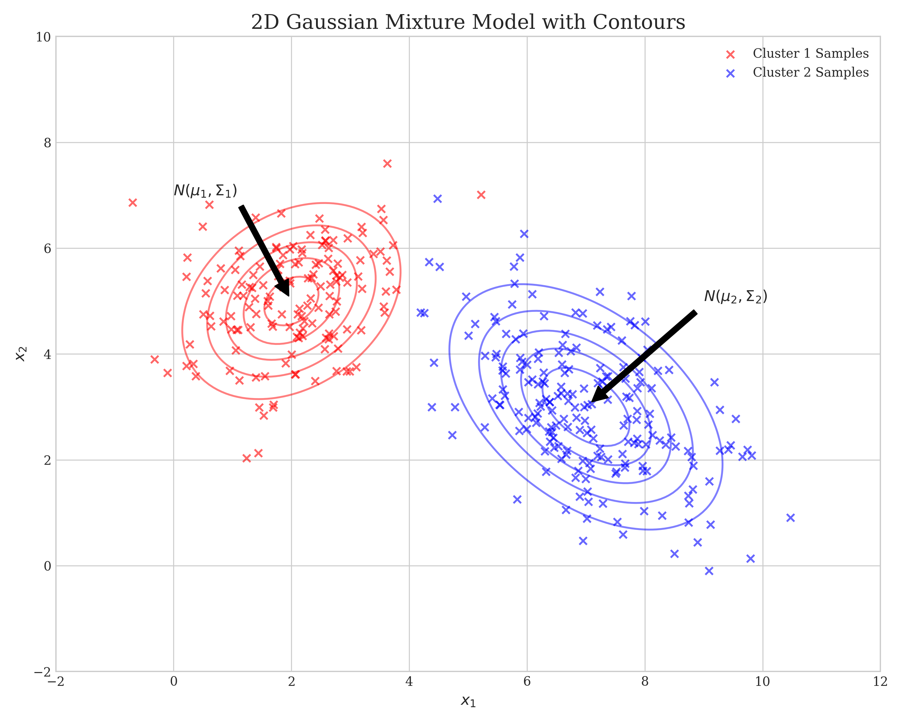

# 高斯混合模型 - Gaussian Mixture Model (GMM)

## 1. 简介 (Introduction)

Gaussian Mixture Model (GMM) 与 K-Means 的不同之处在于，它是一种 **soft clustering** (软聚类) 方法。在 GMM 中，每个数据点都以一定的概率属于某个簇 (cluster)，而不是像 K-Means 那样进行硬性分配 (hard assignment)。

我们可以从两个角度来理解 GMM：**几何角度 (Geometric Perspective)** 和 **生成模型角度 (Generative Model Perspective)**。

### 1.1 几何角度 (Geometric Perspective)

从几何角度来看，GMM 是多个高斯分布 (Gaussian distributions) 的 **加权平均 (weighted average)** (或者说叠加)。

$$
p(x) = \sum_{k=1}^K \alpha_k \mathcal{N}(x | \mu_k, \Sigma_k)
$$

其中：
- $\sum_{k=1}^K \alpha_k = 1$
- $\alpha_k \ge 0$ 是混合系数 (mixing coefficients) 或 **权重 (weight)**。
- $\mathcal{N}(x | \mu_k, \Sigma_k)$ 是第 $k$ 个高斯分量。

<!-- Generated by scripts/generate_ch11_gmm_plots.py -->

### 1.2 生成模型角度 (Generative Model Perspective)

从生成模型的角度来看，我们引入一个 **latent variable** (隐变量) $z$。观测变量 $x$ 是基于隐变量 $z$ 的选择而生成的。

- $x$: Observed variable (观测变量)
- $z$: Latent variable (隐变量)

**概率图模型 (Probabilistic Graphical Model):**

<!-- Generated by scripts/generate_ch11_gmm_pgm.py -->

生成过程 (Generative Process) 如下：
1.  首先，根据 $z$ 的概率分布选择一个分量 $k$。
2.  然后，从对应的高斯分布 $\mathcal{N}(\mu_k, \Sigma_k)$ 中生成样本 $x$。

**离散随机变量 $z$ (Discrete Random Variable $z$)**

我们可以用一个表格来表示隐变量 $z$ 的概率分布：

| $z$ | $C_1$ | $C_2$ | $\dots$ | $C_K$ |
| :--- | :---: | :---: | :---: | :---: |
| $P(z)$ | $p_1$ | $p_2$ | $\dots$ | $p_K$ |

其中：
- $\sum_{k=1}^K p_k = 1$
- $p = (p_1, p_2, \dots, p_K)$

这定义了选择每个簇的先验概率 (prior probability)。

<!-- Generated by scripts/generate_ch11_gmm_plots.py -->

## 2. 极大似然估计 (Maximum Likelihood Estimation)

为了求解 GMM 模型，我们首先尝试使用 **极大似然估计** (MLE)。

定义变量：
-   **Observed Data (观测数据)**: $X = (x_1, x_2, \dots, x_N)$
-   **Complete Data (完整数据)**: $(X, Z)$，包含观测变量和隐变量。
-   **Parameters (参数)**: $\theta = \{p_1, \dots, p_K, \mu_1, \dots, \mu_K, \Sigma_1, \dots, \Sigma_K\}$
    > 注意：此处 $p_k$ 对应前文的权重 $\alpha_k$。

我们的目标是最大化对数似然函数 (Log-Likelihood Function)：

$$
\begin{aligned}
\hat{\theta}_{MLE} &= \arg\max_\theta \log P(X) \\
&= \arg\max_\theta \log \prod_{i=1}^N P(x_i) \\
&= \arg\max_\theta \sum_{i=1}^N \log P(x_i) \\
&= \arg\max_\theta \sum_{i=1}^N \log \sum_{k=1}^K p_k \cdot \mathcal{N}(x_i | \mu_k, \Sigma_k)
\end{aligned}
$$

**结论**: 由于对数函数里面包含求和 ($\log \sum$)，导致其导数形式复杂，**直接用 MLE 求解 GMM，无法得出解析解** (no closed-form solution)。通常我们需要使用 **EM 算法** (Expectation-Maximization Algorithm) 来求解。

## 3. EM 算法求解 GMM

EM 算法 (Expectation-Maximization Algorithm) 是一种迭代算法，用于求解含有隐变量的概率模型参数。

核心思想是最大化 Q 函数：
$$
\theta^{(t+1)} = \arg\max_\theta Q(\theta, \theta^{(t)})
$$

其中 Q 函数定义为完全数据对数似然函数关于在给定观测数据 $X$ 和当前参数 $\theta^{(t)}$ 下隐变量 $Z$ 的后验概率分布的期望：

$$
Q(\theta, \theta^{(t)}) = \sum_Z \log P(X, Z | \theta) \cdot P(Z | X, \theta^{(t)})
$$
(注：如果是连续隐变量则为积分形式 $\int_Z \dots dZ$，这里针对 GMM 的离散隐变量使用求和 $\sum_Z$)

### 3.1 E-step (Expectation Step)

我们先推导 E-step。

展开 $\log P(X, Z | \theta)$：
由于数据是独立同分布的 (i.i.d)，我们可以写成：
$$
\log P(X, Z | \theta) = \sum_{i=1}^N \log P(x_i, z_i | \theta)
$$

代入 Q 函数：
$$
\begin{aligned}
Q(\theta, \theta^{(t)}) &= \sum_Z \left[ \sum_{i=1}^N \log P(x_i, z_i | \theta) \right] \prod_{j=1}^N P(z_j | x_j, \theta^{(t)}) \\
&= \sum_{z_1, \dots, z_N} \left[ \sum_{i=1}^N \log P(x_i, z_i | \theta) \right] \prod_{j=1}^N P(z_j | x_j, \theta^{(t)})
\end{aligned}
$$

这里需要解释一下为什么可以将多重求和 $\sum_{z_1, \dots, z_N}$ 化简为单重求和 $\sum_{z_i}$。

考虑求和式中的某一项 (例如 $i=1$ 的项)：
$$
\begin{aligned}
& \sum_{z_1, \dots, z_N} \log P(x_1, z_1 | \theta) \prod_{j=1}^N P(z_j | x_j, \theta^{(t)}) \\
&= \sum_{z_1} \sum_{z_2} \dots \sum_{z_N} \log P(x_1, z_1 | \theta) \cdot P(z_1 | x_1, \theta^{(t)}) \cdot P(z_2 | x_2, \theta^{(t)}) \dots P(z_N | x_N, \theta^{(t)}) \\
&= \sum_{z_1} \log P(x_1, z_1 | \theta) P(z_1 | x_1, \theta^{(t)}) \cdot \underbrace{\left( \sum_{z_2} P(z_2 | x_2, \theta^{(t)}) \right)}_{1} \dots \underbrace{\left( \sum_{z_N} P(z_N | x_N, \theta^{(t)}) \right)}_{1} \\
&= \sum_{z_1} \log P(x_1, z_1 | \theta) P(z_1 | x_1, \theta^{(t)})
\end{aligned}
$$

因为 $P(z_j | x_j, \theta^{(t)})$ 是概率分布，其对所有可能的 $z_j$ 求和为 1。同理，对于每一项 $i$，其他 $j \neq i$ 的求和项都会变成 1。

因此，原本复杂的式子可以化简为：
$$
\begin{aligned}
&= \sum_{z_1} \log P(x_1, z_1 | \theta) P(z_1 | x_1, \theta^{(t)}) + \dots + \sum_{z_N} \log P(x_N, z_N | \theta) P(z_N | x_N, \theta^{(t)}) \\
&= \sum_{i=1}^N \sum_{z_i} \log P(x_i, z_i | \theta) \cdot P(z_i | x_i, \theta^{(t)})
\end{aligned}
$$

**代入 GMM 的具体形式:**

对于 GMM：
1.  $P(x_i, z_i | \theta) = P(z_i) P(x_i | z_i) = p_{z_i} \mathcal{N}(x_i | \mu_{z_i}, \Sigma_{z_i})$
2.  $P(z_i | x_i, \theta^{(t)})$ 是我们在 E-step 需要计算的后验概率 (Posterior Probability)，通常记为 **Responsibilities** (该样本属于第 $k$ 个簇的概率)。
    根据贝叶斯公式：
    $$
    P(z_i=C_k | x_i, \theta^{(t)}) = \frac{P(x_i, z_i=C_k | \theta^{(t)})}{P(x_i | \theta^{(t)})} = \frac{p_k \cdot \mathcal{N}(x_i | \mu_k, \Sigma_k)}{\sum_{j=1}^K p_j \cdot \mathcal{N}(x_i | \mu_j, \Sigma_j)}
    $$

最终得到的 Q 函数形式为：
$$
\begin{aligned}
Q(\theta, \theta^{(t)}) &= \sum_{i=1}^N \sum_{z_i} \underbrace{\log \left[ p_{z_i} \mathcal{N}(x_i | \mu_{z_i}, \Sigma_{z_i}) \right]}_{\text{About } \theta} \cdot \underbrace{\frac{p_{z_i}^{(t)} \cdot \mathcal{N}(x_i | \mu_{z_i}^{(t)}, \Sigma_{z_i}^{(t)})}{\sum_{k=1}^K p_k^{(t)} \cdot \mathcal{N}(x_i | \mu_k^{(t)}, \Sigma_k^{(t)})}}_{P(z_i | x_i, \theta^{(t)}) \text{ (Fixed)}} \\
&= \sum_{k=1}^K \sum_{i=1}^N \log \left[ p_k \cdot \mathcal{N}(x_i | \mu_k, \Sigma_k) \right] \cdot P(z_i=C_k | x_i, \theta^{(t)}) \\
&= \sum_{k=1}^K \sum_{i=1}^N \left[ \log p_k + \log \mathcal{N}(x_i | \mu_k, \Sigma_k) \right] \cdot P(z_i=C_k | x_i, \theta^{(t)})
\end{aligned}
$$
(这里我们将对隐变量状态 $z_i$ 的求和，具体写为对 $K$ 个簇的求和，并将对数项展开)

### 3.2 M-step (Maximization Step)

M-step 的目标是最大化 Q 函数，求出参数 $\theta$ 的更新值：

$$
\theta^{(t+1)} = \arg\max_\theta Q(\theta, \theta^{(t)})
$$

我们需要分别对 $\mu_k, \Sigma_k, p_k$ 求偏导并令其为 0。

之所以可以分开求解，是因为 Q 函数可以写成如下形式 (忽略常数项)：
$$
Q \propto \sum_{k=1}^K \sum_{i=1}^N P(z_i=C_k | x_i, \theta^{(t)}) \left[ \log p_k + \log \mathcal{N}(x_i | \mu_k, \Sigma_k) \right]
$$

#### 3.2.1 求解 $\mu_k$

对 $\mu_k$ 求偏导：
$$
\frac{\partial Q}{\partial \mu_k} = \sum_{i=1}^N P(z_i=C_k | x_i, \theta^{(t)}) \frac{\partial}{\partial \mu_k} \left( -\frac{1}{2} (x_i - \mu_k)^T \Sigma_k^{-1} (x_i - \mu_k) \right) = 0
$$

解得：
$$
\mu_k^{(t+1)} = \frac{\sum_{i=1}^N P(z_i=C_k | x_i, \theta^{(t)}) x_i}{\sum_{i=1}^N P(z_i=C_k | x_i, \theta^{(t)})}
$$
(这解释了 $\mu_k$ 是样本的加权平均，权重是样本属于该簇的后验概率)

#### 3.2.2 求解 $\Sigma_k$

对 $\Sigma_k$ 求偏导 (利用矩阵求导公式)：
$$
\Sigma_k^{(t+1)} = \frac{\sum_{i=1}^N P(z_i=C_k | x_i, \theta^{(t)}) (x_i - \mu_k^{(t+1)})(x_i - \mu_k^{(t+1)})^T}{\sum_{i=1}^N P(z_i=C_k | x_i, \theta^{(t)})}
$$

#### 3.2.3 求解 $p_k$

求解 $p_k$ 的更新公式：
$$
p^{(t+1)} = \arg\max_{p} \sum_{k=1}^K \sum_{i=1}^N \log p_k \cdot P(z_i=C_k | x_i, \theta^{(t)}) \quad \text{s.t.} \quad \sum_{k=1}^K p_k = 1
$$

构造拉格朗日函数 (Lagrange Function)：
$$
L(p, \lambda) = \sum_{k=1}^K \sum_{i=1}^N \log p_k \cdot P(z_i=C_k | x_i, \theta^{(t)}) + \lambda \left( \sum_{k=1}^K p_k - 1 \right)
$$

对 $p_k$ 求偏导并令其为 0：
$$
\frac{\partial L}{\partial p_k} = \sum_{i=1}^N \frac{1}{p_k} P(z_i=C_k | x_i, \theta^{(t)}) + \lambda = 0
$$

两边同时乘以 $p_k$：
$$
\sum_{i=1}^N P(z_i=C_k | x_i, \theta^{(t)}) + p_k \lambda = 0
$$

对 $k$ 求和 (Sum to eliminate $\lambda$)：
$$
\sum_{k=1}^K \sum_{i=1}^N P(z_i=C_k | x_i, \theta^{(t)}) + \sum_{k=1}^K p_k \lambda = 0
$$

交换求和顺序 $\sum_{i=1}^N \sum_{k=1}^K P(z_i=C_k | x_i, \theta^{(t)}) = \sum_{i=1}^N 1 = N$，且 $\sum p_k = 1$，得到：
$$
N + \lambda = 0 \implies \lambda = -N
$$

代回原式解得：
$$
p_k^{(t+1)} = \frac{1}{N} \sum_{i=1}^N P(z_i=C_k | x_i, \theta^{(t)})
$$
(这表示 $p_k$ 是该簇所有样本后验概率的平均值)
