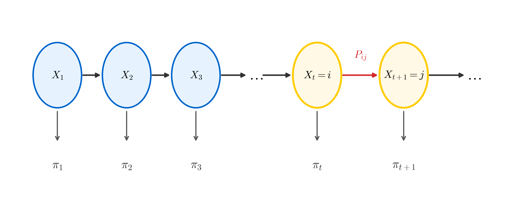

# Markov Chain Monte Carlo (MCMC)

## 1. 蒙特卡洛方法 (Monte Carlo Method)

### 1.1 简介 (Introduction)

#### 推断 (Inference)
在概率模型中，我们经常需要进行推断（Inference），即求后验概率 $P(Z|X)$，其中 $X$ 是观测数据，$Z$ 是潜变量（Latent Variable）。
推断方法主要分为两类：
1.  **精确推断 (Exact Inference)**
2.  **近似推断 (Approximate Inference)**
    *   **确定性近似 (Deterministic)**：如变分推断 (Variational Inference, VI)。
    *   **随机近似 (Stochastic)**：如马尔可夫链蒙特卡洛 (MCMC)。

#### 蒙特卡洛方法 (Monte Carlo Method)
蒙特卡洛方法是一种**基于采样的随机近似方法**。
我们的目标通常是计算某个函数 $f(z)$ 在分布 $p(z|x)$ 下的期望：
$$
E_{z|x}[f(z)] = \int p(z|x) f(z) dz \approx \frac{1}{N} \sum_{i=1}^{N} f(z^{(i)})
$$
其中 $z^{(1)}, z^{(2)}, \dots, z^{(N)}$ 是从分布 $p(z|x)$ 中采样得到的 $N$ 个样本。
当 $N \to \infty$ 时，根据大数定律，样本均值收敛于期望值。

#### 概率分布采样 (Probability Distribution Sampling)
如何从一个复杂的概率分布 $p(z)$ 中进行采样呢？

**逆变换采样 (Inverse Transform Sampling)**
对于简单的分布，如果我们知道其概率密度函数 (PDF) $p(z)$，可以求得其累积分布函数 (CDF) $F(z)$。
利用 $U(0,1)$ 分布进行采样：
1.  从均匀分布 $U(0,1)$ 中采样得到 $u$。
2.  通过 CDF 的逆函数计算 $z$：
    $$
    z = F^{-1}(u) \quad \text{where } u \sim U(0,1)
    $$
    这样得到的 $z$ 服从分布 $p(z)$。
    然而，对于很多复杂的分布，求 CDF 的逆函数是非常困难甚至不可能的，因此我们需要更高级的采样方法。

### 1.2 拒绝采样 (Rejection Sampling)
当分布 $p(z)$ 非常复杂（例如归一化常数未知，或者没有容易采样的形式）时，我们可以利用一个简单的**建议分布 (Proposal Distribution)** $q(z)$ 来进行采样。

**原理**
我们需要找到一个简单的分布 $q(z)$（例如高斯分布），以及一个常数 $M$，使得对于所有的 $z$，都满足：
$$
M \cdot q(z) \ge p(z)
$$
这就意味着 $M \cdot q(z)$ 的曲线始终在 $p(z)$ 的上方。

**采样步骤**
1.  **采样建议样本**: 从建议分布 $q(z)$ 中采样得到样本 $z^{(i)}$。
$$
z^{(i)} \sim q(z)
$$
2.  **采样拒绝条件**: 从均匀分布 $U(0,1)$ 中采样得到 $u$。
$$
u \sim U(0,1)
$$
3.  **接受/拒绝判断**:
    计算接受率 $\alpha$:
$$
\alpha = \frac{p(z^{(i)})}{M \cdot q(z^{(i)})}
$$
*   如果 $u \le \alpha$，则**接受** $z^{(i)}$ 作为 $p(z)$ 的样本。
*   否则，**拒绝**该样本，重新开始步骤1。

直观理解：我们在 $M \cdot q(z)$ 下方的区域均匀撒点，只保留落在 $p(z)$ 下方区域的点。

---

### 1.3 重要性采样 (Importance Sampling)
重要性采样并不是为了直接生成 $p(z)$ 的样本，而是为了**计算函数 $f(z)$ 在分布 $p(z)$ 下的期望**。
有时候直接从 $p(z)$ 采样很困难，或者 $p(z)$ 在某些重要区域的概率密度很小，导致样本稀疏。

**推导**
我们需要计算期望 $E_{p(z)}[f(z)]$。
利用另一个简单的分布 $q(z)$（Importance Distribution），我们可以引入 $q(z)$ 进行如下变换：
$$
\begin{aligned}
E_{p(z)}[f(z)] &= \int p(z) f(z) dz \\
&= \int \frac{p(z)}{q(z)} q(z) f(z) dz \\
&= \int \left( \frac{p(z)}{q(z)} f(z) \right) q(z) dz \\
&= E_{q(z)} \left[ \frac{p(z)}{q(z)} f(z) \right]
\end{aligned}
$$
这样，我们将对 $p(z)$ 的期望转化为了对 $q(z)$ 的期望。
在实际计算中，我们从 $q(z)$ 中采样 $N$ 个样本 $z^{(1)}, \dots, z^{(N)}$，则有：
$$
E_{p(z)}[f(z)] \approx \frac{1}{N} \sum_{i=1}^{N} \frac{p(z^{(i)})}{q(z^{(i)})} f(z^{(i)})
$$

**重要性权重 (Importance Weights)**
我们定义**重要性权重 (Weight)** 为：
$$
w_i = \frac{p(z^{(i)})}{q(z^{(i)})}
$$
则上述公式可以写为：
$$
E_{p(z)}[f(z)] \approx \frac{1}{N} \sum_{i=1}^{N} w_i f(z^{(i)})
$$
这里的权重 $w_i$ 反映了样本 $z^{(i)}$ 对期望贡献的“重要性”。如果 $p(z^{(i)})$ 很大而 $q(z^{(i)})$ 很小，说明该样本在原分布中概率大但在建议分布中概率小，需要赋予更大的权重进行补偿。

**采样-重要性-重采样 (Sampling-Importance-Resampling, SIR)**
虽然重要性采样主要用于计算期望，但也可以通过**重采样 (Resampling)** 步骤来获取 $p(z)$ 的近似样本。
具体做法是根据归一化后的权重 $w_i$ 对样本 $\{z^{(i)}\}$ 进行重采样。

---

## 2. 马尔可夫链 (Markov Chain)

### 2.1 定义与性质 (Definition & Properties)
**马尔可夫链 (Markov Chain)** 指的是状态空间 $\{X_t\}$，其中时间和状态都是离散的。

满足 **齐次一阶马尔可夫性 (Homogeneous First-order Markov Property)**：
$$
P(X_{t+1}=x | X_1, X_2, \dots, X_t) = P(X_{t+1}=x | X_t)
$$
即下一时刻的状态仅依赖于当前时刻的状态，与之前的历史状态无关。

**转移矩阵 (Transition Matrix)**
状态转移概率定义为 $P_{ij}$，表示从状态 $i$ 转移到状态 $j$ 的概率：
$$
P_{ij} = P(X_{t+1}=j | X_t=i)
$$
转移矩阵 $P = [P_{ij}]$ 满足每一行之和为 1：$\sum_j P_{ij} = 1$。

### 2.2 平稳分布 (Stationary Distribution)
如果在时间趋于无穷时，马尔可夫链的状态分布收敛于一个固定的分布 $\pi$，则称 $\pi$ 为该马尔可夫链的**平稳分布**。
对于离散状态，平稳分布 $\pi = [\pi(1), \pi(2), \dots]$ 满足：
$$
\pi = \pi P
$$
或者写成分量形式：
$$
\pi(j) = \sum_i \pi(i) P_{ij}
$$
这表示经过一次状态转移后，分布保持不变。
在连续情况下，写作积分形式：
$$
\pi(x^*) = \int \pi(x) P(x \to x^*) dx
$$

### 2.3 细致平稳条件 (Detailed Balance)
**细致平稳条件**是平稳分布的一个充分条件（但不是必要条件）。
如果分布 $\pi$ 和转移概率 $P$ 满足以下等式：
$$
\pi(i) P_{ij} = \pi(j) P_{ji} \quad (\text{Discrete})
$$
$$
\pi(x) P(x \to x^*) = \pi(x^*) P(x^* \to x) \quad (\text{Continuous})
$$
则称该马尔可夫链满足细致平稳条件。
**物理含义**：处于状态 $i$ 并转移到 $j$ 的概率质量与之平衡（从 $j$ 到 $i$）。

**证明细致平稳条件蕴含平稳分布**：
$$
\begin{aligned}
\int \pi(x) P(x \to x^*) dx &= \int \pi(x^*) P(x^* \to x) dx \quad (\text{Use Detailed Balance}) \\
&= \pi(x^*) \int P(x^* \to x) dx \\
&= \pi(x^*) \cdot 1 \\
&= \pi(x^*)
\end{aligned}
$$
得证。
这意味着如果我们能构造一个转移矩阵（或转移核）使得它满足细致平稳条件，那么它收敛后的分布就是 $\pi$。这是 MCMC 方法的核心思想。

---

## 3. Metropolis-Hastings (MH) 算法

Metropolis-Hastings 算法不仅是 MCMC 中最著名、应用最广泛的算法，也是一种构造满足特定平稳分布的马尔可夫链的通用方法。
它通过引入**建议分布 (Proposal Distribution)** $Q(z^*|z)$ 和**接受率 (Acceptance Probability)** $\alpha(z, z^*)$ 来实现从复杂分布 $p(z)$ 的采样。

### 3.1 算法描述 (Algorithm Description)
假设我们需要采样的目标分布为 $p(z)$（通常 $p(z) = \frac{\hat{p}(z)}{Z_p}$，其中归一化常数 $Z_p$ 未知）。
建议分布为 $Q(z^*|z^{(t-1)})$，即给定当前状态 $z^{(t-1)}$，生成下一个候选状态 $z^*$ 的概率分布。

**步骤如下：**
1.  初始化 $z^{(0)}$，设定采样数量 $N$。
2.  对于 $i = 1, 2, \dots, N$：
    *   **采样候选状态**: 从建议分布中采样 $z^*$：
        $$
        z^* \sim Q(z | z^{(i-1)})
        $$
    *   **计算接受率**:
        $$
        \alpha(z^{(i-1)}, z^*) = \min \left( 1, \frac{p(z^*) Q(z^{(i-1)} | z^*)}{p(z^{(i-1)}) Q(z^* | z^{(i-1)})} \right)
        $$
        注意：这里 $p(z)$ 中的常数 $Z_p$ 在分子分母中会被消去，因此只需要知道 $\hat{p}(z)$ 即可。
    *   **接受/拒绝**: 从均匀分布采样 $u$：
        $$
        u \sim U(0,1)
        $$
        *   如果 $u \le \alpha(z^{(i-1)}, z^*)$，则**接受** $z^*$，令 $z^{(i)} = z^*$。
        *   否则，**拒绝** $z^*$，保持状态不变，令 $z^{(i)} = z^{(i-1)}$。

### 3.2 细致平稳条件的满足 (Detailed Balance Proof)
为什么这样做能保证平稳分布就是 $p(z)$ 呢？我们需要证明 MH 算法构造的转移核满足细致平稳条件。

MH 算法的实际转移概率 $P(z \to z^*)$ 由两部分组成：建议分布 $Q(z^*|z)$ 和接受率 $\alpha(z, z^*)$。
$$
P(z \to z^*) = Q(z^*|z) \cdot \alpha(z, z^*)
$$
我们需要验证：
$$
p(z) P(z \to z^*) = p(z^*) P(z^* \to z)
$$

**证明过程：**
考察左边：
$$
\begin{aligned}
p(z) P(z \to z^*) &= p(z) Q(z^*|z) \alpha(z, z^*) \\
&= p(z) Q(z^*|z) \min \left( 1, \frac{p(z^*) Q(z|z^*)}{p(z) Q(z^*|z)} \right) \\
&= \min \left( p(z) Q(z^*|z), p(z) Q(z^*|z) \frac{p(z^*) Q(z|z^*)}{p(z) Q(z^*|z)} \right) \\
&= \min \left( p(z) Q(z^*|z), p(z^*) Q(z|z^*) \right)
\end{aligned}
$$
我们可以看到，最终的结果 $\min(p(z)Q(z^*|z), p(z^*)Q(z|z^*))$ 是关于 $z$ 和 $z^*$ 对称的。

同理，考察右边：
$$
\begin{aligned}
p(z^*) P(z^* \to z) &= p(z^*) Q(z|z^*) \alpha(z^*, z) \\
&= p(z^*) Q(z|z^*) \min \left( 1, \frac{p(z) Q(z^*|z)}{p(z^*) Q(z|z^*)} \right) \\
&= \min \left( p(z^*) Q(z|z^*), p(z) Q(z^*|z) \right)
\end{aligned}
$$
显然，左边 = 右边。
因此，Metropolis-Hastings 算法构造的转移核满足细致平稳条件，其平稳分布就是目标分布 $p(z)$。

---

## 4. 吉布斯采样 (Gibbs Sampling)

吉布斯采样是 Metropolis-Hastings 算法的一个特例，特别适用于高维分布的采样。
当直接对高维联合分布 $p(z) = p(z_1, z_2, \dots, z_M)$ 进行采样很困难，但对每个分量的条件分布 $p(z_i | z_{-i})$ 进行采样相对容易时，Gibbs 采样非常有效。

### 4.1 算法描述 (Algorithm Description)
假设状态 $z$ 由 $M$ 个分量组成：$z = (z_1, z_2, \dots, z_M)$。
$z_{-i}$ 表示除去 $z_i$ 以外的所有其他分量：$z_{-i} = (z_1, \dots, z_{i-1}, z_{i+1}, \dots, z_M)$。

**步骤如下：**
1.  初始化 $z^{(0)} = (z_1^{(0)}, z_2^{(0)}, \dots, z_M^{(0)})$。
2.  对于 $t = 1, 2, \dots, N$：
    *   依次对每个维度 $i = 1$ 到 $M$ 进行更新：
        *   从条件分布中采样 $z_i^{(t)}$：
            $$
            z_i^{(t)} \sim p(z_i | z_1^{(t)}, \dots, z_{i-1}^{(t)}, z_{i+1}^{(t-1)}, \dots, z_M^{(t-1)})
            $$
            即 $z_i^{(t)} \sim p(z_i | z_{-i})$。
    *   得到新的样本 $z^{(t)} = (z_1^{(t)}, \dots, z_M^{(t)})$。

### 4.2 Gibbs 是 MH 的特例 (Gibbs as a special case of MH)
我们可以证明，Gibbs 采样等价于接受率 $\alpha = 1$ 的 Metropolis-Hastings 算法。

对于第 $i$ 个维度的更新，我们的建议分布 (Proposal Distribution) 设定为目标分布的条件分布：
$$
Q(z^* | z) = p(z_i^* | z_{-i})
$$
注意这里 $z^*$ 和 $z$ 只有第 $i$ 个分量不同，即 $z_{-i}^* = z_{-i}$。

**计算 MH 接受率：**
$$
\begin{aligned}
\alpha(z, z^*) &= \min \left( 1, \frac{p(z^*) Q(z | z^*)}{p(z) Q(z^* | z)} \right) \\
&= \min \left( 1, \frac{p(z_i^*, z_{-i}^*) p(z_i | z_{-i}^*)}{p(z_i, z_{-i}) p(z_i^* | z_{-i})} \right)
\end{aligned}
$$
由于 $z_{-i}^* = z_{-i}$，我们可以利用条件概率公式 $p(a, b) = p(a|b)p(b)$ 将联合概率展开：
$$
p(z^*) = p(z_i^*, z_{-i}) = p(z_i^* | z_{-i}) p(z_{-i})
$$
$$
p(z) = p(z_i, z_{-i}) = p(z_i | z_{-i}) p(z_{-i})
$$
代入接受率公式：
$$
\begin{aligned}
\alpha(z, z^*) &= \min \left( 1, \frac{ (p(z_i^* | z_{-i}) p(z_{-i})) \cdot p(z_i | z_{-i}) }{ (p(z_i | z_{-i}) p(z_{-i})) \cdot p(z_i^* | z_{-i}) } \right) \\
&= \min \left( 1, \frac{ p(z_i^* | z_{-i}) p(z_{-i}) p(z_i | z_{-i}) }{ p(z_i | z_{-i}) p(z_{-i}) p(z_i^* | z_{-i}) } \right) \\
&= \min (1, 1) \\
&= 1
\end{aligned}
$$
因此，Gibbs 采样的接受率始终为 **1**。这意味着我们总是接受建议的样本，不会发生拒绝，这使得 Gibbs 采样在高维空间中通常比普通的 MH 算法更高效。

---

## 5. 平稳分布与收敛性分析 (Stationary Distribution & Convergence Analysis)

为什么马尔可夫链最终会收敛到一个平稳分布？我们可以通过矩阵的特征值分解来分析这一过程。

### 5.1 状态转移矩阵的谱分解 (Spectral Decomposition)
假设状态空间为 $\{1, 2, \dots, K\}$，转移矩阵为 $P$（有时也记为 $Q$）。
设 $\pi^{(t)}$ 为 $t$ 时刻的状态分布向量（行向量），则状态更新公式为：
$$
\pi^{(t+1)} = \pi^{(t)} P
$$
递推可知：
$$
\pi^{(t)} = \pi^{(0)} P^t
$$
我们希望分析当 $t \to \infty$ 时，$P^t$ 的行为。

假设矩阵 $P$ 可以被对角化（这在大多数情况下成立），即存在可逆矩阵 $A$ 和对角矩阵 $\Lambda$，使得：
$$
P = A \Lambda A^{-1}
$$
其中 $\Lambda = \text{diag}(\lambda_1, \lambda_2, \dots, \lambda_K)$，$\lambda_i$ 为 $P$ 的特征值。
那么 $P^t$ 可以表示为：
$$
P^t = (A \Lambda A^{-1})^t = A \Lambda^t A^{-1}
$$
$$
\Lambda^t = \text{diag}(\lambda_1^t, \lambda_2^t, \dots, \lambda_K^t)
$$

### 5.2 收敛条件 (Convergence Condition)
随机矩阵（每一行之和为 1）有一个重要性质：
1.  **最大特征值**: 必定存在一个特征值 $\lambda_1 = 1$。
2.  **特征值范围**: 所有特征值的模都小于等于 1，即 $|\lambda_i| \le 1$。

如果不妨设 $\lambda_1 = 1$，且其他特征值严格小于 1（对于遍历的、非周期的马尔可夫链成立），即 $|\lambda_i| < 1$ for $i \ne 1$。
当 $t \to \infty$ 时：
*   $\lambda_1^t = 1^t = 1$
*   $\lambda_i^t \to 0$ (for $i \ne 1$)

此时，$\Lambda^t$ 收敛于一个只有第一个元素为 1，其余为 0 的对角矩阵（或者更准确地说，对应于 $\lambda=1$ 的子空间保留，其余衰减）。
$$
\lim_{t \to \infty} \Lambda^t = \text{diag}(1, 0, \dots, 0)
$$
因此，$P^t$ 收敛于一个极限矩阵 $P^{\infty}$。
这意味着无论初始分布 $\pi^{(0)}$ 如何，经过足够多次迭代后，$\pi^{(t)}$ 都会收敛到与特征值 1 对应的特征向量方向，即平稳分布 $\pi$。
$$
\lim_{t \to \infty} \pi^{(t)} = \pi
$$

---

## 6. MCMC 方法回顾与问题 (MCMC Approach & Potential Problems)

回顾 MCMC 的核心思想：我们希望从目标分布 $p(x)$ 采样，但直接采样困难。
于是我们需要设计一个转移矩阵 $Q$（或转移核），使得该马尔可夫链的平稳分布恰好是目标分布 $p(x)$。
$$
\text{设计 } Q, \text{ 使得 } \frac{q(x)}{p(x)} \to 1 \text{ (收敛)}
$$

### 6.1 核心概念 (Core Concepts)
*   **预烧期 (Burn-in)**:
    从初始状态 $x^{(0)}$ 开始，马尔可夫链需要一段时间才能达到平稳状态。这段时间称为 Burn-in 阶段。
    在实际操作中，我们会丢弃前 $m$ 个样本（例如前 1000 个），只保留 $t > m$ 的样本 $x^{(m)}, x^{(m+1)}, \dots$ 作为有效样本。
*   **混合时间 (Mixing Time)**:
    衡量马尔可夫链从初始状态收敛到平稳分布所需的时间。

### 6.2 MCMC 面临的问题 (Problems with MCMC)
尽管 MCMC 理论保证了收敛性，但在实际应用中面临三大挑战：

1.  **无法判断何时收敛 (Convergence Diagnosis)**
    *   理论只保证当 $t \to \infty$ 时收敛，但我们无法确切知道在 $t$ 为多少时已经收敛。
    *   特别是当 $p(x)$ 非常复杂、高维、或者变量间存在强相关性时，收敛可能非常慢，且难以检测。

2.  **混合时间过长 (Mixing Time is too long)**
    *   这种情况通常发生在目标分布是**多峰 (Multimodal)** 的时候。
    *   如果两个峰之间被低概率区域分隔（例如“缓和” vs “陡峭”的山峰），马尔可夫链可能被困在一个峰（Mode）附近，很难跳转到另一个峰。这导致采样的样本不能很好地覆盖整个分布空间。

3.  **样本之间存在相关性 (Sample Correlation)**
    *   马尔可夫链产生的样本 $x^{(t+1)}$ 高度依赖于 $x^{(t)}$。
    *   这意味着样本之间不是独立的 (Non-i.i.d.)。虽然均值估计 $\frac{1}{N} \sum f(x^{(i)})$ 依然是无偏的，但方差会比独立样本大，导致有效样本量 (Effective Sample Size) 减少。
    *   解决方法通常是进行**稀疏采样 (Thinning)**，例如每隔 $k$ 步取一个样本，以降低相关性。

