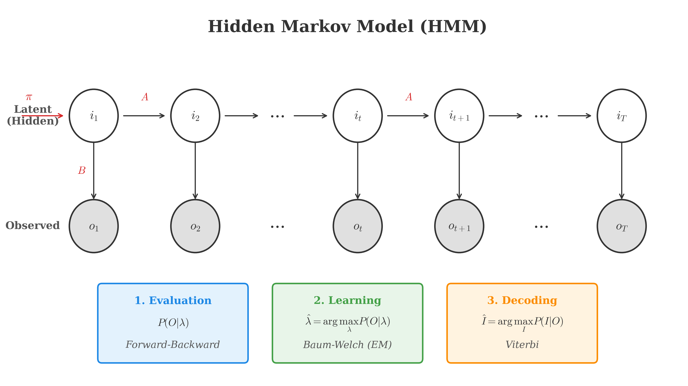
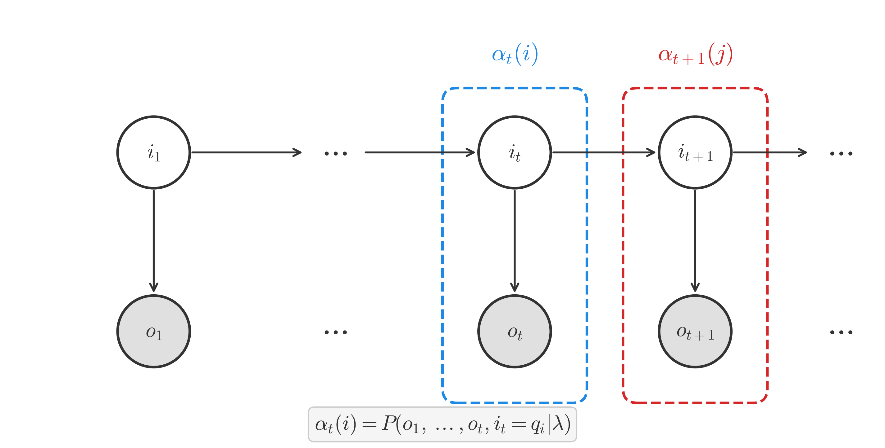
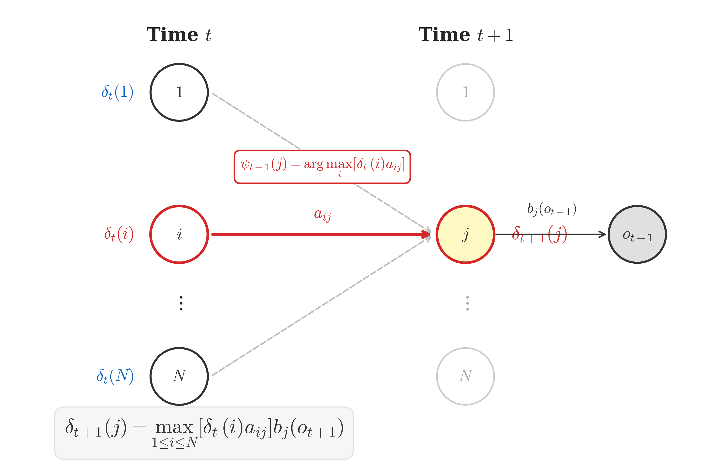

# 隐马尔可夫模型 (Hidden Markov Model)

## 1. 背景 (Background)

### 1.1 概率图模型 (Probabilistic Graphical Model)

概率图模型 (PGM) 大致可以分为两类：
*   **有向图 (Directed Graph)**: 贝叶斯网络 (Bayesian Network)。
*   **无向图 (Undirected Graph)**: 马尔可夫随机场 (Markov Random Field, MRF)。

隐马尔可夫模型 (HMM) 属于有向图模型中的**动态模型 (Dynamic Model)**，主要用于处理序列数据（如时间序列）。根据状态变量 (State Variable) 的不同性质，动态模型可以进一步划分：

*   **HMM (Hidden Markov Model)**: 状态变量是**离散 (Discrete)** 的。
*   **Kalman Filter**: 状态变量是**连续 (Continuous)** 的，且系统是**线性 (Linear)** 的，噪声服从**高斯分布 (Gaussian)**。
*   **Particle Filter**: 状态变量是**连续 (Continuous)** 的，系统是**非线性 (Non-linear)** 的，噪声服从**非高斯分布 (Non-Gaussian)**。

### 1.2 HMM 模型定义 (Definition)

<!-- Generated by scripts/generate_ch14_hmm_concept.py -->

HMM 由两个序列组成：
1.  **状态序列 (State Sequence)**: $I = (i_1, i_2, \dots, i_T)$，其中 $i_t \in Q = \{q_1, q_2, \dots, q_N\}$。状态序列是隐变量 (Latent Variable)，不可观测。
2.  **观测序列 (Observation Sequence)**: $O = (o_1, o_2, \dots, o_T)$，其中 $o_t \in V = \{v_1, v_2, \dots, v_M\}$。观测序列是可见的。

HMM 的参数 $\lambda$ 可以表示为三元组：
$$
\lambda = (\pi, A, B)
$$

其中：
*   **$\pi$ (Initial State Distribution)**: 初始概率分布。
    $$
    \pi = (\pi_1, \pi_2, \dots, \pi_N), \quad \pi_i = P(i_1 = q_i)
    $$
*   **$A$ (State Transition Matrix)**: 状态转移矩阵。
    $$
    A = [a_{ij}]_{N \times N}, \quad a_{ij} = P(i_{t+1} = q_j | i_t = q_i)
    $$
*   **$B$ (Emission Matrix)**: 发射矩阵（观测概率矩阵）。
    $$
    B = [b_j(k)]_{N \times M}, \quad b_j(k) = P(o_t = v_k | i_t = q_j)
    $$

### 1.3 两个基本假设 (Two Assumptions)

HMM 的推导基于以下两个重要假设：

1.  **齐次马尔可夫假设 (Homogeneous Markov Assumption)**:
    任意时刻的状态只依赖于前一时刻的状态，与其他时刻的状态和观测无关，也与时刻 $t$ 无关。
    $$
    P(i_{t+1} | i_t, i_{t-1}, \dots, i_1, o_t, \dots, o_1) = P(i_{t+1} | i_t)
    $$

2.  **观测独立假设 (Observation Independence Assumption)**:
    任意时刻的观测只依赖于该时刻的状态，与其他时刻的状态和观测无关。
    $$
    P(o_t | i_t, i_{t-1}, \dots, i_1, o_t, \dots, o_1) = P(o_t | i_t)
    $$

### 1.4 三个基本问题 (Three Basic Problems)

HMM 主要解决三个问题：

1.  **Evaluation (概率计算问题)**:
    *   **已知**: 模型参数 $\lambda = (\pi, A, B)$ 和观测序列 $O$。
    *   **求解**: 观测序列出现的概率 $P(O|\lambda)$。
    *   **方法**: 前向-后向算法 (Forward-Backward Algorithm)。

2.  **Learning (参数估计问题)**:
    *   **已知**: 观测序列 $O$。
    *   **求解**: 模型参数 $\lambda$，使得 $P(O|\lambda)$ 最大。即 $\hat{\lambda} = \arg\max_{\lambda} P(O|\lambda)$。
    *   **方法**: EM 算法 (Baum-Welch Algorithm)。

3.  **Decoding (解码问题/预测问题)**:
    *   **已知**: 模型参数 $\lambda$ 和观测序列 $O$。
    *   **求解**: 最有可能的状态序列 $I$。即 $\hat{I} = \arg\max_{I} P(I|O)$。
    *   **方法**: 维特比算法 (Viterbi Algorithm)。

## 2.  Evaluation Problem (概率计算问题)

### 2.1 问题定义 (Problem Definition)

**Evaluation Problem**: 给定模型参数 $\lambda = (\pi, A, B)$ 和观测序列 $O = (o_1, o_2, \dots, o_T)$，计算观测序列出现的概率 $P(O|\lambda)$。

### 2.2 暴力求解 (Naive Solution)

最直接的方法是按照概率公式，将所有可能的隐状态序列 $I = (i_1, i_2, \dots, i_T)$ 进行求和。

$$
P(O|\lambda) = \sum_I P(O, I|\lambda) = \sum_I P(O|I, \lambda) P(I|\lambda)
$$

我们分别对这两项进行推导：

1.  **状态序列概率** $P(I|\lambda)$：
    根据**齐次马尔可夫假设**，状态 $i_t$ 只依赖于前一时刻的状态 $i_{t-1}$：
    $$
    \begin{aligned}
    P(I|\lambda) &= P(i_1, i_2, \dots, i_T | \lambda) \\
    &= P(i_1|\lambda) P(i_2|i_1, \lambda) P(i_3|i_2, \lambda) \dots P(i_T|i_{T-1}, \lambda) \\
    &= \pi_{i_1} \prod_{t=2}^T a_{i_{t-1}, i_t}
    \end{aligned}
    $$

2.  **观测序列概率** $P(O|I, \lambda)$：
    根据**观测独立假设**，观测 $o_t$ 只依赖于当前时刻的隐状态 $i_t$：
    $$
    \begin{aligned}
    P(O|I, \lambda) &= P(o_1, o_2, \dots, o_T | I, \lambda) \\
    &= \prod_{t=1}^T P(o_t | i_t, \lambda) \\
    &= \prod_{t=1}^T b_{i_t}(o_t)
    \end{aligned}
    $$

将上述两部分代入求和公式：

$$
P(O|\lambda) = \sum_{i_1, i_2, \dots, i_T} \pi_{i_1} b_{i_1}(o_1) \prod_{t=2}^T a_{i_{t-1}, i_t} b_{i_t}(o_t)
$$

**复杂度分析 (Complexity)**: 状态序列共有 $N^T$ 种可能。对于每一个序列，计算概率需要 $O(T)$ 的时间。也就是总的时间复杂度为 $O(TN^T)$。这个复杂度是指数级的，对于较大的 $T$ 是不可行的。

### 2.3 前向算法 (Forward Algorithm)

为了降低复杂度，我们利用动态规划的思想，引入**前向算法 (Forward Algorithm)**。

**定义 (Definition)**:
记 $\alpha_t(i)$ 为时刻 $t$ 部分观测序列为 $o_1, \dots, o_t$ 且状态为 $q_i$ 的概率：

$$
\alpha_t(i) = P(o_1, o_2, \dots, o_t, i_t = q_i | \lambda)
$$

**算法步骤 (Algorithm Steps)**:

1.  **初始化 (Initialization)**:
    $$
    \alpha_1(i) = \pi_i b_i(o_1), \quad 1 \le i \le N
    $$

2.  **递推 (Recursion)** (对于 $t = 1, 2, \dots, T-1$):
    $$
    \alpha_{t+1}(j) = \left[ \sum_{i=1}^N \alpha_t(i) a_{ij} \right] b_j(o_{t+1}), \quad 1 \le j \le N
    $$

    *解释*: 为了在时刻 $t+1$ 到达状态 $q_j$，我们可以从时刻 $t$ 的任意状态 $q_i$ 转移而来。我们需要对所有可能的路径进行求和：

    1.  $\alpha_t(i)$: 时刻 $t$ 处于状态 $q_i$ 且观测到 $o_1 \dots o_t$ 的概率。
    2.  $a_{ij}$: 从 $q_i$ 转移到 $q_j$ 的概率。
    3.  $b_j(o_{t+1})$: 在状态 $q_j$ 发射观测 $o_{t+1}$ 的概率。

    **详细推导过程:**
    $$
    \begin{aligned}
    \alpha_{t+1}(j) &= P(o_1, \dots, o_t, o_{t+1}, i_{t+1}=q_j | \lambda) \\
    &= \sum_{i=1}^N P(o_1, \dots, o_t, o_{t+1}, i_{t+1}=q_j, i_t=q_i | \lambda) \\
    &= \sum_{i=1}^N P(o_{t+1} | o_1, \dots, o_t, i_{t+1}=q_j, i_t=q_i, \lambda) \cdot P(o_1, \dots, o_t, i_{t+1}=q_j, i_t=q_i | \lambda) \\
    &= \sum_{i=1}^N P(o_{t+1} | i_{t+1}=q_j) \cdot P(o_1, \dots, o_t, i_{t+1}=q_j, i_t=q_i | \lambda) \\
    &= \sum_{i=1}^N b_j(o_{t+1}) \cdot P(i_{t+1}=q_j | o_1, \dots, o_t, i_t=q_i, \lambda) \cdot P(o_1, \dots, o_t, i_t=q_i | \lambda) \\
    &= \sum_{i=1}^N b_j(o_{t+1}) \cdot P(i_{t+1}=q_j | i_t=q_i) \cdot \alpha_t(i) \\
    &= \sum_{i=1}^N b_j(o_{t+1}) a_{ij} \alpha_t(i) \\
    &= \left[ \sum_{i=1}^N \alpha_t(i) a_{ij} \right] b_j(o_{t+1})
    \end{aligned}
    $$

3.  **终止 (Termination)**:

    记 $\alpha_T(i)$ 为时刻 $T$ 时，观测序列为 $O$ 且状态为 $i_T=q_i$ 的联合概率：
    $$
    \alpha_T(i) = P(o_1, \dots, o_T, i_T=q_i | \lambda) = P(O, i_T=q_i | \lambda)
    $$

    对所有可能的最终状态 $i_T$ 进行求和，即可得到观测序列的概率 $P(O|\lambda)$：
    $$
    P(O|\lambda) = \sum_{i=1}^N P(O, i_T=q_i | \lambda) = \sum_{i=1}^N \alpha_T(i)
    $$
**复杂度 (Complexity)**:
利用前向算法，计算复杂度降低到了 $O(TN^2)$，使得计算变得高效可行。

<!-- Generated by scripts/generate_ch14_forward_definition.py -->

### 2.4 后向算法 (Backward Algorithm)

除了前向算法，我们也可以从后往计算，称为**后向算法 (Backward Algorithm)**。

**定义 (Definition)**:
记 $\beta_t(i)$ 为时刻 $t$ 状态为 $q_i$ 的条件下，从时刻 $t+1$ 到 $T$ 的部分观测序列为 $o_{t+1}, \dots, o_T$ 的概率：

$$
\beta_t(i) = P(o_{t+1}, o_{t+2}, \dots, o_T | i_t = q_i, \lambda)
$$

**算法步骤 (Algorithm Steps)**:

1.  **初始化 (Initialization)** (时刻 $T$):
    $$
    \beta_T(i) = 1, \quad 1 \le i \le N
    $$
    *解释*: 在时刻 $T$ 之后没有观测数据，故规定概率为 1。

2.  **递推 (Recursion)** (对于 $t = T-1, T-2, \dots, 1$):

    $$
    \beta_t(i) = \sum_{j=1}^N a_{ij} b_j(o_{t+1}) \beta_{t+1}(j), \quad 1 \le i \le N
    $$

    *解释*: 为了计算从时刻 $t$ 的状态 $q_i$ 出发观测到未来序列 $o_{t+1} \dots o_T$ 的概率，我们需要考虑他在时刻 $t+1$ 可能转移到的所有状态 $q_j$。
    对于每一个可能的下一状态 $q_j$：
    1.  $a_{ij}$: 从 $q_i$ 转移到 $q_j$。
    2.  $b_j(o_{t+1})$: 在状态 $q_j$ 发射观测 $o_{t+1}$。
    3.  $\beta_{t+1}(j)$: 从状态 $q_j$ 出发观测到剩余序列 $o_{t+2} \dots o_T$ 的概率。

    **详细推导过程**:
    $$
    \begin{aligned}
    \beta_t(i) &= P(o_{t+1}, \dots, o_T | i_t = q_i, \lambda) \\
    &= \sum_{j=1}^N P(o_{t+1}, \dots, o_T, i_{t+1}=q_j | i_t=q_i, \lambda) \\
    &= \sum_{j=1}^N P(o_{t+1}, o_{t+2}, \dots, o_T | i_{t+1}=q_j, i_t=q_i, \lambda) \cdot P(i_{t+1}=q_j | i_t=q_i, \lambda) \\
    &= \sum_{j=1}^N P(o_{t+1}, o_{t+2}, \dots, o_T | i_{t+1}=q_j, \lambda) \cdot a_{ij} \\
    &= \sum_{j=1}^N P(o_{t+1} | o_{t+2}, \dots, o_T, i_{t+1}=q_j, \lambda) \cdot P(o_{t+2}, \dots, o_T | i_{t+1}=q_j, \lambda) \cdot a_{ij} \\
    &= \sum_{j=1}^N P(o_{t+1} | i_{t+1}=q_j) \cdot \beta_{t+1}(j) \cdot a_{ij} \\
    &= \sum_{j=1}^N b_j(o_{t+1}) a_{ij} \beta_{t+1}(j)
    \end{aligned}
    $$

3.  **终止 (Termination)**:
    利用时刻 1 的后向概率计算 $P(O|\lambda)$：
    $$
    P(O|\lambda) = \sum_{i=1}^N \pi_i b_i(o_1) \beta_1(i)
    $$

<!-- Generated by scripts/generate_ch14_backward_definition.py -->

## 3. Learning Problem (参数估计问题)

**Learning Problem**: 给定观测序列 $O = (o_1, o_2, \dots, o_T)$，估计模型参数 $\lambda = (\pi, A, B)$，使得 $P(O|\lambda)$ 最大。即极大似然估计 (MLE)。

由于存在隐变量 $I$，我们无法直接使用 MLE，而是采用 **EM 算法 (Expectation-Maximization Algorithm)**，在 HMM 中称为 **Baum-Welch 算法**。

### 3.1 EM 算法框架

EM 算法的迭代公式为：
$$
\lambda^{(t+1)} = \arg\max_{\lambda} \int_Z \log P(O, Z | \lambda) P(Z | O, \lambda^{(t)}) dZ
$$

在 HMM 中，隐变量 $Z$ 即为状态序列 $I$。公式转化为：
$$
\lambda^{(t+1)} = \arg\max_{\lambda} \sum_I \log P(O, I | \lambda) P(I | O, \lambda^{(t)})
$$

为了简化计算，我们定义辅助函数 $Q(\lambda, \lambda^{(t)})$。由于 $P(O|\lambda^{(t)})$ 对于 $\lambda$ 是常数，我们可以直接使用 **联合概率** $P(O, I | \lambda^{(t)})$ 作为权重（省略分母）：

**Q 函数 (Q-Function)**:
$$
Q(\lambda, \lambda^{(t)}) = \sum_I \log P(O, I | \lambda) P(O, I | \lambda^{(t)})
$$

### 3.2 Q 函数展开

首先展开 $\log P(O, I | \lambda)$：
$$
P(O, I | \lambda) = \pi_{i_1} b_{i_1}(o_1) a_{i_1 i_2} b_{i_2}(o_2) \dots a_{i_{T-1} i_T} b_{i_T}(o_T)
$$
取对数：
$$
\log P(O, I | \lambda) = \log \pi_{i_1} + \sum_{t=2}^T \log a_{i_{t-1} i_t} + \sum_{t=1}^T \log b_{i_t}(o_t)
$$

代入 Q 函数：
$$
Q(\lambda, \lambda^{(t)}) = \sum_I \left[ \log \pi_{i_1} + \sum_{t=2}^T \log a_{i_{t-1} i_t} + \sum_{t=1}^T \log b_{i_t}(o_t) \right] P(O, I | \lambda^{(t)})
$$

我们可以将 Q 函数分解为三部分，分别对 $\pi, A, B$ 进行最大化。

### 3.3 M-Step: 求解 $\pi$ (Initial State Distribution)

我们需要最大化 Q 函数中的第一项：

$$
\begin{aligned}
\pi^{(t+1)} &= \arg\max_{\pi} Q(\lambda, \lambda^{(t)}) \\
&= \arg\max_{\pi} \sum_I \left[ \log \pi_{i_1} P(O, I | \lambda^{(t)}) \right] \\
&= \arg\max_{\pi} \sum_{i_1} \dots \sum_{i_T} \left[ \log \pi_{i_1} \cdot P(O, i_1, \dots, i_T | \lambda^{(t)}) \right] \\
&= \arg\max_{\pi} \sum_{i=1}^N \left[ \log \pi_i P(O, i_1=q_i | \lambda^{(t)}) \right]
\end{aligned}
$$
*解释*: 求和是对所有可能的状态序列 $I = (i_1, i_2, \dots, i_T)$ 进行的。由于 $\pi$ 只与初始状态 $i_1$ 有关，我们可以将 $i_2, \dots, i_T$ 边缘化 (Marginalize)：
$$
\sum_{i_2, \dots, i_T} P(O, i_1, i_2, \dots, i_T | \lambda^{(t)}) = P(O, i_1 | \lambda^{(t)})
$$
因此，原来的多重求和简化为仅对 $i_1$ 的求和。

约束条件：$\sum_{i=1}^N \pi_i = 1$。

**拉格朗日乘子法 (Lagrange Multipliers)**:
构造拉格朗日函数：
$$
\mathcal{L}(\pi, \eta) = \sum_{i=1}^N \log \pi_i P(O, i_1=q_i | \lambda^{(t)}) + \eta \left( \sum_{i=1}^N \pi_i - 1 \right)
$$

对 $\pi_i$ 求偏导并令其为 0：
$$
\frac{\partial \mathcal{L}}{\partial \pi_i} = \frac{1}{\pi_i} P(O, i_1=q_i | \lambda^{(t)}) + \eta = 0
$$
$$
P(O, i_1=q_i | \lambda^{(t)}) + \pi_i \eta = 0
$$

对所有 $i$ 求和（利用 $\sum \pi_i = 1$）：
$$
\sum_{i=1}^N P(O, i_1=q_i | \lambda^{(t)}) + \eta \sum_{i=1}^N \pi_i = 0
$$
$$
P(O | \lambda^{(t)}) + \eta \cdot 1 = 0 \implies \eta = -P(O | \lambda^{(t)})
$$

代回原式求解 $\pi_i$：
$$
\pi_i = \frac{-P(O, i_1=q_i | \lambda^{(t)})}{\eta} = \frac{P(O, i_1=q_i | \lambda^{(t)})}{P(O | \lambda^{(t)})}
$$

故 $\pi$ 的更新公式为：
$$
\pi_i^{(t+1)} = \frac{P(O, i_1=q_i | \lambda^{(t)})}{P(O | \lambda^{(t)})}
$$

### 3.4 M-Step: 求解 $A$ (Transition Matrix)

我们需要最大化 Q 函数中的第二项：
$$
\sum_I \left[ \sum_{t=1}^{T-1} \log a_{i_t i_{t+1}} \right] P(O, I | \lambda^{(t)})
$$
(注：这里求和下标调整为 $t=1$ 到 $T-1$，对应 $a_{i_t i_{t+1}}$)

这一项可以重写为：
$$
\sum_{i=1}^N \sum_{j=1}^N \sum_{t=1}^{T-1} \log a_{ij} P(O, i_t=q_i, i_{t+1}=q_j | \lambda^{(t)})
$$

约束条件：$\sum_{j=1}^N a_{ij} = 1$ (对于每个 $i$)。

构造拉格朗日函数 (针对每一行 $i$)：
$$
\mathcal{L}(a_{ij}, \eta_i) = \sum_{j=1}^N \log a_{ij} \sum_{t=1}^{T-1} P(O, i_t=q_i, i_{t+1}=q_j | \lambda^{(t)}) + \eta_i \left( \sum_{j=1}^N a_{ij} - 1 \right)
$$

对 $a_{ij}$ 求偏导并令其为 0：
$$
\frac{\partial \mathcal{L}}{\partial a_{ij}} = \frac{1}{a_{ij}} \sum_{t=1}^{T-1} P(O, i_t=q_i, i_{t+1}=q_j | \lambda^{(t)}) + \eta_i = 0
$$
$$
\sum_{t=1}^{T-1} P(O, i_t=q_i, i_{t+1}=q_j | \lambda^{(t)}) + a_{ij} \eta_i = 0
$$

对 $j$ 求和：
$$
\sum_{j=1}^N \sum_{t=1}^{T-1} P(O, i_t=q_i, i_{t+1}=q_j | \lambda^{(t)}) + \eta_i \sum_{j=1}^N a_{ij} = 0
$$
$$
\sum_{t=1}^{T-1} P(O, i_t=q_i | \lambda^{(t)}) + \eta_i = 0 \implies \eta_i = -\sum_{t=1}^{T-1} P(O, i_t=q_i | \lambda^{(t)})
$$

代回求解 $a_{ij}$：
$$
a_{ij}^{(t+1)} = \frac{\sum_{t=1}^{T-1} P(O, i_t=q_i, i_{t+1}=q_j | \lambda^{(t)})}{\sum_{t=1}^{T-1} P(O, i_t=q_i | \lambda^{(t)})}
$$

为了方便书写，我们定义两个辅助变量：
*   $\xi_t(i, j) = P(i_t=q_i, i_{t+1}=q_j | O, \lambda)$
*   $\gamma_t(i) = P(i_t=q_i | O, \lambda) = \sum_{j=1}^N \xi_t(i, j)$

则 $A$ 的更新公式为：
$$
a_{ij}^{(t+1)} = \frac{\sum_{t=1}^{T-1} \xi_t(i, j)}{\sum_{t=1}^{T-1} \gamma_t(i)}
$$

### 3.5 M-Step: 求解 $B$ (Emission Matrix)

我们需要最大化 Q 函数中的第三项：
$$
\sum_I \left[ \sum_{t=1}^T \log b_{i_t}(o_t) \right] P(O, I | \lambda^{(t)})
$$

这一项可以重写为：
$$
\sum_{j=1}^N \sum_{t=1}^T \log b_j(o_t) P(O, i_t=q_j | \lambda^{(t)})
$$
进一步按照观测值 $v_k$ 分组：
$$
\sum_{j=1}^N \sum_{k=1}^M \sum_{t \text{ s.t. } o_t=v_k} \log b_j(v_k) P(O, i_t=q_j | \lambda^{(t)})
$$

约束条件：$\sum_{k=1}^M b_j(k) = 1$ (对于每个状态 $j$)。

构造拉格朗日函数 (针对状态 $j$)：
$$
\mathcal{L}(b_j(k), \eta_j) = \sum_{k=1}^M \log b_j(k) \sum_{t \text{ s.t. } o_t=v_k} P(O, i_t=q_j | \lambda^{(t)}) + \eta_j \left( \sum_{k=1}^M b_j(k) - 1 \right)
$$

对 $b_j(k)$ 求偏导并令其为 0：
$$
b_j(k) \eta_j + \sum_{t \text{ s.t. } o_t=v_k} P(O, i_t=q_j | \lambda^{(t)}) = 0
$$

对 $k$ 求和，可得 $\eta_j = -\sum_{t=1}^T P(O, i_t=q_j | \lambda^{(t)})$.

代回得 $B$ 的更新公式：
$$
b_j(k)^{(t+1)} = \frac{\sum_{t=1, o_t=v_k}^T P(O, i_t=q_j | \lambda^{(t)})}{\sum_{t=1}^T P(O, i_t=q_j | \lambda^{(t)})}
$$

用 $\gamma_t(j)$ 表示：
$$
b_j(k)^{(t+1)} = \frac{\sum_{t=1, o_t=v_k}^T \gamma_t(j)}{\sum_{t=1}^T \gamma_t(j)}
$$

## 4. Decoding Problem (解码问题)

**Decoding Problem**: 给定模型参数 $\lambda = (\pi, A, B)$ 和观测序列 $O = (o_1, o_2, \dots, o_T)$，找到最有可能的状态序列 $I = (i_1, i_2, \dots, i_T)$。即 $\hat{I} = \arg\max_{I} P(I|O, \lambda)$。

我们采用 **维特比算法 (Viterbi Algorithm)**，这是一种动态规划算法。

### 4.1 两个变量 (Two Variables)

1.  **最大概率 $\delta_t(i)$**:
    定义为在时刻 $t$ 状态为 $q_i$ 的所有单一路径 $(i_1, \dots, i_t)$ 中概率最大值：

    $$
    \delta_t(i) = \max_{i_1, i_2, \dots, i_{t-1}} P(o_1, o_2, \dots, o_t, i_1, i_2, \dots, i_{t-1}, i_t=q_i | \lambda)
    $$

2.  **回溯指针 $\psi_t(i)$**:
    用于记录时刻 $t$ 状态为 $q_i$ 的最优路径中，前一个时刻 ($t-1$) 的状态：
    $$
    \psi_t(i) = \arg\max_{1 \le j \le N} [\delta_{t-1}(j) a_{ji}]
    $$

### 4.2 算法步骤 (Algorithm Steps)

1.  **初始化 (Initialization)**:
    $$
    \begin{aligned}
    \delta_1(i) &= \pi_i b_i(o_1), \quad 1 \le i \le N \\
    \psi_1(i) &= 0
    \end{aligned}
    $$

2.  **递推 (Recursion)** (对于 $t = 1, \dots, T-1$):
    $$
    \begin{aligned}
    \delta_{t+1}(j) &= \max_{i_1, \dots, i_t} P(o_1, \dots, o_{t+1}, i_1, \dots, i_t, i_{t+1}=q_j | \lambda) \\
    &= \max_{1 \le i \le N} \left[ \delta_t(i) a_{ij} \right] b_j(o_{t+1}), \quad 1 \le j \le N
    \end{aligned}
    $$

    记录最优路径回溯指针：
    $$
    \psi_{t+1}(j) = \arg\max_{1 \le i \le N} [\delta_t(i) a_{ij}]
    $$

3.  **终止 (Termination)**:
    最优路径的概率：
    $$
    P^* = \max_{1 \le i \le N} \delta_T(i)
    $$
    最优路径的终点：
    $$
    i_T^* = \arg\max_{1 \le i \le N} \delta_T(i)
    $$

4.  **回溯 (Path Backtracking)** (对于 $t = T-1, \dots, 1$):
    $$
    i_t^* = \psi_{t+1}(i_{t+1}^*)
    $$
    最终得到最优状态序列 $I^* = (i_1^*, i_2^*, \dots, i_T^*)$。

<!-- Generated by scripts/generate_ch14_viterbi_diagram.py -->

## 5. 总结 (Summary)

我们将 HMM 的主要任务总结如下。注意：在某些文献中（如 whiteboard），观测变量记为 $x$，隐变量记为 $z$。为了保持一致性，本节我们将符号对照如下：
*   观测变量: $O \leftrightarrow x$
*   隐变量: $I \leftrightarrow z$
*   模型参数: $\lambda$

### 5.1 任务概览 (Tasks Overview)

1.  **Learning (学习)**:
    *   **目标**: 已知观测 $x$，估计参数 $\lambda$。
    *   **算法**: Baum-Welch Algorithm (EM Algorithm)。

2.  **Decoding (解码)**:
    *   **目标**: 已知 $x$ 和 $\lambda$，找到最可能的隐状态序列 $z$。
    *   **算法**: Viterbi Algorithm。

3.  **Evaluation (概率计算)**:
    *   **目标**: 已知 $O$ 和 $\lambda$，计算 $P(O|\lambda)$。
    *   **算法**: Forward Algorithm。

4.  **Filtering (滤波)**:
    *   **目标**: Online 地估计当前时刻的隐状态 $P(z_t | x_{1}, \dots, x_t)$。
    *   **公式**:
        $$
        P(z_t | x_{1:t}) = \frac{P(x_{1:t}, z_t)}{P(x_{1:t})} \propto P(x_{1:t}, z_t) = \alpha_t
        $$
    *   **算法**: Forward Algorithm。通常用于实时系统中，根据过去和现在的观测推断当前状态。

5.  **Smoothing (平滑)**:
    *   **目标**: Offline 地估计过去某时刻的隐状态 $P(z_t | x_{1}, \dots, x_T)$。
    *   **公式**:
        $$
        \begin{aligned}
        P(z_t | x_{1:T}) &= \frac{P(x_{1:T}, z_t)}{P(x_{1:T})} \\
        &= \frac{P(x_{t+1:T} | x_{1:t}, z_t) P(x_{1:t}, z_t)}{P(x_{1:T})} \\
        &= \frac{P(x_{t+1:T} | z_t) P(x_{1:t}, z_t)}{P(x_{1:T})} \quad (\text{由齐次马尔可夫性}) \\
        &\propto P(x_{1:t}, z_t) P(x_{t+1:T} | z_t) \\
        &= \alpha_t \cdot \beta_t
        \end{aligned}
        $$
    *   **算法**: Forward-Backward Algorithm。利用了未来的信息，比单纯的 Filtering 更准确。

6.  **Prediction (预测)**:
    *   **目标**: 预测未来的状态或观测。
    *   **状态预测**: $P(z_{t+1} | x_{1:t})$
        $$
        P(z_{t+1} | x_{1:t}) = \sum_{z_t} P(z_{t+1}, z_t | x_{1:t}) = \sum_{z_t} P(z_{t+1} | z_t) P(z_t | x_{1:t})
        $$
    *   **观测预测**: $P(x_{t+1} | x_{1:t})$
        $$
        P(x_{t+1} | x_{1:t}) = \sum_{z_{t+1}} P(x_{t+1} | z_{t+1}) P(z_{t+1} | x_{1:t})
        $$
