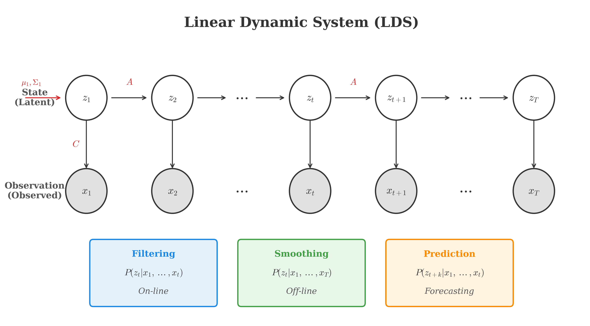
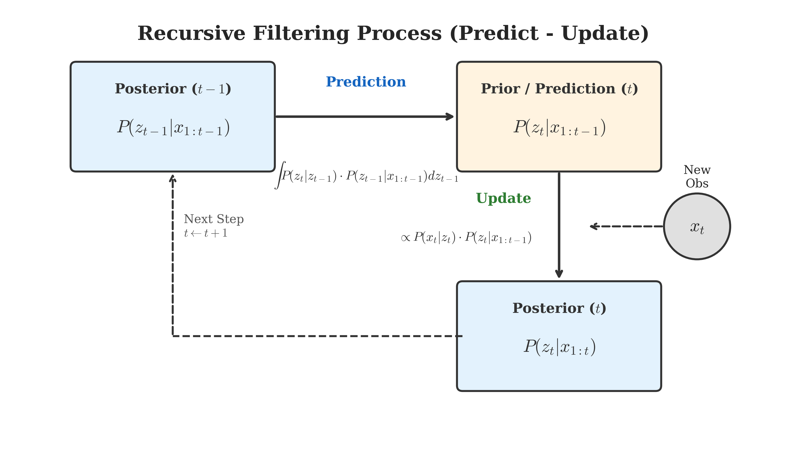

# 线性动态系统 (Linear Dynamic System)

在之前的章节中，我们介绍了隐马尔可夫模型 (Hidden Markov Model, HMM)。HMM 是最基础的动态模型 (Dynamic Model) 或状态空间模型 (State Space Model)。本章我们将探讨另一种重要的动态模型——线性动态系统 (Linear Dynamic System, LDS)，在信号处理和控制领域中，它通常被称为**卡尔曼滤波 (Kalman Filter)**。

## 1. 背景 (Background)

### 1.1 动态模型概览 (Overview of Dynamic Models)

动态模型主要描述随时间变化的系统，通常由观测变量 (Observed Variables) $x$ 和隐变量 (Latent/Hidden Variables) $z$ 组成。根据隐变量的状态类型和分布特性，我们可以将常见的动态模型分为以下几类：

1.  **隐马尔可夫模型 (HMM)**:
    *   状态 $z_t$ 是**离散 (Discrete)** 的。
    *   例如：语音识别中的音素序列，或者词性标注中的词性序列。

2.  **线性动态系统 (LDS) / 卡尔曼滤波 (Kalman Filter)**:
    *   状态 $z_t$ 是**连续 (Continuous)** 的。
    *   状态转移和观测发射过程均是**线性 (Linear)** 的。
    *   噪声服从**高斯分布 (Gaussian Distribution)**。
    *   因此，LDS 也被称为 Linear Gaussian Model。

3.  **粒子滤波 (Particle Filter)**:
    *   状态 $z_t$ 是连续的。
    *   模型是**非线性 (Non-Linear)** 的，且噪声可以是**非高斯 (Non-Gaussian)** 的。
    *   粒子滤波是一种基于蒙特卡洛采样的数值近似方法。

### 1.2 LDS 的定义 (Definition of LDS)

LDS 是一个线性高斯模型，其概率图模型结构与 HMM 相同（如下主要图示），但状态和观测变量均为连续值。

<!-- Generated by scripts/generate_ch15_lds_concept.py -->

我们通常用以下两个方程来描述 LDS。根据白板推导，我们将状态转移和观测方程写在一起：

$$
\begin{cases}
z_t = A \cdot z_{t-1} + B + \epsilon, & \epsilon \sim \mathcal{N}(0, Q) \\
x_t = C \cdot z_t + D + \delta, & \delta \sim \mathcal{N}(0, R)
\end{cases}
$$

其中：
*   $z_t \in \mathbb{R}^p$ 是 $t$ 时刻的隐状态。
*   $x_t \in \mathbb{R}^m$ 是 $t$ 时刻的观测值。
*   $A, C$ 分别是状态转移矩阵和发射矩阵。
*   $B, D$ 是偏置项。
*   $Q, R$ 分别是过程噪声和测量噪声的协方差矩阵。

我们将上述线性方程转化为概率分布的形式，可以得到 LDS 的概率图模型定义：

$$
\left\{
\begin{aligned}
P(z_t | z_{t-1}) &= \mathcal{N}(A \cdot z_{t-1} + B, Q) \\
P(x_t | z_t) &= \mathcal{N}(C \cdot z_t + D, R) \\
P(z_1) &= \mathcal{N}(\mu_1, \Sigma_1)
\end{aligned}
\right.
$$

### 1.3 模型参数 (Model Parameters)

一个线性动态系统完全由以下参数集合 $\theta$ 决定：
$$
\theta = \{ A, B, C, D, Q, R, \mu_1, \Sigma_1 \}
$$

### 1.4 学习与推断 (Learning & Inference)

与 HMM 类似，LDS 主要涉及两个核心问题：

1.  **学习 (Learning)**:
    *   给定观测序列 $X = \{x_1, x_2, \dots, x_T\}$，估计模型参数 $\theta$。
    *   通常使用 EM 算法 (Expectation-Maximization) 进行参数估计。

2.  **推断 (Inference)**:
    *   已知模型参数 $\theta$ 和观测序列 $X$，推断隐状态 $Z$。常见的推断任务包括：
        *   **解码 (Decoding)**: 推断最可能的隐状态序列 $P(z_1, z_2, \dots, z_T | x_1, x_2, \dots, x_T)$。在 LDS 中，由于全是高斯分布，最大后验概率路径与平滑结果（均值）是一致的。
        *   **滤波 (Filtering)**: 在线 (Online) 推断当前时刻的隐状态 $P(z_t | x_1, x_2, \dots, x_t)$。这是卡尔曼滤波最常用的场景（例如：实时位置追踪）。
        *   **平滑 (Smoothing)**: 离线 (Offline) 推断过去时刻的隐状态 $P(z_t | x_1, x_2, \dots, x_T)$，利用了整个序列的信息，通常比滤波更准确。
        *   **预测 (Prediction)**: 推断未来的状态 $P(z_{t+1}, z_{t+2} | x_1, \dots, x_t)$ 或未来的观测值 $P(x_{t+1}, x_{t+2} | x_1, \dots, x_t)$。

## 2. 滤波问题 (Filtering Problem)

### 2.1 目标 (Goal)

滤波问题的目标是计算边缘后验分布 (Marginal Posterior)：
$$
P(z_t | x_1, x_2, \dots, x_t)
$$
即在时刻 $t$，根据所有历史观测数据 $x_{1:t}$，推断当前时刻隐状态 $z_t$ 的分布。
由于 LDS 是线性高斯模型，这个后验分布也是高斯的，因此只要在该时刻求出均值和方差即可。

> **注意 (Note)**: 在滤波问题中，我们假设模型参数 $\theta = (A, B, C, D, Q, R, \mu_1, \Sigma_1)$ 是**已知且固定 (Known and Fixed)** 的。如果参数未知需要从数据中学习，这属于**学习 (Learning)** 问题（通常使用 EM 算法），而非滤波问题。

### 2.2 递推求解 (Recursive Solution)

为了实现**在线 (Online)** 学习，我们希望通过递推的方式求解，即利用 $t-1$ 时刻的结果 $P(z_{t-1} | x_{1:t-1})$ 来计算 $t$ 时刻的结果 $P(z_t | x_{1:t})$。
这可以分解为两个步骤：**预测 (Prediction)** 和 **更新 (Update)**。

#### 步骤 1: 预测 (Prediction)
根据 $t-1$ 时刻的后验分布，预测 $t$ 时刻的状态分布。
目标：求 $P(z_t | x_{1:t-1})$。

$$
\begin{aligned}
P(z_t | x_{1:t-1}) &= \int P(z_t, z_{t-1} | x_{1:t-1}) dz_{t-1} \\
&= \int P(z_t | z_{t-1}, x_{1:t-1}) \cdot P(z_{t-1} | x_{1:t-1}) dz_{t-1} \\
&= \int \underbrace{P(z_t | z_{t-1})}_{\text{Transition}} \cdot \underbrace{P(z_{t-1} | x_{1:t-1})}_{\text{Previous Posterior}} dz_{t-1}
\end{aligned}
$$
这里利用了齐次马尔可夫假设：$P(z_t | z_{t-1}, x_{1:t-1}) = P(z_t | z_{t-1})$。

**高斯推导 (Gaussian Derivation):**

假设上一时刻的后验分布为高斯分布：
$$
P(z_{t-1} | x_{1:t-1}) = \mathcal{N}(z_{t-1} | \mu_{t-1}, \Sigma_{t-1})
$$
状态转移概率为：
$$
P(z_t | z_{t-1}) = \mathcal{N}(z_t | A z_{t-1} + B, Q)
$$

我们需要计算上述积分：
$$
P(z_t | x_{1:t-1}) = \int \mathcal{N}(z_t | A z_{t-1} + B, Q) \cdot \mathcal{N}(z_{t-1} | \mu_{t-1}, \Sigma_{t-1}) dz_{t-1}
$$

根据线性高斯模型的性质（或者高斯分布的卷积性质），结果仍然是一个高斯分布 $ \mathcal{N}(\mu_t^*, \Sigma_t^*) $。
参数计算如下：
$$
\left\{
\begin{aligned}
\mu_t^* &= A \mu_{t-1} + B \\
\Sigma_t^* &= A \Sigma_{t-1} A^T + Q
\end{aligned}
\right.
$$
这里 $\mu_t^*$ 和 $\Sigma_t^*$ 表示**预测 (Prior)** 的均值和方差。

#### 步骤 2: 更新 (Update)
结合 $t$ 时刻的新观测值 $x_t$，修正预测分布，得到 $t$ 时刻的后验分布。
目标：求 $P(z_t | x_{1:t})$。

利用贝叶斯公式：
$$
\begin{aligned}
P(z_t | x_{1:t}) &= P(z_t | x_{1:t-1}, x_t) \\
&\propto P(x_t, z_t | x_{1:t-1}) \\
&= P(x_t | z_t, x_{1:t-1}) \cdot P(z_t | x_{1:t-1}) \\
&= \underbrace{P(x_t | z_t)}_{\text{Emission}} \cdot \underbrace{P(z_t | x_{1:t-1})}_{\text{Prediction}}
\end{aligned}
$$
这里利用了观测独立性假设：$P(x_t | z_t, x_{1:t-1}) = P(x_t | z_t)$。

**2.1 高斯推导 (信息形式) | Gaussian Derivation (Information Form):**

我们需要计算两个高斯分布的乘积：
$$
P(z_t | x_{1:t}) \propto \mathcal{N}(x_t | C z_t + D, R) \cdot \mathcal{N}(z_t | \mu_t^*, \Sigma_t^*)
$$

这是一个典型的**高斯条件分布 (Gaussian Conditioning)** 问题。已知：
$$
P(x) = \mathcal{N}(x | \mu, \Lambda^{-1}), \quad P(y|x) = \mathcal{N}(y | Ax+b, L^{-1})
$$
则后验 $P(x|y)$ 为：
$$
P(x|y) = \mathcal{N}(x | \Sigma (A^T L (y-b) + \Lambda \mu), \Sigma)
$$
其中 $\Sigma = (\Lambda + A^T L A)^{-1}$。

将我们的 LDS 变量代入上述公式：
*   $x \to z_t$, $y \to x_t$, $\mu \to \mu_t^*$, $\Lambda \to (\Sigma_t^*)^{-1}$, $A \to C$, $b \to D$, $L \to R^{-1}$

我们可以得到更新后的均值 $\mu_t$ 和方差 $\Sigma_t$ 的**信息形式 (Information Form)**：
$$
\begin{cases}
\Sigma_t = ((\Sigma_t^*)^{-1} + C^T R^{-1} C)^{-1} \\
\mu_t = \Sigma_t [ C^T R^{-1} (x_t - D) + (\Sigma_t^*)^{-1} \mu_t^* ]
\end{cases}
$$

**2.2 推导标准形式 (卡尔曼增益) | Deriving Standard Form (Kalman Gain):**

虽然信息形式在数学上正确，但在实际计算中求逆运算量较大。我们利用**伍德伯里矩阵恒等式 (Woodbury Matrix Identity)** 将其转化为高效的**卡尔曼增益形式**。

Woodbury 恒等式：$(A + UCV)^{-1} = A^{-1} - A^{-1}U(C^{-1} + VA^{-1}U)^{-1}VA^{-1}$。
令 $A = (\Sigma_t^*)^{-1}, U = C^T, C = R^{-1}, V = C$，代入 $\Sigma_t$ 公式：

1.  **方差更新**:
    $$
    \begin{aligned}
    \Sigma_t &= \Sigma_t^* - \Sigma_t^* C^T (R + C \Sigma_t^* C^T)^{-1} C \Sigma_t^*
    \end{aligned}
    $$
    定义**卡尔曼增益 (Kalman Gain)** $K_t$:
    $$
    K_t = \Sigma_t^* C^T (C \Sigma_t^* C^T + R)^{-1}
    $$
    则方差更新简化为：
    $$
    \Sigma_t = (I - K_t C) \Sigma_t^*
    $$

2.  **均值更新**:
    将 $\Sigma_t$ 代入均值公式：
    $$
    \begin{aligned}
    \mu_t &= \Sigma_t C^T R^{-1} (x_t - D) + \Sigma_t (\Sigma_t^*)^{-1} \mu_t^* \\
    &= K_t (x_t - D) + (I - K_t C) \Sigma_t^* (\Sigma_t^*)^{-1} \mu_t^* \quad (\text{利用性质 } \Sigma_t C^T R^{-1} = K_t) \\
    &= K_t (x_t - D) + (I - K_t C) \mu_t^* \\
    &= \mu_t^* + K_t (x_t - C \mu_t^* - D)
    \end{aligned}
    $$

#### 总结: 卡尔曼滤波方程 (Summary: Kalman Filter Equations)

通过上述推导，我们得到了标准的卡尔曼滤波五个核心方程：

**预测 (Prediction) 阶段：**
1.  **预测状态均值**: $\mu_t^* = A \mu_{t-1} + B$
2.  **预测状态协方差**: $\Sigma_t^* = A \Sigma_{t-1} A^T + Q$

**更新 (Update) 阶段：**
3.  **计算卡尔曼增益**: $K_t = \Sigma_t^* C^T (C \Sigma_t^* C^T + R)^{-1}$
4.  **更新状态均值**: $\mu_t = \mu_t^* + K_t (x_t - C \mu_t^* - D)$
5.  **更新状态协方差**: $\Sigma_t = (I - K_t C) \Sigma_t^*$
### 2.3 在线过程 (Online Process)

这就构成了一个**预测——更新 (Prediction-Update)** 的循环过程，如下图所示：

<!-- Generated by scripts/generate_ch15_filtering_cycle.py -->

1.  **初始状态**: $t=1$
    *   $P(z_1 | x_1) \propto P(x_1 | z_1) P(z_1)$ (Update)
2.  **递推**: $t=2$
    *   $P(z_2 | x_1) = \int P(z_2 | z_1) P(z_1 | x_1) dz_1$ (**Prediction**)
    *   $P(z_2 | x_1, x_2) \propto P(x_2 | z_2) P(z_2 | x_1)$ (**Update / Correction**)
3.  ...

如此不断循环，即可实现在线滤波。

