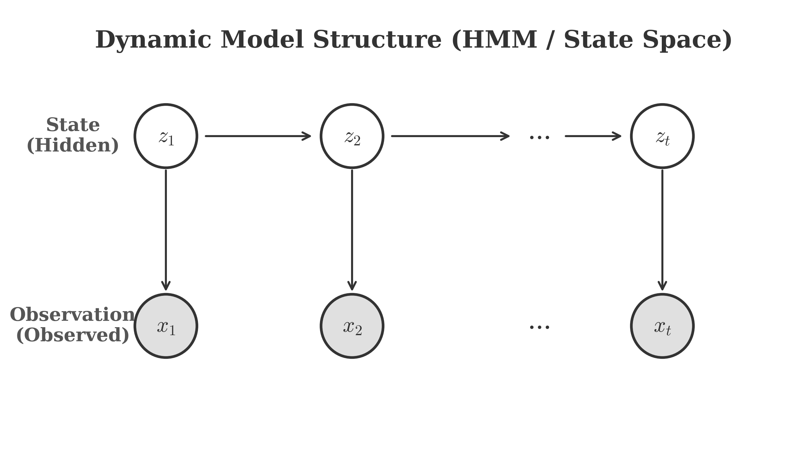
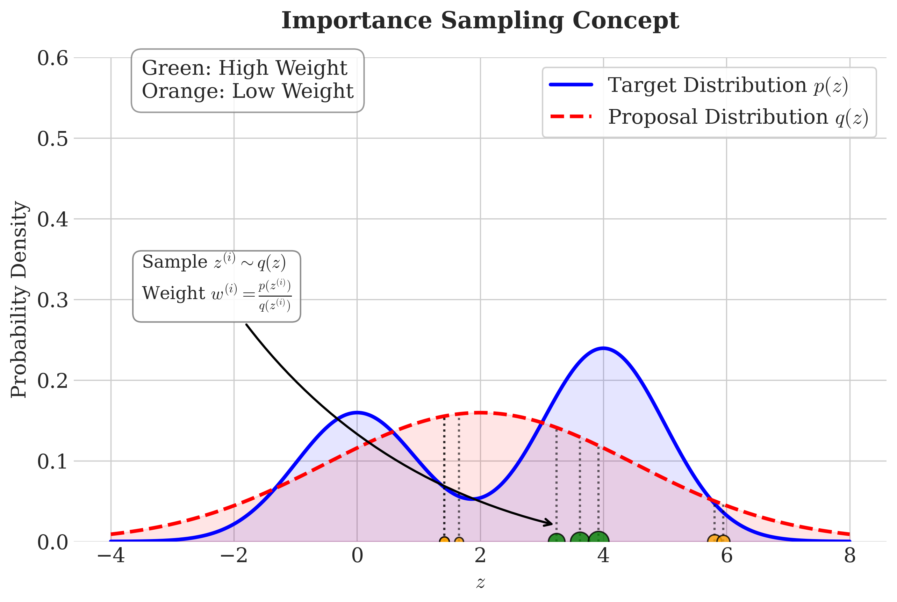
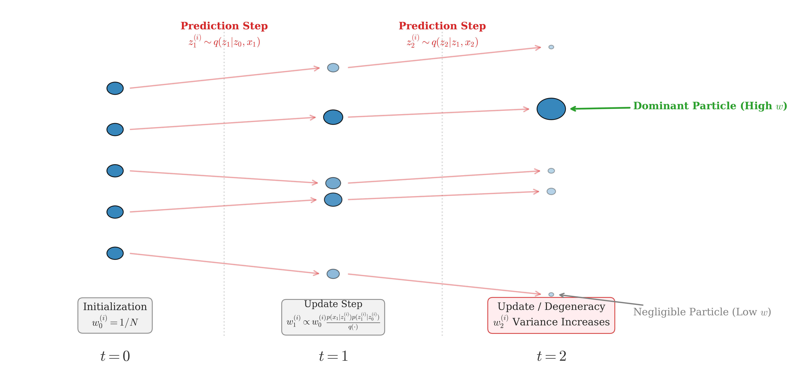
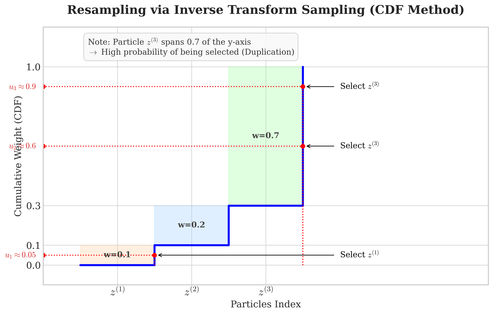

# 粒子滤波 (Particle Filter)

## 1. 简介 (Introduction)

粒子滤波（Particle Filter）是一种非参数化的贝叶斯滤波算法，主要用于解决非线性、非高斯系统的状态估计问题。在介绍粒子滤波之前，我们需要先了解动态模型（Dynamic Model）的基本概念。

### 1.1 动态模型 (Dynamic Models)

动态模型通常由两个序列组成：
1.  **状态序列 (State Sequence)**：$Z = \{z_1, z_2, \dots, z_t\}$，通常是不可观测的涵盖变量（Latent Variables）。
2.  **观测序列 (Observation Sequence)**：$X = \{x_1, x_2, \dots, x_t\}$，是我们实际观测到的数据。

这两个序列之间的关系可以用图模型（Graph Model）来表示，类似于隐马尔可夫模型（HMM）：

<!-- Generated by scripts/generate_ch16_hmm.py -->

该模型基于两个核心假设：
1.  **齐次马尔可夫假设 (Homogeneous Markov Assumption)**：当前状态 $z_t$ 只依赖于前一时刻的状态 $z_{t-1}$：
    $$
    P(z_t | z_{1:t-1}) = P(z_t | z_{t-1})
    $$
2.  **观测独立假设 (Observation Independence Assumption)**：当前观测 $x_t$ 只依赖于当前状态 $z_t$：
    $$
    P(x_t | z_{1:t}, x_{1:t-1}) = P(x_t | z_t)
    $$

系统的演化方程可以表示为：
$$
\begin{cases}
z_t = g(z_{t-1}, u, \varepsilon) \quad \text{(状态转移方程)} \\
x_t = h(z_t, u, \delta) \quad \text{(观测方程)}
\end{cases}
$$
其中 $u$ 是控制输入，$\varepsilon$ 和 $\delta$ 是噪声。

### 1.2 模型分类

根据函数 $g, h$ 的线性性质以及噪声 $\varepsilon, \delta$ 的分布特性，我们可以将动态模型分为以下几类：

1.  **线性高斯模型 (Linear Gaussian Model)**：
    -   $g, h$ 均为线性函数。
    -   $\varepsilon, \delta$ 服从高斯分布。
    -   **解决方法**：卡尔曼滤波 (Kalman Filter, KF)。

2.  **非线性非高斯模型 (Non-linear Non-Gaussian Model)**：
    -   $g, h$ 为非线性函数，或噪声服从非高斯分布。
    -   **解决方法**：扩展卡尔曼滤波 (EKF, 线性化近似)，粒子滤波 (Particle Filter, 蒙特卡洛采样)。

## 2. 滤波问题 (The Filtering Problem)

在动态模型中，核心问题之一是**滤波 (Filtering)**，即在给定截止到 $t$ 时刻的观测数据 $x_{1:t}$ 的条件下，估计当前状态 $z_t$ 的后验概率分布 $P(z_t | x_{1:t})$。
这个分布也被称为**滤波分布 (Filtering Distribution)**。

我们的目标是推导出 $P(z_t | x_{1:t})$ 的递推公式，即如何从上一时刻的后验 $P(z_{t-1} | x_{1:t-1})$ 更新得到当前的后验 $P(z_t | x_{1:t})$。这个过程通常分为两步：**预测 (Prediction)** 和 **更新 (Update)**。

### 2.1 预测 (Prediction)

预测步骤是在获得 $t$ 时刻的观测 $x_t$ 之前，根据 $t-1$ 时刻的信息推测 $t$ 时刻的状态分布 $P(z_t | x_{1:t-1})$。

利用全概率公式和马尔可夫假设：
$$
\begin{aligned}
P(z_t | x_{1:t-1}) &= \int P(z_t, z_{t-1} | x_{1:t-1}) \, dz_{t-1} \\
&= \int P(z_t | z_{t-1}, x_{1:t-1}) \cdot P(z_{t-1} | x_{1:t-1}) \, dz_{t-1} \\
&= \int \underbrace{P(z_t | z_{t-1})}_{\text{State Transition}} \cdot \underbrace{P(z_{t-1} | x_{1:t-1})}_{\text{Previous Posterior}} \, dz_{t-1}
\end{aligned}
$$

### 2.2 更新 (Update)

更新步骤是在获得新的观测 $x_t$ 后，修正对 $z_t$ 的估计，得到 $P(z_t | x_{1:t})$。

利用贝叶斯公式：
$$
\begin{aligned}
P(z_t | x_{1:t}) &= P(z_t | x_1, \dots, x_t) \\
&= \frac{P(x_1, \dots, x_t, z_t)}{P(x_1, \dots, x_t)} \\
&= \frac{P(x_t | x_{1:t-1}, z_t) \cdot P(x_{1:t-1}, z_t)}{P(x_{1:t})} \\
&= \frac{P(x_t | z_t) \cdot P(z_t | x_{1:t-1}) \cdot P(x_{1:t-1})}{P(x_t | x_{1:t-1}) \cdot P(x_{1:t-1})} \\
&= \frac{P(x_t | z_t) \cdot P(z_t | x_{1:t-1})}{P(x_t | x_{1:t-1})}
\end{aligned}
$$
其中分母 $P(x_t | x_{1:t-1})$ 是归一化常数（通常写为 $C$）：
$$
P(x_t | x_{1:t-1}) = \int P(x_t | z_t) \cdot P(z_t | x_{1:t-1}) \, dz_t
$$

因此，更新公式可以简化为：
$$
P(z_t | x_{1:t}) \propto \underbrace{P(x_t | z_t)}_{\text{Likelihood}} \cdot \underbrace{P(z_t | x_{1:t-1})}_{\text{Prior (Prediction)}}
$$

### 小结

滤波过程是一个由“预测”和“更新”构成的递归过程：
1.  **Prediction**: $P(z_{t-1} | x_{1:t-1}) \xrightarrow{\text{Transition}} P(z_t | x_{1:t-1})$
2.  **Update**: $P(z_t | x_{1:t-1}) \xrightarrow{\text{Observation } x_t} P(z_t | x_{1:t})$

对于线性高斯模型（Kalman Filter），上述积分和乘积有解析解。但对于非线性非高斯模型，积分通常无法直接计算，这就是粒子滤波发挥作用的地方。

## 3. 序列重要性采样 (Sequential Importance Sampling, SIS)

粒子滤波的核心思想是源于蒙特卡洛方法（Monte Carlo Method），即通过采样来近似积分。

### 3.1 蒙特卡洛方法 (Monte Carlo Method)

假设我们要计算某个函数 $f(z)$ 在分布 $p(z)$ 下的期望：
$$
E_{z \sim p(z)}[f(z)] = \int f(z) p(z) \, dz
$$
如果我们能从分布 $p(z)$ 中抽取 $N$ 个样本 $\{z^{(1)}, z^{(2)}, \dots, z^{(N)}\}$，那么根据大数定理，我们可以用样本均值来近似期望：
$$
E[f(z)] \approx \frac{1}{N} \sum_{i=1}^{N} f(z^{(i)}), \quad z^{(i)} \sim p(z)
$$
在粒子滤波中，我们的目标分布是后验概率 $P(z_t | x_{1:t})$。然而，通常情况下这个后验分布非常复杂，无法直接从中采样。

### 3.2 重要性采样 (Importance Sampling, IS)

为了解决无法直接采样的问题，我们引入一个容易采样的**建议分布 (Proposal Distribution)**，记为 $q(z)$。
利用如下恒等变换：
$$
E[f(z)] = \int f(z) p(z) \, dz = \int f(z) \frac{p(z)}{q(z)} q(z) \, dz = E_{z \sim q(z)} \left[ f(z) \frac{p(z)}{q(z)} \right]
$$
这意味着我们可以从 $q(z)$ 中采样 $\{z^{(1)}, \dots, z^{(N)}\}$，然后对每个样本赋予一个**权重 (Weight)**：
$$
w^{(i)} = \frac{p(z^{(i)})}{q(z^{(i)})}
$$
这样，原始期望可以近似为：
$$
E[f(z)] \approx \frac{1}{N} \sum_{i=1}^{N} f(z^{(i)}) w^{(i)}
$$
如果分布 $p(z)$ 只是已知到一个归一化常数（即 $p(z) = \frac{\tilde{p}(z)}{Z_p}$），我们需要使用归一化的重要性权重：
$$
\tilde{w}^{(i)} = \frac{p(z^{(i)})}{q(z^{(i)})}, \quad w^{(i)} = \frac{\tilde{w}^{(i)}}{\sum_{j=1}^N \tilde{w}^{(j)}}
$$
此时：
$$
E[f(z)] \approx \sum_{i=1}^{N} f(z^{(i)}) w^{(i)}
$$

<!-- Generated by scripts/generate_ch16_importance_sampling.py -->

### 3.3 SIS 算法 (Sequential Importance Sampling)

将重要性采样应用于序列数据（即滤波问题），我们的目标是由 $P(z_{1:t} | x_{1:t})$ 进行采样。
令 $z_{1:t}^{(i)}$ 表示第 $i$ 个粒子的轨迹。
这时候，根据重要性采样（Importance Sampling）的原理，权重 $w_t^{(i)}$ 定义为**目标分布**与**建议分布**的比值。
在 SIS 中，**目标分布**是后验分布 $p(z_{1:t} | x_{1:t})$，**建议分布**是 $q(z_{1:t} | x_{1:t})$。
因此：
$$
w_t^{(i)} = \frac{\text{Target Distribution}}{\text{Proposal Distribution}} = \frac{p(z_{1:t}^{(i)} | x_{1:t})}{q(z_{1:t}^{(i)} | x_{1:t})}
$$
我们需要找到一种递推的方式来计算权重 $w_t^{(i)}$。

假设建议分布 $q$ 可以分解为：
$$
q(z_{1:t} | x_{1:t}) = q(z_t | z_{1:t-1}, x_{1:t}) \cdot q(z_{1:t-1} | x_{1:t-1})
$$
这意味着我们可以在时刻 $t$ 基于之前的轨迹 $z_{1:t-1}$ 和观测 $x_{1:t}$ 来采样新的状态 $z_t$。

$$
\begin{aligned}
p(z_{1:t} | x_{1:t}) &= \frac{p(z_{1:t}, x_{1:t})}{p(x_{1:t})} \\
&\propto p(z_{1:t}, x_{1:t}) \\
&= p(x_t | z_{1:t}, x_{1:t-1}) \cdot p(z_{1:t}, x_{1:t-1}) \\
&= p(x_t | z_t) \cdot p(z_{1:t}, x_{1:t-1}) \quad (\text{Observation Independence}) \\
&= p(x_t | z_t) \cdot p(z_t | z_{1:t-1}, x_{1:t-1}) \cdot p(z_{1:t-1}, x_{1:t-1}) \quad (\text{Chain Rule}) \\
&= p(x_t | z_t) \cdot p(z_t | z_{t-1}) \cdot p(z_{1:t-1}, x_{1:t-1}) \quad (\text{Markov Property}) \\
&\propto p(x_t | z_t) \cdot p(z_t | z_{t-1}) \cdot p(z_{1:t-1} | x_{1:t-1})
\end{aligned}
$$
其中我们利用了：
1.  **观测独立假设**: $p(x_t | z_{1:t}, x_{1:t-1}) = p(x_t | z_t)$
2.  **齐次马尔可夫假设**: $p(z_t | z_{1:t-1}, x_{1:t-1}) = p(z_t | z_{t-1})$

代入权重的定义：
$$
\begin{aligned}
w_t^{(i)} &\propto \frac{p(z_{1:t}^{(i)} | x_{1:t})}{q(z_{1:t}^{(i)} | x_{1:t})} \\
&\propto \frac{p(x_t | z_t^{(i)}) p(z_t^{(i)} | z_{t-1}^{(i)}) p(z_{1:t-1}^{(i)} | x_{1:t-1})}{q(z_t^{(i)} | z_{1:t-1}^{(i)}, x_{1:t}) q(z_{1:t-1}^{(i)} | x_{1:t-1})} \\
&= \underbrace{\frac{p(z_{1:t-1}^{(i)} | x_{1:t-1})}{q(z_{1:t-1}^{(i)} | x_{1:t-1})}}_{w_{t-1}^{(i)}} \cdot \frac{p(x_t | z_t^{(i)}) p(z_t^{(i)} | z_{t-1}^{(i)})}{q(z_t^{(i)} | z_{1:t-1}^{(i)}, x_{1:t})}
\end{aligned}
$$
所以，我们得到了权重的递推公式：
$$
w_t^{(i)} \propto w_{t-1}^{(i)} \cdot \frac{p(x_t | z_t^{(i)}) p(z_t^{(i)} | z_{t-1}^{(i)})}{q(z_t^{(i)} | z_{1:t-1}^{(i)}, x_{1:t})}
$$
这就是 **SIS (Sequential Importance Sampling)** 的核心公式。

SIS 算法流程 (SIS Algorithm)：

**前提 (Precondition)**：
$t-1$ 时刻采样已完成，即 $\{z_{1:t-1}^{(i)}, w_{t-1}^{(i)}\}_{i=1}^N$ 已知。

**$t$ 时刻 (Current Step $t$)**：
For $i = 1, \dots, N$:
1.  **采样 (Sampling)**：
    $$
    z_t^{(i)} \sim q(z_t | z_{1:t-1}^{(i)}, x_{1:t})
    $$
2.  **权重更新 (Weight Update)**：
    $$
    w_t^{(i)} \propto w_{t-1}^{(i)} \cdot \frac{p(x_t | z_t^{(i)}) \cdot p(z_t^{(i)} | z_{t-1}^{(i)})}{q(z_t^{(i)} | z_{1:t-1}^{(i)}, x_{1:t})}
    $$
End For

**归一化 (Normalization)**：
$$
\sum_{i=1}^N w_t^{(i)} = 1
$$

<!-- Generated by scripts/generate_ch16_sis_algorithm.py -->

## 4. 序列重要性重采样 (Sequential Importance Resampling, SIR)

### 4.1 权值退化 (Weight Degeneracy)

正如 3.3 节末尾提到的，SIS 算法存在一个严重的问题：**权值退化**。
随着时间的推移，权重的方差会增大。经过几次迭代后，绝大多数粒子的权重会变得极其微小，只有极少数粒子拥有较大的权重。
这意味着我们花费了大量的计算资源在那些对后验分布贡献几乎为零的粒子上，导致**有效样本数 (Effective Sample Size, ESS)** 急剧下降。

为了解决这个问题，我们需要引入**重采样 (Resampling)** 步骤。

### 4.2 重采样 (Resampling)

**核心思想**：
对于权重较小的粒子，我们将它们丢弃；对于权重较大的粒子，我们将其复制多份。
重采样后，所有粒子的权重被重置为 $1/N$。

**实现方法 (CDF Method)**：
我们可以利用权重的**累积分布函数 (CDF)** 来进行重采样（也称为逆变换采样 Inverse Transform Sampling）。
1.  构建权重的 CDF。
2.  产生 $N$ 个均匀分布的随机数 $u^{(j)} \sim U(0, 1)$。
3.  根据 $u^{(j)}$ 在 CDF 上的位置，选择对应的粒子。

<!-- Generated by scripts/generate_ch16_resampling.py -->

如图所示，权重较大的粒子 $z^{(3)}$ 占据了 CDF 较大的区间，因此更有可能被多次选中（复制）；而权重较小的粒子则会被淘汰。

### 4.3 SIR 算法 (SIR Algorithm)

SIR 滤波器（也称为 **Bootstrap Filter**）是 SIS 算法加上重采样步骤的特例。
**SIR 算法流程** (SIR Filter: Sampling-Importance-Resampling)：

**前提 (Precondition)**：
$t-1$ 时刻采样已完成，即权重 $\{w_{t-1}^{(i)}\}$ 已知 (通常为 $1/N$)。

**$t$ 时刻 (Current Step $t$)**：

**1. 采样 (Sampling)**：
选择建议分布 (Proposal Distribution) 为状态转移分布：
$$
q(z_t | z_{1:t-1}, x_{1:t}) = p(z_t | z_{t-1})
$$

For $i = 1, \dots, N$:
-   从建议分布中采样：
    $$
    z_t^{(i)} \sim p(z_t | z_{t-1}^{(i)})
    $$
-   计算权重 (Weight Update)：
    $$
    w_t^{(i)} = \frac{p(x_t | z_t^{(i)}) \cdot p(z_t^{(i)} | z_{t-1}^{(i)})}{q(z_t^{(i)} | z_{1:t}, x_{1:t})} \cdot w_{t-1}^{(i)}
    $$
    由于 $q(z_t | \cdot) = p(z_t | z_{t-1})$，分子分母消去 $p(z_t | z_{t-1})$，得到：
    $$
    w_t^{(i)} = p(x_t | z_t^{(i)}) \cdot w_{t-1}^{(i)}
    $$
End For

**2. 归一化 (Normalized)**：
$$
w_t^{(i)} \rightarrow \hat{w}_t^{(i)}, \quad \sum_{i=1}^N \hat{w}_t^{(i)} = 1
$$

**3. 重采样 (Resampling)**：
根据归一化权重 $\{\hat{w}_t^{(i)}\}$ 重采样，得到新的粒子集合。重采样后，权重重置为：
$$
\hat{w}_t^{(i)} = \frac{1}{N}
$$