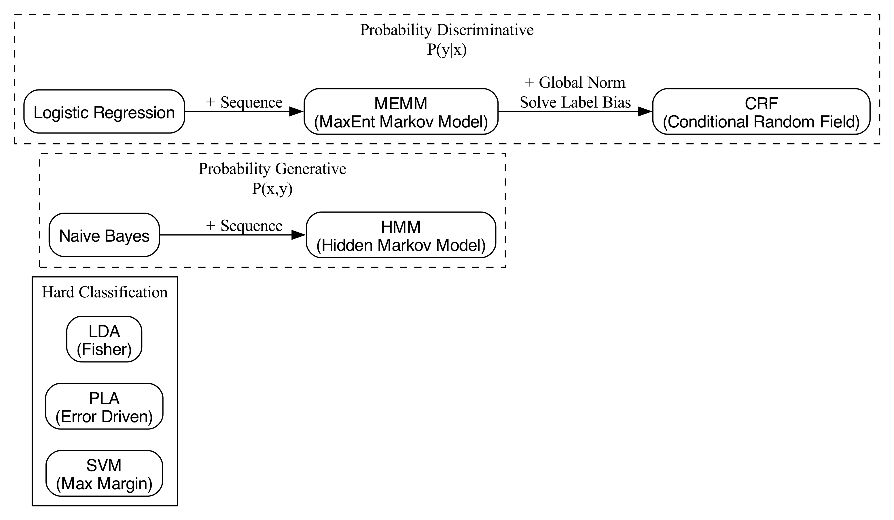
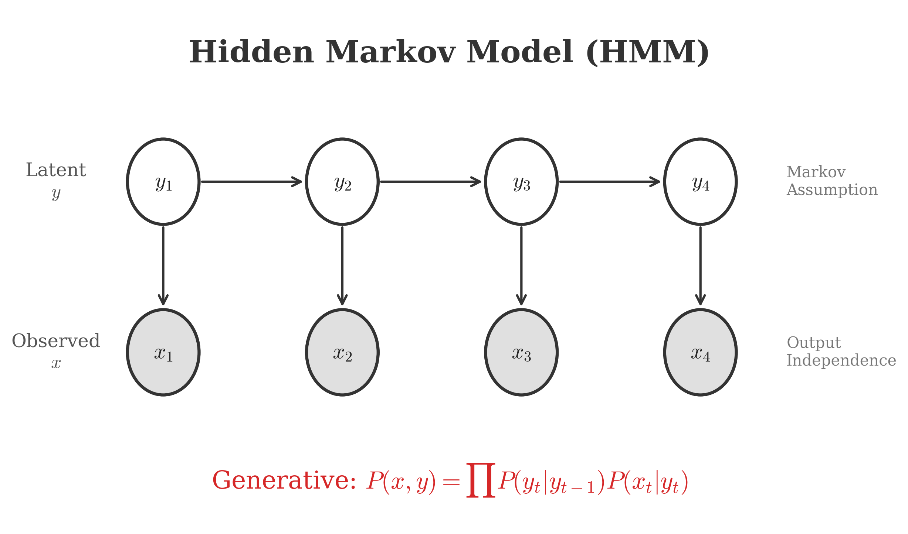
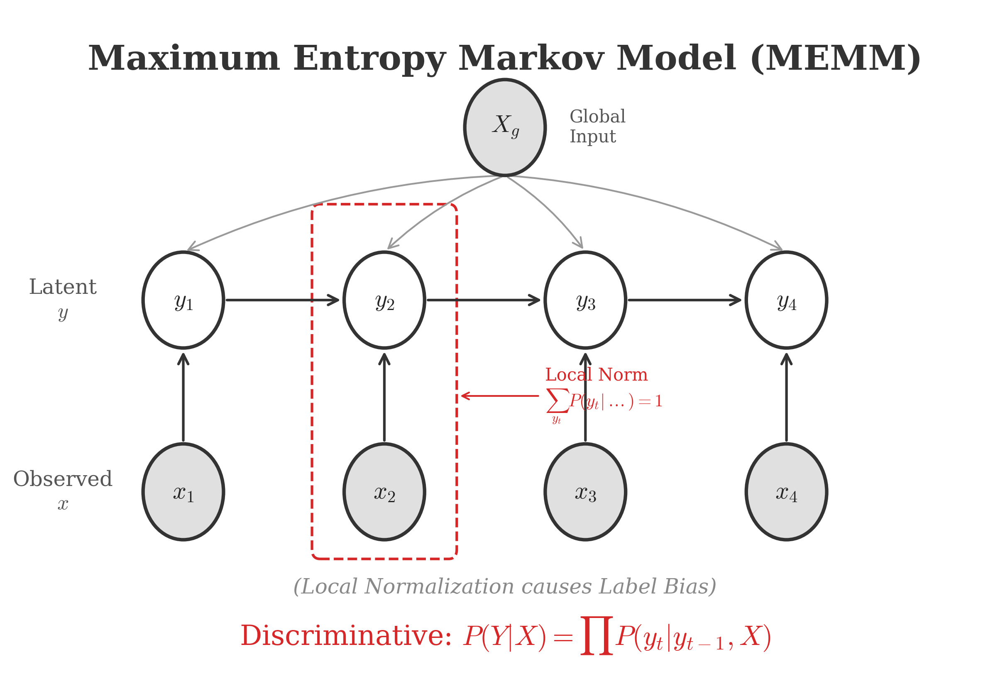
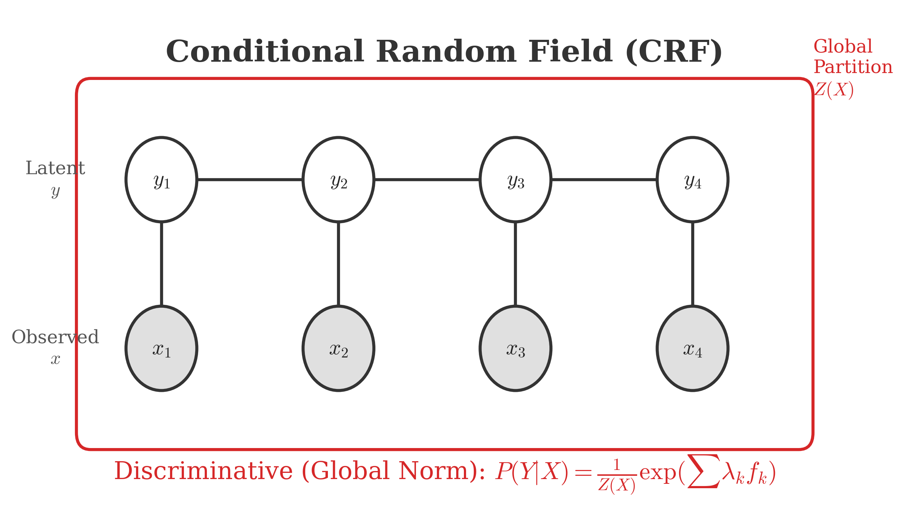

# 条件随机场 (Conditional Random Field)

## 1. 背景 (Background)

Conditional Random Field (CRF) 是一种鉴别式概率模型 (Discriminative Probability Model)，常用于序列标注任务 (Sequence Labeling)，如词性标注 (POS Tagging)、命名实体识别 (NER) 等。

为了理解 CRF 的位置，我们需要回顾一下分类模型 (Classification) 的体系。

### 1.1 硬分类 vs 软分类 (Hard vs Soft Classification)

分类模型可以从输出结果的性质分为两大类：

1.  **硬分类 (Hard Classification)**: 直接输出类别 $y \in \{+1, -1\}$ 或 $y \in \{C_1, \dots, C_k\}$。
    *   代表模型：
        *   **SVM (Support Vector Machine)**: 最大化几何间隔 (Geometric Margin)。
        *   **PLA (Perceptron Learning Algorithm)**: 误分类驱动 (Error Driven)。
        *   **LDA (Linear Discriminant Analysis)**: 类间大，类内小 (Fisher Criterion)。

2.  **软分类 (Soft Classification)**: 输出属于某类的概率 $P(y|x)$，通常在 $[0, 1]$ 之间。
    *   软分类模型又可以进一步分为：
        *   **概率生成模型 (Probability Generative Model)**: 对联合概率 $P(x, y)$ 建模，然后通过贝叶斯公式求 $P(y|x)$。
        *   **概率判别模型 (Probability Discriminative Model)**: 直接对条件概率 $P(y|x)$ 建模。

### 1.2 模型演变图谱 (Model Evolution Map)

CRF 的发展可以看作是概率模型在序列数据上的延伸和改进。

#### 概率生成模型路径 (Generative Path):
*   **Naive Bayes (朴素贝叶斯)**: 假设特征之间相互独立 ($x_i \perp x_j | y$)。
    $$
    P(y|x) \propto P(y) \prod_{i=1}^{d} P(x_i|y)
    $$
*   **HMM (Hidden Markov Model, 隐马尔可夫模型)**: Naive Bayes 在时序上的扩展（加入马尔可夫假设）。
    $$
    P(x, y) = \prod_{t=1}^{T} P(y_t|y_{t-1}) P(x_t|y_t)
    $$
    *   HMM 同样做了很强的独立性假设：观测独立假设 (Output Independence) 和 齐次马尔可夫假设 (Homogeneous Markov Assumption)。

#### 概率判别模型路径 (Discriminative Path):
*   **Logistic Regression (逻辑回归)**: 最大熵原理 (Maximum Entropy) 的一种特例。直接建模 $P(y|x)$。
*   **MEMM (Maximum Entropy Markov Model, 最大熵马尔可夫模型)**: 将 Logistic Regression / MaxEnt 扩展到序列数据。
    $$
    P(y|x) = \prod_{t=1}^{T} P(y_t | y_{t-1}, x_t)
    $$
    *   MEMM 打破了 HMM 的观测独立假设，允许当前状态依赖于观测序列的任意部分（通常是 Local Input）。
    *   **缺点**: Label Bias Problem (标记偏置问题)。由于它是局部归一化 (Local Normalization)，即 $\sum_{y_t} P(y_t|y_{t-1}, x_t) = 1$，导致模型倾向于选择转移状态较少的状态。

*   **CRF (Conditional Random Field)**: 为了解决 Label Bias Problem，CRF 引入了 **全局归一化 (Global Normalization)**。
    $$
    P(Y|X) = \frac{1}{Z} \exp \left( \sum_{t=1}^{T} \sum_{k} \lambda_k f_k(y_{t-1}, y_t, X, t) \right)
    $$
    *   它不再是对每个时刻及其状态进行归一化，而是对整个序列的所有可能路径进行归一化。

### 演变总结 (Summary of Evolution)

1.  **HMM**: Generative, $P(X, Y)$, 两个强假设。
2.  **MEMM**: Discriminative, $P(Y|X)$, 打破观测独立假设，但引入 Label Bias。
3.  **CRF**: Discriminative, $P(Y|X)$, 全局归一化，解决 Label Bias，更加合理。

<!-- Generated by scripts/generate_ch17_model_map.py -->

## 2. HMM vs MEMM vs CRF

为了更深入理解 CRF 的优势，我们详细对比这三个模型。

### 2.1 HMM (Hidden Markov Model)

HMM 是典型的生成模型，对联合概率 $P(X, Y)$ 建模。
图模型结构如下：

<!-- Generated by scripts/generate_ch17_hmm.py -->

HMM 包含两个关键假设：
1.  **齐次马尔可夫假设 (Homogeneous Markov Assumption)**: $P(y_t | y_{1:t-1}) = P(y_t | y_{t-1})$。即当前状态只依赖于前一个状态。
2.  **观测独立假设 (Output Independence Assumption)**: $P(x_t | y_t, \dots) = P(x_t | y_t)$。即当前观测只依赖于当前状态。

这两个假设简化了计算，但也限制了模型的表达能力。特别是观测独立假设，使得 HMM 难以利用上下文的特征（例如，词性标注中，当前词的词性可能依赖于前一个词本身，而不仅仅是前一个词的词性）。

### 2.2 MEMM (Maximum Entropy Markov Model)

MEMM 试图打破 HMM 的观测独立假设。它直接对后验概率 $P(Y|X)$ 建模（判别模型）。
图模型中，除了每个时刻的局部观测 $x_t$，通常还引入全局观测 $X$ (Global Input) 来辅助判断。

MEMM 在时刻 $t$ 的概率是局部归一化的：
$$
P(y_t | y_{t-1}, x_t) = \frac{1}{Z(y_{t-1}, x_t)} \exp\left(\sum_k \lambda_k f_k(y_t, y_{t-1}, X)\right)
$$
*   **优点**: 打破了 HMM 的观测独立假设。特征函数 $f_k$ 可以依赖于整个观测序列 $X$ (例如 $x_{1:T}$)，而不仅是当前时刻的 $x_t$。

**标记偏置问题 (Label Bias Problem)**:
由于 MEMM 进行的是**局部归一化** (Local Normalization)，即对于每一个给定的 $y_{t-1}$，$\sum_{y_t} P(y_t|y_{t-1}, x_t) = 1$。
这会导致一种现象：如果某个状态 $y_{t-1}$ 只有一个后续状态（或者很少），那么无论观测值 $x_t$ (或 $X$) 是什么，转移到该后续状态的概率都会接近 1。模型会倾向于选择那些“出度”较小的路径，而忽略了观测数据 $x$ 的实际影响。

> *形象理解*: 局部归一化就像是在每个路口都强迫流量守恒。如果一条路只有一个出口，所有流量必须走这里，完全不管路边的路牌（观测值）指引去哪里。

<!-- Generated by scripts/generate_ch17_memm.py -->

### 2.3 CRF (Conditional Random Field)

CRF 解决了 Label Bias 问题，方法是**全局归一化 (Global Normalization)**。

CRF 也是判别模型，建模 $P(Y|X)$。但它不是在每个时刻 $t$ 归一化，而是计算整个序列 $Y=(y_1, \dots, y_T)$ 的得分 (Score)，然后除以全局配分函数 $Z(X)$。

$$
P(Y|X) = \frac{1}{Z(X)} \exp(\text{Score}(Y, X))
$$
$$
\text{Score}(Y, X) = \sum_{t=1}^T \sum_k \lambda_k f_k(y_{t-1}, y_t, X, t)
$$

*   **打破观察独立性**: 特征函数 $f_k$ 可以依赖于整个观测序列 $X$。

*   **解决 Label Bias**: 归一化因子 $Z(X)$ 是对所有可能的路径 $Y'$ 求和。路径的选择是在全局范围内竞争，而不是局部路口竞争。

<!-- Generated by scripts/generate_ch17_crf.py -->

## 3. Probability Density Function (PDF)

CRF 是基于 **无向图模型 (Undirected Graphical Model)** 也称为 **马尔可夫随机场 (Markov Random Field, MRF)** 构建的。

### 3.1 MRF 因子分解 (Factorization)

根据 Hammersley-Clifford 定理，无向图模型的联合概率分布可以表示为图中最大团 (Maximal Clique) 上的势函数 (Potential Function) 的乘积。

对于给定观测序列 $X$，状态序列 $Y$ 的条件概率 $P(Y|X)$ 定义为：
$$
P(Y|X) = \frac{1}{Z(X)} \prod_{C \in \mathcal{C}} \psi_C(Y_C, X)
$$
*   $\mathcal{C}$: 所有的最大团。
*   $Y_C$: 团 $C$ 对应的随机变量集合。
*   $\psi_C(Y_C, X)$: 势函数，必须为正值，通常取指数形式 $\exp(-E(Y_C, X))$。
*   $Z(X)$: 规范化因子 (Partition Function)，确保概率和为 1。

### 3.2 线性链 CRF (Linear Chain CRF)

在序列标注任务中，我们通常使用 **线性链 CRF**。
*   图结构: $y_1 - y_2 - \dots - y_T$。
*   最大团: 相邻的两个状态节点 $(y_{t-1}, y_t)$。

因此，概率分布可以写成：
$$
P(Y|X) = \frac{1}{Z(X)} \prod_{t=1}^T \psi_t(y_{t-1}, y_t, X)
$$
引入指数模型 (Log-Linear Model)，我们将势函数定义为特征函数的线性组合：
$$
\psi_t(y_{t-1}, y_t, X) = \exp\left( \sum_{k=1}^K \lambda_k f_k(y_{t-1}, y_t, X, t) \right)
$$
*   $f_k(y_{t-1}, y_t, X, t)$: **特征函数 (Feature Function)**。
*   $\lambda_k$: 特征对应的权重参数。

### 3.3 参数化形式 (Parametric Form)

为了更清晰地表示，我们将特征函数分为两类：
1.  **转移特征 (Transition Features)**: $f_k(y_{t-1}, y_t, x_{1:T})$，权重为 $\lambda_k$，共 $K$ 个。
2.  **状态特征 (State Features)**: $g_l(y_t, x_{1:T})$，权重为 $\eta_l$，共 $L$ 个。

于是，条件概率可以写为：
$$
P(Y|X) = \frac{1}{Z(X)} \exp \sum_{t=1}^T \left[ \sum_{k=1}^K \lambda_k f_k(y_{t-1}, y_t, x_{1:T}) + \sum_{l=1}^L \eta_l g_l(y_t, x_{1:T}) \right]
$$

我们将参数和特征进行向量化 (Vectorization)：

*   **参数向量 $\theta$**:
    $$
    \lambda = \begin{pmatrix} \lambda_1 \\ \vdots \\ \lambda_K \end{pmatrix}, \quad
    \eta = \begin{pmatrix} \eta_1 \\ \vdots \\ \eta_L \end{pmatrix}
    \quad \Rightarrow \quad
    \theta = \begin{pmatrix} \lambda \\ \eta \end{pmatrix} \in \mathbb{R}^{K+L}
    $$

*   **特征向量 $H$**:
    首先定义时刻 $t$ 的局部特征向量：
    $$
    f = \begin{pmatrix} f_1 \\ \vdots \\ f_K \end{pmatrix}, \quad
    g = \begin{pmatrix} g_1 \\ \vdots \\ g_L \end{pmatrix}
    $$
    然后定义全局特征向量 (Global Feature Vector) $H(y, x)$，这是所有时刻局部特征的累加和：
    $$
    H(Y, X) = \begin{pmatrix} \sum_{t=1}^T f(y_{t-1}, y_t, x) \\ \sum_{t=1}^T g(y_t, x) \end{pmatrix}
    $$

最终，CRF 的概率密度函数可以写成简洁的内积形式：
$$
P(Y=y | X=x) = \frac{1}{Z(x, \theta)} \exp \langle \theta, H(y, x) \rangle
$$
其中 $Z(x, \theta) = \sum_{y} \exp \langle \theta, H(y, x) \rangle$。

## 4. 模型需要解决的问题 (Problems to Solve)

给定训练数据集 $\{(x^{(i)}, y^{(i)})\}_{i=1}^N$，CRF 模型主要涉及以下三个关键问题：

### 4.1 学习 (Learning / Parameter Estimation)

**目标**: 估计参数 $\hat{\theta}$，使得训练数据的对数似然函数最大化。
$$
\hat{\theta} = \arg\max_{\theta} \prod_{i=1}^N P(y^{(i)} | x^{(i)})
$$

CRF 的对数似然函数 $L(\theta)$ 为：
$$
\begin{aligned}
L(\theta) &= \sum_{i=1}^N \log P(y^{(i)} | x^{(i)}) \\
&= \sum_{i=1}^N \left( \langle \theta, H(y^{(i)}, x^{(i)}) \rangle - \log Z(x^{(i)}, \theta) \right)
\end{aligned}
$$
通常会加入正则化项 (Regularization) 来防止过拟合：
$$
\hat{\theta} = \arg\max_{\theta} \left( L(\theta) - \frac{\lambda}{2} \|\theta\|^2 \right)
$$
由于 $L(\theta)$ 是关于 $\theta$ 的凹函数 (Concave Function)，可以通过由梯度上升法 (Gradient Ascent) 或 拟牛顿法 (L-BFGS) 进行求解。

**具体梯度推导**:

CRF 的对数似然函数关于参数 $\lambda_k$ 的梯度为：
$$
\begin{aligned}
\frac{\partial L}{\partial \lambda_k} &= \sum_{i=1}^N \sum_{t=1}^T f_k(y_{t-1}^{(i)}, y_t^{(i)}, x^{(i)}) - \sum_{i=1}^N E_{P(y|x^{(i)})}\left[ \sum_{t=1}^T f_k(y_{t-1}, y_t, x^{(i)}) \right] \\
&= \sum_{i=1}^N \sum_{t=1}^T f_k(y_{t-1}^{(i)}, y_t^{(i)}, x^{(i)}) - \sum_{i=1}^N \sum_{t=1}^T \sum_{y_{t-1}, y_t} P(y_{t-1}, y_t | x^{(i)}) f_k(y_{t-1}, y_t, x^{(i)})
\end{aligned}
$$

*   第一部分: **Empirical Count** (数据中实际出现的特征次数)。
*   第二部分: **Expected Count** (当前模型预测的特征期望次数)。
    *   其中 $P(y_{t-1}, y_t | x^{(i)})$ 是边缘概率，可以通过 **Forward-Backward 算法** 计算得到 (即 Section 4.2 中的内容)。

同理，关于状态特征参数 $\eta_l$ 的梯度为：
$$
\frac{\partial L}{\partial \eta_l} = \sum_{i=1}^N \sum_{t=1}^T g_l(y_t^{(i)}, x^{(i)}) - \sum_{i=1}^N \sum_{t=1}^T \sum_{y_t} P(y_t | x^{(i)}) g_l(y_t, x^{(i)})
$$

**参数更新 (Gradient Ascent)**:

重复以下步骤直至收敛：
1.  计算梯度 $\nabla_\lambda L$ 和 $\nabla_\eta L$。
2.  更新参数：
    $$
    \lambda^{(t+1)} = \lambda^{(t)} + \eta_{step} \cdot \nabla_\lambda L
    $$
    $$
    \eta^{(t+1)} = \eta^{(t)} + \eta_{step} \cdot \nabla_\eta L
    $$
    (其中 $\eta_{step}$ 为学习率)。

### 4.2 推断 (Inference)

推断问题主要包含两个方面：

#### 1. 边缘概率计算 (Marginal Probability)

目标是计算给定观测 $x$ 下，时刻 $t$ 处于状态 $y_t=i$ 的概率：
$$
P(y_t=i | x) = \sum_{y_{<t}, y_{>t}} P(y | x) = \frac{1}{Z(x)} \sum_{y_{<t}, y_{>t}} \prod_{t'=1}^T \psi_{t'}(y_{t'-1}, y_{t'}, x)
$$
直接求和计算量巨大 ($O(m^T)$)，我们可以利用 **前向-后向算法 (Forward-Backward Algorithm)** 高效计算。

定义 **前向变量 $\alpha_t(i)$**:
表示从序列开始到时刻 $t$，状态为 $i$ 的所有路径的非规范化概率之和。
$$
\alpha_t(i) = \sum_{y_{<t}} \psi_t(y_{t-1}, y_t=i, x) \prod_{t'=1}^{t-1} \psi_{t'}(y_{t'-1}, y_{t'}, x)
$$
**递推公式**:
$$
\alpha_t(i) = \sum_{j \in S} \psi_t(y_{t-1}=j, y_t=i, x) \alpha_{t-1}(j)
$$
定义 **后向变量 $\beta_t(i)$**:
表示从时刻 $t$ 状态 $i$ 出发，到序列结束的所有路径的非规范化概率之和。
**递推公式**:
$$
\beta_t(i) = \sum_{j \in S} \psi_{t+1}(y_t=i, y_{t+1}=j, x) \beta_{t+1}(j)
$$

于是，边缘概率可以表示为：
$$
P(y_t=i | x) = \frac{1}{Z(x)} \alpha_t(i) \beta_t(i)
$$
其中配分函数 $Z(x) = \sum_{i \in S} \alpha_T(i)$。

#### 2. MAP 推断 / 解码 (MAP Inference / Decoding)
也就是我们要找到最可能的标签序列 $\hat{y}$：
$$
\hat{y} = \arg\max_{y} P(y | x) = \arg\max_{y} \frac{1}{Z(x, \theta)} \exp \langle \theta, H(y, x) \rangle
$$
等价于找到得分最高的路径：
$$
\hat{y} = \arg\max_{y} \langle \theta, H(y, x) \rangle
$$
*   这可以通过 **Viterbi 算法** 高效求解。
*   Viterbi 算法是一种动态规划算法，用于寻找图中的最短/长路径。
