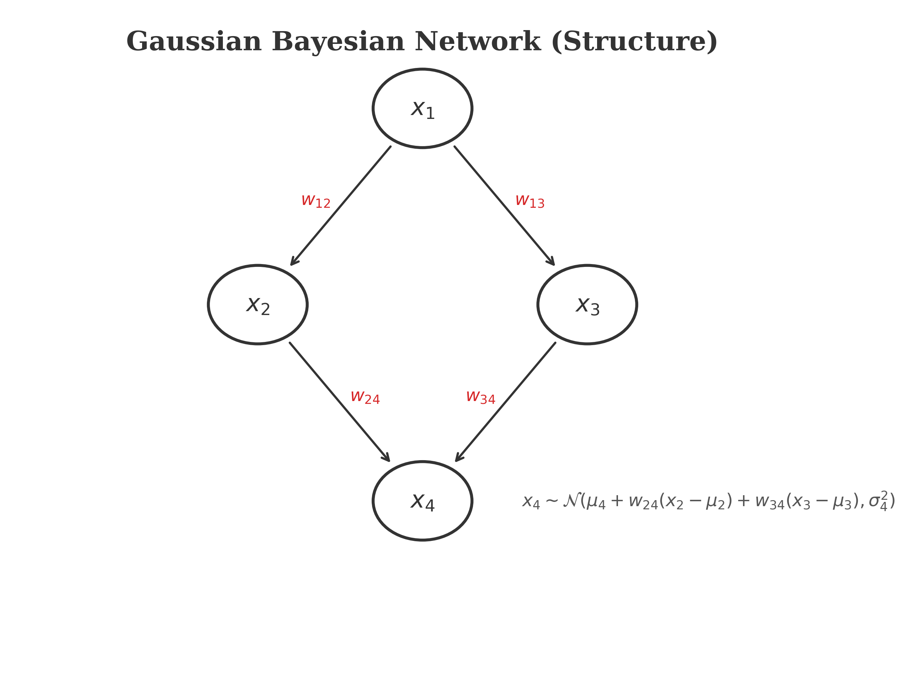
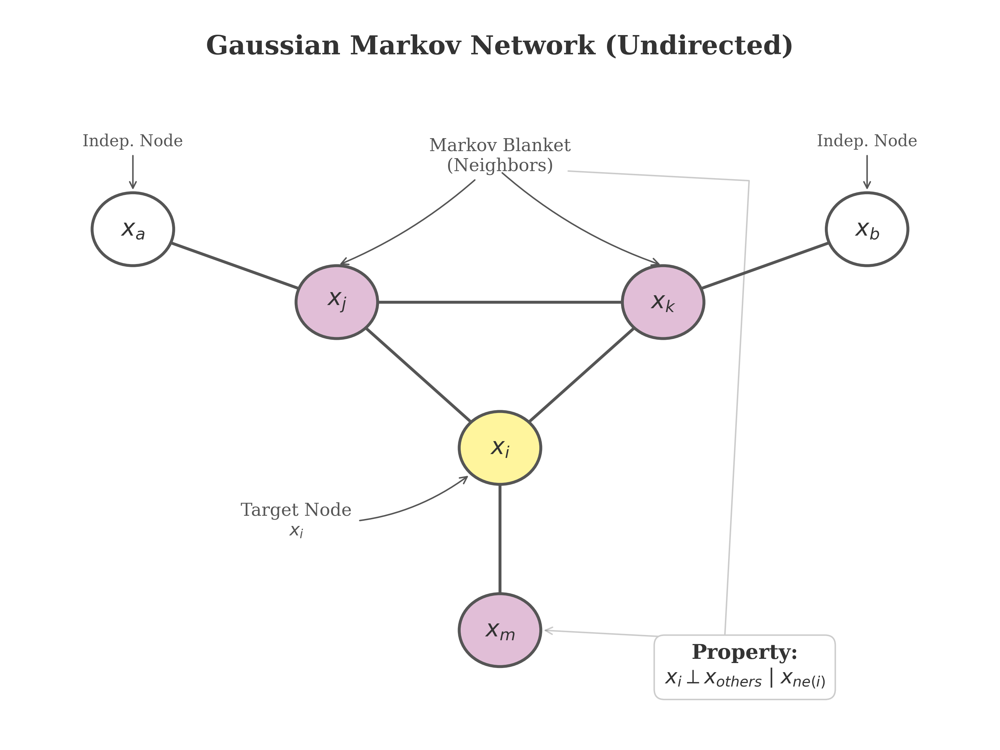

# 高斯网络 (Gaussian Network)

本章我们将介绍高斯网络（Gaussian Network），也称为高斯图模型（Gaussian Graphical Model, GGM）。它是概率图模型中针对连续变量的一种重要形式。

## 1. 简介 (Introduction)

### 多元高斯分布 (Multivariate Gaussian Distribution)

首先回顾一下多元高斯分布（Multivariate Gaussian Distribution）。
假设随机变量 $x$ 是一个 $p$ 维向量：
$$
x = (x_1, x_2, \dots, x_p)^T
$$
如果 $x$ 服从多元高斯分布，记作 $x \sim \mathcal{N}(\mu, \Sigma)$，其概率密度函数（PDF）为：
$$
P(x) = \frac{1}{(2\pi)^{p/2}|\Sigma|^{1/2}} \exp\left\{ -\frac{1}{2}(x-\mu)^T \Sigma^{-1} (x-\mu) \right\}
$$
其中：
- $\mu$ 是均值向量（Mean Vector）。
- $\Sigma$ 是协方差矩阵（Covariance Matrix），大小为 $p \times p$。
- $|\Sigma|$ 是 $\Sigma$ 的行列式。

### 协方差矩阵与边缘独立性 (Covariance Matrix & Marginal Independence)

协方差矩阵 $\Sigma$ 的元素 $\sigma_{ij}$ 定义了变量 $x_i$ 和 $x_j$ 之间的协方差：
$$
\Sigma = (\sigma_{ij})_{p \times p} = \begin{pmatrix}
\sigma_{11} & \sigma_{12} & \cdots & \sigma_{1p} \\
\vdots & \vdots & \ddots & \vdots \\
\sigma_{p1} & \sigma_{p2} & \cdots & \sigma_{pp}
\end{pmatrix}
$$
协方差矩阵的一个重要性质是它与**边缘独立性（Marginal Independence）** 的关系：
如果 $\sigma_{ij} = 0$，则变量 $x_i$ 和 $x_j$ 是相互独立的（Marginally Independent）。
$$
x_i \perp x_j \iff \sigma_{ij} = 0
$$
注意：这里的前提是 $x$ 服从联合高斯分布。

### 精度矩阵与条件独立性 (Precision Matrix & Conditional Independence)

在高斯图模型中，我们更关注的是**条件独立性（Conditional Independence）**。这里引入一个关键的概念：**精度矩阵（Precision Matrix）**，也称为信息矩阵（Information Matrix）。
精度矩阵定义为协方差矩阵的逆矩阵：
$$
\Lambda = \Sigma^{-1} = (\lambda_{ij})_{p \times p} = \begin{pmatrix}
\lambda_{11} & \lambda_{12} & \cdots & \lambda_{1p} \\
\vdots & \vdots & \ddots & \vdots \\
\lambda_{p1} & \lambda_{p2} & \cdots & \lambda_{pp}
\end{pmatrix}
$$

精度矩阵的元素 $\lambda_{ij}$ 直接对应了变量之间的**条件独立性**。
具体来说，给定除了 $x_i$ 和 $x_j$ 之外的所有其他变量 $x_{-\{i,j\}}$，$x_i$ 和 $x_j$ 条件独立，当且仅当精度矩阵中对应的元素 $\lambda_{ij}$ 为 0。
$$
x_i \perp x_j \mid x_{-\{i,j\}} \iff \lambda_{ij} = 0
$$

这个结论是高斯图模型的核心：**图的结构（边的存在与否）是由精度矩阵 $\Lambda$ 的非零元素决定的，而不是协方差矩阵 $\Sigma$。**
- 如果 $\lambda_{ij} = 0$，则在图中节点 $i$ 和节点 $j$ 之间**没有边**。
- 如果 $\lambda_{ij} \neq 0$，则在图中节点 $i$ 和节点 $j$ 之间**有边**。

## 2. 高斯贝叶斯网络 (Gaussian Bayesian Network)

### GBN 定义与因子分解 (Definition & Factorization)

高斯贝叶斯网络（Gaussian Bayesian Network, GBN）可以被看作是连续型的有向图模型（Directed Graphical Model）。
根据贝叶斯网络的因子分解性质，联合概率分布可以表示为：
$$
P(x) = \prod_{i=1}^p P(x_i \mid x_{pa(i)})
$$
其中 $x_{pa(i)}$ 表示节点 $x_i$ 的父节点集合（Parents of $x_i$）。

<!-- Generated by scripts/generate_ch18_gbn_example.py -->

### 局部线性高斯模型 (Local Linear Gaussian Model)

在 GBN 中，我们假设每一个节点 $x_i$ 服从**线性高斯模型**。具体来说，给定父节点 $x_{pa(i)}$，$x_i$ 的条件分布是一个高斯分布，其均值是父节点的线性组合，方差是一个常数。

数学表达如下：
$$
x_i = \mu_i + \sum_{j \in x_{pa(i)}} w_{ij}(x_j - \mu_j) + \sigma_i \epsilon_i
$$
其中：
- $\mu_i$ 是 $x_i$ 的无条件均值。
- $w_{ij}$ 是权重系数（Weight），表示 $x_j$ 对 $x_i$ 的影响强度。如果 $j \notin x_{pa(i)}$，则 $w_{ij} = 0$。
- $\sigma_i^2$ 是条件方差（Conditional Variance）。
- $\epsilon_i \sim \mathcal{N}(0, 1)$ 是独立的标准高斯噪声。

这等价于写成条件概率的形式：
$$
P(x_i \mid x_{pa(i)}) = \mathcal{N}\left( x_i \mid \mu_i + \sum_{j \in x_{pa(i)}} w_{ij}(x_j - \mu_j), \sigma_i^2 \right)
$$

### 全局模型与矩阵形式 (Global Model & Matrix Form)

我们可以将上述的局部模型整合成一个全局的向量/矩阵形式。

定义向量和矩阵：
- $x = (x_1, \dots, x_p)^T$
- $\mu = (\mu_1, \dots, \mu_p)^T$
- $W = (w_{ij})_{p \times p}$，其中 $w_{ij}$ 是权重。如果我们对节点进行拓扑排序，该矩阵可以被写成下三角矩阵（假设 $i < j$ 没有边）。
- $\epsilon = (\epsilon_1, \dots, \epsilon_p)^T \sim \mathcal{N}(0, I)$
- $S = \text{diag}(\sigma_1, \dots, \sigma_p) = \text{diag}(\sigma_i)$ 是对角矩阵。

将局部方程 $x_i - \mu_i = \sum_{j} w_{ij}(x_j - \mu_j) + \sigma_i \epsilon_i$ 写成向量形式：
$$
x - \mu = W(x - \mu) + S \epsilon
$$

我们可以通过移项来解出 $x - \mu$：
$$
(I - W)(x - \mu) = S \epsilon
$$
$$
x - \mu = (I - W)^{-1} S \epsilon
$$

### 协方差矩阵的推导 (Derivation of Covariance Matrix)

利用上述向量形式，我们可以推导出联合分布 $P(x)$ 的协方差矩阵 $\Sigma$。
根据定义 $\Sigma = \text{Cov}(x) = \text{Cov}(x - \mu)$。
代入 $x - \mu = (I - W)^{-1} S \epsilon$：
$$
\begin{aligned}
\Sigma &= \text{Cov}\left( (I - W)^{-1} S \epsilon \right) \\
&= (I - W)^{-1} S \cdot \text{Cov}(\epsilon) \cdot S^T (I - W)^{-T}
\end{aligned}
$$
因为 $\epsilon \sim \mathcal{N}(0, I)$，所以 $\text{Cov}(\epsilon) = I$。
且 $S$ 是对角矩阵，所以 $S = S^T$，即 $S S^T = S^2$。

最终得到：
$$
\Sigma = (I - W)^{-1} S^2 (I - W)^{-T}
$$
这展示了 GBN 的参数（$W, S$）如何决定整个高斯分布的协方差结构 $\Sigma$。

## 3. 高斯马尔可夫网络 (Gaussian Markov Network)

### GMN 定义与势函数 (Definition & Potentials)

高斯马尔可夫网络（Gaussian Markov Network, GMN）是连续型的无向图模型（Undirected Graphical Model）。
根据无向图模型的因子分解性质（Hammersley-Clifford Theorem），其 joint distribution 可以表示为最大团（Maximal Clique）上的势函数（Potential Function）的乘积：
$$
P(x) = \frac{1}{Z} \prod_{C \in \mathcal{C}} \psi_C(x_C)
$$
在高斯分布的特例下，我们可以直接考察多元高斯分布的指数部分，来识别势函数。

### 信息形式 (Information Form) 与精度矩阵

将多元高斯分布的 PDF 写成指数族的形式：
$$
P(x) \propto \exp\left\{ -\frac{1}{2}(x-\mu)^T \Sigma^{-1} (x-\mu) \right\}
$$
令 $\Lambda = \Sigma^{-1}$ 为精度矩阵。展开指数项：
$$
\begin{aligned}
-\frac{1}{2}(x-\mu)^T \Lambda (x-\mu) &= -\frac{1}{2}(x^T \Lambda x - x^T \Lambda \mu - \mu^T \Lambda x + \mu^T \Lambda \mu) \\
&= -\frac{1}{2} x^T \Lambda x + (\Lambda \mu)^T x + \text{const}
\end{aligned}
$$
令 $h = \Lambda \mu$ 为**潜在向量（Potential Vector）**。则高斯分布的**信息形式（Information Form）**为：
$$
P(x) \propto \exp\left\{ -\frac{1}{2} x^T \Lambda x + h^T x \right\}
$$

进一步展开二次型 $x^T \Lambda x = \sum_i \sum_j x_i \lambda_{ij} x_j$：
$$
P(x) \propto \exp\left\{ \sum_{i} (h_i x_i - \frac{1}{2} \lambda_{ii} x_i^2) - \sum_{i \neq j} \frac{1}{2} \lambda_{ij} x_i x_j \right\}
$$

由此我们可以通过参数 $\Lambda$ 和 $h$ 识别出 GMN 的点势函数（Node Potential）和边势函数（Edge Potential）：
- **Node Potential**: $\psi_i(x_i) = \exp(h_i x_i - \frac{1}{2} \lambda_{ii} x_i^2)$
- **Edge Potential**: $\psi_{ij}(x_i, x_j) = \exp(-\lambda_{ij} x_i x_j)$

### 条件分布与马尔可夫毯 (Conditional Distribution & Markov Blanket)

高斯马尔可夫网络的一个核心性质是它的条件独立性直接体现在图结构（精度矩阵）中。

考虑某个节点 $x_i$ 给定所有其他节点 $x_{-i}$ 的条件分布 $P(x_i \mid x_{-i})$。经过推导，该条件分布只依赖于 $x_i$ 的邻居节点（Neighbors, $ne(i)$）。
$$
P(x_i \mid x_{-i}) = P(x_i \mid x_{ne(i)}) = \mathcal{N}\left( x_i \mid \frac{h_i - \sum_{j \neq i} \lambda_{ij} x_j}{\lambda_{ii}}, \frac{1}{\lambda_{ii}} \right)
$$
可以看到，均值部分 $\sum_{j \neq i} \lambda_{ij} x_j$ 中，如果 $\lambda_{ij} = 0$，则 $x_j$ 不影响 $x_i$。
只要 $j \notin ne(i) \iff \lambda_{ij} = 0$，则该项消失。

因此，$x_i$ 在给定其**马尔可夫毯（Markov Blanket，即邻居节点集）**的情况下，独立于图中其他所有节点。
$$
x_i \perp x_{-\{i, ne(i)\}} \mid x_{ne(i)}
$$

<!-- Generated by scripts/generate_ch18_gmn_markov_blanket.py -->

