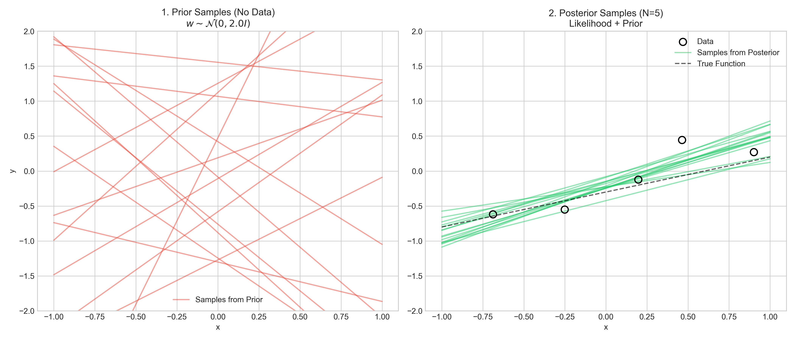
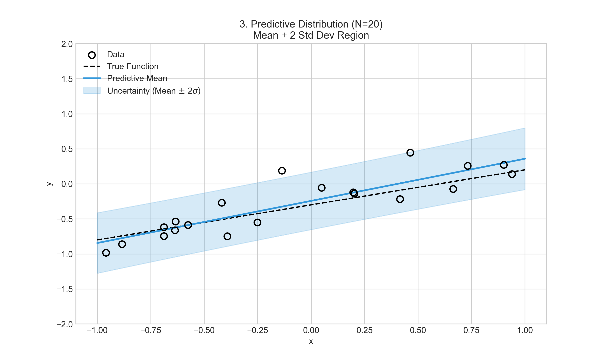

# 第19章 贝叶斯线性回归 (Bayesian Linear Regression)

## 1. 背景 (Background)

在之前的章节中，我们已经学习了**线性回归 (Linear Regression)**。给定数据集 $\mathcal{D} = \{(x_i, y_i)\}_{i=1}^N$，线性回归的模型假设为：

$$
f(x) = w^T x
$$
$$
y = f(x) + \epsilon = w^T x + \epsilon
$$

其中 $\epsilon$ 是噪声。

对于参数 $w$ 的估计，主要有两个流派的观点：**频率派 (Frequentist)** 和 **贝叶斯派 (Bayesian)**。

### 1.1 频率派视角 (Frequentist Perspective)

频率派认为参数 $w$ 是一个**未知的常量 (Unknown Constant)**。我们的目标是根据数据构建一个优化问题，求出 $w$ 的**点估计 (Point Estimation)**。

*   **MLE (Maximum Likelihood Estimation)**:
    如果假设噪声 $\epsilon$ 服从高斯分布 (Gaussian Distribution)，即 $\epsilon \sim \mathcal{N}(0, \sigma^2)$，那么最大似然估计 (MLE) 等价于最小二乘估计 (LSE)。

    $$
    w_{MLE} = \arg\max_w P(Data|w)
    $$

*   **Regularized LSE**:
    为了防止过拟合，我们要加上正则项 (Regularization)。
    *   **Lasso**: L1 正则化
    *   **Ridge**: L2 正则化

### 1.2 贝叶斯视角 (Bayesian Perspective)

贝叶斯派认为参数 $w$ 是一个**随机变量 (Random Variable)**。我们不直接求某一个具体的值，而是求 $w$ 的**概率分布**，即后验概率 $P(w|Data)$。

根据贝叶斯定理 (Bayes' Theorem)：

$$
P(w|Data) = \frac{P(Data|w)P(w)}{P(Data)} \propto P(Data|w) \cdot P(w)
$$

*   **Posterior (后验)**: $P(w|Data)$
*   **Likelihood (似然)**: $P(Data|w)$
*   **Prior (先验)**: $P(w)$

### 1.3 两个流派的联系 (Connection)

贝叶斯派中的 **MAP (Maximum A Posteriori)** 估计旨在找到后验概率最大的 $w$：

$$
w_{MAP} = \arg\max_w P(w|Data) = \arg\max_w P(Data|w) \cdot P(w)
$$

这就建立了与频率派正则化方法的联系：

1.  **Ridge Regression (岭回归)**:
    如果先验 $P(w)$ 服从**高斯分布 (Gaussian Distribution)** $w \sim \mathcal{N}(0, \Sigma_0)$，并且噪声也是高斯的，那么 $w_{MAP}$ 等价于 Ridge Regression。

2.  **Lasso Regression**:
    如果先验 $P(w)$ 服从**拉普拉斯分布 (Laplace Distribution)**，那么 $w_{MAP}$ 等价于 Lasso Regression。

总结来说，**Regularized LSE** 可以看作是 **MAP** 在特定先验假设下的特例。而贝叶斯线性回归不仅关注点估计 (MAP)，更关注完整的后验分布 $P(w|Data)$ 以及基于此的预测分布。

## 2. 数学推导 (Mathematical Formulation & Inference)

我们将问题具体化为数据、模型和推断目标，并推导后验分布。

### 2.1 数据与模型 (Data & Model)

**数据 (Data)**：
假设我们有 $N$ 个观测样本 $\{(x_i, y_i)\}_{i=1}^N$，其中 $x_i \in \mathbb{R}^p$，$y_i \in \mathbb{R}$。
我们可以将其表示为矩阵形式：
*   **输入矩阵 $X$**: $N \times p$ 维，每一行是一个样本。
    $$
    X = (x_1, x_2, \dots, x_N)^T = \begin{pmatrix} x_{11} & \cdots & x_{1p} \\ \vdots & \ddots & \vdots \\ x_{N1} & \cdots & x_{Np} \end{pmatrix}_{N \times p}
    $$
*   **输出向量 $Y$**: $N \times 1$ 维。
    $$
    Y = (y_1, y_2, \dots, y_N)^T_{N \times 1}
    $$

**模型 (Model)**：
假设数据生成过程为：
$$
\begin{cases}
f(x) = w^T x \\
y = f(x) + \epsilon = w^T x + \epsilon \\
\epsilon \sim \mathcal{N}(0, \sigma^2)
\end{cases}
$$
其中 $x, y, \epsilon$ 都是随机变量 (Random Variables)，噪声 $\epsilon$ 服从均值为 0、方差为 $\sigma^2$ 的高斯分布。

### 2.2 贝叶斯推断框架 (Bayesian Inference Framework)

在贝叶斯方法中，我们的核心任务有两个：

1.  **Inference (推断)**: 求参数 $w$ 的后验分布 $P(w|Data)$。
2.  **Prediction (预测)**: 给定新样本 $x^*$，求预测值 $y^*$ 的分布 $P(y^*|x^*, Data)$。

根据贝叶斯定理：
$$
P(w|Data) = P(w|X, Y) = \frac{P(Y|X, w) \cdot P(w)}{P(Y|X)}
$$

其中分母 $P(Y|X) = \int P(Y|X, w) \cdot P(w) dw$ 是与 $w$ 无关的归一化常数，因此我们通常写成：
$$
P(w|Data) \propto P(Y|X, w) \cdot P(w)
$$

### 2.3 似然与先验 (Likelihood & Prior)

**似然函数 (Likelihood)**:
$P(Y|X, w)$ 表示在参数 $w$ 固定的情况下，观测到数据 $Y$ 的概率。由于样本独立同分布 (i.i.d.)：
$$
P(Y|X, w) = \prod_{i=1}^N P(y_i | w, x_i) = \prod_{i=1}^N \mathcal{N}(y_i | w^T x_i, \sigma^2)
$$
这就构成了一个多维高斯分布 $\mathcal{N}(Y | Xw, \sigma^2 I)$。

**先验分布 (Prior)**:
我们要为 $w$ 选择一个先验分布 $P(w)$。为了计算方便，我们选择**共轭先验 (Conjugate Prior)**。
对于高斯似然函数，其共轭先验也是**高斯分布**。

假设 $w$ 服从零均值高斯分布：
$$
P(w) = \mathcal{N}(w | 0, \Sigma_p)
$$
(注：板书中使用 $\Sigma_p$ 表示先验协方差矩阵，通常可以设为 $\tau^2 I$)。

**共轭性 (Conjugacy)**:
由于 **Gaussian $\times$ Gaussian = Gaussian**，所以后验分布 $P(w|Data)$ 必然也是一个高斯分布：
$$
\underbrace{P(w|Data)}_{\mathcal{N}(\mu_w, \Sigma_w)} \propto \underbrace{\mathcal{N}(Y|Xw, \sigma^2 I)}_{Likelihood} \cdot \underbrace{\mathcal{N}(w|0, \Sigma_p)}_{Prior}
$$

### 2.4 后验分布推导 (Posterior Derivation)

我们的目标是计算 $p(w|Y, X)$。
由于 Likelihood 和 Prior 都是高斯分布，根据高斯分布的共轭性质，Posterior 也必然是一个**高斯分布**。我们的任务就是求出这个后验高斯分布的**均值** $\mu_N$ 和 **协方差矩阵** $\Sigma_N$。

#### 2.4.1 展开指数项

首先写出 Likelihood 和 Prior 的表达式（忽略常数项，只保留与 $w$ 有关的指数部分）：

### 2.4 后验分布推导 (Posterior Derivation)

我们的目标是计算 $P(w|Data)$：

$$
P(w|Data) \propto \exp\left\{ -\frac{1}{2\sigma^2} (Y - Xw)^T (Y - Xw) \right\} \cdot \exp\left\{ -\frac{1}{2} w^T \Sigma_p^{-1} w \right\}
$$

**第一步：展开 Likelihood 的指数项**
$$
\begin{aligned}
(Y - Xw)^T (Y - Xw) &= (Y^T - w^T X^T)(Y - Xw) \\
&= Y^T Y - Y^T X w - w^T X^T Y + w^T X^T X w \\
&= Y^T Y - 2 Y^T X w + w^T X^T X w
\end{aligned}
$$
(注意：$Y^T X w$ 是标量，所以等于其转置 $w^T X^T Y$)

**第二步：合并 Likelihood 和 Prior**
忽略与 $w$ 无关的常数项（如 $Y^T Y$），我们将所有含 $w$ 的项合并：
$$
\begin{aligned}
\ln P(w|Data) &\propto -\frac{1}{2\sigma^2} (w^T X^T X w - 2 Y^T X w) - \frac{1}{2} w^T \Sigma_p^{-1} w \\
&= -\frac{1}{2} \left[ \frac{1}{\sigma^2} w^T X^T X w - \frac{2}{\sigma^2} Y^T X w + w^T \Sigma_p^{-1} w \right] \\
&= -\frac{1}{2} \left[ w^T \left( \sigma^{-2} X^T X + \Sigma_p^{-1} \right) w - 2 \sigma^{-2} Y^T X w \right]
\end{aligned}
$$

**第三步：配方 (Completing the Square)**
我们要凑成标准高斯分布的形式 $\mathcal{N}(\mu_w, \Sigma_w)$：
$$
-\frac{1}{2} (w - \mu_w)^T \Sigma_w^{-1} (w - \mu_w) = -\frac{1}{2} (w^T \Sigma_w^{-1} w - 2 \mu_w^T \Sigma_w^{-1} w + \dots)
$$

**对比二次项系数**：
令 $A = \Sigma_w^{-1}$ (精度矩阵 Precision Matrix)，则有：
$$
A = \Sigma_w^{-1} = \sigma^{-2} X^T X + \Sigma_p^{-1}
$$
**对比一次项系数**：
$$
\mu_w^T \Sigma_w^{-1} = \sigma^{-2} Y^T X \implies A \mu_w = \sigma^{-2} X^T Y
$$

由此解得均值 $\mu_w$：
$$
\mu_w = \sigma^{-2} A^{-1} X^T Y
$$

**第四步：最终结果**
后验分布 $P(w|Data) = \mathcal{N}(\mu_w, \Sigma_w)$，其中：
$$
\begin{cases}
\Sigma_w = A^{-1} = (\sigma^{-2} X^T X + \Sigma_p^{-1})^{-1} \\
\mu_w = \sigma^{-2} A^{-1} X^T Y
\end{cases}
$$

> **直观理解**：
> *   $A$ (精度矩阵) 代表了我们对参数估计的信心。它由两部分组成：数据提供的精度 $\sigma^{-2} X^T X$ 和先验提供的精度 $\Sigma_p^{-1}$。
> *   $A \mu_w$ 可以看作是加权和。

<!-- Generated by scripts/generate_ch19_plots.py -->

## 3. 预测分布 (Predictive Distribution)

根据板书内容，我们的目标是：给定新输入 $x^*$，求对应输出 $y^*$ 的概率分布 $P(y^*|Data, x^*)$。

这就涉及两个步骤：
1.  求无噪声函数值 $f(x^*)$ 的分布。
2.  加上观测噪声 $\epsilon$ 得到 $y^*$ 的分布。

### 3.1 步骤一：无噪声预测 (Noise-free Prediction)

首先考虑潜在函数值：
$$
f(x^*) = (x^*)^T w
$$

由于 $w$ 服从后验高斯分布 $w \sim \mathcal{N}(\mu_w, \Sigma_w)$，且 $f(x^*)$ 是 $w$ 的线性变换，因此 $f(x^*)$ 也服从高斯分布：

*   **均值**: $\mathbb{E}[f(x^*)] = \mathbb{E}[(x^*)^T w] = (x^*)^T \mathbb{E}[w] = (x^*)^T \mu_w$
*   **方差**: $\text{Var}[f(x^*)] = \text{Var}[(x^*)^T w] = (x^*)^T \text{Var}[w] x^* = (x^*)^T \Sigma_w x^*$

所以：
$$
P(f(x^*)|Data, x^*) = \mathcal{N}((x^*)^T \mu_w, \quad (x^*)^T \Sigma_w x^*)
$$

### 3.2 步骤二：有噪声预测 (Noisy Observation)

真实的观测值 $y^*$ 包含噪声 $\epsilon$：
$$
y^* = f(x^*) + \epsilon, \quad \epsilon \sim \mathcal{N}(0, \sigma^2)
$$

由于 $f(x^*)$ 和 $\epsilon$ 是独立的两个高斯随机变量，它们的和也是高斯分布。
最终的预测分布 $P(y^*|Data, x^*)$ 也就是在 $f(x^*)$ 的基础上增加了噪声的方差：

*   **均值**: $(x^*)^T \mu_w + 0 = (x^*)^T \mu_w$
*   **方差**: $(x^*)^T \Sigma_w x^* + \sigma^2$

### 3.3 结果总结

$$
P(y^* | Data, x^*) = \mathcal{N}(y^* \mid (x^*)^T \mu_w, \quad \underbrace{(x^*)^T \Sigma_w x^*}_{\text{Epistemic}} + \underbrace{\sigma^2}_{\text{Aleatoric}})
$$

这个方差项由两部分组成（如之前所述）：

1.  **$\sigma^2$ (Aleatoric Uncertainty)**:
    **数据本身的噪声**。这是由于即使我们确切知道真实的 $w$，数据本身也带有噪声 $\epsilon$。这部分不确定性是**无法通过增加数据消除的**。

2.  **$(x^*)^T \Sigma_w x^*$ (Epistemic Uncertainty)**:
    **模型参数的不确定性**。这反映了我们在多大程度上不确定 $w$ 的值。
    *   随着数据量 $N$ 的增加，$\Sigma_w$ 会减小（协方差矩阵变“窄”），这一项也会减小。
    *   在训练数据密集的区域，$x^*$ 附近的这一项会比较小（置信度高）。
    *   在远离训练数据的区域，$x^*$ 会导致这一项变大（预测的不确定性增加）。

> **可视化直觉**：
> 如果我们画出贝叶斯线性回归的预测图，你会看到一条均值曲线，以及周围的置信区间（Confidence Interval）。这个置信区间在数据点附近会收窄，而在没有数据的区域会变宽（像喇叭口一样）。这正是 $(x^*)^T \Sigma_w x^*$ 这一项在起作用。

<!-- Generated by scripts/generate_ch19_plots.py -->
