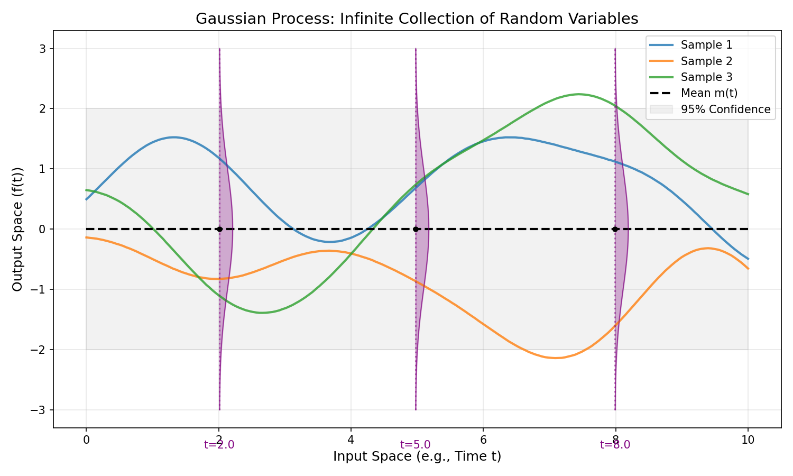

# 高斯过程 (Gaussian Process)

## 1. 背景 (Background)

### 1.1 从高斯分布到高斯过程

我们在之前的章节中已经非常熟悉高斯分布（Gaussian Distribution）。我们可以按照维度的增加来理解高斯过程：

1.  **一维高斯分布 (Univariate Gaussian Distribution)**:
    定义在标量 $x$ 上的分布: $p(x) = \mathcal{N}(\mu, \sigma^2)$。

2.  **多元高斯分布 (Multivariate Gaussian Distribution)**:
    定义在向量 $\mathbf{x} \in \mathbb{R}^p$ 上的分布 ($p < \infty$): $p(\mathbf{x}) = \mathcal{N}(\boldsymbol{\mu}, \boldsymbol{\Sigma})$。
    其中 $\boldsymbol{\mu}$ 是 $p$ 维均值向量，$\boldsymbol{\Sigma}$ 是 $p \times p$ 协方差矩阵。

3.  **无限维高斯分布 (Infinite-dimensional Gaussian Distribution)**:
    如果我们让维度 $p \to \infty$，我们就得到了**高斯过程 (Gaussian Process)**。

简单来说，高斯过程是定义在**连续域**（Continuous Domain，如时间或空间）上的无限多个高维随机变量所组成的随机过程。

### 1.2 定义

**高斯过程 (Gaussian Process)** 定义为随机变量的集合 $\{f(\mathbf{x}) : \mathbf{x} \in \mathcal{X}\}$，其中任意有限个随机变量的线性组合都服从联合高斯分布。

形式化地，对于任意有限个输入点集 $\mathbf{x}_1, \dots, \mathbf{x}_n \in \mathcal{X}$，与之对应的函数值 $f(\mathbf{x}_1), \dots, f(\mathbf{x}_n)$ 的联合分布是一个多元高斯分布。

### 1.3 核心要素

一个高斯过程完全由这就由其**均值函数 (Mean Function)** 和**协方差函数 (Covariance Function)** 确定：

$$
\begin{aligned}
m(\mathbf{x}) &= \mathbb{E}[f(\mathbf{x})] \\
k(\mathbf{x}, \mathbf{x}') &= \mathbb{E}[(f(\mathbf{x}) - m(\mathbf{x}))(f(\mathbf{x}') - m(\mathbf{x}'))]
\end{aligned}
$$

我们可以将其记作：
$$
f(\mathbf{x}) \sim \mathcal{GP}(m(\mathbf{x}), k(\mathbf{x}, \mathbf{x}'))
$$

-   $m(\mathbf{x})$: 描述了函数的中心趋势。
-   $k(\mathbf{x}, \mathbf{x}')$: 描述了不同点 $x$ 和 $x'$ 处函数值的相关性（即函数的平滑程度）。

### 1.4 直观理解

你可以把高斯过程看作是**函数的分布**。就像高斯分布描述随机变量的分布一样，高斯过程描述的是**函数**的分布。当我们从高斯过程中采样时，我们是在采样一个函数曲线。

下图展示了一个高斯过程的几个采样函数（彩色实线）。你可以看到：
-   在这个连续域（时间轴 $t$）上，每一个时刻 $t$ 的取值 $f(t)$ 都是一个随机变量。
-   如果我们切片观察某个时刻（如 $t=2, 5, 8$），该点的边缘分布（Marginal Distribution）就是一个一维高斯分布（紫色曲线所示）。

<!-- Generated by scripts/generate_ch20_gp_intro.py -->

## 2. 高斯过程回归 (Gaussian Process Regression)

### 2.1 权重空间视角 (Weight-space View)

权重空间视角的核心思想是：**由线性模型出发，引入核函数，推导出高斯过程**。

#### 1. 贝叶斯线性回归回顾 (Review of Bayesian Linear Regression)

考虑标准的线性回归模型：
$$
f(\mathbf{x}) = \mathbf{x}^T \mathbf{w}, \quad y = f(\mathbf{x}) + \varepsilon, \quad \varepsilon \sim \mathcal{N}(0, \sigma^2)
$$
我们对权重 $\mathbf{w}$ 引入高斯先验：
$$
\mathbf{w} \sim \mathcal{N}(\boldsymbol{0}, \Sigma_p)
$$

根据贝叶斯公式，我们可以求出 $\mathbf{w}$ 的后验分布 $p(\mathbf{w}|X, \mathbf{y})$：
$$
\begin{aligned}
\mathbf{w} | X, \mathbf{y} &\sim \mathcal{N}(\boldsymbol{\mu}_w, A^{-1}) \\
A &= \sigma^{-2} X^T X + \Sigma_p^{-1} \\
\boldsymbol{\mu}_w &= \sigma^{-2} A^{-1} X^T \mathbf{y}
\end{aligned}
$$

对于新的输入 $\mathbf{x}_*$，其无噪声预测值 $f_* = \mathbf{x}_*^T \mathbf{w}$ 和有噪声预测值 $y_*$ 的分布为：
$$
\begin{aligned}
p(f_* | X, \mathbf{y}, \mathbf{x}_*) &= \mathcal{N}(\mathbf{x}_*^T \boldsymbol{\mu}_w, \mathbf{x}_*^T A^{-1} \mathbf{x}_*) \\
p(y_* | X, \mathbf{y}, \mathbf{x}_*) &= \mathcal{N}(\mathbf{x}_*^T \boldsymbol{\mu}_w, \mathbf{x}_*^T A^{-1} \mathbf{x}_* + \sigma^2)
\end{aligned}
$$

#### 2. 引入非线性映射与核技巧 (Kernel Trick)

为了处理非线性关系，我们将输入 $\mathbf{x}$ 映射到高维特征空间 $\mathbf{z} = \phi(\mathbf{x}) \in \mathbb{R}^q$ ($q \gg p$, 甚至无限)。
此时设计矩阵变为 $\Phi = [\phi(\mathbf{x}_1), \dots, \phi(\mathbf{x}_N)]^T$。模型变为 $f(\mathbf{x}) = \phi(\mathbf{x})^T \mathbf{w}$。

此时后验分布的参数变为：
$$
A = \sigma^{-2} \Phi^T \Phi + \Sigma_p^{-1}
$$
预测分布 $f(\mathbf{x}_*) | X, \mathbf{y}$ 服从高斯分布，其均值和方差包含 $A^{-1}$：
$$
\begin{aligned}
\mathbb{E}[f_*] &= \sigma^{-2} \phi(\mathbf{x}_*)^T A^{-1} \Phi^T \mathbf{y} \\
\text{var}[f_*] &= \phi(\mathbf{x}_*)^T A^{-1} \phi(\mathbf{x}_*)
\end{aligned}
$$

**问题**: 特征空间维度 $q$ 可能很高甚至无限，直接计算 $q \times q$ 矩阵 $A$ 的逆是不可行的。我们需要借助 Woodbury 公式将其转化为 $N \times N$ 的计算。

#### 3. Woodbury 公式推导 (Derivation using Woodbury Formula)

Woodbury 矩阵恒等式为：
$$
(A+UCV)^{-1} = A^{-1} - A^{-1}U(C^{-1} + VA^{-1}U)^{-1}VA^{-1}
$$

我们将 $A = \sigma^{-2} \Phi^T \Phi + \Sigma_p^{-1}$ 中的 $\Sigma_p^{-1}$ 视为恒等式中的 "$A$" (注意符号对应的位置)，$\sigma^{-2} \Phi^T \Phi$ 视为 $UCV$ 部分。或者更直接地，为了求 $A^{-1}=(\Sigma_p^{-1} + \sigma^{-2}\Phi^T I \Phi)^{-1}$：
这里对应 Woodbury 公式中的 $A \leftarrow \Sigma_p^{-1}, U \leftarrow \Phi^T, C \leftarrow \sigma^{-2}I, V \leftarrow \Phi$。

经过推导（或者利用等价变换 $A \Sigma_p = \sigma^{-2}\Phi^T\Phi\Sigma_p + I$），我们可以得到一个关键恒等式：
$$
\sigma^{-2} A^{-1} \Phi^T = \Sigma_p \Phi^T (K + \sigma^2 I)^{-1}
$$
其中定义核矩阵 $K = \Phi \Sigma_p \Phi^T$。

**均值推导**:
$$
\begin{aligned}
\mathbb{E}[f_*] &= \mathbf{\phi}(\mathbf{x}_*)^T (\sigma^{-2} A^{-1} \Phi^T) \mathbf{y} \\
&= \mathbf{\phi}(\mathbf{x}_*)^T \Sigma_p \Phi^T (K + \sigma^2 I)^{-1} \mathbf{y} \\
&= k(\mathbf{x}_*, X) (K + \sigma^2 I)^{-1} \mathbf{y}
\end{aligned}
$$
其中 $k(\mathbf{x}_*, X) = \phi(\mathbf{x}_*)^T \Sigma_p \Phi^T = [k(\mathbf{x}_*, \mathbf{x}_1), \dots, k(\mathbf{x}_*, \mathbf{x}_N)]$。

**方差推导**:
同理，利用 Woodbury 公式展开 $A^{-1}$，可以得到：
$$
\text{var}[f_*] = k(\mathbf{x}_*, \mathbf{x}_*) - k(\mathbf{x}_*, X) (K + \sigma^2 I)^{-1} k(X, \mathbf{x}_*)
$$

**结论**:
通过核函数的定义 $k(\mathbf{x}, \mathbf{x}') = \phi(\mathbf{x})^T \Sigma_p \phi(\mathbf{x}')$ (对应内积 $\langle \psi(\mathbf{x}), \psi(\mathbf{x}') \rangle$)，我们成功消掉了特征空间的具体形式 $\phi(\mathbf{x})$，直接在核空间进行计算。这就得到了与函数空间视角完全一致的结果。

#### 4. 从权重空间到函数空间的桥梁 (The Bridge)

我们在这个视角下关注的是权重 $\mathbf{w}$。但在贝叶斯方法中，我们最终关心的是预测分布。
我们可以对比两种视角的预测推断过程：

-   **权重空间视角 (Weight-space View)**: 关注 $\mathbf{w}$。
    $$
    p(y_* | X, \mathbf{y}, \mathbf{x}_*) = \int p(y_* | \mathbf{w}, \mathbf{x}_*) p(\mathbf{w} | X, \mathbf{y}) d\mathbf{w}
    $$
-   **函数空间视角 (Function-space View)**: 关注 $f$。
    $$
    p(y_* | X, \mathbf{y}, \mathbf{x}_*) = \int p(y_* | f, \mathbf{x}_*) p(f | X, \mathbf{y}) df
    $$

**证明：核贝叶斯线性回归就是一个高斯过程**。
已知 $f(\mathbf{x}) = \phi(\mathbf{x})^T \mathbf{w}$，且 $\mathbf{w} \sim \mathcal{N}(\mathbf{0}, \Sigma_p)$。
1.  **均值**: $\mathbb{E}[f(\mathbf{x})] = \phi(\mathbf{x})^T \mathbb{E}[\mathbf{w}] = 0$。
2.  **协方差**:
    $$
    \begin{aligned}
    \text{cov}(f(\mathbf{x}), f(\mathbf{x}')) &= \mathbb{E}[(f(\mathbf{x}) - 0)(f(\mathbf{x}') - 0)] \\
    &= \mathbb{E}[\phi(\mathbf{x})^T \mathbf{w} \mathbf{w}^T \phi(\mathbf{x}')] \\
    &= \phi(\mathbf{x})^T \mathbb{E}[\mathbf{w} \mathbf{w}^T] \phi(\mathbf{x}') \\
    &= \phi(\mathbf{x})^T \Sigma_p \phi(\mathbf{x}') \\
    &= k(\mathbf{x}, \mathbf{x}')
    \end{aligned}
    $$
3.  **高斯性**: 由于 $f(\mathbf{x})$ 是高斯变量 $\mathbf{w}$ 的线性组合，所以任意有限个 $f(\mathbf{x})$ 的组合都服从联合高斯分布。

因此，**$f(\mathbf{x}) \sim \mathcal{GP}(0, k(\mathbf{x}, \mathbf{x}'))$**。这说明我们在权重空间定义的模型，实际上就是函数空间中的一个高斯过程。

虽然从权重空间出发可以推导出高斯过程，但这种方法受限于 $\phi(\mathbf{x})$ 的具体形式。更自然的方法是直接在函数空间进行推断。

### 2.2 函数空间视角 (Function-space View)

函数空间视角更加直接。既然高斯过程假设所有数据点（无论是训练点还是测试点）的函数值都服从联合高斯分布，我们就可以直接写出这个联合分布。

假设我们有：
-   **训练集 (Training Set)**: 输入 $X = [\mathbf{x}_1, \dots, \mathbf{x}_n]$，观测值 $\mathbf{y} = [y_1, \dots, y_n]^T$。
    -   观测模型包含噪声：$y = f(\mathbf{x}) + \varepsilon, \quad \varepsilon \sim \mathcal{N}(0, \sigma^2)$。
-   **测试集 (Test Set)**: 输入 $X_* = [\mathbf{x}_{*1}, \dots, \mathbf{x}_{*m}]$，我们需要预测其对应的函数值 $\mathbf{f}_*$。

#### 1. 联合分布 (Joint Distribution)

根据高斯过程的定义，我们关注随机变量 $Y$ (观测值) 和 $f(\mathbf{x}_*)$ (待预测的无噪声函数值)。它们的联合分布为：

$$
\left[ \begin{array}{c} Y \\ f(X_*) \end{array} \right]
\sim
\mathcal{N} \left(
\left[ \begin{array}{c} \mu(X) \\ \mu(X_*) \end{array} \right],
\left[ \begin{array}{cc}
K(X, X) + \sigma^2 I & K(X, X_*) \\
K(X_*, X) & K(X_*, X_*)
\end{array} \right]
\right)
$$

这里我们将矩阵分块对应到高斯分布的条件概率公式中：
-   $\mathbf{x}_a \leftarrow Y$
-   $\mathbf{x}_b \leftarrow f(X_*)$
-   $\Sigma_{aa} \leftarrow K(X, X) + \sigma^2 I$
-   $\Sigma_{ab} \leftarrow K(X, X_*)$
-   $\Sigma_{bb} \leftarrow K(X_*, X_*)$

#### 2. 条件分布与预测 (Conditioning & Prediction)

我们的目标是求后验条件概率 $p(f(X_*) | Y, X, X_*)$。

**回顾多元高斯分布的条件概率公式**：
若 $x \sim \mathcal{N}(\mu, \Sigma)$，且
$$
x = \begin{pmatrix} x_a \\ x_b \end{pmatrix}, \quad \mu = \begin{pmatrix} \mu_a \\ \mu_b \end{pmatrix}, \quad \Sigma = \begin{pmatrix} \Sigma_{aa} & \Sigma_{ab} \\ \Sigma_{ba} & \Sigma_{bb} \end{pmatrix}
$$
则 $x_b | x_a \sim \mathcal{N}(\mu_{b|a}, \Sigma_{b|a})$，其中：
$$
\begin{aligned}
\mu_{b|a} &= \Sigma_{ba} \Sigma_{aa}^{-1} (x_a - \mu_a) + \mu_b \\
\Sigma_{b|a} &= \Sigma_{bb} - \Sigma_{ba} \Sigma_{aa}^{-1} \Sigma_{ab}
\end{aligned}
$$

**代入高斯过程回归**:
我们得到**无噪声预测 (Noise-free Prediction)** $f(X_*)$ 的后验分布：
$$
p(f(X_*) | Y, X, X_*) = \mathcal{N}(\mu^*, \Sigma^*)
$$
其中：
$$
\begin{aligned}
\mu^* &= K(X_*, X) [K(X, X) + \sigma^2 I]^{-1} (Y - \mu(X)) + \mu(X_*) \\
\Sigma^* &= K(X_*, X_*) - K(X_*, X) [K(X, X) + \sigma^2 I]^{-1} K(X, X_*)
\end{aligned}
$$
通常假设先验均值 $\mu(X) = 0$，公式可简化。

#### 3. 有噪声预测 (Noisy Prediction)

如果我们预测的是**有噪声的观测值** $y^* = f(X_*) + \varepsilon$，即 $p(y^* | Y, X, X_*)$。
由于 $\varepsilon \sim \mathcal{N}(0, \sigma^2)$ 是独立噪声，预测分布的均值不变，但方差需要加上噪声方差：

$$
p(y^* | Y, X, X_*) = \mathcal{N}(\mu_y^*, \Sigma_y^*)
$$
其中：
$$
\begin{aligned}
\mu_y^* &= \mu^* \\
\Sigma_y^* &= \Sigma^* + \sigma^2 I
\end{aligned}
$$

这便是高斯过程回归在函数空间视角的完整推导。我们通过联合高斯分布，利用条件概率公式，直接得到了预测值的解析解。

