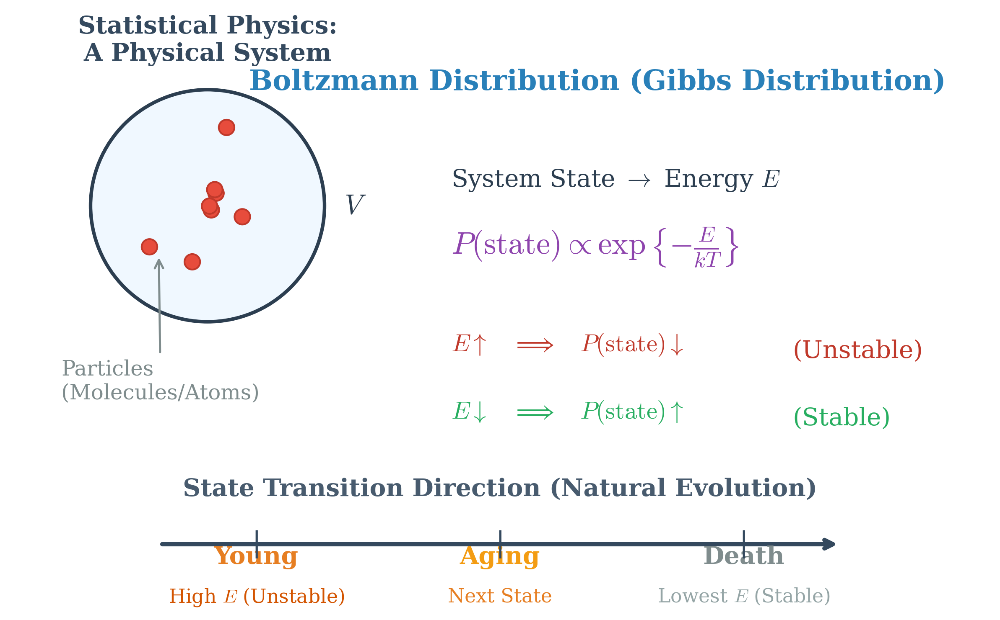
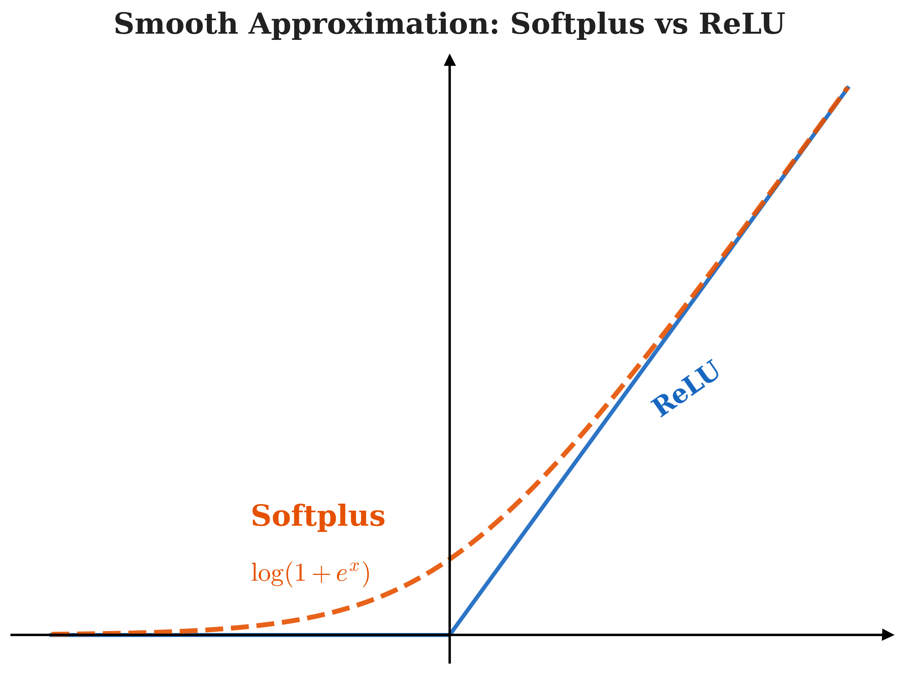

# 受限玻尔兹曼机 (Restricted Boltzmann Machine)

## 1. 背景介绍 (Background)

玻尔兹曼机 (Boltzmann Machine) 是一种具有隐藏节点的马尔可夫随机场 (Markov Random Field, MRF)。
在它的图模型结构中，节点代表随机变量 (Random Variable)。这些变量可以分为两类：
- **观测变量 (Observed Variable)**：通常用 $v$ 表示。
- **隐藏变量 (Hidden Variable)**：通常用 $h$ 表示。

而受限玻尔兹曼机 (Restricted Boltzmann Machine, RBM) 是玻尔兹曼机的一种特殊形式，我们在后文会详细讨论其“受限”的具体含义。

### 1.1 因子分解与 Hammersley-Clifford 定理

因为玻尔兹曼机本质上是一个无向图模型（马尔可夫随机场），根据 **Hammersley-Clifford 定理**，图模型中联合概率分布的因子分解可以基于**最大团 (Maximal Clique)** 来表示。

假设无向图中有 $K$ 个最大团，我们用 $C_i$ 表示第 $i$ 个最大团，用 $x_{C_i}$ 表示最大团 $C_i$ 中所有的随机变量的集合。为了保证概率的数值意义，我们引入非负的**势函数 (Potential Function)** $\psi_i(x_{C_i})$，满足严格大于零的条件：
$$
\text{s.t.} \quad \psi_i(x_{C_i}) > 0
$$

根据定理，系统的联合概率分布 $P(x)$ 可以写成各个最大团上势函数的乘积归一化后的结果，即：
$$
P(x) = \frac{1}{Z} \prod_{i=1}^K \psi_i(x_{C_i})
$$

其中，$Z$ 为**配分函数 (Partition Function)**，用于将所有可能状态的势函数乘积之和归一化为 $1$。配分函数 $Z$ 的计算需要穷举所有可能的变量取值，这是一个多重求和：
$$
Z = \sum_{x} \prod_{i=1}^K \psi_i(x_{C_i}) = \sum_{x_1} \sum_{x_2} \dots \sum_{x_p} \prod_{i=1}^K \psi_i(x_{C_i})
$$
其中集合 $x = \{x_1, x_2, \dots, x_p\}$ 代表所有的随机变量。

### 1.2 能量函数与玻尔兹曼分布

为了满足势函数严格大于 $0$ 的条件（$\psi_i > 0$），一个非常自然的选择是使用指数函数。我们引入**能量函数 (Energy Function)** $E(x_{C_i})$，并将势函数定义为：
$$
\psi_i(x_{C_i}) = \exp\{-E(x_{C_i})\}
$$

将势函数的这个定义代入联合概率分布公式中，我们通过下面详细的推导得到最终概率分布：
$$
\begin{aligned}
P(x) &= \frac{1}{Z} \prod_{i=1}^K \psi_i(x_{C_i}) \\
&= \frac{1}{Z} \prod_{i=1}^K \exp\{-E(x_{C_i})\} \\
&= \frac{1}{Z} \exp\left\{ -\sum_{i=1}^K E(x_{C_i}) \right\}
\end{aligned}
$$

在这里，我们可以将整个系统（图模型）的总能量函数 $E(x)$ 定义为所有最大团能量之和：
$$
E(x) = \sum_{i=1}^K E(x_{C_i})
$$

那么由于指数的运算法则，联合概率分布最终可以优雅地简化为：
$$
P(x) = \frac{1}{Z} \exp\{-E(x)\}
$$

这种形式的概率分布在统计学中被称为**指数族分布 (Exponential Family Distribution)**。而在物理学和机器学习的模型中，这种形式尤为经典，被称为 **玻尔兹曼分布 (Boltzmann Distribution)** 或 **吉布斯分布 (Gibbs Distribution)**。

### 1.3 统计物理视角下的直观理解

为什么我们要特别地把这个概率分布写成能量函数的指数形式呢？我们可以从**统计物理 (Statistical Physics)** 的角度获得非常直观的理解。

假如我们考察一个包含大量粒子（如分子/原子）的物理系统（例如在一个密闭的体积 $V$ 内）。系统的整体结构、粒子的每一次排列都对应着系统的一个**状态 (State)**，而每个具体的系统状态都有其对应的**能量 $E$ (Energy)**。
在热力学平衡时，系统处于某个特定状态的概率 $P(\text{state})$ 与该状态的能量 $E$ 之间满足以下关系：
$$
P(\text{state}) \propto \exp\left\{ -\frac{E}{kT} \right\}
$$
*(注：这里 $k$ 是玻尔兹曼常数，$T$ 是热力学温度。在机器学习问题中，这部分常数通常被吸收到能量函数的定义中，即等价于设定 $kT=1$)*

从上面这个正比关系式中，我们可以得出一个极其核心的结论：**能量 $E$ 和状态出现的概率 $P(\text{state})$ 成反比。**

- 当处在一个能量升高的状态时 ($E \uparrow$)，对应的概率会骤降 ($P(\text{state}) \downarrow$)：高能量意味着系统此时的状态是**不稳定 (unstable)** 的。
- 当处在一个能量降低的状态时 ($E \downarrow$)，对应的概率会上升 ($P(\text{state}) \uparrow$)：低能量意味着系统此时的状态非常**稳定 (stable)**。

进一步假设该物理系统总共有 $M$ 个可能的状态：
- 状态集合 $s \in \{1, 2, \dots, i, \dots, M\}$
- 对应的概率分布为 $P \in \{p_1, p_2, \dots, p_i, \dots, p_M\}$

**状态转移的方向：**
物质世界的一个基本规律，也是这类系统演化的自然方向，是从高能的不稳定状态自发向低能的稳定状态转移。
举一个直观但贴切的例子：将当前的系统状态 (`current state`) 看作是处于“年轻”状态。年轻往往充满活力和能量 ($E \uparrow$)，这种高能量随之而来的也就是一种随时间和运动存在的不稳定；所以生命体会自然而然不可逆地朝着下一个状态 (`next state`) 演变——即“衰老”（能量减少），并最终走向“死亡”。而在物理视角下，“死亡”恰恰是这个系统生命周期中能量最低 ($E \downarrow$)、最彻底稳定的状态。

在机器学习和构建玻尔兹曼机的过程中，我们其实就是借鉴了这一物理现象：通过训练调节网络参数以塑造这个模型的**能量函数**，使得**出现真实数据（训练样本）对应的状态能量降得越低越好**，从而让系统生成真实数据的概率变得极大。

## 2. 模型表示 (Model Representation)

基于第一节的定义，我们可以具体地将图模型结构中的所有随机变量向量化并且连接起来。

### 2.1 变量定义与动机

我们定义所有节点的集合为组合向量 $x$：
$$
x = \begin{pmatrix} x_1 \\ x_2 \\ \vdots \\ x_p \end{pmatrix} = \begin{pmatrix} h \\ v \end{pmatrix}
$$
其中，隐藏变量 $h$ 构成的向量和观测变量 $v$ 构成的向量分别为：
$$
h = \begin{pmatrix} h_1 \\ h_2 \\ \vdots \\ h_m \end{pmatrix} \quad \text{和} \quad v = \begin{pmatrix} v_1 \\ v_2 \\ \vdots \\ v_n \end{pmatrix}
$$
整个系统满足维度关系：$p = m + n$。

**为什么要引入“受限 (Restricted)”？**
如果允许所有节点之间自由连接（即**标准玻尔兹曼机, Boltzmann Machine**），那么在求解网络概率和进行推断 (Inference) 时，我们会面临巨大的困难：
1. **精确推断 (Exact inference)**：涉及所有状态组合的穷举计算，这表现为 intractable（计算上不可行，NP难问题）。
2. **近似推断 (Approximate inference)**：即便使用如 MCMC 这样的采样方法，自由网络结构的近似计算量依然太大。

为了简化推断和学习过程，我们引出了 **受限玻尔兹曼机 (Restricted Boltzmann Machine, RBM)**：
- **受限规则**：隐藏变量 $h$ 和观测变量 $v$ 之间**有**连接（层间有连接）；但在 $h$ 内部之间、以及 $v$ 内部之间**无**连结（层内无连接）。
- 这使得 RBM 的图结构具有典型的**二分图 (Bipartite Graph)** 特征。

### 2.2 联合概率分布与因子图视角 (Factor Graph View)

依据第一节推导的基本概率模型：
$$
P(x) = \frac{1}{Z} \exp\{-E(x)\}
$$

将 $x$ 替换为具体的观测量和隐藏量，我们得到：
$$
P(v, h) = \frac{1}{Z} \exp\{-E(v, h)\}
$$

在受限玻尔兹曼机的结构假设下（无层内连接），我们可以将此系统的**能量函数 $E(v,h)$** 写成一个简洁的双线性与单线性项的组合形式：
$$
E(v, h) = - \left( h^T W v + \alpha^T v + \beta^T h \right)
$$
*其中：*
* $W$ 是 $m \times n$ 的权重矩阵，代表 $h$ 与 $v$ 之间的相互作用。
* $\alpha$ 长度为 $n$ 的偏置向量，作用于观测节点。
* $\beta$ 长度为 $m$ 的偏置向量，作用于隐藏节点。

将能量函数的具体形式代入联合概率分布中，我们可以很自然地利用指数函数的加法性质，将其分解为乘法项：
$$
\begin{aligned}
P(v, h) &= \frac{1}{Z} \exp\left\{ h^T W v + \alpha^T v + \beta^T h \right\} \\
&= \frac{1}{Z} \exp\{h^T W v\} \cdot \exp\{\alpha^T v\} \cdot \exp\{\beta^T h\}
\end{aligned}
$$

**Factor Graph View (因子图视角)：**
从因子图的角度看，上述拆分体现了随机场中势函数是如何根据边（相互作用）和点（独立状态）分解的：
1. $\exp\{h^T W v\}$ 对应网络中 $h$ 与 $v$ 连线上的**边 (Edge)** 因子。
2. $\exp\{\alpha^T v\}$ 对应**观测节点 $v$ (Node $v$)** 的自身因子。
3. $\exp\{\beta^T h\}$ 对应**隐藏节点 $h$ (Node $h$)** 的自身因子。

如果我们将上面的矩阵乘法完全展开成标量连乘，就可以看到极其清晰的**因子化 (factorization)** 结果：
$$
\begin{aligned}
P(v, h) &= \frac{1}{Z} \exp(h^T W v) \cdot \exp(\alpha^T v) \cdot \exp(\beta^T h) \\
&= \frac{1}{Z} \underbrace{\left( \prod_{i=1}^m \prod_{j=1}^n \exp(h_i w_{ij} v_j) \right)}_{\text{edge (因子)}} \cdot \underbrace{\left( \prod_{j=1}^n \exp(\alpha_j v_j) \right)}_{\text{node } v \text{ (因子)}} \cdot \underbrace{\left( \prod_{i=1}^m \exp(\beta_i h_i) \right)}_{\text{node } h \text{ (因子)}}
\end{aligned}
$$
这揭示了受限的无向图可以完美拆解为各个节点和节点间独立因子的连乘形式。

<!-- Generated by scripts/generate_ch21_model_plot.py -->

## 3. 推断 (Inference)

在定义好了受限玻尔兹曼机的联合概率分布后，接下来的核心问题是如何根据观测数据进行**推断 (Inference)**。在 RBM 中，推断的核心目的就是求解后验概率 (Posterior)：即给定观测变量 $v$ 求隐藏变量 $h$ 的分布 $P(h|v)$，反之亦然求解 $P(v|h)$。

由于受限的拓扑结构（层内没有任何连结），隐藏变量之间在给定观测变量的条件下是互为条件独立的 (Conditionally Independent)。因此，全局的后验分布可以拆分成单个节点的概率连乘形式：
$$
P(h|v) = \prod_{l=1}^m P(h_l|v)
$$
*同理可得，给定隐藏层时观测层的后验概率也可被拆分：*
$$
P(v|h) = \prod_{j=1}^n P(v_j|h)
$$

### 3.1 单节点后验概率推导

下面我们将非常详细地推导单个隐藏节点 $h_l$ 被激活（即取值为 1）的概率公式 $P(h_l=1|v)$。

首先，根据条件概率的定义和贝叶斯定理的变形，我们有：
$$
\begin{aligned}
P(h_l=1|v) &= P(h_l=1 | h_{-l}, v) \\
&= \frac{P(h_l=1, h_{-l}, v)}{P(h_{-l}, v)} \\
&= \frac{P(h_l=1, h_{-l}, v)}{P(h_l=1, h_{-l}, v) + P(h_l=0, h_{-l}, v)}
\end{aligned}
$$
其中 $h_{-l}$ 表示**除了 $h_l$ 之外**所有的隐藏节点集合。

根据之前的联合分布形式 $P(v, h) \propto \exp\{-E(v,h)\}$，推导问题的关键转至计算系统的总能量 $E(h,v)$。我们将原来矩阵形式的能量函数完全展开为标量求和的形式：
$$
E(h, v) = -\left( \sum_{i=1}^m \sum_{j=1}^n h_i w_{ij} v_j + \sum_{j=1}^n \alpha_j v_j + \sum_{i=1}^m \beta_i h_i \right)
$$

为了孤立目标变量 $h_l$，我们将上述三个大求和项分别拆分成包含 $h_l$ 的部分和包含其他节点 $h_{i\neq l}$ 的部分：
$$
E(h, v) = -\left[ \underbrace{\sum_{i=1, i \neq l}^m \sum_{j=1}^n h_i w_{ij} v_j}_{\Delta_1} + \underbrace{h_l \sum_{j=1}^n w_{lj} v_j}_{\Delta_2} + \underbrace{\sum_{j=1}^n \alpha_j v_j}_{\Delta_3} + \underbrace{\sum_{i=1, i \neq l}^m \beta_i h_i}_{\Delta_4} + \underbrace{\beta_l h_l}_{\Delta_5} \right]
$$

接下来进行巧妙的合并。我们发现有且仅有 $\Delta_2$ 和 $\Delta_5$ 包含了变量 $h_l$：
$$
\Delta_2 + \Delta_5 = h_l \left( \sum_{j=1}^n w_{lj} v_j + \beta_l \right)
$$
我们可以令括号内的部分为一个仅仅与 $v$ 的状态有关的宏观项，记为 $H_l(v)$：
$$
H_l(v) = \sum_{j=1}^n w_{lj} v_j + \beta_l
$$
所以，$\Delta_2 + \Delta_5 = h_l \cdot H_l(v)$。

剩下的与 $h_l$ 绝缘的杂项 $(\Delta_1 + \Delta_3 + \Delta_4)$ 综合记为 $\bar{H}_l(h_{-l}, v)$，表示它们仅受其他隐藏节点和可见节点的影响。由此：
$$
E(h, v) = -\left[ h_l \cdot H_l(v) + \bar{H}_l(h_{-l}, v) \right]
$$

现在可以代回我们的联合概率中了，分子：
$$
P(h_l=1, h_{-l}, v) = \frac{1}{Z} \exp\left\{ H_l(v) + \bar{H}_l(h_{-l}, v) \right\}
$$
分母（将 $h_l=1$ 和 $h_l=0$ 的情况加总）：
$$
\begin{aligned}
P(h_l=1, h_{-l}, v) + P(h_l=0, h_{-l}, v) &= \frac{1}{Z} \exp\left\{ 1 \cdot H_l(v) + \bar{H}_l(h_{-l}, v) \right\} + \frac{1}{Z} \exp\left\{ 0 \cdot H_l(v) + \bar{H}_l(h_{-l}, v) \right\} \\
&= \frac{1}{Z} \exp\{H_l(v)\} \exp\{\bar{H}_l(h_{-l}, v)\} + \frac{1}{Z} \cdot 1 \cdot \exp\{\bar{H}_l(h_{-l}, v)\}
\end{aligned}
$$

将分子与分母相除，公因子 $\frac{1}{Z} \exp\{\bar{H}_l(h_{-l}, v)\}$ 被完美地约掉了！
$$
\begin{aligned}
P(h_l=1|v) &= \frac{\exp\{H_l(v)\}}{\exp\{H_l(v)\} + 1}
\end{aligned}
$$
我们将上下同时除以 $\exp\{H_l(v)\}$，就会得到我们在机器学习界极为熟悉的经典函数形式：
$$
P(h_l=1|v) = \frac{1}{1 + \exp\{-H_l(v)\}} = \sigma\left( H_l(v) \right) = \sigma\left( \sum_{j=1}^n w_{lj} v_j + \beta_l \right)
$$
其中，$\sigma(x)$ 为 Sigmoid 函数。

基于 RBM 的对称性，利用完全相同的逻辑推导，我们同样可以求得在给定隐藏层状态下，观测节点的后验概率：
$$
P(v_j=1|h) = \sigma\left( \sum_{i=1}^m w_{ij} h_i + \alpha_j \right)
$$

**结论：**
因为结构被“受限”，极大化似然或者能量的过程被惊人简化了。在受限玻尔兹曼机中，跨层节点的条件独立性，最终推导出了使用 Sigmoid 激活函数进行的神经元状态传递公式。

正如推导结果所揭示的：
$$
\text{RBM} \implies \text{神经网络 (Neural Network) 激活} \implies \sigma(x) = \frac{1}{1 + e^{-x}}
$$
这也正是 RBM 能够被当作构建深度信念网络 (Deep Belief Network, DBN) 乃至经典经网络基本模块的基础根源，因为它的推断过程完美等价于前馈神经网络中一层带 Sigmoid 激活函数的神经元前向传播过程。

### 3.2 边缘概率推导与 Softplus 激活函数

除了计算条件概率，另一项核心的推断任务是计算观测数据所在可见层的**边缘概率 (Marginal Probability)** $P(v)$。推导边缘概率的过程将惊奇地关联到深度学习中另一个大名鼎鼎的激活函数：Softplus（即 ReLU 函数的平滑近似）。

我们从边缘概率的定义出发，即需要对所有的隐藏状态 $h$ 进行求和边缘化（此处 $h_i \in \{0, 1\}$）：
$$
P(v) = \sum_{h} P(h, v) = \sum_{h} \frac{1}{Z} \exp\{-E(h, v)\}
$$

将联合能量函数 $E(h,v) = -\left( h^T W v + \alpha^T v + \beta^T h \right)$ 代入：
$$
\begin{aligned}
P(v) &= \sum_{h_1} \sum_{h_2} \cdots \sum_{h_m} \frac{1}{Z} \exp \left\{ h^T W v + \alpha^T v + \beta^T h \right\} \\
&= \frac{1}{Z} \exp(\alpha^T v) \cdot \sum_{h_1} \sum_{h_2} \cdots \sum_{h_m} \exp \left\{ h^T W v + \beta^T h \right\}
\end{aligned}
$$
由于提取了与 $h$ 无关项 $\exp(\alpha^T v)$ 到连加号外面，我们关注乘法求和核心部分。将内积操作拆解成所有 $m$ 个隐藏神经元的累加：
$$
\begin{aligned}
\sum_{h_1} \cdots \sum_{h_m} \exp \left\{ \sum_{i=1}^m \left( h_i W_{i\cdot} v + \beta_i h_i \right) \right\}
\end{aligned}
$$
其中 $W_{i\cdot}$ 指权重矩阵 $W_{m \times n}$ 的第 $i$ 行向量，与可见层向量 $v$ 直接相乘（相当于 $\sum_{j} W_{ij} v_j$）。

指数中的求和等于乘积的连乘。而且由于 RBM 优美的层内无连接特性，外层对每个隐藏变量的求和（如 $\sum_{h_1}$）与其后方的乘加项也是相互独立的分配关系，因此我们可以将巨大的组合连加式分解为一组相对独立的乘积项：
$$
=\sum_{h_1} \cdots \sum_{h_m} \left( \exp \left\{ h_1 W_{1\cdot} v + \beta_1 h_1 \right\} \cdot \exp \left\{ h_2 W_{2\cdot} v + \beta_2 h_2 \right\} \cdots \exp \left\{ h_m W_{m\cdot} v + \beta_m h_m \right\} \right)
$$
进一步结合求和符合，可以将独立求和分配进去：
$$
= \left( \sum_{h_1} \exp \{ h_1 W_{1\cdot} v + \beta_1 h_1 \} \right) \cdots \left( \sum_{h_m} \exp \{ h_m W_{m\cdot} v + \beta_m h_m \} \right)
$$

此时，我们在每一个小独立成分里强制代入隐藏结点的二值状态 $h_i \in \{0, 1\}$，以第一个成分为例：
- 当 $h_1 = 0$ 时，$\exp \{ 0 \cdot W_{1\cdot} v + \beta_1 \cdot 0 \} = \exp\{0\} = 1$
- 当 $h_1 = 1$ 时，$\exp \{ 1 \cdot W_{1\cdot} v + \beta_1 \cdot 1 \} = \exp \{  W_{1\cdot} v + \beta_1 \}$

加合后即为 $(1 + \exp \{ W_{1\cdot} v + \beta_1 \})$。将这 $m$ 组计算重新用大乘积符号 $\prod$ 包装：
$$
P(v) = \frac{1}{Z} \exp(\alpha^T v) \cdot \prod_{i=1}^m \left( 1 + \exp \{ W_{i\cdot} v + \beta_i \} \right)
$$

**Exp-Log 魔法转换：**
如何继续化简上面的连乘公式？数学中有一招叫做 $\exp(\log(\cdot))$ 恒等变换（$x = e^{\ln x}$）。这可以帮我们把连乘转化为指数上的连加：
$$
\begin{aligned}
\prod_{i=1}^m \left( 1 + \exp \{ W_{i\cdot} v + \beta_i \} \right)
&= \prod_{i=1}^m \exp \left\{ \log \left( 1 + \exp \{ W_{i\cdot} v + \beta_i \} \right) \right\} \\
&= \exp \left\{ \sum_{i=1}^m \log \left( 1 + \exp \{ W_{i\cdot} v + \beta_i \} \right) \right\}
\end{aligned}
$$

将这一成果整合进最初的公式中去，我们就得到了最简边缘概率表达式：
$$
P(v) = \frac{\exp \left\{ \alpha^T v + \sum_{i=1}^m \textbf{Softplus}(W_{i\cdot} v + \beta_i) \right\}}{Z}
$$
其中，**Softplus 函数**定义为 $\text{Softplus}(x) = \log(1 + e^x)$。

正如推导所示，可见变量的边缘似然结构其实等于原始的偏置加上隐藏单元通过 Softplus 变换后的**非线性组合**。同时，这也提供给我们在深度学习背景下审视 RBM 的另一重视角——$\text{Softplus}$ 就是那个著名的大爆点 **ReLU (Rectified Linear Unit)** 激活函数的连续、平滑且可导的数学逼近。我们可以使用如下可视化图表来观察它们之间的关系。

<!-- Generated by scripts/generate_ch21_softplus_relu.py -->
