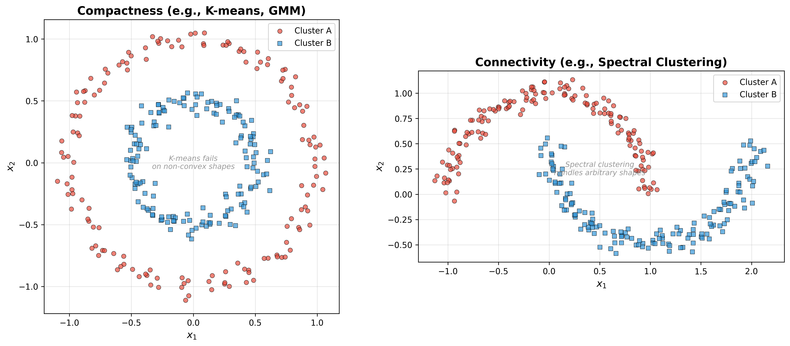

# 谱聚类

## 1. 简介 (Introduction)

在机器学习中，聚类算法通常可以根据其对数据分布的假设分为两类：基于**紧致性** (Compactness) 的聚类和基于**连通性** (Connectivity) 的聚类。

- **紧致性 (Compactness)**: 这类算法（如 K-means 和高斯混合模型 GMM）通常假设簇是凸的 (Convex) 或者存在一个明确的中心。它们倾向于将距离较近的点归为一类，但在处理非凸形状（如嵌套的圆环）时效果不佳。
- **连通性 (Connectivity)**: 谱聚类 (Spectral Clustering) 是一种典型的基于连通性的算法。它能够处理任意形状的簇（例如互相交织的螺旋线），只要数据点在图的连通性上更紧密即可。

<!-- Generated by scripts/generate_ch22_clustering_comparison.py -->

谱聚类本质上是一种**基于图的 (Graph-based)** 聚类方法。它将带权重的无向图 $G = \{V, E\}$ 作为底层数据结构。

### 1.1 符号定义

假设我们有 $N$ 个数据点，提取特征后组成的数据矩阵为 $X$：

$$
X = (x_1, x_2, \dots, x_N)^T = \begin{pmatrix} x_1^T \\ x_2^T \\ \vdots \\ x_N^T \end{pmatrix}_{N \times p}
$$

在带权重的无向图 $G = \{V, E\}$ 中：
- **顶点集 (Vertices)**: $V = \{1, 2, \dots, N\} \Leftrightarrow X$，即图中的每一个节点对应数据集中的一个样本点。
- **边集 (Edges)**: 只有当节点 $i$ 和 $j$ 之间存在边时 ($(i, j) \in E$)，它们才有正的连接权重。节点之间的边权由相似度矩阵 (Similarity matrix / Affinity matrix) $W = [w_{ij}]_{1 \le i, j \le N}$ 决定。

其中，权重 $w_{ij}$ 的定义通常为：

$$
w_{ij} = \begin{cases} K(x_i, x_j) = \exp \left\{ - \frac{\|x_i - x_j\|_2^2}{2\sigma^2} \right\}, & (i, j) \in E \\ 0, & (i, j) \notin E \end{cases}
$$

这里使用的是高斯核函数 (RBF Kernel) 来度量两点之间的相似度。距离越近，即差异越小，相似度越接近 1；距离越远，相似度越接近 0。

此外，我们定义：
- **节点的度 (Degree)**: 节点 $i$ 的度 $d_i$ 为与之相连的所有边的权重之和：

  $$
  d_i = \sum_{j=1}^N w_{ij}
  $$

- **子集的度 (Degree of a subset)**: 对于顶点集的子集 $A_k \subset V$，它的度记为 $\Delta = \operatorname{degree}(A_k)$，等于该子集中所有节点的度之和：

  $$
  \operatorname{degree}(A_k) = \sum_{i \in A_k} d_i
  $$

- **两个子集之间的权重 (Weight between subsets)**: 对于互不相交的两个子集 $A \subset V, B \subset V, A \cap B = \emptyset$，它们之间的连接总权重定义为：

  $$
  W(A, B) = \sum_{i \in A, j \in B} w_{ij}
  $$

### 1.2 谱聚类的目标：图的划分 (Graph Cut)

按照谱聚类的思想，聚类的根本目标是将顶点集 $V$ 划分为 $K$ 个互不相交的子集 $\{A_1, A_2, \dots, A_K\}$（即 $V = \bigcup_{k=1}^K A_k$，且任意 $i \neq j$ 时 $A_i \cap A_j = \emptyset$），使得不同子集之间的连接权重尽可能小。

由此引入**割 (Cut)** 的概念：

$$
cut(V) = cut(A_1, A_2, \dots, A_K) = \frac{1}{2} \sum_{k=1}^K W(A_k, \bar{A}_k)
$$

这里 $\bar{A}_k = V \setminus A_k$ 表示 $A_k$ 的补集。此公式计算了所有跨越不同子集的边的权重总和。公式中的 $\frac{1}{2}$ 是因为在无向图中，每一条跨边界的边在这个求和公式里会被对称地计算两次。

另外，我们可以根据定义将 $W(A_k, \bar{A}_k)$ 展开为：

$$
W(A_k, \bar{A}_k) = W(A_k, V) - W(A_k, A_k)
$$

我们希望最小化 $cut(V)$。然而，直接最小化 $cut(V)$ 容易导致将单个边远且孤立的离群点作为一个独立类别的现象。为了得到更平衡、有意义的划分，通常会引入每个子集大小（以度来衡量）的惩罚项，这就是 **归一化割 (Normalized Cut, Ncut)** 的动机：

$$
Ncut(V) = \sum_{k=1}^K \frac{W(A_k, \bar{A}_k)}{\operatorname{degree}(A_k)} = \sum_{k=1}^K \frac{W(A_k, \bar{A}_k)}{\sum_{i \in A_k} d_i}
$$

因此，谱聚类的**模型 (Model)** 可以表述为求解以下最优化问题：

$$
\{\hat{A}_k\}_{k=1}^K = \arg\min_{\{A_k\}_{k=1}^K} Ncut(V)
$$

## 2. 矩阵表示 (Matrix Formulation)

为了求解上述最优化问题，我们需要将其转化为矩阵形式来进行优化计算。

首先，我们定义**指示向量 (Indicator vector)** $y_i \in \{0, 1\}^K$，表示第 $i$ 个样本属于哪一个聚类类别：
- 当第 $i$ 个样本属于第 $j$ 个类别时，向量的第 $j$ 个元素为 1，即 $y_{ij} = 1$。
- 对于每个样本 $i$，它只能唯一属于一个类别，因此共有互斥限制：$\sum_{j=1}^K y_{ij} = 1$。
- 指示向量元素的简明定义为：$y_{ij} = 1 \iff \text{第 } i \text{ 个样本属于第 } j \text{ 个类别}$（其中 $1 \le i \le N, 1 \le j \le K$）。

我们将所有的指示向量堆叠起来，定义 $N \times K$ 的**指示矩阵 $Y$**：
$$
Y = (y_1, y_2, \dots, y_N)^T = \begin{pmatrix} y_1^T \\ y_2^T \\ \vdots \\ y_N^T \end{pmatrix}_{N \times K}
$$

回忆之前定义的最优化目标：
$$
\hat{Y} = \arg\min_{Y} Ncut(V)
$$
在此通过指示矩阵 $Y$，我们要将 $Ncut(V)$ 的表达式转化为包含 $Y$ 的迹计算（$\operatorname{tr}$ 表示矩阵的迹）。

根据展开的 $Ncut(V)$ 的定义式：
$$
Ncut(V) = \sum_{k=1}^K \frac{W(A_k, \bar{A}_k)}{\sum_{i \in A_k} d_i}
$$
我们可以将其看作是两个 $K \times K$ 对角矩阵相乘再求迹的结果：
$$
Ncut(V) = \operatorname{tr}(O \cdot P^{-1})
$$

其中，分子构成的对角矩阵 $O$ 为：
$$
O = \begin{pmatrix}
W(A_1, \bar{A}_1) & & & & \\
 & W(A_2, \bar{A}_2) & & 0 & \\
 & & \ddots & & \\
 & 0 & & W(A_K, \bar{A}_K)
\end{pmatrix}_{K \times K}
$$

分母构成的对角矩阵 $P$ 为：
$$
P = \begin{pmatrix}
\sum_{i \in A_1} d_i & & & & \\
 & \sum_{i \in A_2} d_i & & 0 & \\
 & & \ddots & & \\
 & 0 & & \sum_{i \in A_K} d_i
\end{pmatrix}_{K \times K}
$$

我们需要分别将这两个矩阵与未知矩阵 $Y$ 以及已知的距离权重矩阵 $W$ ($N \times N$) 联系起来。

### 2.1 推导分母矩阵 $P$

首先考察 $Y^T Y$ 的矩阵乘法结果：
$$
Y^T Y = (y_1, y_2, \dots, y_N) \begin{pmatrix} y_1^T \\ y_2^T \\ \vdots \\ y_N^T \end{pmatrix} = \sum_{i=1}^N y_i y_i^T
$$
由于 $y_i$ 中只有一个元素为 1，其余均为 0，因此 $y_i y_i^T$ 是一个除对角线上某元素为 1外全部为零的矩阵。累加后的 $Y^T Y$ 是一个对角线元素为各个类别样本总数 $N_k = \sum_{i \in A_k} 1$ 的 $K \times K$ 的对角矩阵：
$$
Y^T Y = \begin{pmatrix}
N_1 & & & & \\
 & N_2 & & 0 & \\
 & & \ddots & & \\
 & 0 & & N_K
\end{pmatrix}
$$

如果我们在矩阵相乘中插入由样本独立度 $d_i$ 组成的**对角度数矩阵 $D$**：
$$
D = \operatorname{diag}(d_1, d_2, \dots, d_N) = \operatorname{diag}(W \cdot \mathbf{1}_{N})
$$
那么，$Y^T D Y$ 的结果变为：
$$
Y^T D Y = \sum_{i=1}^N y_i d_i y_i^T
$$
这里累加时考虑了系数 $d_i$，因此对角线上累积的结果正是每个类别的总度数 $\sum_{i \in A_k} d_i$。结果为：
$$
Y^T D Y = \begin{pmatrix}
\sum_{i \in A_1} d_i & & & \\
 & \sum_{i \in A_2} d_i & & \\
 & & \ddots & \\
 & & & \sum_{i \in A_K} d_i
\end{pmatrix} = P
$$
故推导得出分母矩阵等同于：
$$
P = Y^T D Y
$$

### 2.2 推导分子矩阵 $O$

回想起前面的公式，割的权重可以写作总连接权重减去内部连接权重：
$$
W(A_k, \bar{A}_k) = W(A_k, V) - W(A_k, A_k) = \sum_{i \in A_k} d_i - W(A_k, A_k)
$$
据此，对角矩阵 $O$ 可以被拆解为两个对角矩阵之差：
$$
O = \begin{pmatrix}
\sum_{i \in A_1} d_i & \dots & 0 \\
\vdots & \ddots & \vdots \\
0 & \dots & \sum_{i \in A_K} d_i
\end{pmatrix} - \begin{pmatrix}
W(A_1, A_1) & \dots & 0 \\
\vdots & \ddots & \vdots \\
0 & \dots & W(A_K, A_K)
\end{pmatrix}
$$
左边的矩阵正好是之前求得的分母矩阵 $P$。那么右边的对角矩阵怎么用 $Y$ 来表示呢？

我们引入一个相关的矩阵 $Y^T W Y$，并计算其乘积的结果：
$$
Y^T W Y = \begin{pmatrix} y_1, y_2, \dots, y_N \end{pmatrix} \begin{pmatrix} w_{11} & \dots & w_{1N} \\ \vdots & \ddots & \vdots \\ w_{N1} & \dots & w_{NN} \end{pmatrix} \begin{pmatrix} y_1^T \\ \vdots \\ y_N^T \end{pmatrix} = \sum_{i=1}^N \sum_{j=1}^N y_i y_j^T w_{ij}
$$
这个 $K \times K$ 满秩矩阵中，对角线上的第 $k$ 个元素 $(Y^T W Y)_{kk}$ 仅累加了属于同一类别 $k$ 时的 $w_{ij}$，因此正好等同于类的内部连通权重 $W(A_k, A_k)$。

如果我们定义一个新矩阵 $O'$：
$$
O' = Y^T D Y - Y^T W Y
$$
经过上面的分析，虽然 $O'$ 这一矩阵含有非零的非对角元，但其对角线上的元素严格等于 $O$（因为 $Y^T D Y$ 的对角线元素对应 $O$ 拆解中的左半部分，$Y^T W Y$ 的对角线元素对应右半部分）。

我们在最初的目标是计算 $\operatorname{tr}(O \cdot P^{-1})$，并且已知 $P^{-1} = (Y^T D Y)^{-1}$ 是一个对角矩阵。
**当一个任意矩阵与对角矩阵相乘并求迹时，其结果仅与这个任意矩阵的对角线元素有关（非对角元素的累加和必然被对角矩阵的0屏蔽抵消）。**

因此，由于 $O$ 行完全由其在对角线等效的 $O'$ 替代：
$$
\operatorname{tr}(O \cdot P^{-1}) = \operatorname{tr}(O' \cdot P^{-1})
$$
从而，在求迹运算下，分子矩阵 $O \iff O'$ 是完全成立等效的。

### 2.3 引入图拉普拉斯矩阵 (Laplacian Matrix) 与最终目标

在图论和谱聚类中，经常用到**图拉普拉斯矩阵 (Graph Laplacian Matrix)** $L$。我们将 $L$ 定义为图的度数矩阵与邻接权重矩阵之差：
$$
L = D - W
$$
基于此，我们可以把 $O'$ 进一步化简为拉普拉斯矩阵的形式：
$$
O' = Y^T D Y - Y^T W Y = Y^T (D - W) Y = Y^T L Y
$$

将等效的 $O'$ 与 $P$ 皆代入之前的迹表示 $Ncut(V) = \operatorname{tr}(O \cdot P^{-1})$ 中，我们可以得到谱聚类计算的最终等价形式：
$$
Ncut(V) = \operatorname{tr}\left[ (Y^T L Y) \cdot (Y^T D Y)^{-1} \right]
$$

进而最终模型公式为：
$$
\hat{Y} = \arg\min_Y \operatorname{tr}\left[ (Y^T L Y) \cdot (Y^T D Y)^{-1} \right]
$$

至此，我们将原本复杂的、关于离散集合划分 $A_k$ 的最优化问题巧妙地统摄成了一个仅含有矩阵 $Y$ 及其变换计算的数学最优化模型。这样我们就极大程度地方便了接下来通过特征值求解近似答案的步骤。
