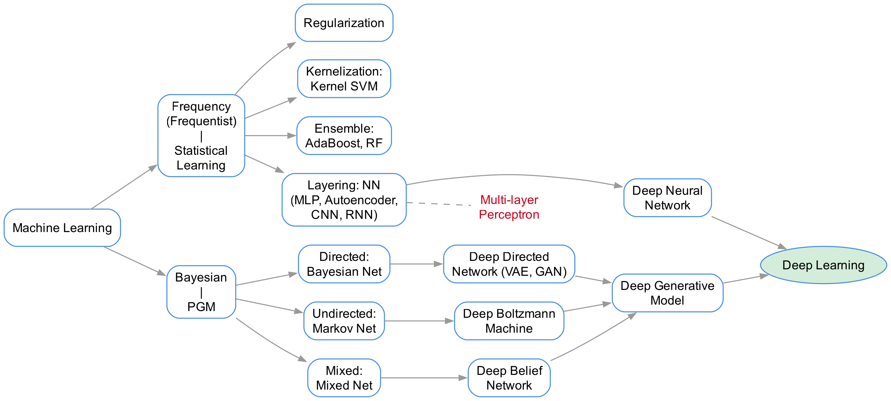
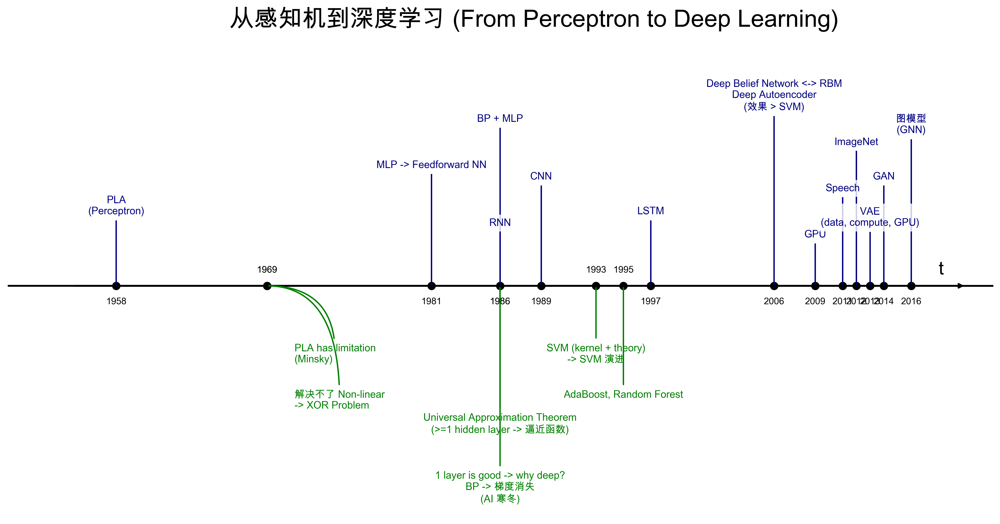
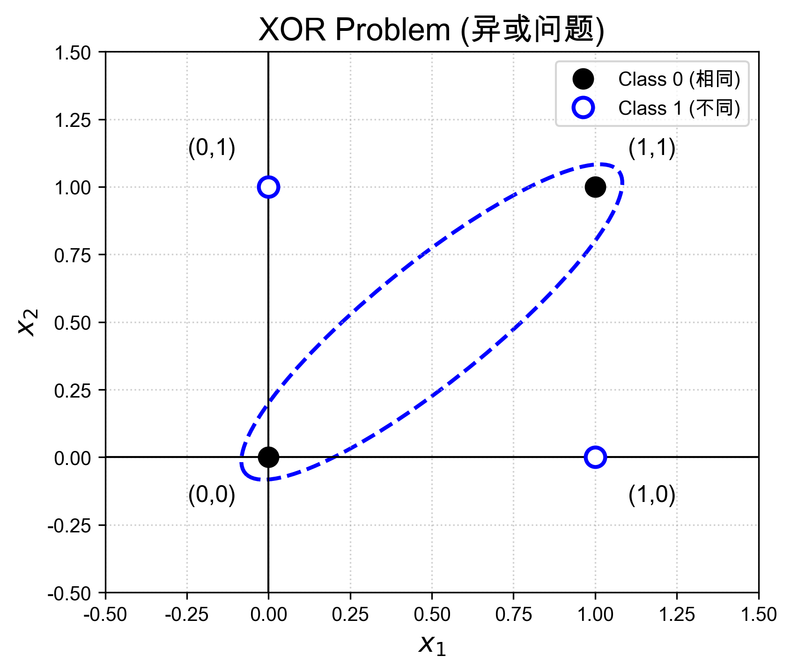

# 前馈神经网络

## 1. 机器学习的发展脉络与深度学习的背景

在深入研究前馈神经网络（Feedforward Neural Network）之前，我们需要先从宏观的角度了解机器学习（Machine Learning）的发展脉络，以及如今繁荣的深度学习（Deep Learning）是如何在这个脉络中发展起来的。

机器学习主要可以分为两大流派：**频率派（Frequentist）** 和 **贝叶斯派（Bayesian）**。这两个流派有着不同的哲学基础，并分别演化出了统计学习（Statistical Learning）和概率图模型（Probabilistic Graphical Model, PGM）。这两条线最终殊途同归，共同促成了深度学习的发展。

<!-- Generated by scripts/generate_ch23_ml_taxonomy.py -->

### 1.1 频率派与统计学习

频率派认为模型参数是客观存在且固定的，通常通过优化某种目标函数来求解最优参数。这一流派发展出了**统计学习**的丰富体系。为了应对越来越复杂的数据和非线性问题，统计学习在不同方向上进行了演进与扩展：

1. **正则化（Regularization）**：通过引入惩罚项（如 L1 / L2 正则化）来控制模型复杂度，防止过拟合。
2. **核化（Kernelization）**：例如核支持向量机（Kernel SVM），通过核技巧（Kernel Trick）将数据隐式映射到高维空间，从而解决非线性可分的问题。
3. **集成化（Ensemble）**：例如 AdaBoost、随机森林（Random Forest），通过组合多个弱学习器来构建一个具有强泛化能力的学习器。
4. **层状化（Layering / Deepening）**：即**神经网络（Neural Network）**模型的发展。通过增加模型层数（包括多层感知机 MLP、自编码器 Autoencoder、卷积神经网络 CNN、循环神经网络 RNN 等），极大提高了模型的表达能力。神经网络的不断层状化和加深，最终演变为了**深度神经网络（Deep Neural Network, DNN）**。

### 1.2 贝叶斯派与概率图模型 (PGM)

贝叶斯派认为参数是一个随机变量，服从某种先验分布，需要通过观测数据来推断参数的后验分布。它发展出了**概率图模型（Probabilistic Graphical Model）**，善于清晰地表达变量间的概率依赖关系。根据图中边的有无方向，概率图模型可分为：

1. **有向图 (Directed Network)**：例如贝叶斯网络（Bayesian Network）。其深度化发展成了**深度有向网络（Deep Directed Network）**，典型代表有 Sigmoid Belief Network、变分自编码器（VAE）、生成对抗网络（GAN）等。
2. **无向图 (Undirected Network)**：例如马尔可夫网络（Markov Network）。其深度化发展成了**深度玻尔兹曼机（Deep Boltzmann Machine, DBM）**。
3. **有向 + 无向图 (Mixed Network)**：例如包含有向和无向边的混合网络。其深度化发展成了**深度信念网络（Deep Belief Network, DBN）**。

这些概率图模型的深度化扩展，被统称为**深度生成模型（Deep Generative Model）**。

### 1.3 深度学习的诞生

综上所述，源自频率派的**深度神经网络**与源自贝叶斯派的**深度生成模型**交汇融合，构成了今天**深度学习（Deep Learning）**的核心拼图。

本章我们将聚焦于频率派“层状化”发展的起点——**多层感知机（Multi-layer Perceptron, MLP）**，它也是最基础、最典型的**前馈神经网络**，为后续学习更复杂的深度模型打下基础。

## 2. 从感知机到深度学习：发展简史与时间线

在深入多层感知机的数学细节之前，让我们回溯历史，看看神经网络是如何一步步跨越低谷，最终演变成今天统治级的**深度学习**框架的。

<!-- Generated by scripts/generate_ch23_timeline.py -->

神经网络的发展并非一帆风顺，而是经历了“两起两落”，可以大致分为以下几个核心阶段：

### 2.1 起步与第一次低谷 (1958 - 1969)

- **1958年：感知机 (PLA, Perceptron)**
  Frank Rosenblatt 提出了感知机模型。由于其结构的简单和线性可分问题上的成功，引起了第一波人工智能的浪潮。
- **1969年：感知机的局限性**
  Marvin Minsky（人工智能之父之一）出版了《感知机》一书，从数学上严谨地证明了单层感知机**无法解决基本的非线性问题，例如最简单的异或问题（XOR Problem）**。这一结论如同浇了一盆冷水，直接导致神经网络研究进入了漫长的第一次“AI寒冬”。

### 2.2 多层网络的崛起与第二次低谷 (1981 - 1990s 晚期)

- **1981年：多层感知机 (MLP)**
  学术界开始探讨包含隐层的**多层感知机（Multi-layer Perceptron）**，即**前馈神经网络（Feedforward Neural Network）**。这就需要一种有效的算法来训练多层结构。
- **1986年：反向传播算法 (BP) 的普及**
  Geoffrey Hinton 等人重新发现并推广了**反向传播算法（Backpropagation, BP）**。BP 算法与 MLP 的结合，成功解决了 XOR 问题，宣告了第二次浪潮的到来。同年，**循环神经网络（RNN）**的概念也被提出。
- **1986年（并行理论）：通用近似定理 (Universal Approximation Theorem)**
  理论证明：**只要有至少一层隐藏层（并且节点足够多），神经网络可以逼近任意连续函数**。但这同时带来了一个疑问：既然一层隐藏层就足够好了（1 layer is good），**我们为什么还需要“深”的网络（why deep）呢？**
- **1989年：卷积神经网络 (CNN)**
  Yann LeCun 提出了基于 CNN 的 LeNet，在手写数字识别上取得了成功。
- **1990s 中后期的第二次寒冬**
  随着研究深入，人们发现虽然网络“深”可以带来更强的表达能力，但由于 BP 算法在多层网络中会导致致命的**梯度消失（Vanishing Gradient）**问题，深层网络极难训练。
  与此同时，基于统计学习的核方法（Kernel Method）异军突起：**1993年支持向量机（SVM）**及其核技巧和坚实的理论基础被提出并不断演进；**1995年 AdaBoost 和 Random Forest** 等集成学习模型问世。在这些效果极佳的机器学习算法的“围剿”下，神经网络再次走向边缘化。

### 2.3 深度学习的破晓与爆发 (2006 - 至今)

- **2006年：深度学习的起点**
  Hinton 提出通过**受限玻尔兹曼机（RBM）**来逐层预训练**深度信念网络（Deep Belief Network, DBN）**或深度自编码器（Deep Autoencoder）。这不仅有效缓解了梯度消失问题，而且在各项任务上的效果开始超越 SVM，这一年常被看作**深度学习（Deep Learning）元年**。
- **2009-2012年：算力与数据的爆发**
  随着 **GPU** 的普及（2009年）和数据量的大爆发，神经网络迎来了春天。在语音识别（2011年）和 **ImageNet** 视觉挑战赛（2012年 AlexNet）上，深度神经网络以绝对优势碾压了传统方法。
- **2013年及之后：生成模型与图网络的繁荣**
  在此基础上，领域内的创新出现了井喷，尤其体现在生成模型上：
  - **2013年：变分自编码器（VAE）**结合了深度学习和贝叶斯推理。
  - **2014年：生成对抗网络（GAN）**将博弈论引入网络训练，开启了逼真图像生成的新纪元。
  - **2016年及以后：图神经网络（GNN）**开始展露头角，将深度学习的能力泛化到了非欧几里得空间的数据上。

理解这段历史可以帮助我们看清：从“单层感知机”增加隐藏层变为“多层感知机（前馈神经网络）”，并引入非线性激活函数和 BP 算法，是整个深度学习架构大厦的**真正基石**。

## 3. 非线性问题 (Non-Linear Problem) 的三种破局思路

我们在上一节提到，单层感知机 (PLA) 之所以陷入低谷，是因为它连最简单的**异或问题 (XOR Problem)** 都无法解决。异或问题本质上就是一种线性不可分的**非线性问题**。

<!-- Generated by scripts/generate_ch23_xor_plot.py -->

如上图所示，异或运算的规则是“相同为 0，不同为 1”：
- Class 0: $(0,0) \rightarrow 0$ 且 $(1,1) \rightarrow 0$
- Class 1: $(0,1) \rightarrow 1$ 且 $(1,0) \rightarrow 1$

我们无法在二维平面上找到一条单一的直线将黑色实心点（Class 0）与带明圈的点（Class 1）完全划分开来。

在机器学习的历史中，针对“如何解决非线性问题”，学者们给出了三种截然不同、却又极其优美的解决方案。

### 3.1 方案一：显式转换 (Non-Transformation / Explicit Transformation)

如果低维空间线性不可分，为什么不把数据映射到高维空间呢？这其实就是 Cover's Theorem 的思想：将输入数据映射到一个高维的非线性特征空间中，高维空间下数据线性可分的概率会大大增加。

这就是第一种思路：**“明转”**。
我们设计一个显式的映射函数 $\phi$:
$$
\phi: \mathcal{X} \longrightarrow \mathcal{Z}
$$
把原始的输入空间 (Input Space) $\mathcal{X}$ 中的样本 $x$ 映射到了特征空间 (Feature Space) $\mathcal{Z}$ 中。比如在多项式回归中引入 $x_1^2, x_1 x_2$ 这种多项式特征，就是典型的“明转”。

### 3.2 方案二：隐式转换 (Kernel Method)

第二种思路则更加巧妙，它被称为**核方法 (Kernel Method)**，即**“暗转”**。

当我们算法的最终形式仅依赖于特征空间中两点间的内积 $\langle \phi(x), \phi(x') \rangle$ 时，我们并不需要显式地去定义那可能高维甚至无限维的映射函数 $\phi$。我们只需要定义核函数 (Kernel Function) $K$:
$$
K(x, x') = \langle \phi(x), \phi(x') \rangle , \quad x, x' \in \mathcal{X}
$$
核函数 $K$ 就像是隐藏了一个 $\phi$，它直接在低维输入空间计算出了高维空间内积的结果。“暗转”是支持向量机（SVM）大获成功的关键。

### 3.3 方案三：神经网络与自学习转换 (Neural Networks)

第三种思路是**“自转”**，这也是**神经网络 (Neural Network)** 的核心思想。它不是人为指定一个固定的多项式或者是高斯核去映射，而是**让网络自己在数据中学习出非线性的转换或复合运算**。

让我们回到 XOR 问题。逻辑学上，基本的逻辑运算有：
- **AND (与, $\wedge$)**：仅当两者都为 True 时为 True
- **OR (或, $\vee$)**：只要有一者为 True 即为 True
- **NOT (非, $\neg$)**：取反

感知机 PLA 虽然解决不了异或，但它完美地可以表示 AND、OR 和 NOT（这些都是线性可分的**基础运算**）。那么异或 (XOR，记号为 $\oplus$) 是怎么定义的呢？
$$
x_1 \oplus x_2 \iff (x_1 = 1, x_2 = 0) \quad \text{或者} \quad (x_1 = 0, x_2 = 1)
$$
可以将其写成复合逻辑表达式：
$$
x_1 \oplus x_2 = (\neg x_1 \wedge x_2) \vee (x_1 \wedge \neg x_2)
$$
或者还有一种等价写法：
$$
x_1 \oplus x_2 = (x_1 \vee x_2) \wedge \neg(x_1 \wedge x_2)
$$

你看！XOR 这样的**非线性运算**，可以完全由 AND、OR、NOT 这些**基础线性运算复合**而成！

这就直接导致了**多层感知机 (MLP)**，即**前馈神经网络 (FNN)** 的出现：
1. **输入层**接收原始数据 $X$。
2. **隐藏层**利用激活函数进行“基础运算”，将这些局部特征提取出来。这相当于让系统在隐式地构建一个特征空间。
3. **输出层**再将隐藏层提取出的特征进行组合（**复合运算**），最终输出非线性复杂问题的结果。

$$
\text{复合运算} \implies \text{复合表达式} \implies \text{复合函数 (神经网络的本质)}
$$

每一层的神经元都在对上一层的输出做仿射变换和非线性激活处理。最终的输出实际上是一系列复合函数的嵌套，由此网络自己“学习”出了解决非线性问题的能力。通过引入反向传播（Backpropagation, BP）算法，我们能够自动训练这个长长的复合函数链条中的参数！
