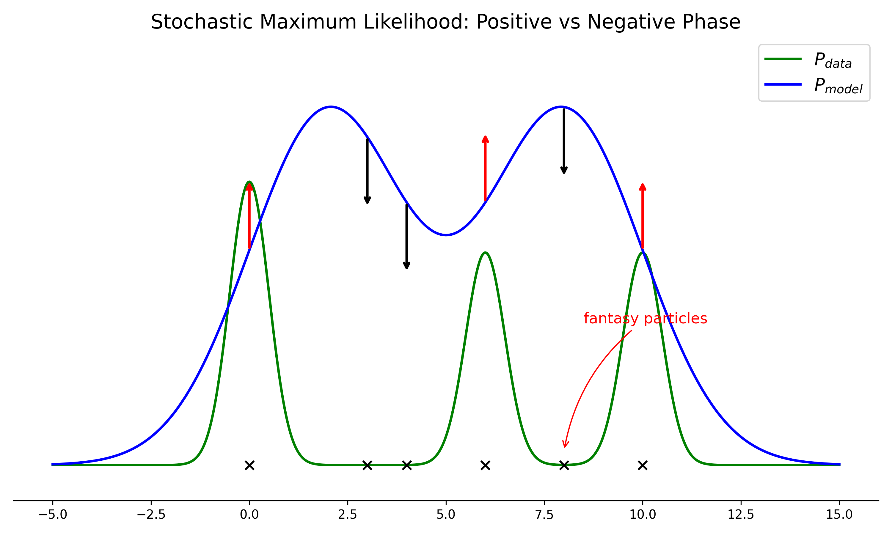

# 配分函数

## 1. 对数似然梯度 (The Log-Likelihood Gradient)

### 动机 (Motivation)

在无向图模型（如马尔可夫逻辑网络、玻尔兹曼机等）中，我们经常会遇到**配分函数** (Partition Function) 的计算问题。它主要出现在两个核心任务中：
1. **学习 (Learning)**：我们需要通过最大化似然函数来估计模型参数。
2. **评估 (Evaluation)**：我们需要计算特定事件的概率。

假设我们的随机变量为 $x \in \mathbb{R}^p$ 或 $x \in \{0, 1\}^p$，模型分布可以写成未归一化的概率分布形式：

$$
P(x; \theta) = \frac{1}{Z(\theta)} \hat{P}(x; \theta)
$$

其中，$\hat{P}(x; \theta)$ 是未归一化的势函数，$Z(\theta)$ 就是配分函数（用来保证概率积分或求和为1的归一化常数）：

$$
Z(\theta) = \int \hat{P}(x; \theta) dx
$$

*(注：如果 $x$ 是离散变量，积分则变为求和。)*

### 机器学习中的参数估计 (ML Learning)

给定训练数据集 $X = \{x_i\}_{i=1}^N$，我们需要估计参数 $\theta$。通常我们使用最大似然估计（Maximum Likelihood Estimation, MLE）。

参数估计的目标是最大化数据集的似然函数：

$$
\hat{\theta} = \arg\max_{\theta} P(X; \theta) = \arg\max_{\theta} \prod_{i=1}^N P(x_i; \theta)
$$

为了方便计算，我们对其取对数，将连乘变为连加。因为对数函数是单调递增的，这不会改变最大值所在的位置：

$$
= \arg\max_{\theta} \log \left( \prod_{i=1}^N P(x_i; \theta) \right) = \arg\max_{\theta} \sum_{i=1}^N \log P(x_i; \theta)
$$

接下来，我们将原始的概率表示 $P(x; \theta) = \frac{1}{Z(\theta)} \hat{P}(x; \theta)$ 代入上式中：

$$
= \arg\max_{\theta} \sum_{i=1}^N \left( \log \hat{P}(x_i; \theta) - \log Z(\theta) \right)
$$

我们可以将求和拆开。由于 $\log Z(\theta)$ 这一项与数据样本 $x_i$ 无关，我们可以将其提取出来：

$$
= \arg\max_{\theta} \left( \sum_{i=1}^N \log \hat{P}(x_i; \theta) - N \log Z(\theta) \right)
$$

为了得到类似于均值的目标函数，我们将整体除以样本数量 $N$（这也是一个合法的单调变换）：

$$
= \arg\max_{\theta} \underbrace{\left( \frac{1}{N} \sum_{i=1}^N \log \hat{P}(x_i; \theta) - \log Z(\theta) \right)}_{L(\theta)}
$$

我们定义被最大化的目标函数（即对数似然）为 $L(\theta)$：
$$
L(\theta) = \frac{1}{N} \sum_{i=1}^N \log \hat{P}(x_i; \theta) - \log Z(\theta)
$$

### 求解梯度 (Gradient Derivation)

为了使用梯度上升等优化算法求解 $\hat{\theta}$，我们需要对目标函数 $L(\theta)$ 求参数 $\theta$ 的梯度：

$$
\nabla_{\theta} L(\theta) = \underbrace{ \frac{1}{N} \sum_{i=1}^N \nabla_{\theta} \log \hat{P}(x_i; \theta) }_{\text{① Data-dependent term}} - \underbrace{ \nabla_{\theta} \log Z(\theta) }_{\text{② Model-dependent term}}
$$

第一部分 ① 很容易计算，它只是未归一化概率对数的梯度在所有样本上的经验平均。难点在于第二部分 ②，即配分函数对数 $\log Z(\theta)$ 的梯度。我们来专门推导这一项：

我们需要求解的是 $\nabla_{\theta} \log Z(\theta)$。根据复合函数求导法则 $\nabla \log f(x) = \frac{\nabla f(x)}{f(x)}$，以及 $P(x;\theta) = \frac{\hat{P}(x;\theta)}{Z(\theta)}$ （即 $\frac{1}{Z(\theta)} = \frac{P(x;\theta)}{\hat{P}(x;\theta)}$）：

$$
\text{②} = \nabla_{\theta} \log Z(\theta) = \frac{1}{Z(\theta)} \cdot \nabla_{\theta} Z(\theta)
$$

将 $Z(\theta) = \int \hat{P}(x; \theta) dx$ 代入：

$$
= \frac{P(x; \theta)}{\hat{P}(x; \theta)} \cdot \nabla_{\theta} \int \hat{P}(x; \theta) dx
$$

假设积分和求导可以可逆交换顺序（在满足一定正则条件下成立），我们将求导符号移入积分号内，并将外层的常数系数（相对于 $x$ 积分来说，等效于 $\frac{1}{Z(\theta)}$ 作为常数乘入以 $\hat{P}$ 的积分中）：

$$
\text{②} = \int \frac{1}{Z(\theta)} \cdot \nabla_{\theta} \hat{P}(x; \theta) dx
$$

再次利用关系 $\frac{1}{Z(\theta)} = \frac{P(x; \theta)}{\hat{P}(x; \theta)}$，我们将其代入积分内：

$$
= \int \frac{P(x; \theta)}{\hat{P}(x; \theta)} \cdot \nabla_{\theta} \hat{P}(x; \theta) dx
$$

重新组合一下：

$$
= \int P(x; \theta) \cdot \left( \frac{\nabla_{\theta} \hat{P}(x; \theta)}{\hat{P}(x; \theta)} \right) dx
$$

由于 $\frac{\nabla_{\theta} \hat{P}(x; \theta)}{\hat{P}(x; \theta)} = \nabla_{\theta} \log \hat{P}(x; \theta)$，所以上式变为：

$$
= \int P(x; \theta) \cdot \nabla_{\theta} \log \hat{P}(x; \theta) dx
$$

观察这个积分形式，它恰好是函数 $\nabla_{\theta} \log \hat{P}(x; \theta)$ 在模型分布 $P(x; \theta)$ 下的期望：

$$
= \mathbb{E}_{x \sim P(x; \theta)} \left[ \nabla_{\theta} \log \hat{P}(x; \theta) \right]
$$

### 总结

将求解得到的 ② 代回梯度的整体公式中，我们得到了对数似然梯度的最终形式：

$$
\nabla_{\theta} L(\theta) = \frac{1}{N} \sum_{i=1}^N \nabla_{\theta} \log \hat{P}(x_i; \theta) - \mathbb{E}_{x \sim P(x; \theta)} \left[ \nabla_{\theta} \log \hat{P}(x; \theta) \right]
$$

这个公式给出了非常直观的物理意义：梯度的第一项是无约束情况下的经验期望（由训练数据决定），第二项是模型当前分布下的理论期望。梯度的更新过程，就是试图让模型分布产生的数据期望去逼近真实数据产生的经验期望，这就是**基于梯度的模型学习的核心本质**。

## 2. 随机最大似然 (Stochastic Maximum Likelihood)

在上一节中，我们推导出了对数似然梯度的形式：

$$
\nabla_{\theta} L(\theta) = \mathbb{E}_{P_{data}} \left[ \nabla_{\theta} \log \hat{P}(x; \theta) \right] - \mathbb{E}_{P_{model}} \left[ \nabla_{\theta} \log \hat{P}(x; \theta) \right]
$$

*(注：这里我们将第一项写成了基于经验数据分布 $P_{data}$ 的期望形式，以与第二项基于模型分布 $P_{model} \triangleq P(x; \theta)$ 的期望相对应。其中连续变量 $x \in \mathbb{R}^p$，离散变量 $x \in \{0, 1\}^p$)*

这个梯度公式揭示了训练过程中的两个相对抗的阶段：
1. **正相阶段 (Positive Phase / Data-dependent phase)**：对应公式的前半部分 $\mathbb{E}_{P_{data}}[\dots]$。这一步试图提高训练数据样本（真实数据）的概率。
2. **负相阶段 (Negative Phase / Model-dependent phase)**：对应公式的后半部分 $\mathbb{E}_{P_{model}}[\dots]$。这一步试图降低模型自身生成的样本（"幻觉"数据）的概率。

### 梯度上升算法 (Gradient Ascent)

基于上述梯度，参数的更新规则（梯度上升）为：

$$
\theta^{(t+1)} := \theta^{(t)} + \eta \nabla_{\theta} L(\theta^{(t)})
$$

其中 $\eta$ 是学习率（Learning Rate）。

### 基于马尔可夫链蒙特卡洛的梯度上升 (Gradient Ascent based on MCMC)

直接计算梯度的难点在于第二项的期望：$\mathbb{E}_{P_{model}} \left[ \nabla_{\theta} \log \hat{P}(x; \theta) \right]$。由于配分函数难以计算，我们通常无法精确计算这个期望。

为了解决这个问题，我们采用**马尔可夫链蒙特卡洛 (Markov Chain Monte Carlo, MCMC)** 方法，特别是**吉布斯采样 (Gibbs Sampling)**，从当前模型分布 $P_{model} = P(x; \theta^{(t)})$ 中进行采样，用样本均值来近似这个期望。

具体操作如下：从当前模型分布中采样 $m$ 个样本，我们称这些样本为**幻想粒子 (Fantasy Particles)**：

$$
\hat{x}_1 \sim P(x; \theta^{(t)}) \\
\vdots \\
\hat{x}_m \sim P(x; \theta^{(t)})
$$

这样，梯度的负相部分就可以用这些幻想粒子来近似估计：

$$
\mathbb{E}_{P_{model}} \left[ \nabla_{\theta} \log \hat{P}(x; \theta) \right] \approx \frac{1}{m} \sum_{i=1}^m \nabla_{\theta} \log \hat{P}(\hat{x}_i; \theta)
$$

将正相阶段的经验期望（假设有 $N$ 个训练样本）和负相阶段的 MCMC 估计代入梯度上升公式，我们得到了**随机最大似然 (Stochastic Maximum Likelihood, SML)** 的最终参数更新等式：

$$
\theta^{(t+1)} := \theta^{(t)} + \eta \left( \frac{1}{N} \sum_{i=1}^N \nabla_{\theta} \log \hat{P}(x_i; \theta^{(t)}) - \frac{1}{m} \sum_{i=1}^m \nabla_{\theta} \log \hat{P}(\hat{x}_i; \theta^{(t)}) \right)
$$

### 直观理解 (Intuition)

为了更好地理解这个学习过程，我们可以通过下面的示意图来观察真实数据分布和模型分布是如何在梯度的指导下发生变化的。

<!-- Generated by scripts/generate_ch24_sml_distribution_plot.py -->

- **绿色曲线 ($P_{data}$)**：真实的训练数据分布。通常在具体样本点上表现为高峰。
- **蓝色曲线 ($P_{model}$)**：当前模型参数 $\theta^{(t)}$ 对应的分布。
- **向上的箭头（正相阶段）**：梯度上升的第一项引导机制。在真实数据所在的区域（即 $P_{data}$ 较大的地方），模型试图增加这些点在未归一化概率 $\hat{P}(x; \theta)$ 中的“能量”或权重。
- **向下的箭头（负相阶段）**：梯度上升的第二项惩罚机制。我们在当前模型分布 $P_{model}$ 下进行 Gibbs 采样，得到一些“幻想粒子"（红色的 $\times$ 号）。模型会压低这些粒子所在区域的概率。

整个学习过程就像是一场拉锯战：真实数据点向上拉长概率密度，而模型自己幻想出的“虚假部分”（即使那里没有真实数据，模型却分配了较高概率的区域）被向下拉低。最终，$P_{model}$ 会逐渐向 $P_{data}$ 逼近。

### 最大似然学习的 KL 散度视角 (The KL Divergence Perspective of ML Learning)

在上一节的开头，我们将参数估计的目标定义为最大化对数似然函数。如果我们从信息论中**KL 散度 (Kullback-Leibler Divergence)** 的角度来看待这个过程，会得到一个非常优雅的结论：**最大化似然本质上就是在最小化数据分布 $P_{data}$ 和模型分布 $P_{model}$ 之间的 KL 散度**。

我们可以通过严谨的数学推导来证明这一点。回顾我们的最大似然目标：

$$
\hat{\theta} = \arg\max_{\theta} \frac{1}{N} \sum_{i=1}^N \log P(x_i; \theta)
$$

由于训练样本 $x_i$ 是从真实数据分布 $P_{data}(x)$ 中采样得到的经验分布，当样本量 $N$ 足够大时，上述经验平均可以转化为在 $P_{data}$ 分布下的期望：

$$
= \arg\max_{\theta} \mathbb{E}_{x \sim P_{data}} [\log P_{model}(x; \theta)]
$$

将期望写成积分形式：

$$
= \arg\max_{\theta} \int P_{data}(x) \cdot \log P_{model}(x; \theta) dx
$$

这里，我们巧妙地引入一个不依赖于参数 $\theta$ 的项：$\int P_{data}(x) \cdot \log P_{data}(x) dx$。因为这一项对于 $\theta$ 来说是一个常数，减去它并不会改变 $\arg\max$ 的结果位置：

$$
= \arg\max_{\theta} \left( \int P_{data}(x) \cdot \log P_{model}(x; \theta) dx - \int P_{data}(x) \cdot \log P_{data}(x) dx \right)
$$

合并积分项：

$$
= \arg\max_{\theta} \int P_{data}(x) \cdot \log \frac{P_{model}(x; \theta)}{P_{data}(x)} dx
$$

提取出一个负号：

$$
= \arg\max_{\theta} - \int P_{data}(x) \cdot \log \frac{P_{data}(x)}{P_{model}(x; \theta)} dx
$$

根据 KL 散度的定义，积分部分正是 $KL(P_{data} \| P_{model})$：

$$
= \arg\max_{\theta} - KL(P_{data} \| P_{model})
$$

最大化一个负数，等价于最小化它的正数部分：

$$
= \arg\min_{\theta} KL(P_{data} \| P_{model})
$$

这证明了：**最大似然学习 (ML Learning) 的本质是调整参数 $\theta$，使得模型分布 $P_{model}$ 尽可能去逼近真实数据分布 $P_{data}$**。为了书写方便，我们记数据分布为 $P^{(0)}$，模型分布（MCMC 运行至稳态后的分布）为 $P^{(\infty)}$，则目标为：

$$
\text{ML Learning Goal: } \arg\min_{\theta} KL(P^{(0)} \| P^{(\infty)})
$$

### CD 学习的目标 (The Goal of CD Learning)

*(注：这部分为下一节 CD 学习做铺垫)*

在下一节我们要介绍的对比散度 (Contrastive Divergence, CD) 算法中，算法并没有追求让马尔可夫链完全收敛到稳态分布 $P^{(\infty)}$，而是截断在第 $k$ 步分布 $P^{(k)}$。Hinton 证明了，CD 学习实际上是在优化两个 KL 散度之差：

$$
\hat{\theta}_{CD} \approx \arg\min_{\theta} \left[ KL(P^{(0)} \| P^{(\infty)}) - KL(P^{(k)} \| P^{(\infty)}) \right]
$$

这一“散度之差”也就是**"对比散度" (Contrastive Divergence)** 名字的由来。

## 3. 对比散度 (Contrastive Divergence)

尽管随机最大似然 (SML) 通过 MCMC 采样近似了梯度中的负相期望，但在实际操作中仍然存在一个致命的问题：**混合时间 (Mixing Time)**。

传统的 MCMC 算法（如 Gibbs Sampling）必须运行足够长的时间，也就是要经历漫长的“混合时间”，才能保证采样结果真正服从目标分布（即模型分布 $P_{model}$）。这意味着在参数优化的每一步 $t+1$，我们都要运行一个极长的马尔可夫链来获得仅仅几个用来估算期望的“幻想粒子”。这种计算开销是巨大的，导致训练过程非常缓慢。

为了解决这个问题，Geoffrey Hinton 等人提出了一种非常高效的近似算法：**对比散度 (Contrastive Divergence, CD-k)**。

对比散度算法巧妙地改变了马尔可夫链的初始化策略，并极大地截断了采样步数，从而大大提升了效率。让我们来看在参数更新的第 $t+1$ 步时，CD-k 是怎么做的：

### 第 1 步：正相采样 (Sampling for Positive Phase)

正相阶段需要从真实数据分布 $P_{data}$ 中采样：
$$
x_1, x_2, \dots, x_m \sim P_{data}
$$
由于我们已经手握训练集，这一步**直接 (directly)** 从训练集中抽取一个小批次 (mini-batch) 的真实数据即可。这里的 $x_1, \dots, x_m$ 本身就是训练数据样本。

### 第 2 步：负相采样 (Sampling for Negative Phase)

负相阶段需要从模型分布 $P_{model} = P(x; \theta^{(t)})$ 中采样获得幻想粒子 $\hat{x}_i$。CD-k 对传统的 Gibbs 采样做了两个关键的修改：

**1. 巧妙的初始化 (Initialization)**
传统 MCMC 通常随机初始化马尔可夫链的状态。但是在 CD-k 中，**我们将马尔可夫链的初始状态直接设置为正相阶段抽取的真实数据！**
$$
\begin{align}
\hat{x}_1 &= x_1 \\
\hat{x}_2 &= x_2 \\
&\vdots \\
\hat{x}_m &= x_m
\end{align}
$$
这个做法非常关键。因为在训练后期，模型分布 $P_{model}$ 已经比较接近数据分布 $P_{data}$了。如果我们的链从真实数据出发，那么它本身就**极度接近目标稳态分布**，这极大地缩短了所需的“混合时间”。

**2. 截断采样步数 (Truncated steps: k-step)**
因为初始化点已经非常接近稳态，CD-k 认为没有必要再运行漫长的采样链去等待完全混合。相反，我们只让 Gibbs 采样在模型分布下运行 $k$ 步：
* 初始状态（0-step）：$x_i$
* 迭代 1 步（1-step）
* ……
* 迭代 $k$ 步（k-step），得到最终近似样本：$\hat{x}_i$

在实际应用中（特别是对于受限玻尔兹曼机 RBM 等模型），**即使 $k=1$ (即 CD-1)，也足以提供计算梯度所需的有效下降方向**。

### CD-k 梯度上升法则

综合正相采样和经过 $k$ 步 Gibbs 采样的负相采样，我们得到 CD-k 的参数更新法则（与 SML 的更新公式结构完全一致，只是幻想粒子 $\hat{x}_i$ 的生成方式不同）：

$$
\theta^{(t+1)} := \theta^{(t)} + \eta \left[ \sum_{i=1}^m \nabla_{\theta} \log \hat{P}(x_i; \theta^{(t)}) - \sum_{i=1}^m \nabla_{\theta} \log \hat{P}(\hat{x}_i; \theta^{(t)}) \right]
$$

*(注：上式为了与白板板书一致，我们在括号内给出了未除以样本数量 $m$ 的形式，你可以理解为将学习率 $\eta$ 吸纳了批量大小的常数因子，这在实际工程优化中是非常常见的)*

## 4. RBM 学习算法 (RBM Learning Algorithm)

为了将抽象的对数似然梯度公式以及对比散度（CD）算法具体化，我们来看看如何推导**限制玻尔兹曼机 (Restricted Boltzmann Machine, RBM)** 的梯度，并利用 CD 算法训练它。

### 4.1 RBM 能量函数与边缘似然

首先，回顾一下 RBM 的能量函数定义：
* 隐藏节点 $h$ 与可见节点 $v$ 之间的权重矩阵: $W$
* 隐层偏置: $a$，可见层偏置: $b$
* 参数集合: $\theta = \{W, a, b\}$

**能量函数 (Energy Function):**
$$
E(h, v) = -(h^T W v + a^T h + b^T v)
$$

**联合概率分布 (Joint Probability):**
$$
P(h, v) = \frac{1}{Z} \exp\{-E(h, v)\}
$$

给定一个样本 $v$，其对数边缘似然为：

$$
\log P(v) = \log \sum_h P(h, v) = \log \sum_h \frac{1}{Z} \exp\{-E(h, v)\}
$$

展开配分函数 $Z = \sum_{h, v} \exp\{-E(h, v)\}$ 并利用对数性质分离分子和分母：

$$
\begin{align}
\log P(v) &= \log \frac{\sum_h \exp\{-E(h, v)\}}{\sum_{h, v} \exp\{-E(h, v)\}} \\
&= \underbrace{ \log \sum_h \exp\{-E(h, v)\} }_{\text{①}} - \underbrace{ \log \sum_{h, v} \exp\{-E(h, v)\} }_{\text{②}}
\end{align}
$$

我们需要求解梯度：
$$
\frac{\partial}{\partial \theta} \log P(v) = \frac{\partial}{\partial \theta} \text{①} - \frac{\partial}{\partial \theta} \text{②}
$$

### 4.2 求解正相与负相梯度

#### 求解正相部分 ①

根据复合函数求导法则：

$$
\begin{align}
\frac{\partial}{\partial \theta} \text{①} &= \frac{\partial}{\partial \theta} \log \sum_h \exp\{-E(h, v)\} \\
&= \frac{1}{\sum_{h'} \exp\{-E(h', v)\}} \cdot \sum_h \left[ \exp\{-E(h, v)\} \cdot \frac{\partial (-E(h, v))}{\partial \theta} \right] \\
&= - \sum_h \left[ \underbrace{ \frac{\exp\{-E(h, v)\}}{\sum_{h'} \exp\{-E(h', v)\}} }_{P(h|v)} \cdot \frac{\partial E(h, v)}{\partial \theta} \right]
\end{align}
$$

括号内的分数正是给定可见状态 $v$ 下隐藏状态 $h$ 的条件概率 $P(h|v)$：

$$
\frac{\partial}{\partial \theta} \text{①} = - \sum_h P(h|v) \cdot \frac{\partial E(h, v)}{\partial \theta}
$$

#### 求解负相部分 ②

用相同方法对配分函数对数项求导：

$$
\begin{align}
\frac{\partial}{\partial \theta} \text{②} &= \frac{\partial}{\partial \theta} \log \sum_{h, v} \exp\{-E(h, v)\} \\
&= \frac{1}{\sum_{h', v'} \exp\{-E(h', v')\}} \cdot \sum_{h, v} \left[ \exp\{-E(h, v)\} \cdot \frac{\partial (-E(h, v))}{\partial \theta} \right] \\
&= - \sum_{h, v} \left[ \underbrace{ \frac{\exp\{-E(h, v)\}}{\sum_{h', v'} \exp\{-E(h', v')\}} }_{P(h, v)} \cdot \frac{\partial E(h, v)}{\partial \theta} \right]
\end{align}
$$

分母恰为 $Z$，因此该分数即模型分布 $P(h, v)$：

$$
\frac{\partial}{\partial \theta} \text{②} = - \sum_{h, v} P(h, v) \cdot \frac{\partial E(h, v)}{\partial \theta}
$$

#### 完整 RBM 梯度公式

将 ① 和 ② 的偏导代回原式：

### 4.3 权重 $w_{ij}$ 的具体梯度 (Gradient w.r.t Weight $w_{ij}$)

我们可以进一步深入，看看能量函数对特定权重 $w_{ij}$ 的偏导数具体是什么形式。

回顾 RBM 的能量函数，将矩阵形式完全展开为标量求和：

$$
E(h, v) = -\left( \sum_{i=1}^m \sum_{j=1}^n h_i w_{ij} v_j + \Delta \right)
$$

其中 $\Delta$ 包含了偏置项，与 $w_{ij}$ 无关。对具体的参数 $w_{ij}$ 求偏导：

$$
\frac{\partial E(h, v)}{\partial w_{ij}} = -h_i v_j
$$

将这个结果代回我们推导出的单样本对数似然梯度公式中：

$$
\begin{align}
\frac{\partial}{\partial w_{ij}} \log P(v) &= - \sum_h P(h|v) \cdot (-h_i v_j) - \left( - \sum_{h, v} P(h, v) \cdot (-h_i v_j) \right) \\
&= \underbrace{ \sum_h P(h|v) \cdot h_i v_j }_{\text{① 正相}} - \underbrace{ \sum_{h, v} P(h, v) \cdot h_i v_j }_{\text{② 负相}}
\end{align}
$$

让我们分别化简这左右两项。由于隐含节点是二值的 ($h_i \in \{0, 1\}$)，它的期望值就等于它被激活（取值为1）时的概率。

**正相化简 (Positive Phase Simplification)：**

在第一项 ① 中，我们对所有隐藏层状态的组合求和：

$$
\begin{align}
\text{①} &= \sum_{h_1} \sum_{h_2} \dots \sum_{h_m} P(h_1, h_2, \dots, h_m | v) \cdot h_i v_j \\
&= \sum_{h_i} P(h_i|v) \cdot h_i v_j \\
&= P(h_i=1|v) \cdot v_j
\end{align}
$$

**负相化简 (Negative Phase Simplification)：**

在第二项 ② 中，我们对所有隐藏层状态和可见层状态求和。利用边缘概率公式 $P(h,v) = P(v)P(h|v)$：

$$
\begin{align}
\text{②} &= \sum_v \sum_h P(v) \cdot P(h|v) \cdot h_i v_j \\
&= \sum_v P(v) \sum_h P(h|v) \cdot h_i v_j \\
&= \sum_v P(v) P(h_i=1|v) \cdot v_j
\end{align}
$$

**整体数据集的真实梯度 (Gradient over the Training Set)：**

如果我们有一个包含 $N$ 个样本的训练集 $S$，整个数据集的对数似然梯度就是所有样本梯度的平均值：

$$
\frac{\partial}{\partial w_{ij}} \left[ \frac{1}{N} \sum_{v \in S} \log P(v) \right] = \frac{1}{N} \sum_{v \in S} \left( P(h_i=1|v) \cdot v_j \right) - \sum_{v'} P(v') P(h_i=1|v') \cdot v'_j
$$

### 4.4 基于 CD-k 的 RBM 训练算法 (RBM Training Algorithm based on CD-k)

现在我们有了具体的针对权重 $w_{ij}$ 的梯度期望表示，我们可以写出使用 **对比散度 (CD-k)** 训练 RBM 的完整算法流程。回忆一下，在 CD-k 中，我们的马尔可夫链不是随机初始化的，而是直接使用训练样本来初始化可见层，并且仅仅运行 $k$ 步 Gibbs 采样 (Gibbs Sampling) 就会截断。

由于 RBM 层内无连接的“受限”特性，我们可以进行**块吉布斯采样 (Block Gibbs Sampling)**。这意味着我们可以一次性并行地采样整个隐藏层的所有神经元，然后再一次性并行地采样整个可见层的所有神经元。

具体的 CD-k 算法流程如下：

1. **输入参数：** 训练集 $S$，样本总数 $|S| = N$，学习率 $\eta$。
2. **初始化：** $\Delta w_{ij} \leftarrow 0$ (对所有的 $i \in \{1,\dots,m\}$ 和 $j \in \{1,\dots,n\}$)。

**对于训练集 $S$ 中的每一个样本 $v$：**
>
> 1. **初始化采样链正相起点：**
>    $v^{(0)} \leftarrow v$
>
> 2. **执行 $k$ 步块吉布斯采样 (Block Gibbs Sampling)：**
>    $\text{For } l = 0, 1, 2, \dots, k-1:$
>    - 采样隐藏层：$\text{For } i = 1, \dots, m: \quad \text{sample } h_i^{(l)} \sim P(h_i | v^{(l)})$
>    - 采样可见层：$\text{For } j = 1, \dots, n: \quad \text{sample } v_j^{(l+1)} \sim P(v_j | h^{(l)})$
>
> 3. **计算梯度近似并累加更新量：**
>    有了正相的起点 $(v^{(0)})$ 和负相的终点粒子 $(v^{(k)})$ 后，对每一个权重 $w_{ij}$ 计算其增量近似：
>    $\text{For } i = 1, \dots, m; \ j = 1, \dots, n:$
>    $$
>    \Delta w_{ij} \leftarrow \Delta w_{ij} + \left[ P(h_i=1 | v^{(0)}) \cdot v_j^{(0)} - P(h_i=1 | v^{(k)}) \cdot v_j^{(k)} \right]
>    $$

**更新模型参数：**
当遍历完整个数据集（或一个小批量 mini-batch）后，使用累加的梯度更新权重：
$$
w_{ij} := w_{ij} + \frac{\eta}{N} \Delta w_{ij}
$$

**直观理解采样链转移：**
整个 Block Gibbs Sampling 可以被可视化为如下的马尔可夫链状态转移（其中 $h$ 代表隐藏层状态，$v$ 代表可见层状态）：

$$
\left[ \begin{array}{c} h^{(0)} \\ \uparrow \\ v^{(0)} \end{array} \right] \xrightarrow{\text{Gibbs}} \left[ \begin{array}{c} h^{(1)} \\ \uparrow \\ v^{(1)} \end{array} \right] \xrightarrow{\text{Gibbs}} \cdots \xrightarrow{\text{Gibbs}} \left[ \begin{array}{c} h^{(k)} \\ \uparrow \\ v^{(k)} \end{array} \right]
$$

每次向上箭头隐式表示了 $h^{(l)} \sim P(h|v^{(l)})$，而向下或向右下箭头的生成则表示了 $v^{(l+1)} \sim P(v|h^{(l)})$。我们利用 $v^{(0)}$ 计算正相共现概率，利用第 $k$ 步的 $v^{(k)}$ 计算截断的负相共现概率，从而极大地提升了 RBM 的训练速度。
