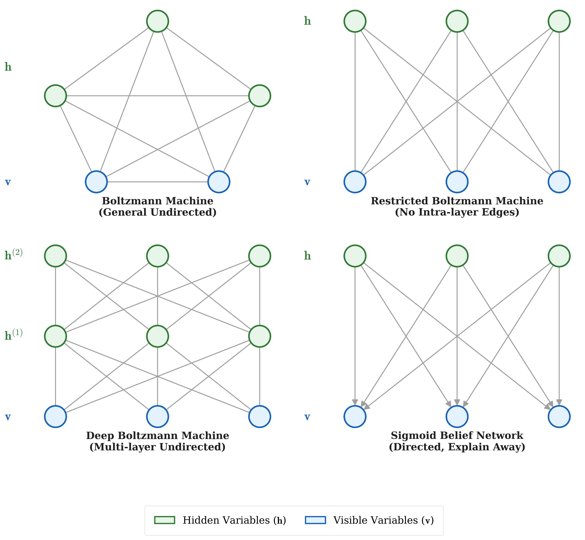

# 近似推断 (Approximate Inference)

## 1. 简介 (Introduction)

在之前的章节中，我们学习了多种概率图模型 (Probabilistic Graphical Models)。下图展示了几种常见的概率图模型：

<!-- Generated by scripts/generate_ch25_inference_models.py -->

图中展示了四种网络结构，其中 $h$ 代表隐藏变量 (hidden variables)，$v$ 代表观测变量 (visible variables，带阴影的节点)：
1. **Boltzmann Machine**: 一般的无向图模型，节点之间允许全连接。
2. **Restricted Boltzmann Machine (RBM)**: 受限玻尔兹曼机，是一个二分图，层内无连接，层间全连接。
3. **Deep Boltzmann Machine (DBM)**: 深度玻尔兹曼机，包含多个隐藏层，相邻层之间全连接，层内无连接。
4. **Sigmoid Belief Network**: 有向图模型，边从隐藏层指向观测层。

在以上复杂的图结构中，推断 (Inference) 是核心问题之一。

### 1.1 推断的动机 (Motivation for Inference)

我们为什么需要进行推断呢？主要有两个动机：
- **推断本身 (Inference itself)**: 在给定部分可观测数据的情况下，我们想要求解某些隐变量的后验概率 $P(h|v)$，或者基于已有模型进行预测。
- **学习需要 (Learning needs)**: 在模型的参数学习（如极大似然估计的梯度上升）过程中，我们往往需要计算对数似然函数的梯度。梯度的计算往往涉及求期望，这就要求我们能够在当前模型下进行推断以估计这些期望值（如在 EM 算法的 E 步中计算隐变量的后验）。

### 1.2 推断的困难 (Difficulties of Inference)

在复杂的图模型中，精确推断 (Exact Inference) 往往是极其困难的，原因在于图连接引入了复杂的依赖关系：
- **有向图 (Directed Graph)**: 比如 Sigmoid Belief Network。在观测到共同的子节点 $v$ 之后，原本独立的父节点（隐变量 $h$）之间会产生依赖关系，这就是所谓的 **explain away** (具有协同效应或“解释掉”效应) 现象。这使得求解隐变量的后验变得非常棘手。
- **无向图 (Undirected Graph)**: 比如 Boltzmann Machine 及其变种。节点之间存在大量的 **mutual interaction** (相互作用) 以及环状结构（并且计算配分函数 Partition Function 在高维下通常不可行），导致精确计算边缘概率或条件概率的复杂度呈指数级增长。

因为精确推断在很多实际模型中是 intractable (不可处理) 的，所以我们需要引入 **近似推断 (Approximate Inference)**，这将会是本章讨论的核心内容。

## 2. 推断即优化 (Inference as Optimization)

在近似推断中，最核心的一个思想是将“推断”问题转化为一个“优化”问题。我们通过引入一个变分分布 (Variational Distribution) $q(h|v)$ 来近似真实的后验分布 $P(h|v)$。寻找最好的近似分布 $q(h|v)$ 的过程，就是一个优化过程。这就是**变分推断 (Variational Inference, VI)** 的基础。

给定观测数据样本集 $V = \{v\}$，我们关注对数似然函数 (log-likelihood): $\sum_{v \in V} \log P(v)$。
对于单个样本的对数似然 $\log P(v)$，我们可以进行如下详细的数学推导，展示它如何被分解为两部分：证据下界 (ELBO) 和 KL 散度 (KL Divergence)。

**详细推导步骤：**

首先，根据条件概率的定义 $P(h|v) = \frac{P(v, h)}{P(v)}$，我们可以将 $\log P(v)$ 展开：
$$
\log P(v) = \log \frac{P(v, h)}{P(h|v)}
$$

接着，我们在分子和分母中同时乘以并除以变分分布 $q(h|v)$：
$$
\log P(v) = \log \left( \frac{P(v, h)}{q(h|v)} \cdot \frac{q(h|v)}{P(h|v)} \right)
$$

利用对数的乘法性质 $\log(A \cdot B) = \log A + \log B$，将上式拆开：
$$
\log P(v) = \log \frac{P(v, h)}{q(h|v)} + \log \frac{q(h|v)}{P(h|v)}
$$

现在，我们在等式两边同时对 $h$ 根据分布 $q(h|v)$ 求积分（假设 $h$ 为连续变量。若为离散变量，则将等式两边同乘 $q(h|v)$ 后求和）：
$$
\int \log P(v) \cdot q(h|v) dh = \int \log \frac{P(v, h)}{q(h|v)} \cdot q(h|v) dh + \int \log \frac{q(h|v)}{P(h|v)} \cdot q(h|v) dh
$$

分析等式左边：因为 $\log P(v)$ 是不依赖于 $h$ 的常数，可以直接提出来，并且概率密度函数本身的积分为 $1$ 即 $\int q(h|v) dh = 1$，所以左边依然是 $\log P(v)$。
再看等式的右边，由期望和 KL 散度的定义，上式可以写为：
$$
\log P(v) = \mathbb{E}_{q(h|v)} \left[ \log \frac{P(v, h)}{q(h|v)} \right] + \text{KL}(q(h|v) || P(h|v))
$$

我们可以进一步将第一项期望内部展开：
$$
\log P(v) = \mathbb{E}_{q(h|v)} \left[ \log P(v, h) - \log q(h|v) \right] + \text{KL}(q(h|v) || P(h|v))
$$

将期望操作作用到里面的每一项，并利用信息熵的定义 $H[q] = - \mathbb{E}_{q(h|v)} [\log q(h|v)]$：
$$
\log P(v) = \underbrace{ \mathbb{E}_{q(h|v)} \left[ \log P(v, h) \right] + H[q] }_{\text{ELBO} = \mathcal{L}(v, h, q)} + \underbrace{ \text{KL}(q(h|v) || P(h|v)) }_{\text{KL}(q||P)}
$$

最终，我们得出结论，对数似然 $\log P(v)$ 可以被分解为两部分之和：
1. **ELBO (Evidence Lower Bound)** $\mathcal{L}(v, h, q)$: 证据下界。正是因为 $\text{KL} \geq 0$，所以 $\log P(v) \geq \mathcal{L}$，即 $\mathcal{L}$ 是 $\log P(v)$ 的一个下界。
2. **KL 散度** $\text{KL}(q||P)$: 衡量近似分布 $q(h|v)$ 与真实后验 $P(h|v)$ 之间的差异。

在推断（寻找最优的 $q$）时，由于 $\log P(v)$ 对 $q$ 而言是常数，**最小化 KL 散度等价于最大化 ELBO $\mathcal{L}$**。这就将推断问题巧妙地转化成了优化问题。
