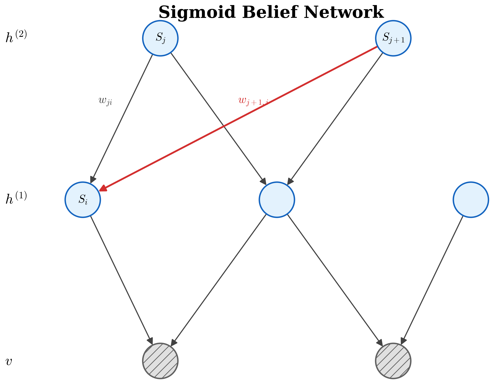
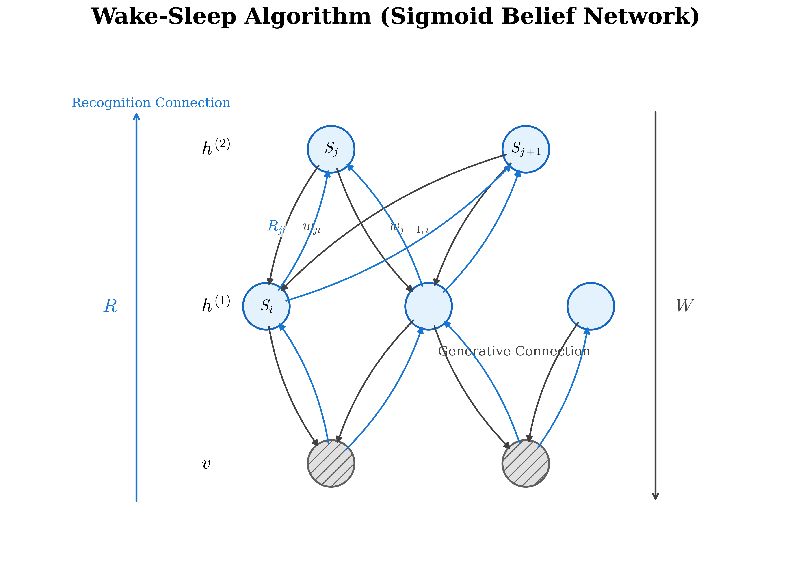

# Sigmoid信念网络 (Sigmoid Belief Network)

## 1. 背景 (Background)

Sigmoid信念网络（Sigmoid Belief Network, 简称SBN）由Radford Neal于1990年左右提出。它是一种用于表示多重随机变量之间联合概率分布的**有向图模型**（Bayesian Network）。

SBN的核心思想是利用Sigmoid函数 $\sigma(x)$ 将线性组合的结果转化为概率，从而构建变量之间的条件概率分布。

### 1.1 变量与图模型结构

<!-- Generated by scripts/generate_ch26_sbn_diagram.py -->

在SBN中，我们将所有的随机变量集合记为 $S$：
$$
S = \{s_1, s_2, \dots, s_J\} = \{v, h\} = \{v, h^{(1)}, h^{(2)}\}
$$
其中，变量被划分为**可见变量**（visible variables）$v$（对应图中的阴影节点）和**隐变量**（hidden variables）$h$（对应图中的空白节点）。隐变量可以进一步划分为多个不同的层级，例如在上面示意图及白板示例中，被划分为 $h^{(1)}$ 和 $h^{(2)}$。

由于SBN是一个有向无环图，变量之间存在因果顺序。通常我们可以对节点进行标号排序，使得节点 $s_i$ 的生成过程只依赖于排在它前面的节点集合 $\{s_j : j < i\}$。连接节点 $j$ 到节点 $i$ 的有向边具有权重 $w_{ji}$。

### 1.2 条件概率分布 (Conditional Probability)

首先回顾Sigmoid函数的定义式：
$$
\sigma(x) = \frac{1}{1 + \exp(-x)}
$$
它具有一个非常重要且在推导中常用的对称性：
$$
\sigma(-x) = 1 - \sigma(x)
$$

在SBN中，假设每个节点都是二元状态变量，即其取值 $s_i \in \{0, 1\}$。给定所有前序节点的状态后，节点 $s_i$ 被激活（即取值为 1）的条件概率被定义为其父节点状态的线性加权和，经过 Sigmoid 函数映射后的结果：
$$
P(s_i = 1 \mid s_j : j < i) = \sigma \left( \sum_{j < i} w_{ji} s_j \right)
$$

基于概率的归一化要求以及前述提及的Sigmoid函数对称性，节点 $s_i$ 不激活（即取值为 0）的条件概率可以通过以下推导得出：
$$
\begin{aligned}
P(s_i = 0 \mid s_j : j < i) &= 1 - P(s_i = 1 \mid s_j : j < i) \\
&= 1 - \sigma \left( \sum_{j < i} w_{ji} s_j \right) \\
&= \sigma \left( - \sum_{j < i} w_{ji} s_j \right)
\end{aligned}
$$

为了将上述两种状态 ($s_i = 1$ 和 $s_i = 0$) 的条件概率表示统一为一个更加简洁的表达式，我们可以引入一个新的变量状态表示 $s_i^*$，其取值范围为 $\{-1, 1\}$，并与原来的状态 $s_i \in \{0, 1\}$ 具有如下对应关系：
$$
s_i^* = 2s_i - 1
$$
（即：当 $s_i=1$ 时，$s_i^*=1$；当 $s_i=0$ 时，$s_i^*=-1$。）

通过这种重新参数化处理，根据上面推导的概率公式，节点 $s_i$ 取任意给定状态的条件概率可以被完美地统一表示为：
$$
P(s_i \mid s_j : j < i) = \sigma \left( s_i^* \sum_{j < i} w_{ji} s_j \right)
$$

## 2. 对数似然函数的梯度 (Gradient of Log-likelihood)

在学习SBN的参数时，我们通常希望最大化观测数据 $v$ 的对数似然函数（log-likelihood）。定义对数似然函数为所有可见变量状态 $v \in V$ 概率的对数和：
$$
\text{log-likelihood} = \sum_{v \in V} \log P(v)
$$

为了使用基于梯度的优化算法（例如梯度上升），我们需要计算对数似然函数关于网络连接权重 $w_{ji}$ 的梯度。我们将详细推导 $\frac{\partial \sum_{v \in V} \log P(v)}{\partial w_{ji}}$ 的数学展开过程。

### 2.1 似然函数梯度的展开

首先，根据链式法则对单项 $\log P(v)$ 求偏导：
$$
\frac{\partial \log P(v)}{\partial w_{ji}} = \frac{1}{P(v)} \cdot \frac{\partial P(v)}{\partial w_{ji}}
$$

由于可见变量 $v$ 是联合分布 $P(v, h)$ 对隐变量 $h$ 边缘化（积分/求和）的结果， 即 $P(v) = \sum_{h} P(v, h)$，我们可以将其代入：
$$
\begin{aligned}
\frac{\partial \log P(v)}{\partial w_{ji}} &= \frac{1}{P(v)} \cdot \frac{\partial \sum_{h} P(v, h)}{\partial w_{ji}} \\
&= \sum_{h} \frac{1}{P(v)} \cdot \frac{\partial P(v, h)}{\partial w_{ji}}
\end{aligned}
$$

利用条件概率公式 $P(h|v) = \frac{P(h, v)}{P(v)}$，即 $\frac{1}{P(v)} = \frac{P(h|v)}{P(h,v)}$，继续展开化简：
$$
\begin{aligned}
\frac{\partial \log P(v)}{\partial w_{ji}} &= \sum_{h} \frac{P(h|v)}{P(h, v)} \cdot \frac{\partial P(v, h)}{\partial w_{ji}} \\
&= \sum_{h} P(h|v) \left( \frac{1}{P(v, h)} \cdot \frac{\partial P(v, h)}{\partial w_{ji}} \right)
\end{aligned}
$$

这里我们记所有节点的状态集合为 $S = \{v, h\}$，因此联合概率 $P(v, h)$ 可以写为 $P(S)$：
$$
\frac{\partial \log P(v)}{\partial w_{ji}} = \sum_{h} P(h|v) \left( \frac{1}{P(S)} \cdot \frac{\partial P(S)}{\partial w_{ji}} \right)
$$

### 2.2 计算联合概率的梯度项

接下来我们需要计算括号内的项 $\frac{1}{P(S)} \cdot \frac{\partial P(S)}{\partial w_{ji}}$。
在SBN中，联合概率 $P(S)$ 定义为所有节点在其父节点条件下的概率乘积：
$$
P(S) = \prod_{k} P(s_k \mid s_j : j < k)
$$

当我们要对特定的权重 $w_{ji}$ （连接节点 $j$ 到节点 $i$）求偏导时，乘积中绝大多数项是不包含 $w_{ji}$ 的常数。由于 $w_{ji}$ 仅直接影响节点 $i$ 的生成概率，我们可以将连乘分解为包含 $w_{ji}$ 的项和不包含 $w_{ji}$ 的常数项 $\Delta_i$：
$$
\Delta_i = \prod_{k \neq i} P(s_k \mid s_j : j < k)
$$
因此，联合概率可以写为 $P(S) = P(s_i \mid s_j : j < i) \cdot \Delta_i$。

代入梯度项中进行偏导计算，常数项 $\Delta_i$ 将会被约掉：
$$
\begin{aligned}
\frac{1}{P(S)} \cdot \frac{\partial P(S)}{\partial w_{ji}} &= \frac{1}{P(s_i \mid s_j : j < i) \cdot \Delta_i} \cdot \Delta_i \frac{\partial P(s_i \mid s_j : j < i)}{\partial w_{ji}} \\
&= \frac{1}{P(s_i \mid s_j : j < i)} \cdot \frac{\partial P(s_i \mid s_j : j < i)}{\partial w_{ji}}
\end{aligned}
$$

回顾之前推导的节点条件概率公式 $P(s_i \mid s_j : j < i) = \sigma \left( s_i^* \sum_{j < i} w_{ji} s_j \right)$，并利用Sigmoid函数的求导性质 $\sigma'(x) = \sigma(x)\sigma(-x)$：
$$
\begin{aligned}
\frac{\partial P(s_i \mid s_j : j < i)}{\partial w_{ji}} &= \frac{\partial}{\partial w_{ji}} \sigma \left( s_i^* \sum_{j < i} w_{ji} s_j \right) \\
&= \sigma \left( s_i^* \sum_{j < i} w_{ji} s_j \right) \cdot \sigma \left( -s_i^* \sum_{j < i} w_{ji} s_j \right) \cdot (s_i^* s_j)
\end{aligned}
$$

将其代回前面的式子中，注意到分母 $P(s_i \mid s_j : j < i)$ 刚好抵消了求导公式中的第一项：
$$
\begin{aligned}
\frac{1}{P(S)} \cdot \frac{\partial P(S)}{\partial w_{ji}} &= \frac{1}{\sigma \left( s_i^* \sum_{j < i} w_{ji} s_j \right)} \cdot \sigma \left( s_i^* \sum_{j < i} w_{ji} s_j \right) \cdot \sigma \left( -s_i^* \sum_{j < i} w_{ji} s_j \right) \cdot s_i^* s_j \\
&= \sigma \left( -s_i^* \sum_{j < i} w_{ji} s_j \right) \cdot s_i^* s_j
\end{aligned}
$$

### 2.3 最终梯度表示与期望形式

将第 2.2 节的项计算结果代回第 2.1 节得到的公式中：
$$
\frac{\partial \log P(v)}{\partial w_{ji}} = \sum_{h} P(h|v) \left[ \sigma \left( -s_i^* \sum_{j < i} w_{ji} s_j \right) \cdot s_i^* s_j \right]
$$

那么，对于整个数据集（假设样本 $v \sim P_{data}$），对数似然函数的总梯度为：
$$
\begin{aligned}
\frac{\partial}{\partial w_{ji}} \sum_{v \in V} \log P(v) &= \sum_{v \in V} \sum_{h} P(h|v) \left[ \sigma \left( -s_i^* \sum_{k < i} w_{ki} s_k \right) \cdot s_i^* s_j \right] \\
&= \mathbb{E}_{\substack{v \sim P_{data} \\ h \sim P(h|v)}} \left[ \sigma \left( -s_i^* \sum_{k < i} w_{ki} s_k \right) \cdot s_i^* s_j \right]
\end{aligned}
$$
*(注：为避免在求和中符号混淆，我们将内层联合条件的求和角标 $j$ 替换为了 $k$)*

这揭示了一个非常直观的结论：参数梯度的计算依赖于给定可见变量数据 $v$ 的条件下，隐变量 $h$ 的后验分布 $P(h|v)$ 上的期望。

## 3. Wake-Sleep 算法 (Wake-Sleep Algorithm)

如上一节所述，当我们在 SBN 中尝试最大化对数似然时，计算梯度需要求得真实后验分布 $P_\theta(h|v)$（此处引入参数 $\theta = W$ 代表生成模型的连接权重）。由于网络中存在大量的隐藏节点相互作用（如“Explain Away”效应），直接计算 $P_\theta(h|v)$ 在计算上是**intractable**（难以处理的）。

为了解决这个问题，Geoffrey Hinton 等人提出了 **Wake-Sleep 算法**。该算法引入了一个额外的参数化模型——**识别模型**（Recognition Model）$q_\phi(h|v)$，用于近似真实的后验分布 $P_\theta(h|v)$。识别模型的参数记为 $\phi = R$。

### 3.1 识别连接与生成连接

下面是加入了识别连接后的网络结构图：

<!-- Generated by scripts/generate_ch26_wake_sleep_diagram.py -->

在 Wake-Sleep 算法框架下，我们需要维护两套不同的单向连接权重：
1. **生成连接 (Generative Connection) $W$**：也是在前面提到的原本 SBN 中的连接。信息流向是**自顶向下 (Top-down)**，由隐变量 $h$ 生成可见变量 $v$，定义了生成模型 $P_\theta(v, h)$。
2. **识别连接 (Recognition Connection) $R$**：Wake-Sleep 算法额外引入的结构。信息流向是**自底向上 (Bottom-up)**，由可见变量 $v$ 推断隐变量 $h$，用于构建近似后验分布 $q_\phi(h|v)$。它帮助模型快速“识别”数据。

### 3.2 变分下界与期望最大化 (EM-like Framework)

有了 $q_\phi(h|v)$ 作为近似之后，优化对数似然 $\log P(v)$ 的问题可以转化为一个类似于 **期望最大化 (Expectation-Maximization, EM) 算法** 的过程。

通过变分推断（Variational Inference）的技巧，我们可以将对数似然分解为**变分下界 (Evidence Lower Bound, ELBO)** 和**KL散度 (Kullback-Leibler Divergence)**：
$$
\log P(v) = \text{ELBO} + KL(q_\phi(h|v) \parallel P_\theta(h|v))
$$
其中，ELBO的定义为：
$$
\begin{aligned}
\text{ELBO} &= \mathbb{E}_{q_\phi(h|v)} \left[ \log \frac{P_\theta(v, h)}{q_\phi(h|v)} \right] \\
&= \mathbb{E}_{q_\phi(h|v)} [ \log P_\theta(v, h) ] + H[q_\phi]
\end{aligned}
$$
由于 $KL \ge 0$，最大化 $\log P(v)$ 可以近似转变为最大化它的下界 ELBO。这一过程分为两个交替进行的阶段：“醒 (Wake)” 和 “睡 (Sleep)”。

### 3.3 Wake Phase (醒阶段)

Wake phase 的目的是提高生成模型解释（生成）观测数据的能力。这对应于 EM 算法中的 **M-step**，即在保持隐变量的推断信息不变的情况下，更新生成模型的参数 $\theta = W$。

1. **自底向上激活神经元 (Bottom-up)**：将真实世界的数据样本 $v$ 输入底层节点，利用**现有的识别连接 $R$ ($\phi$)** 以 Bottom-up 的方式计算网络中各层神经元的状态，从而获得隐变量 $h$ 的各个层级的样本。
2. **学习生成连接 (Learning Generative Connection)**：在上一步我们通过 $q_\phi(h|v)$ 得到了隐变量分布的样本，此时我们将识别参数 $\phi$ 固定（with $\phi$ fixed），尝试最大化 ELBO 中与生成参数 $\theta$ 相关的部分：
$$
\begin{aligned}
\hat{\theta} &= \arg\max_\theta \mathbb{E}_{q_\phi(h|v)} [ \log P_\theta(h, v) ] \\
&= \arg\max_\theta \text{ELBO}(\theta)
\end{aligned}
$$
结合KL散度和ELBO的关系式，固定$\phi$和观测数据$v$的情况下，最大化ELBO相当于最小化KL散度（因为 $\log P(v)$ 相当于常数）：
$$
\hat{\theta} = \arg\min_\theta KL\left(q_\phi(h|v) \parallel P_\theta(h|v)\right)
$$
在此阶段，我们利用公式 2.3 中的梯度结论，以梯度上升的方式更新 $W$ 矩阵，即**求 $W$ 的过程**。

### 3.4 Sleep Phase (睡阶段)

Sleep phase 的目的是让识别模型更准确地近似生成模型所隐含的后验分布过程。这对应于 EM 算法中的 **E-step**，也就是调整识别参数 $\phi = R$ 以便 $q_\phi(h|v)$ 能够更好地贴近 $P_\theta(h|v)$。

1. **自顶向下激活神经元 (Top-down)**：断开与真实数据的连接，让模型处于“睡眠做梦”的状态。从顶层隐变量开始，利用**现有的生成连接 $W$ ($\theta$)** 逐层采样向下传递，直至生成了底层的可见观测样本“梦境” $v$，从而产生了多层 $(h, v)$ 成对的“梦境”样本。
2. **学习识别连接 (Learning Recognition Connection)**：利用生成的 $(h, v)$ 对子，反过来作为监督数据，训练识别模型。目标是寻找一个新的 $\phi$ 来最大化在生成分布下后验近似的对数概率：
$$
\hat{\phi} = \arg\max_\phi \mathbb{E}_{P_\theta(h, v)} [ \log q_\phi(h|v) ]
$$
可以通过对上式的展开，深入理解其数学意义：
$$
\begin{aligned}
\mathbb{E}_{P_\theta(h, v)} [ \log q_\phi(h|v) ] &= \int P_\theta(v) P_\theta(h|v) \cdot \log q_\phi(h|v) \, dh \\
&= \int P_\theta(v) \int P_\theta(h|v) \cdot \log \frac{q_\phi(h|v)}{P_\theta(h|v)} \cdot P_\theta(h|v) \, dh \\
&\approx \int P_\theta(v) \cdot \left[ -KL(P_\theta(h|v) \parallel q_\phi(h|v)) \right]
\end{aligned}
$$
所以，寻找最优的 $\phi$ 本质上也是在最小化两个分布之间的差异：
$$
\hat{\phi} = \arg\min_\phi KL \left( P_\theta(h|v) \parallel q_\phi(h|v) \right)
$$
*(注：请注意 Sleep Phase 和 Wake Phase 中 KL 散度变量的方向是反过来的，这也揭示了这种变分近似方案的一种妥协：由于真实后验难求，我们在 Sleep phase 最小化的是一个易于由生成模型采样获得的、反向形式的 KL 散度)*。

在此阶段，我们利用网络生成的样本通过简单的梯度下降方法来更新识别参数矩阵 $R$。
