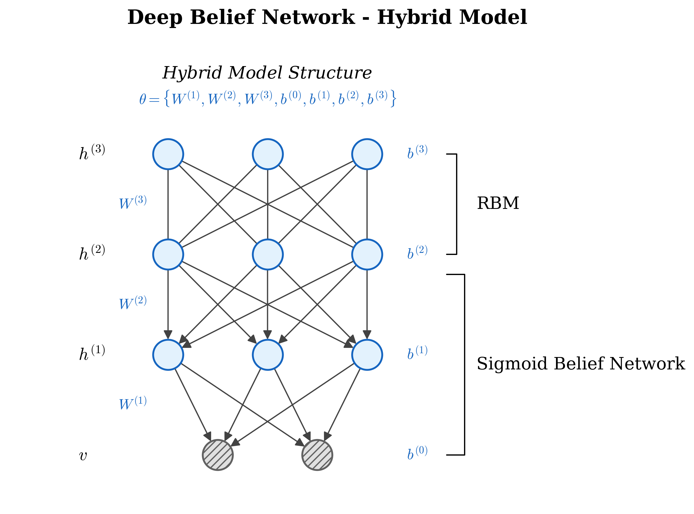
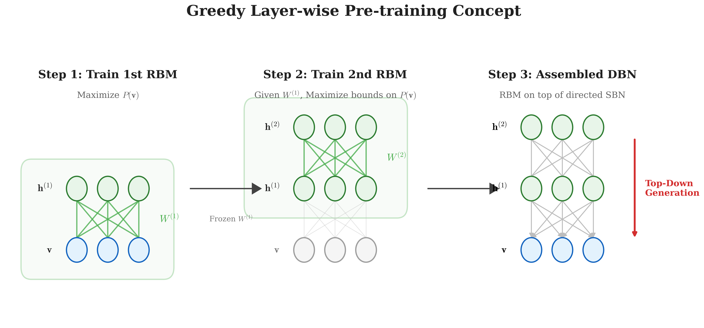
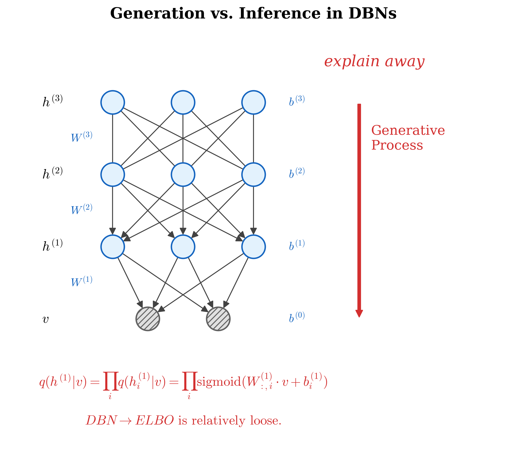

# 深度信念网络 (Deep Belief Network)

## 1. 背景介绍 (Background)

深度信念网络 (Deep Belief Network, DBN) 是一种生成模型。它可以看作是一个由多层隐含变量组成的“混合模型” (Hybrid Model)。

为什么我们称之为“混合模型”呢？因为它的结构包含了两部分：
1. **顶层结构 (Top Layers)**：由两层隐含节点组成的无向图模型，本质上是一个受限玻尔兹曼机 (Restricted Boltzmann Machine, RBM)。
2. **底层结构 (Bottom Layers)**：由向下的有向连接组成，形成了一个 Sigmoid 信念网络 (Sigmoid Belief Network, SBN)。

我们用下图来直观地展示这个结合了 RBM 和 SBN 的四层模型结构：

<!-- Generated by scripts/generate_ch27_dbn_structure.py -->

在这个例子中，我们定义模型的参数集合 $\theta$ 包括了所有层的权重矩阵 $W$ 以及偏置向量 $b$：
$$
\theta = \{W^{(1)}, W^{(2)}, W^{(3)}, b^{(0)}, b^{(1)}, b^{(2)}, b^{(3)}\}
$$

### 联合概率分布推导

为了理解 DBN 是如何工作的，我们需要写出整个系统中所有变量的联合概率分布 $P(v, h^{(1)}, h^{(2)}, h^{(3)})$。

根据概率论的链式法则和图中定义的有向/无向关系，我们可以将这个巨大的联合分布逐步拆解：

首先，将可视层 $v$ 从联合分布中提取出来（条件依赖于第一隐层 $h^{(1)}$）：
$$
P(v, h^{(1)}, h^{(2)}, h^{(3)}) = P(v | h^{(1)}, h^{(2)}, h^{(3)}) \cdot P(h^{(1)}, h^{(2)}, h^{(3)})
$$

观察网络结构，可视层 $v$ 仅仅直接依赖于它上面的第一层隐含层 $h^{(1)}$。这就是所谓的局部马尔可夫性。因此我们有：
$$
P(v | h^{(1)}, h^{(2)}, h^{(3)}) = P(v | h^{(1)})
$$

将上面的式子代回，我们得到第一步化简：
$$
P(v, h^{(1)}, h^{(2)}, h^{(3)}) = P(v | h^{(1)}) \cdot P(h^{(1)}, h^{(2)}, h^{(3)})
$$

接下来，我们继续对 $P(h^{(1)}, h^{(2)}, h^{(3)})$ 进行同样的拆解，剥离出 $h^{(1)}$：
$$
P(h^{(1)}, h^{(2)}, h^{(3)}) = P(h^{(1)} | h^{(2)}, h^{(3)}) \cdot P(h^{(2)}, h^{(3)})
$$

同样地，由于 $h^{(1)}$ 只直接依赖于其上层 $h^{(2)}$，我们可以化简条件概率：
$$
P(h^{(1)} | h^{(2)}, h^{(3)}) = P(h^{(1)} | h^{(2)})
$$

将所有部分组合在一起，我们最终得到了整个 DBN 的联合概率分布的表达式：
$$
\begin{aligned}
P(v, h^{(1)}, h^{(2)}, h^{(3)}) &= P(v | h^{(1)}) \cdot P(h^{(1)} | h^{(2)}) \cdot P(h^{(2)}, h^{(3)})
\end{aligned}
$$

### 各层分布详解

现在，让我们进一步分析公式里的这三个部分。

#### 1. Sigmoid 信念网络部分：$P(v | h^{(1)})$ 和 $P(h^{(1)} | h^{(2)})$

前两项代表了模型底部的有向生成过程（即 Sigmoid Belief Network 部分）。由于同一层的节点之间是没有连接的，给定上一层节点的情况下，当前层各个节点的分布是相互独立的。

可视层 $v$ 的分布可以表示为它每个节点 $v_i$ 分布的乘积：
$$
P(v | h^{(1)}) = \prod_{i} P(v_i | h^{(1)})
$$

同样，第一隐含层 $h^{(1)}$ 也满足：
$$
P(h^{(1)} | h^{(2)}) = \prod_{j} P(h_j^{(1)} | h^{(2)})
$$

在这里，每一个条件概率都由一个 Sigmoid 函数来激活：
$$
P(v_i = 1 | h^{(1)}) = \text{sigmoid}\left(W_{:,i}^{(1)^T} h^{(1)} + b_i^{(0)}\right)
$$
$$
P(h_j^{(1)} = 1 | h^{(2)}) = \text{sigmoid}\left(W_{:,j}^{(2)^T} h^{(2)} + b_j^{(1)}\right)
$$
*(注：公式里的 $W_{:,i}$ 表示权重矩阵 $W$ 的第 $i$ 个列向量)*

#### 2. 受限玻尔兹曼机部分：$P(h^{(2)}, h^{(3)})$

最后一项 $P(h^{(2)}, h^{(3)})$ 是顶层 RBM 层的联合分布。RBM 是一种基于能量的模型，它的联合概率由指数形式和配分函数 $\mathcal{Z}$ 构成：
$$
P(h^{(2)}, h^{(3)}) = \frac{1}{\mathcal{Z}} \exp\left\{ {h^{(3)}}^T W^{(3)} h^{(2)} + {h^{(2)}}^T b^{(2)} + {h^{(3)}}^T b^{(3)} \right\}
$$

总结来说，Deep Belief Network 的强大之处在于，它通过顶层的 RBM 学习到一个关于高层抽象特征的强大联合先验分布 $P(h^{(2)}, h^{(3)})$，然后通过底层的 Sigmoid 有向网络一层层自顶向下地生成可见的数据 $v$。

## 2. 逐层预训练 (Stacking RBM)

深度信念网络的训练是一个非常具有挑战性的非凸优化问题。直接对上述整个巨大网络中的所有参数 $\{W^{(1)}, W^{(2)}, W^{(3)}, b^{(0)}, \dots\}$ 进行联合优化是非常困难的。

Geoffrey Hinton 提出了一个极其精妙的解决思路：**逐层贪心预训练 (Greedy Layer-wise Pre-training)**。其核心思想是将整个深层网络拆解为一个个浅层的 RBM，自底向上进行堆叠 (Stacking)。

下图展示了这个堆叠预训练的流程概念：

<!-- Generated by scripts/generate_ch27_layerwise_pretraining.py -->

该方法的工作原理如下：
1. **底层 RBM 学习**：首先单独把可视层 $v$ 和第一隐层 $h^{(1)}$ 当作一个独立的 RBM 进行训练（即利用对比散度 CD 算法最大化 $v$ 的似然）。在第一层训练完后，权重 $W^{(1)}$ 和偏置 $b^{(0)}, b^{(1)}$ 就会被**固定下来 (Fixed)**。
2. **顶层 RBM 学习 (2nd Layer Learning)**：接着，我们使用固定下来的第一层将原始数据映射到隐含空间，得到 $h^{(1)}$ 的激活状态。我们将这些状态作为新的“可视数据”，继续训练第二层的 RBM（由 $h^{(1)}$ 和 $h^{(2)}$ 组成）。此时新的权重 $W^{(2)}$ 初始化为第一层权重的转置：$W^{(1)^T} = W^{(2)}$。

虽然直觉上这种逐层初始化的贪心策略很合理，但是它为什么在数学上是有效的呢？下面我们通过变分推断中的证据下界 (ELBO) 来严格证明：**第二层 RBM 的学习，本质上是在最大化观测数据 $P(v)$ 对数似然的下界**。

### ELBO 数学推导

首先，我们写出仅依赖于第一隐层的可见数据的边缘概率：
$$
P(v) = \sum_{h^{(1)}} P(v, h^{(1)}) = \sum_{h^{(1)}} \underbrace{P(h^{(1)})}_{\text{prior (先验)}} \cdot \underbrace{P(v | h^{(1)})}_{\text{fixed (生成模型固定)}}
$$
（注意这里 $P(h^{(1)}) = \sum_{h^{(2)}} P(h^{(1)}, h^{(2)})$）

为了最大化 $\log P(v)$，我们引入一个由向下生成模型定义的变分分布（后验） $q(h^{(1)} | v)$。根据 Jensen 不等式构建对数似然的证据下界 (ELBO)：

$$
\begin{aligned}
\log P(v) &= \log \sum_{h^{(1)}} P(v, h^{(1)}) \\
&= \log \sum_{h^{(1)}} q(h^{(1)} | v) \frac{P(v, h^{(1)})}{q(h^{(1)} | v)} \\
&= \log \mathbb{E}_{q(h^{(1)} | v)} \left[ \frac{P(v, h^{(1)})}{q(h^{(1)} | v)} \right] \\
&\ge \mathbb{E}_{q(h^{(1)} | v)} \left[ \log \frac{P(v, h^{(1)})}{q(h^{(1)} | v)} \right] \quad \text{(Jensen's Inequality)}
\end{aligned}
$$

这就是我们的对数似然下界。接下来，我们把 $P(v, h^{(1)})$ 展开为 $P(h^{(1)}) \cdot P(v | h^{(1)})$，对上式进行拆项化简：

$$
\begin{aligned}
ELBO &= \sum_{h^{(1)}} q(h^{(1)} | v) \left[ \log P(h^{(1)}) + \log P(v | h^{(1)}) - \log q(h^{(1)} | v) \right] \\
&= \underbrace{\sum_{h^{(1)}} q(h^{(1)} | v) \log P(h^{(1)})}_{\text{项 1：与先验相关}} + \underbrace{\sum_{h^{(1)}} q(h^{(1)} | v) \left[ \log P(v | h^{(1)}) - \log q(h^{(1)} | v) \right]}_{\text{项 2：与底层权重 } W^{(1)} \text{ 相关}}
\end{aligned}
$$

**核心结论**：
在第一层 RBM 训练完毕后，**项 2 对于第二层来说已经变成了常数 $C$**（因为 $P(v|h^{(1)})$ 和 $q(h^{(1)}|v)$ 都是由底层刚被固定下来的权重决定的）。

所以，当我们引入第二层 RBM 并开始调整上层参数时，我们真正在优化的仅仅是：
$$
\text{最大化目标} \approx \sum_{h^{(1)}} q(h^{(1)} | v) \log P(h^{(1)}) + C
$$

这等价于**最大化对隐变量 $P(h^{(1)})$ 的对数似然 (Maximum log-likelihood over $P(h^{(1)})$)**，其目的正是为了改善和提升先验 $P(h^{(1)})$ (Improve $P(h^{(1)})$)。这也是为什么 Stacking RBM 能够稳步提升整个网络生成能力（至少不会使得生成能力下降）的数学根基。

## 3. 生成与推断，以及 ELBO 的松弛性 (Generation vs Inference)

在 DBN 的图模型结构中，自顶向下的有向生成过程非常简单直观，但由于底层 SBN 部分的图结构，自底向上的概率推断 (Inference) 却面临一些挑战。

<!-- Generated by scripts/generate_ch27_generation_inference.py -->

### Explain Away (解释消除) 效应

在推断过程中，我们需要求给定可视层 $v$ 下，隐层变量的后验概率 $P(h|v)$。
观察 Sigmoid Belief Network (SBN) 部分，多个隐藏节点 $h_i^{(1)}$ 会共同指向同一个可视节点 $v_j$。在有向图模型中，这种“多对一”的结构被称为 **V-structure**。

根据图模型的 d-separation 原理，即使边缘概率下 $h_i^{(1)}$ 之间是独立的，但在给定观测变量 $v$ 时，节点们就不再独立了。这种现象在原因推理中被称为 "**解释消除 (Explain Away)**"。
这也意味着真正的后验分布 $P(h^{(1)}|v)$ 中，各个隐藏节点是高度耦合 (Coupled) 的，我们无法轻易将其分解求解。

### 近似后验分布 $q(h^{(1)}|v)$

由于真实的后验分布难以计算，我们在逐层预训练的贪心算法中，实际上采用了一个极度简化的**平均场近似 (Mean-field Approximation)** 思想。

我们强行假设即使给定了 $v$，各个隐含节点 $h_i^{(1)}$ 之间依然是相互独立的：
$$
q(h^{(1)}|v) = \prod_{i} q(h_i^{(1)}|v)
$$

在这个独立性假设下，我们使用一个简单的 Sigmoid 前向传播作为推断函数：
$$
q(h^{(1)}|v) = \prod_{i} \text{sigmoid}\left(W_{:,i}^{(1)} \cdot v + b_i^{(1)}\right)
$$
*(注：此时使用的是矩阵乘法和带有转置含义的前向映射权重)*

### DBN 的 ELBO 相对宽松 (Relatively Loose)

在上一节推导第二步（顶层 RBM 学习）时，我们构建了证据下界 ELBO：
$$
\log P(v) \ge ELBO = \dots
$$

理论上，当且仅当我们的近似后验 $q(h^{(1)}|v)$ 等于真实后验分布 $P(h^{(1)}|v)$ 时，等号才能成立（即 KL 散度为 0）。

然而，正如前面分析的“解释消除”效应，真实的 $P(h^{(1)}|v)$ 内部由于 V-structure 的存在不仅极度复杂，而且包含着高阶强耦合关系。而我们选取的近似分布 $q(h^{(1)}|v)$ 却是完全因子化分解 (Fully Factorized) 的多独立事件乘积。

这种用完全解耦的简单函数去逼近高度耦合的真实分布的行为，导致了两者之间的 KL 散度永远无法缩小到 0。因此，**DBN 中的 ELBO Bound 被认为是相对松弛的 (Relatively Loose)**。这也成为了后续变分自编码器 (VAE) 等更先进模型致力于改进的方向。
