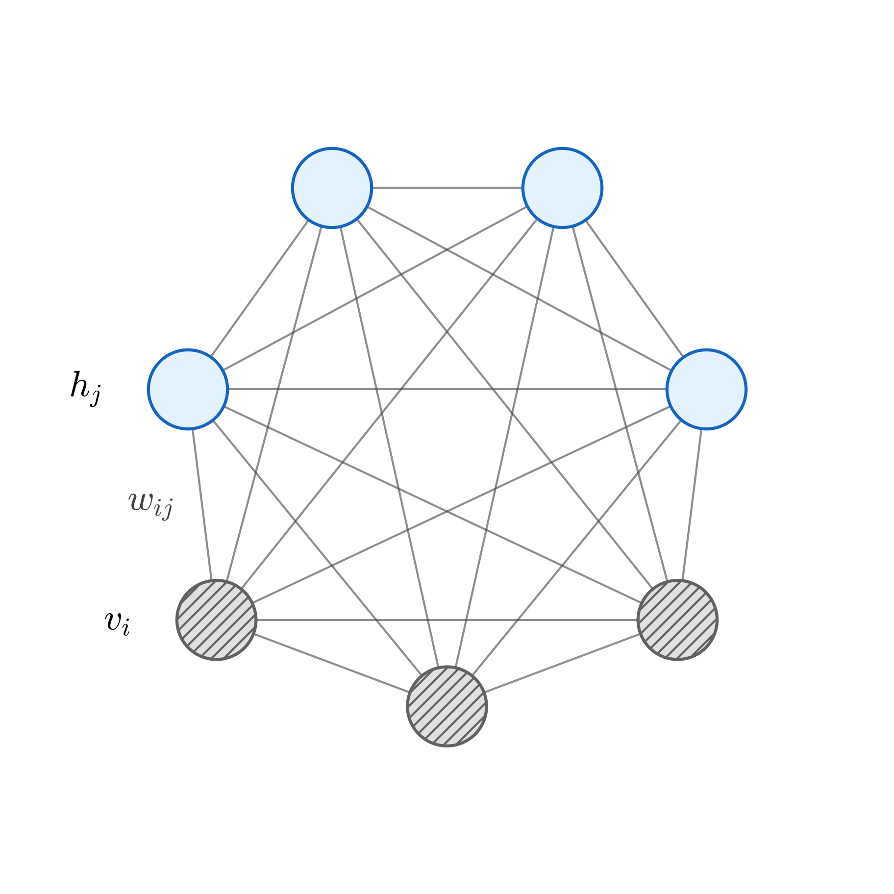

# 玻尔兹曼机 (Boltzmann Machine)

## 1. 简介 (Introduction)

玻尔兹曼机 (Boltzmann Machine, BM) 是一种基于能量的概率图模型。它的结构通常由两部分节点组成：
- **可见节点 (Visible Nodes)**：表示我们能够从数据中观测到的变量，记为 $v \in \{0, 1\}^D$。
- **隐藏节点 (Hidden Nodes)**：表示模型内部的潜在特征变量，用于解释可见变量之间的复杂关联，记为 $h \in \{0, 1\}^P$。

### 1.1 模型结构 (Model Structure)

正如以下图示所示，一个典型的玻尔兹曼机包含 $D$ 个可见节点和 $P$ 个隐藏节点，节点之间相互连接，形成一个无向图结构。

<!-- Generated by scripts/generate_ch29_boltzmann_machine.py -->

### 1.2 能量函数 (Energy Function)

玻尔兹曼机的核心在于其能量函数 (Energy Function)。对于给定的可见节点状态矢量 $v$ 和隐藏节点状态矢量 $h$，系统的能量取决于各节点状态以及连接权重的组合。

定义模型参数 $\theta = \{ W, L, J \}$，分别代表不同节点集合之间的连接权重矩阵：
- $W = [W_{ij}]_{D \times P}$: 可见节点与隐藏节点之间的相互连接权重。
- $L = [L_{ij}]_{D \times D}$: 可见节点内部相互之间的连接权重（对称矩阵）。
- $J = [J_{ij}]_{P \times P}$: 隐藏节点内部相互之间的连接权重（对称矩阵）。

模型的能量函数 $E(v, h)$ 表达为二次型之和的负数：

$$
E(v, h) = - \left( v^T W h + \frac{1}{2} v^T L v + \frac{1}{2} h^T J h \right)
$$

这个公式捕捉了图模型中所有的关联相互作用：
1. 第一项 $v^T W h$ 代表可见变量矩阵和隐藏变量矩阵之间的二元交互能量。
2. 第二项 $\frac{1}{2} v^T L v$ 是可见变量内部自身的相互作用（乘 $\frac{1}{2}$ 是为了修正无向图中对称边 $L_{ij} = L_{ji}$ 带来的重复累加）。
3. 第三项 $\frac{1}{2} h^T J h$ 是隐藏变量内部自身的相互作用。

*(注：在一些标准定义中可能包含独立节点的偏置项偏移。)*

### 1.3 概率分布 (Probability Distribution)

根据统计力学中的热力学原理，能量越低的状态越稳定，即出现的概率越高。因此，系统处于任一联合状态 $(v, h)$ 的概率分布 $P(v, h)$ 可由其能量得出，并符合玻尔兹曼分布形式：

$$
P(v, h) = \frac{1}{Z} \exp\{-E(v, h)\}
$$

这里引入了配分函数 (Partition Function) $Z$。为了确保 $P(v, h)$ 构成了合法的概率分布特性（所有可能状态概率之和为 $1$），需要将指数项除以系统所有可能状态的指数和作为归一化常数：

$$
Z = \sum_{v \in \{0,1\}^D} \sum_{h \in \{0,1\}^P} \exp\{-E(v, h)\}
$$

这种形式的概率分布意味着，模型赋予了具有最小总能量的状态组合最大的概率概率。机器学习网络训练的本质，即是通过微调参数 $\theta$，以最大化我们从真实数据中观察到的 $v$ 状态的发生概率。

## 2. 对数似然梯度 (Gradient of Log-Likelihood)

在训练玻尔兹曼机时，我们通常有一个由 $N$ 个观测样本组成的数据集 $V = \{v_1, v_2, \dots, v_N\}$，即 $|V| = N$。基于最大似然估计原则，我们的目标是最大化整个数据集的对数似然函数 (Log-Likelihood)。

首先，对于任意单个样本 $v$，我们需要对其概率 $P(v)$ 取对数。因为 $v$ 是所有可能的 $(v, h)$ 状态中将隐藏变量 $h$ 边缘化 (Marginalize) 的结果，所以有：

$$
P(v) = \sum_{h} P(v, h)
$$

因此，在整个数据集 $V$ 上的平均对数似然度写为：

$$
\mathcal{L}(\theta) = \frac{1}{N} \sum_{v \in V} \log P(v)
$$

为了找到最大化这个目标函数的参数 $\theta$（$\theta = \{W, L, J\}$ 中的任意一个），我们需要对参数求梯度：

$$
\frac{\partial \mathcal{L}}{\partial \theta} = \frac{\partial}{\partial \theta} \left( \frac{1}{N} \sum_{v \in V} \log P(v) \right) = \frac{1}{N} \sum_{v \in V} \frac{\partial \log P(v)}{\partial \theta}
$$

### 2.1 一般参数梯度推导 (General Gradient Derivation)

我们先推导单个样本的梯度项 $\frac{\partial \log P(v)}{\partial \theta}$。这是一个通用的推导过程，适用于任何参数 $\theta$：

$$
\begin{align}
\frac{\partial \log P(v)}{\partial \theta}
&= \frac{\partial \log \sum_{h} P(v, h)}{\partial \theta} \\
&= \frac{\partial}{\partial \theta} \log \left( \sum_{h} \frac{\exp\{-E(v, h)\}}{Z} \right) \\
&= \frac{\partial}{\partial \theta} \left( \log \sum_{h} \exp\{-E(v, h)\} - \log Z \right) \\
&= \frac{1}{\sum_{h} \exp\{-E(v, h)\}} \sum_{h} \left( \exp\{-E(v, h)\} \cdot \frac{\partial (-E(v, h))}{\partial \theta} \right) - \frac{1}{Z} \frac{\partial Z}{\partial \theta} \\
&= \sum_{h} \left( \frac{\exp\{-E(v, h)\} / Z}{\sum_{h'} \exp\{-E(v, h')\} / Z} \right) \left( -\frac{\partial E(v, h)}{\partial \theta} \right) - \frac{1}{Z} \frac{\partial}{\partial \theta} \left( \sum_{v', h'} \exp\{-E(v', h')\} \right) \\
&= \sum_{h} \left( \frac{P(v, h)}{P(v)} \right) \left( -\frac{\partial E(v, h)}{\partial \theta} \right) - \sum_{v', h'} \frac{\exp\{-E(v', h')\}}{Z} \left( -\frac{\partial E(v', h')}{\partial \theta} \right) \\
&= \sum_{h} P(h|v) \left( -\frac{\partial E(v, h)}{\partial \theta} \right) - \sum_{v', h'} P(v', h') \left( -\frac{\partial E(v', h')}{\partial \theta} \right)
\end{align}
$$

这个结果非常漂亮，它表明对数似然的梯度分为两部分的差值：
1. **数据驱动项 (Data-Driven / Positive Phase)**：在给定可见数据 $v$ 的条件下，隐藏变量 $h$ 的条件分布 $P(h|v)$ 下的某种期望。
2. **模型驱动项 (Model-Driven / Negative Phase)**：在模型自由运行时的联合分布 $P(v', h')$ 下的同等期望。

$$
\frac{\partial \log P(v)}{\partial \theta} = \sum_{v', h'} P(v', h') \frac{\partial E(v', h')}{\partial \theta} - \sum_{h} P(h|v) \frac{\partial E(v, h)}{\partial \theta}
$$
*(注：根据 $\log$ 的求导法则和微小符号变动，这里的最终形式反映了数据与模型的对抗。)*
如果将负号放回对应的位置，可以得到精简形式：
$$
\frac{\partial \log P(v)}{\partial \theta} = \sum_{v', h'} P(v', h') \cdot \frac{\partial E(v', h')}{\partial \theta} - \sum_{h} P(h|v) \cdot \frac{\partial E(v, h)}{\partial \theta}
$$

### 2.2 权重矩阵 $W$ 的梯度 (Gradient for Weight Matrix $W$)

以可见层和隐藏层之间的连接权重 $W$ 为例。回忆能量函数中包含 $W$ 的项是 $-v^T W h$。因此，能量函数对 $W$ 的偏导数为：

$$
\frac{\partial E(v, h)}{\partial W} = -(v h^T)
$$

将这个偏导数代入上一节总结的普通梯度公式中：

$$
\begin{align}
\frac{\partial \log P(v)}{\partial W}
&= \sum_{v', h'} P(v', h') \cdot \big[-(v' (h')^T)\big] - \sum_{h} P(h|v) \cdot \big[-(v h^T)\big] \\
&= \sum_{h} P(h|v) \cdot (v h^T) - \sum_{v', h'} P(v', h') \cdot (v' (h')^T)
\end{align}
$$

将所有的单样本推导结果，扩展为整个数据集上的平均梯度：

$$
\frac{1}{N} \sum_{v \in V} \frac{\partial \log P(v)}{\partial W} = \frac{1}{N} \sum_{v \in V} \sum_{h} P(h|v) \cdot (v h^T) - \sum_{v', h'} P(v', h') \cdot (v' (h')^T)
$$

### 2.3 期望视角下的解释 (Expected Value Interpretation)

最后，我们可以将梯度的两项写成期望 (Expectation) 的形式。

1. 第一部分是在 **数据分布 (Data Distribution)** $P_{\text{data}}$ 控制下的期望。因为样本 $v$ 是从经验数据集中抽取的（$v \in V$），而 $h$ 是在给定真实数据后的推断（$P_{\text{model}}(h|v)$）。
   所以，我们可以定义复合分布 $P_{\text{data}}(v, h) = P_{\text{data}}(v) \cdot P_{\text{model}}(h|v)$，其经验平均 $\frac{1}{N}\sum_{v \in V}$ 就是对 $P_{\text{data}}(v)$ 求期望。
2. 第二部分是完全由 **模型分布 (Model Distribution)** $P_{\text{model}}(v, h)$ 自由生成的期望。

这赋予了梯度更新一个极具直觉的意义：

$$
\nabla_W \mathcal{L} = \mathbb{E}_{P_{\text{data}}} [v h^T] - \mathbb{E}_{P_{\text{model}}} [v h^T]
$$

- 我们希望 $E_{P_{\text{data}}}[v h^T]$ 越来越大，这是系统受到外部真实数据钳制（clamped）时，$v$ 和 $h$ 的相关性；也称作 **Positive Phase (正相)**。
- 我们希望 $E_{P_{\text{model}}}[v h^T]$ 越来越小，这是系统自由运行（free-running）幻想（hallucinate）出的 $v$ 和 $h$ 的相关性；也称作 **Negative Phase (负相)**。

当且仅当模型产生的内部幻想特征已经完全与训练数据的统计特征分布相匹配时，梯度为零，达到了收敛状态。

## 3. 梯度上升与 MCMC 采样 (Gradient Ascent & MCMC)

明白了对数似然的梯度形式后，我们就可以利用梯度上升 (Gradient Ascent) 方法来更新模型的参数。

### 3.1 参数更新法则 (Parameter Update Rules)

根据上一节得到的梯度公式，引入学习率 (Learning Rate)，我们可以得到模型中所有权重矩阵的更新法则。为了简化将常数项合并在了常数因子中，最终呈现为：

$$
\begin{align}
\Delta W &= \alpha \left( \mathbb{E}_{P_{\text{data}}}[v h^T] - \mathbb{E}_{P_{\text{model}}}[v h^T] \right) \\
\Delta L &= \alpha \left( \mathbb{E}_{P_{\text{data}}}[v v^T] - \mathbb{E}_{P_{\text{model}}}[v v^T] \right) \\
\Delta J &= \alpha \left( \mathbb{E}_{P_{\text{data}}}[h h^T] - \mathbb{E}_{P_{\text{model}}}[h h^T] \right)
\end{align}
$$

以权重矩阵 $W_{ij}$ (第 $i$ 个可见节点和第 $j$ 个隐藏节点之间的连接权重) 为例，标量形式的更新量为：

$$
\Delta W_{ij} \propto \underbrace{\mathbb{E}_{P_{\text{data}}} [v_i h_j]}_{\text{positive phase}} - \underbrace{\mathbb{E}_{P_{\text{model}}} [v_i h_j]}_{\text{negative phase}}
$$

### 3.2 难解性问题 (The Intractability Problem)

上述更新公式虽然逻辑优美，但在实际计算中却遇到了**“计算难解” (Intractable)** 的问题：
无论是 Positive Phase 的期望 $\mathbb{E}_{P_{\text{data}}} [ \cdot ]$，还是 Negative Phase 的期望 $\mathbb{E}_{P_{\text{model}}} [ \cdot ]$，都面临着随着节点数目的增加，状态空间呈指数级爆炸，导致求和（积分）操作在计算上是**难解的 (Hard / Intractable)**。

- **$P_{\text{data}}$ 期望的难点**：虽然 $v$ 是已知的经验数据，$P_{\text{data}}(v, h) = P_{\text{data}}(v) P_{\text{model}}(h|v)$，这就要求我们能够轻松计算出 $P_{\text{model}}(h|v)$，即给定可见节点状态下隐藏节点的推断概率，由于节点全连接，这也是极为复杂的。
- **$P_{\text{model}}$ 期望的难点**：这要求我们在一整个联合概率分布 $P_{\text{model}}(v, h)$ 下进行求期望，配分函数 $Z$ 的计算本身就是 NP-Hard 问题。

### 3.3 马尔可夫链蒙特卡洛 (Markov Chain Monte Carlo, MCMC)

因为精确求解期望是不可能的，通常的解决方法是引入**马尔可夫链蒙特卡洛 (MCMC)** 方法，特别是使用**吉布斯采样 (Gibbs Sampling)** 来近似这些期望值。

在玻尔兹曼机中，任何一个节点的状态都可以通过它周围相连节点的状态以及相应的连接权重来计算其概率。具体条件概率的形式可以用 Sigmoid 函数 $\sigma(\cdot)$ 简洁表达。

对于任意指定的**可见节点** $v_i$（当保持所有其它可见节点 $v_{-i}$ 以及所有隐藏节点 $h$ 不变时）：

$$
P(v_i = 1 \mid h, v_{-i}) = \sigma \left( \sum_{j=1}^{P} W_{ij} h_j + \sum_{k=1, k \ne i}^{D} L_{ik} v_k \right)
$$

类似地，对于任意指定的**隐藏节点** $h_j$（当保持所有可见节点 $v$ 以及所有其它隐藏此时的单节点条件概率，直接退化成了仅与对侧层状态有关：

$$
P(h_j = 1 \mid v) = \sigma \left( \sum_{i=1}^{D} W_{ij} v_i \right)
$$

这一独立性极大地简化了 Gibbs 采样的过程，催生了如对比散度 (Contrastive Divergence, CD) 等高效训练算法。
*(进一步的内容我们在下一章节中关于 RBM 的笔记展开)*

## 4. 条件概率推导 (Conditional Probability Derivation)

为了完整性，我们详细推导上一节提到的 Gibbs Sampling 的核心：单节点条件概率。以可见节点 $v_i$ 为例，我们希望证明：

$$
P(v_i = 1 \mid h, v_{-i}) = \sigma \left( \sum_{j=1}^{P} W_{ij} h_j + \sum_{k=1, k \ne i}^{D} L_{ik} v_k \right)
$$

其中 $\sigma(x) = \frac{1}{1 + e^{-x}} = \frac{e^x}{1 + e^x}$ 为 Sigmoid 函数。

### 4.1 基于联合概率的比例形式 (Ratio Form of Joint Probability)

根据条件概率的定义：

$$
P(v_i \mid h, v_{-i}) = \frac{P(v, h)}{P(h, v_{-i})} = \frac{P(v_i, v_{-i}, h)}{\sum_{v_i \in \{0, 1\}} P(v_i, v_{-i}, h)}
$$

代入玻尔兹曼机的联合概率公式 $P(v, h) = \frac{1}{Z} \exp\{-E(v, h)\}$，其中分子分母中的配分函数 $Z$ 也是常数，可以消去：

$$
P(v_i \mid h, v_{-i}) = \frac{\frac{1}{Z} \exp\{-E(v, h)\}}{\sum_{v_i} \frac{1}{Z} \exp\{-E(v_i, v_{-i}, h)\}} = \frac{\exp\{-E(v, h)\}}{\sum_{v_i} \exp\{-E(v_i, v_{-i}, h)\}}
$$

将完整的能量函数 $E(v, h) = - (v^T W h + \frac{1}{2} v^T L v + \frac{1}{2} h^T J h)$ 代入，注意到 $\frac{1}{2} h^T J h$ 这一项与 $v_i$ 完全无关，因此在分子和分母中都可以提取出来并消去：

$$
\begin{align}
P(v_i \mid h, v_{-i})
&= \frac{\exp\{v^T W h + \frac{1}{2} v^T L v + \frac{1}{2} h^T J h\}}{\sum_{v_i} \exp\{v^T W h + \frac{1}{2} v^T L v + \frac{1}{2} h^T J h\}} \\
&= \frac{\exp\{v^T W h + \frac{1}{2} v^T L v\} \cdot \cancel{\exp\{\frac{1}{2} h^T J h\}}}{\cancel{\exp\{\frac{1}{2} h^T J h\}} \cdot \sum_{v_i} \exp\{v^T W h + \frac{1}{2} v^T L v\}} \\
&= \frac{\exp\{v^T W h + \frac{1}{2} v^T L v\}}{\exp\{v^T W h + \frac{1}{2} v^T L v\}\big|_{v_i=1} + \exp\{v^T W h + \frac{1}{2} v^T L v\}\big|_{v_i=0}}
\end{align}
$$

为了方便书写，我们将与 $v$ 相关的保留项定义为 $\Delta_{v_i} = \exp\{v^T W h + \frac{1}{2} v^T L v\}$。所以我们目标求解的是：

$$
P(v_i = 1 \mid h, v_{-i}) = \frac{\Delta_{v_i=1}}{\Delta_{v_i=0} + \Delta_{v_i=1}}
$$

### 4.2 能量项的依变量分离 (Factoring the Energy Function)

现在我们仔细观察 $\Delta_{v_i}$ 指数内部的展开式，目的是把包含 $v_i$ 的项和不包含 $v_i$ 的项分离开来。

$$
\Delta_{v_i} = \exp\left\{ \sum_{\hat{i}=1}^D \sum_{j=1}^P v_{\hat{i}} W_{\hat{i}j} h_j + \frac{1}{2} \sum_{\hat{i}=1}^D \sum_{k=1}^D v_{\hat{i}} L_{\hat{i}k} v_k \right\}
$$

将求和项拆分为 **不包含 $v_i$** 的部分和 **包含 $v_i$** 的部分：
- 第一项 (交叉项) 分离出 $v_i$：
  $$
  \sum_{\hat{i}=1}^D \sum_{j=1}^P v_{\hat{i}} W_{\hat{i}j} h_j = \left( \sum_{\hat{i}=1, \hat{i} \ne i}^D \sum_{j=1}^P v_{\hat{i}} W_{\hat{i}j} h_j \right) + \sum_{j=1}^P v_i W_{ij} h_j
  $$
- 第二项 (二次项) 分离出 $v_i$ (注意 $L_{ii}=0$ 且矩阵对称 $L_{ik} = L_{ki}$)：
  $$
  \frac{1}{2} \sum_{\hat{i}=1}^D \sum_{k=1}^D v_{\hat{i}} L_{\hat{i}k} v_k = \frac{1}{2} \left[ \left( \sum_{\hat{i} \ne i} \sum_{k \ne i} v_{\hat{i}} L_{\hat{i}k} v_k \right) + 2 \sum_{k \ne i} v_i L_{ik} v_k \right]
  $$

将指数内部重组，令完全不包含 $v_i$ 的冗长部分为常数项 $A$。

$$
\Delta_{v_i} = \exp\left\{ \underbrace{\sum_{\hat{i} \ne i} \sum_{j} v_{\hat{i}} W_{\hat{i}j} h_j + \frac{1}{2} \sum_{\hat{i} \ne i} \sum_{k \ne i} v_{\hat{i}} L_{\hat{i}k} v_k}_{A (\text{independent of } v_i)} + \underbrace{\sum_{j=1}^P v_i W_{ij} h_j + \sum_{k \ne i} v_i L_{ik} v_k}_{B (\text{dependent on } v_i)} \right\}
$$

也就是 $\Delta_{v_i} = \exp\{A + B\}$。

### 4.3 节点状态的边际化求值 (Evaluating the Marginal States)

现在分别计算 $v_i$ 取 $0$ 和 $1$ 时的 $\Delta$ 值：

- 当 $v_i = 0$ 时，依赖项 $B = 0$：
  $$
  \Delta_{v_i=0} = \exp\{A\}
  $$

- 当 $v_i = 1$ 时，依赖项 $B$ 保留（消去系数 $v_i$）：
  $$
  \Delta_{v_i=1} = \exp\left\{ A + \sum_{j=1}^P W_{ij} h_j + \sum_{k \ne i}^D L_{ik} v_k \right\}
  $$

### 4.4 归一化与 Sigmoid 形态的导出 (Normalization and Derivation of Sigmoid)

最后，将它们代回我们 4.1 步得出的概率分子分母比值中：

$$
\begin{align}
P(v_i = 1 \mid h, v_{-i})
&= \frac{\Delta_{v_i=1}}{\Delta_{v_i=0} + \Delta_{v_i=1}} \\
&= \frac{\exp\left\{ A + \sum_j W_{ij} h_j + \sum_{k \ne i} L_{ik} v_k \right\}}{\exp\{A\} + \exp\left\{ A + \sum_j W_{ij} h_j + \sum_{k \ne i} L_{ik} v_k \right\}}
\end{align}
$$

因为分子分母都包含 $\exp\{A\}$ 因子，我们可以将其约去（相当于分子分母同除以 $\exp\{A\}$）：

$$
P(v_i = 1 \mid h, v_{-i}) = \frac{\exp\left\{ \sum_{j=1}^P W_{ij} h_j + \sum_{k=1, k \ne i}^D L_{ik} v_k \right\}}{1 + \exp\left\{ \sum_{j=1}^P W_{ij} h_j + \sum_{k=1, k \ne i}^D L_{ik} v_k \right\}}
$$

将指数部分记为 $x$，形式即为 $\frac{e^x}{1 + e^x} = \sigma(x)$。这就完美地推导出了 MCMC 吉布斯采样所需的条件概率分布：

$$
P(v_i = 1 \mid h, v_{-i}) = \sigma \left( \sum_{j=1}^{P} W_{ij} h_j + \sum_{k=1, k \ne i}^{D} L_{ik} v_k \right)
$$

同理可证隐藏节点 $h_j$ 的条件概率。这证明了在玻尔兹曼机中，尽管联合概率很难计算，但给定了图的马尔可夫毯 (Markov Blanket) 之后，单个节点的条件概率遵循简洁的 Sigmoid 形式。

## 5. 变分推断 (Variational Inference, Mean Field)

在模型求解中，除了直接进行梯度的 MCMC 采样，另一种广泛使用的方法是将其看作一个变分推断问题 (Variational Inference)。我们通过寻找一个易于处理的概率分布 $q(h|v)$ 来近似真实的顽固后验概率 $p(h|v)$。

### 5.1 证据下界 (Evidence Lower BOund, ELBO)

变分推断的起点是极大化对数似然 $\log P_\theta(v)$，它可以转化为最大化证据下界 (ELBO)：

$$
\mathcal{L} = ELBO = \log P_\theta(v) - KL(q_\phi || p_\theta)
$$

其中 $KL(\cdot||\cdot)$ 是 Kullback-Leibler 散度，由于 $KL \ge 0$，因此 ELBO 始终是对数似然的下界。当我们在 $q_\phi(h|v)$ 的分布族中搜索并使得 $KL$ 距离最小时，ELBO 将最大限度地逼近 $\log P_\theta(v)$。

我们可以将 ELBO 从期望的角度展开，剥离出其两项核心结构：

$$
ELBO = \sum_h q_\phi(h|v) \log P_\theta(v, h) + H[q]
$$

其中第一项为联合概率对数的期望，第二项 $H[q]$ 是近似分布自身的熵 (Entropy)。

### 5.2 平均场假设 (Mean Field Assumption)

玻尔兹曼机由于隐藏节点间的强相关，导致了精确推断的 intractable。**平均场理论 (Mean Field)** 假设隐藏节点在给定可见节点 $v$ 的情况下，彼此之间是完全相互独立的。即联合分布可完全分解为边缘概率的乘积：

$$
q_\phi(h|v) = \prod_{j=1}^P q_\phi(h_j|v)
$$

由于节点状态是二态的 $h_j \in \{0, 1\}$，每个节点的分布可以通过单个参数 $\phi_j$ 来完全定义（即伯努利分布的期望）：
$$ q_\phi(h_j=1|v) = \phi_j $$
因此我们有一组参数集合 $\phi = \{\phi_j\}_{j=1}^P$ 需要优化。在平均场假定下，该分布的熵恰好就是多个独立伯努利分布的熵之和：

$$
H[q_\phi(h|v)] = -\sum_{j=1}^P \big[ \phi_j \log \phi_j + (1-\phi_j)\log(1-\phi_j) \big]
$$

### 5.3 ELBO 最大化方程拆除 (Splitting the Expectation Terms)

现在我们的优化目标变为了，相对于每一个特定的 $\phi_j$ 去寻找使得极大化函数成立的取值：

$$
\hat{\phi}_j = \arg\max_{\phi_j} \mathcal{L} = \arg\max_{\phi_j} \left\{ \sum_h q_\phi(h|v) \left[ -\log Z + v^T W h + \frac{1}{2} v^T L v + \frac{1}{2} h^T J h \right] + H[q] \right\}
$$

把其中与参数 $h$ 无关的项（比如配分项 $Z$、可见节点项 $\frac{1}{2} v^T L v$）提取出来，它们对于优化特定的 $\phi_j$ 来说是常数。真正影响求解的部分可以被剥离为三个关键项：

$$
\arg\max_{\phi_j} \underbrace{ \sum_h q_\phi(h|v) \cdot v^T W h }_{\text{① 交叉项}} + \underbrace{ \frac{1}{2} \sum_h q_\phi(h|v) \cdot h^T J h }_{\text{② 隐藏互作用项}} + \underbrace{ H[q] }_{\text{③ 熵项}} = \arg\max \text{①} + \text{②} + \text{③}
$$

我们分别求解各个项的期望（得益于平均场假设的独立性）：

$$
\text{①} = \sum_h q_\phi(h|v) \cdot \sum_{i=1}^D \sum_{j=1}^P v_i W_{ij} h_j = \sum_{i=1}^D \sum_{j=1}^P \left( \sum_h \prod_{m=1}^P q_\phi(h_m|v) \right) v_i W_{ij} h_j = \sum_{i=1}^D \sum_{j=1}^P \phi_j v_i W_{ij}
$$

$$
\text{②} = \frac{1}{2} \sum_{j=1}^P \sum_{m=1, m \ne j}^P \phi_j \phi_m J_{jm} + C
$$
*(常数项 $C$ 来源于 $j=m$ 的自环情况，求导时不影响)*

$$
\text{③} = -\sum_{j=1}^P \left[ \phi_j \log \phi_j + (1-\phi_j)\log(1-\phi_j) \right]
$$

### 5.4 偏导数求解与不动点方程 (Derivatives and Fixed-Point Equation)

有了闭式期望表达，我们分别对目标参数 $\phi_j$ 求一阶偏导：

$$
\begin{aligned}
\frac{\partial \text{①}}{\partial \phi_j} &= \sum_{i=1}^D v_i W_{ij} \\
\frac{\partial \text{②}}{\partial \phi_j} &= \sum_{m=1, m \ne j}^P \phi_m J_{jm}  \quad (\text{因对称性 } J_{jm} = J_{mj} \text{ 会消除前面的 } \frac{1}{2}) \\
\frac{\partial \text{③}}{\partial \phi_j} &= -\log \left( \frac{\phi_j}{1 - \phi_j} \right)
\end{aligned}
$$

将这三者相加并设定为零，以求解函数的极大值：

$$
\frac{\partial \left[ \text{①} + \text{②} + \text{③} \right]}{\partial \phi_j} \overset{\Delta}{=} 0
$$

这就引出了：

$$
\log \left( \frac{\phi_j}{1 - \phi_j} \right) = \sum_{i=1}^D v_i W_{ij} + \sum_{m=1, m \ne j}^P \phi_m J_{jm}
$$

两边同时取指数，我们就推回到了熟悉的 Sigmoid 形态。这恰恰就是一个关于 $\phi$ 集合的系统性方程组！

$$
\phi_j = \sigma \left( \sum_{i=1}^D v_i W_{ij} + \sum_{m=1, m \ne j}^P \phi_m J_{jm} \right)
$$

其中目标解的集合 $\hat{\phi} = \{ \hat{\phi}_j \}_{j=1}^P$。由于等号右侧也包含了集合中其他的 $\phi_m$，这就是一个典型的 **不动点方程 (Fixed-Point Equation)**。

在具体求解时，我们无法直接求出的闭式解 (Closed-form Solution)，典型的解法是采用 **坐标上升 (Coordinate Ascent)**。先固定其他所有节点的变分参数，逐一去评估和更新单个节点 $\phi_j$ 直到整体分布收敛。这种变分推断下的坐标上升过程，在具体形式上和我们用到的基于条件概率的 Gibbs 采样展现出了极为奇幻的数学统一性！
