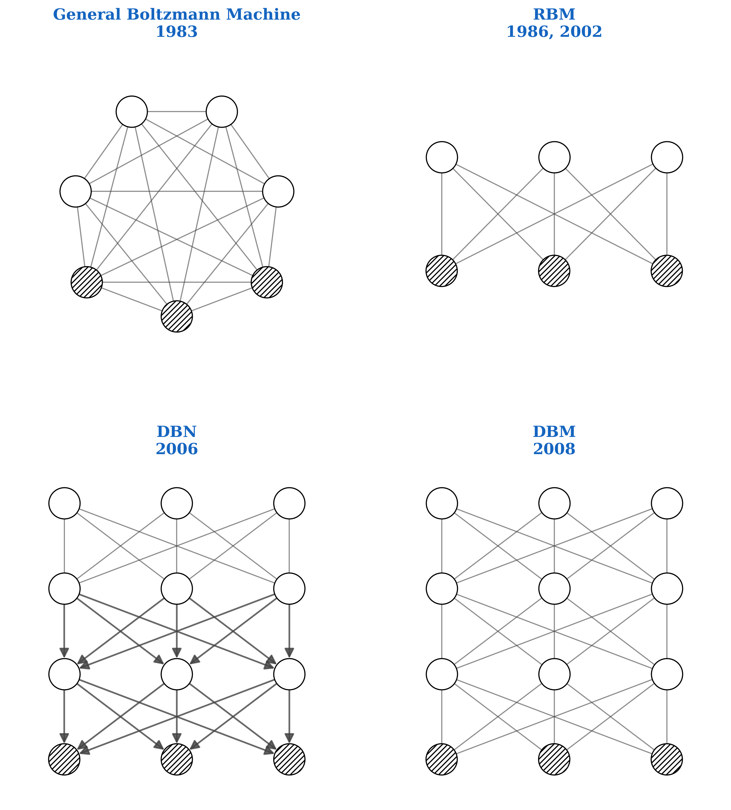
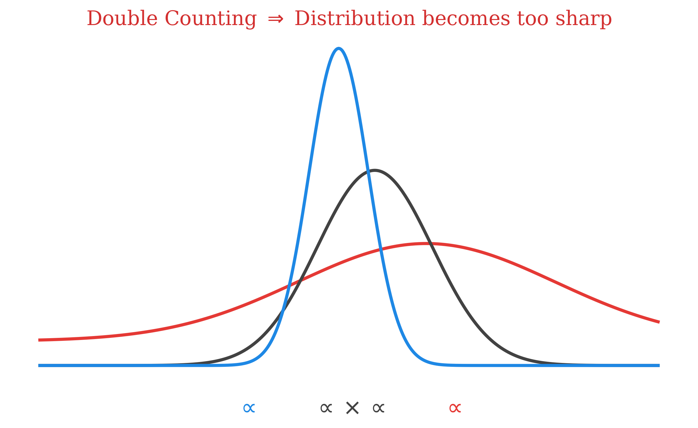
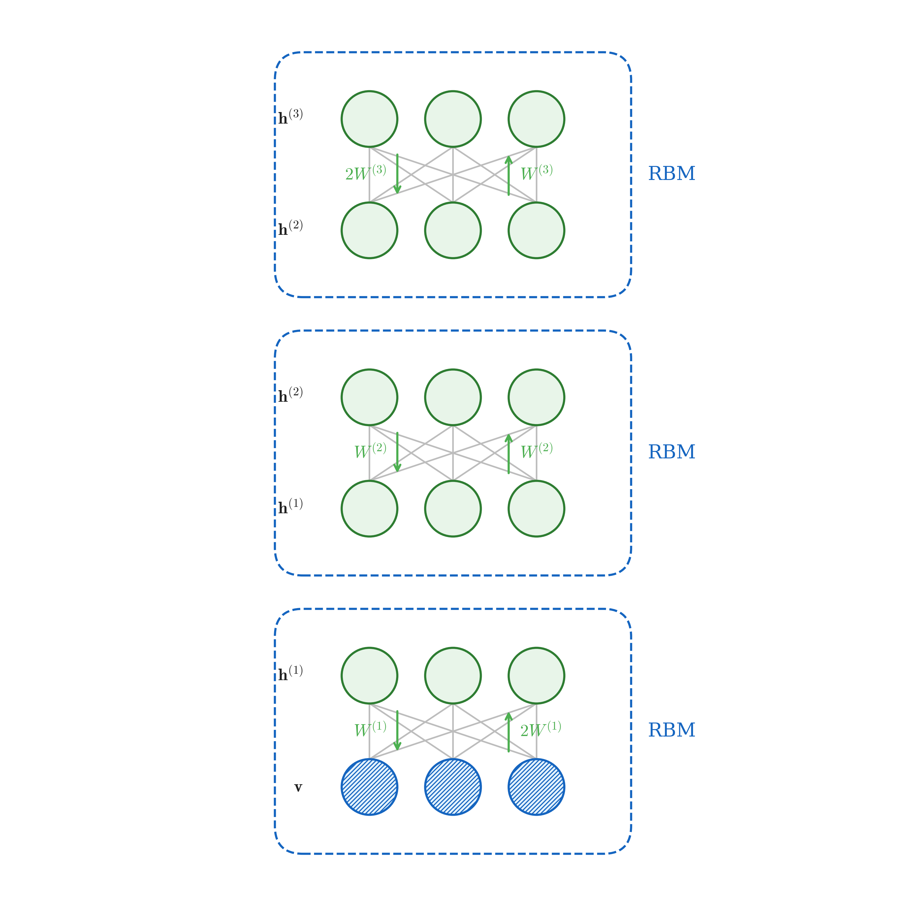

# 深度玻尔兹曼机 (Deep Boltzmann Machine)

# 1. 简介 (Introduction)

深度玻尔兹曼机 (Deep Boltzmann Machine, 简称 DBM) 是一种深层的生成模型。为了更好地理解 DBM 所在的位置，我们可以回顾一下从一般形式的玻尔兹曼机到深度玻尔兹曼机的演进过程：

1. **General Boltzmann Machine (1983)**:
   最原始的玻尔兹曼机是一个全连接的无向图模型。在这个模型中，不论是可见节点 (visible nodes) 还是隐藏节点 (hidden nodes) 之间的同层，还是层与层之间都可以相互连接。这种普遍的连接导致推断和学习都非常困难。
2. **RBM (Restricted Boltzmann Machine, 1986, 2002)**:
   受限玻尔兹曼机 (RBM) 取消了层内连接，形成了一个二分图 (Bipartite graph)。隐藏层和可见层之间有连接，但同一层内的节点之间不互连。这种简化使得推断和学习变得可行。
3. **DBN (Deep Belief Network, 2006)**:
   深度信念网络 (DBN) 是通过堆叠多个 RBM 形成的深层结构。在 DBN 中，只有最顶部的两层保持无向连接（就像一个 RBM），而下方的层次则是自上而下的有向连接。
   - **训练分为两步**：首先进行 **Pre-training** (逐层堆叠 RBM)，然后进行 **Fine-tuning** (使用 Wake-sleep 算法或 BP 反向传播)。
4. **DBM (Deep Boltzmann Machine, 2008)**:
   深度玻尔兹曼机同样是含有多个隐藏层的深层模型，但整个网络是一个**纯粹的无向图**模型。相邻的层之间包含无向连接。
   - **训练方法**：包含 **Pre-training** (堆叠 RBM) 和基于 **SGA (Stochastic Gradient Ascent, 随机梯度上升)** 的整体训练。

<!-- Generated by scripts/generate_ch29_evolution.py -->

### 为什么 DBM 训练很困难？

在训练玻尔兹曼机家族模型时，通常使用的是随机梯度上升 (Stochastic Gradient Ascent, 简称 SGA) 算法。根据对数似然函数的梯度，模型权重的更新公式可以表示为：

$$
\Delta W = \eta \left( \mathbb{E}_{P_{data}}[v h^T] - \mathbb{E}_{P_{model}}[v h^T] \right)
$$

这个公式里包含两项非常重要的期望：
- **正相 (Positive Phase)**: $\mathbb{E}_{P_{data}}[v h^T]$，即在数据分布下（给定真实数据样本）计算特征激活的期望。
- **负相 (Negative Phase)**: $\mathbb{E}_{P_{model}}[v h^T]$，即在模型自身分布下计算特征激活的期望（也被称为模型的“幻想”过程）。

在单层的 RBM 中，这两项相对容易估计。但是在深层的 DBM 中，两者的估计都变得十分困难：

1. **正相的计算 (Positive Phase)**:
   数据分布下的联合概率用 $P_{data}(v, h)$ 表示。由于在训练时我们会输入真实数据观察值 $v$，我们可以写成：

   $$
   P_{data}(v, h) = P_{data}(v) P_{model}(h \mid v)
   $$

   在 DBM 这样的深度无向图中，给定可见变量 $v$ 时，直接计算所有层的隐藏变量 $h$ 的后验概率 $P_{model}(h \mid v)$ 是极其困难的，因为所有隐藏变量之间由于无向边的存在而相互耦合。我们通常需要借助**变分推断 (Variational Inference)** 等近似方法来估计正相期望。

2. **负相的计算 (Negative Phase)**:
   负相需要计算纯模型分布下的期望 $\mathbb{E}_{P_{model}}[v h^T]$，即在没有任何数据输入时，模型自身分布 $P_{model}(v, h)$ 生成状态时的梯度方向。
   实际中往往需要通过马尔可夫链蒙特卡洛 (MCMC) 方法进行长时间的采样。在训练 RBM 时我们常用 CD (Contrastive Divergence) 算法，而在 DBM 的训练中，通常使用 **PCD (Persistent Contrastive Divergence, 持续对比散度)** 来进行马尔可夫链的近似采样。

总体而言，DBM 是一类理论非常优美但推断与学习都极具挑战性的深层概率图模型。它的核心难点正是如何有效地估计 SGA 中的正相和负相期望。

## 2. 预训练 (Pre-training) 与 Double Counting 问题

### 2.1 直观想法与 Double Counting 问题

在 DBM 中，为了让模型能够快速收敛，我们通常会采用**贪心逐层预训练 (Greedy Layer-wise Pre-training)**。直观的设想是：假如我们有一个两层隐藏层（$h^{(1)}$ 和 $h^{(2)}$）的 DBM，我们想要估计第一隐藏层 $h^{(1)}$ 的真实边缘分布 $P(h^{(1)}; W^{(1)}, W^{(2)})$。

如果我们分别训练两个独立的 RBM（下层 RBM 和上层 RBM），下层 RBM 提供了一个依赖于数据 $v$ 的分布估计 $P(h^{(1)}; W^{(1)})$：
$$
P(h^{(1)}; W^{(1)}) = \sum_{v} P(v, h^{(1)}; W^{(1)}) \approx \frac{1}{N_{v}} \sum_{v \in V} P(h^{(1)} \mid v; W^{(1)})
$$

上层 RBM 则提供了一个依赖于顶层隐藏变量的分布估计 $P(h^{(1)}; W^{(2)})$：

$$
P(h^{(1)}; W^{(2)}) = \sum_{h^{(2)}} P(h^{(1)}, h^{(2)}; W^{(2)}) \approx \frac{1}{N} \sum_{h^{(2)} \in H} P(h^{(1)} \mid h^{(2)}; W^{(2)})
$$

直观上，我们希望能“同时利用”自底向上的 $W^{(1)}$ 和自顶向下的 $W^{(2)}$ 去近似真实的联合依赖。但这里存在一个严重的问题：**Double Counting (重复计算)**。
在合并堆叠的 RBM 时，如果不加修改地结合这两种概率信息，模型等于对同样的信息加强了两次。这会导致组合后表达的概率分布过于**尖锐 (Sharp)**。原本宽泛平缓的概率分布（宽红线），因为被二次加强（相乘/指数相加），在峰值处变得非常集中（细蓝线）。这种现象会极大地缩小模型的生成多样性。

<!-- Generated by scripts/generate_ch29_double_counting.py -->

### 2.2 解决方案：预训练时的权重缩放 (Weight Tying / Scaling)

为了解决 Double Counting 问题，在把堆叠的 RBM 组合成一个无向的 DBM 时，其核心技巧是在预训练阶段对边界层的权重进行翻倍，或者在组合阶段将相应的权重减半。这样，在拼装成 DBM 的时候，从所有方向接收到的总输入尺度就能保持一致。

以包含可见层 $v$ 和三个隐藏层 $h^{(1)}, h^{(2)}, h^{(3)}$ 的模型为例：

1. **底层 RBM ($v \leftrightarrow h^{(1)}$)**：
   在 DBM 中，中间的 $h^{(1)}$ 会接收来自 $v$ 和 $h^{(2)}$ 的双向输入。但在 RBM 预训练阶段它只有底部的 $V$ 输入，为了强行模拟未来会有“两倍”的输入量，我们将 $v \to h^{(1)}$ 的权重加倍即 $2W^{(1)}$。同时，由于可见层 $v$ 作为树的叶子节点，即使在组装后的 DBM 中也只有来自 $h^{(1)}$ 的单侧输入，因此 $h^{(1)} \to v$ 的权重保持正常的 $W^{(1)}$。
   *（这一过程也可以直观理解为：相当于复制了一份 $v$ 集合去一起训练 $h^{(1)}$，如右下角示意图所示）*。

2. **中间层 RBM ($h^{(1)} \leftrightarrow h^{(2)}$)**：
   中间的隐藏层在最终的 DBM 里都会接收双向输入，因此这里的 RBM 训练就使用标准的对称权重 $W^{(2)}$ 和 $W^{(2)}$（在最后组装时，整个中间层权重会被减半以抵消 Double counting）。

3. **顶层 RBM ($h^{(2)} \leftrightarrow h^{(3)}$)**：
   与底层逻辑对称。顶部的 $h^{(3)}$ 只有向下的单向连接，所以自底向上 $h^{(2)} \to h^{(3)}$ 保持 $W^{(3)}$不变；而 $h^{(2)}$ 缺少了来自底部的输入，所以自顶向下的输入被翻倍为 $2W^{(3)}$。

<!-- Generated by scripts/generate_ch29_dbm_pretraining.py -->
