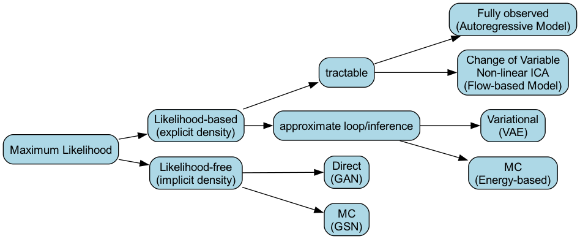

# 生成模型 (Generative Model)

## 1. 引言 (Introduction)

(概率)生成模型的核心在于**关注样本分布本身**，即 $P(X)$。生成模型可以应用于多种机器学习任务，例如：分类、回归、标记、降维、聚类、特征学习、密度估计以及生成数据。

我们可以从监督学习和非监督学习的角度对常见的机器学习模型进行如下划分：

### 1.1 监督学习 (Supervised Learning)

监督学习模型主要可以分为概率模型和非概率模型：

*   **概率模型 (Probabilistic Model)**:
    *   **判别模型 (Discriminative Model)** 关注条件概率 $P(Y|X)$：此类模型包括 Logistic Regression (LR), MEMM, Conditional Random Field (CRF) 等。
    *   **生成模型 (Generative Model)**：在监督学习中，生成模型可以通过建模联合概率 $P(X,Y)$ 来进行分类。例如 Naive Bayes (朴素贝叶斯)。
*   **非概率模型 (Non-probabilistic Model)**:
    *   此类模型直接对映射函数进行建模，例如：Perceptron Learning Algorithm (PLA), Support Vector Machine (SVM), K-Nearest Neighbors (KNN), Neural Network (NN) 以及 Tree Model。

### 1.2 非监督学习 (Unsupervised Learning)

非监督学习同样可以划分为概率模型与非概率模型：

*   **概率模型 (Probabilistic Model)**: 在非监督学习中，概率模型主要就是**生成模型 (Generative Model)**，通常用于对数据分布 $P(X)$ 进行建模。
*   **非概率模型 (Non-probabilistic Model)**:
    *   常见模型包括：PCA (主成分分析), LSA (潜在语义分析), K-means (K均值聚类), Auto-encoder (自编码器)。

值得注意的是，许多非参数/非概率模型都有其对应的概率生成模型版本。我们可以梳理出如下的演进关系：
*   PCA $\rightarrow$ P-PCA (Probabilistic PCA) $\rightarrow$ FA (Factor Analysis)
*   K-means $\rightarrow$ GMM (Gaussian Mixture Model)
*   Auto-encoder $\rightarrow$ VAE (Variational Auto-Encoder)
*   LSA $\rightarrow$ pLSA (Probabilistic LSA) $\rightarrow$ LDA (Latent Dirichlet Allocation)

### 1.3 常见生成模型概览 (Overview of Generative Models)

根据不同的建模方式、假设和应用场景，常见的概率生成模型包括：

*   **Naive Bayes** (朴素贝叶斯分类器，监督学习下的生成模型)
*   **Mixture Model** (混合模型): 例如 GMM (Gaussian Mixture Model, 高斯混合模型)
*   **Time-series Model** (时间序列模型): 包括 HMM (隐马尔可夫模型)，以及 Kalman Filter (KF, 卡尔曼滤波) 和 Particle Filter (PF, 粒子滤波)
*   **Non-parametric Bayesian Model** (非参数贝叶斯模型): 例如 Gaussian Process (GP, 高斯过程) 和 Dirichlet Process (DP, 狄利克雷过程)
*   **Mixed Membership Model**: 例如 LDA (Latent Dirichlet Allocation, 隐含狄利克雷分布)
*   **Factorial Model** (因子模型): 例如 FA, P-PCA, ICA (Independent Component Analysis, 独立成分分析)
*   **Energy-based Model** (基于能量的模型): 例如 Boltzmann Machine (玻尔兹曼机)
*   **VAE** (Variational Auto-Encoder, 变分自编码器)
*   **GAN** (Generative Adversarial Network, 生成对抗网络)
*   **Autoregressive Model** (自回归模型)
*   **Flow-based Model** (标准化流模型)

## 2. 生成模型的三个核心维度 (Three Core Dimensions)

对一个概率生成模型进行研究和分析，通常可以从**表示 (Representation)**、**推断 (Inference)** 和 **学习 (Learning)** 这三个核心维度进行：

### 2.1 表示 (Representation)

生成模型的表示讲究“形神兼备”：

*   **形 (Structure / 结构层面)**:
    *   **Discrete** (离散) vs. **Continuous** (连续)
    *   **Directed Model** (有向模型，如贝叶斯网络) vs. **Undirected Model** (无向模型，如马尔可夫随机场)
    *   **Latent Variable Model** (隐变量模型) vs. **Fully-observed Model** (完全观测模型)
    *   **Shallow** (浅层) vs. **Deep** (深层): 关注网络架构的“层” (Layer) 数
    *   **Sparse** (稀疏) vs. **Dense** (稠密): 关注模型中变量间的“连接” (Connection) 方式
*   **神 (Density / 密度层面)**:
    *   **Parametric Model** (参数化模型) vs. **Non-parametric Model** (非参数化模型)
    *   **Implicit Density** (隐式密度，模型本身不显式给出概率密度函数，如 GAN) vs. **Explicit Density** (显式密度，模型给出明确的概率密度函数，如 VAE, Flow-based Model)

### 2.2 推断 (Inference)

在推断阶段，主要关心的是给定观测数据，如何计算隐变量的后验分布：
*   **Tractable** (可精确推断): 能够解析或高效地得到精确的后验分布。
*   **Intractable** (不可精确推断): 精确计算往往由于积分空间过大而变得不可行，通常需要依靠近似推断方法，如变分推断 (Variational Inference) 或马尔可夫链蒙特卡洛算法 (MCMC)。

### 2.3 学习 (Learning)

在学习阶段，即模型参数估计阶段，主要区分：
*   **Likelihood-based Model** (基于似然的模型): 显式地最大化观测数据的似然函数 (或其变分下界) 来学习参数（例如 VAE, Autoregressive Model, Flow-based Model）。
*   **Likelihood-free Model** (无似然模型): 不显式针对似然函数进行优化，而是通过其他方式（例如生成器和判别器的对抗博弈）来使得生成分布逼近真实分布（例如 GAN）。

## 3. 深度生成模型分类 (Taxonomy of Deep Generative Models)

在深度生成模型中，主要任务依然集中在**非监督学习 (Unsupervised Learning)**，模型在此往往表现为具有**深层结构 (Deep)** 的**有向概率图 (Directed)** 和**参数化模型 (Parametric Model)**。

依据**最大似然估计 (Maximum Likelihood)** 的思想，我们可以对此类深度生成模型进行如下梳理：

<!-- Generated by scripts/generate_ch30_taxonomy_tree.py -->

### 3.1 Likelihood-based Model (基于似然的模型)
此类模型的核心在于显式地表达概率密度 (Explicit Density)，即可以写出 $P(X)$ 或其最大化下界。根据能否精确计算，可以分类为：

*   **Tractable (可精确推断)**:
    *   **Fully observed (完全观测模型)**: 例如自回归模型 (**Autoregressive Model**)。
    *   **Change of Variable (变量代换 / Non-linear ICA)**: 通过可逆函数映射，例如标准化流模型 (**Flow-based Model**)。
*   **Approximate Inference (近似推断)**:
    *   由于积分往往 intractable，需要进行近似计算。
    *   **Variational (变分近似)**: 例如变分自编码器 (**VAE**)。
    *   **MC (蒙特卡洛积分近似)**: 例如基于能量的模型 (**Energy-based Model**，如 Boltzmann Machine)。

### 3.2 Likelihood-free Model (无似然模型)
此类模型不显式刻画概率密度 (Implicit Density)，通常通过某种对抗或是采样过程直接学习潜在分布空间：

*   **Direct (直接推断)**: 例如生成对抗网络 (**GAN**)。
*   **MC (蒙特卡洛)**: 例如生成随机网络 (Generative Stochastic Network, **GSN**)。

## 4. 概率图模型 vs. 神经网络 (Probabilistic Graphical Models vs. Neural Networks)

在深度生成模型的发展历程中，融合了**概率图模型 (Probabilistic Graphical Model, PGM)** 和**神经网络 (Neural Network, NN)** 的思想。这两者的设计哲学存在显著差异，我们可以从以下几个维度进行对比：

### 4.1 基本目的
*   **概率图网络 (PGM / Bayesian Network)**: 其核心目的在于**提供一种表示概率分布 $P(X)$ 的语言或框架**。
*   **神经网络 (NN)**: 其核心目的在于作为一个**通用的函数逼近器 (Function Approximator)**，用于拟合高维复杂的非线性映射。

### 4.2 表示 (Representation)
*   **PGM**:
    *   结构化 (Structured)、稀疏连接 (Sparse)、通常网络较浅 (Shallow)。
    *   网络结构的建立往往基于人类先验知识定义的**条件独立性假设 (Conditional Independence Assumption)**。
    *   因此，PGM 具备极强的**可解释性 (Interpretability)**。
*   **NN**:
    *   通常被表示为计算图 (Computational Graph)，连接稠密 (Dense)、网络通常很深 (Deep)。
    *   内部犹如“黑盒”，其**可解释性通常未知或较弱**。

### 4.3 推断 (Inference)
*   **PGM**: 具有严格的一套推断方法，包括精确推断 (Exact Inference，如变量消除、信念传播) 和近似推断 (Approximate Inference，如 MCMC、变分推断)。
*   **NN**: 前向传播即完成了“推断”的过程，这一过程非常容易且高效，但其隐藏神经元的中间状态往往没有明确的统计学或物理意义。

### 4.4 学习 (Learning)
*   **PGM**: 学习目标通常是**最大似然估计 (Likelihood Maximization)**，当存在隐变量时，常采用 **EM 算法 (Expectation-Maximization)**。
*   **NN**: 学习目标通常被定义为经验风险最小化，通过**梯度下降 (Gradient Descent)** 和反向传播算法 (Backpropagation, BP) 进行优化。BP 本质上是基于链式求导法则的高效求导方法，且可以结合自动微分 (Automatic Differentiation) 和计算图的拓扑排序等技术实现高效计算。

### 4.5 适用场景
*   **PGM**: 更适合用于**高阶推理 (High-level reasoning)**、引入领域先验知识、以及处理不确定性问题。
*   **NN**: 更适合用于底层的**表示学习 (Representation Learning)**、特征提取、感知任务 (Low-level representation)，例如图像和语音处理。

> [!NOTE] 结合：深度生成网络
> 虽然两者侧重点不同，但在如 Boltzmann Machine 这样的交叉领域中（特别是玻尔兹曼机既可以看作受限形式的无向图模型，也可以被视为随机神经网络），我们看到了概率论框架与神网络函数拟合能力的强强联合。这种结合正是催生当今复杂**深度生成模型 (Deep Generative Models)** 的重要理论基础。

## 5. 随机反向传播 (Stochastic Back Propagation) 与重参数化技巧 (Reparameterization Trick)

在深度生成模型（尤其是如 VAE）的学习过程中，我们经常需要对包含随机采样步骤的计算图进行反向传播。但直接对随机节点求导是行不通的。这就是**重参数化技巧 (Reparameterization Trick)** 大显身手的地方。

### 5.1 痛点：如何对概率分布求导？

假设我们有一个目标函数 $J(y)$，其中变量 $y$ 是从某个参数化的概率分布中采样得到的。
最简单的例子：假设变量 $y$ 服从正态分布 $P(y) = \mathcal{N}(\mu, \sigma^2)$，模型参数为 $\theta = \{\mu, \sigma\}$。

在神经网络中，如果上一层输出参数 $\mu, \sigma$，下一层需要通过采样得到 $y$，然后继续计算损失 $J(y)$。在反向传播时，我们需要计算梯度 $\frac{\nabla J(y)}{\nabla \theta}$ （即对 $\mu$ 和 $\sigma$ 求导）：
$$
\frac{\nabla J(y)}{\nabla \theta} = \frac{\nabla J(y)}{\nabla y} \cdot \frac{\nabla y}{\nabla \theta}
$$

但是，**“采样” (Sampling)** 这个动作本身是离散和随机的，由于网络中包含采样节点，梯度无法反向传播穿过 $y$ 这个节点（$\frac{\nabla y}{\nabla \theta}$ 不可导）。

### 5.2 重参数化技巧 (Reparameterization Trick)

**核心思想**：将随机性转移到一个不依赖于模型参数的独立标准分布上。

对于上述的正态分布 $y \sim \mathcal{N}(\mu, \sigma^2)$，我们可以将其改写（重参数化）为：
1.  首先从标准正态分布中采样一个噪声变量 $z$:
    $$
    z \sim \mathcal{N}(0, 1)
    $$
2.  通过确定性的（可导的）变换计算得到 $y$:
    $$
    y = \mu + \sigma \cdot z
    $$

这样一来，我们就把 $y$ 表达为了一个带有参数的确定性函数 $f$ 和一个独立噪声 $z$ 的组合：$y = f(\mu, \sigma, z)$。

在实际的网络实现中：
*   **每个样本维度**: 针对第 $i$ 个样本，我们有 $z^{(i)} \sim \mathcal{N}(0, 1)$，然后 $y^{(i)} = \mu + \sigma \cdot z^{(i)}$。
*   **条件概率分布形式**: 更常见的是，$\mu$ 和 $\sigma$ 是由神经网络根据输入 $X$ 计算得到的（例如 VAE 的 Encoder 输出）。此时分布为条件概率 $P(y|X) = \mathcal{N}(X; \mu, \sigma^2)$。经过重参数化：
    $$
    y = \mu_\theta(X) + \sigma_\theta(X) \cdot z, \quad z \sim \mathcal{N}(0, 1)
    $$

### 5.3 梯度计算过程 (Gradient Calculation)

假设我们的目标函数是平方误差（虽然 VAE 通常是 ELBO，这里用平方误差仅作举例说明）：
$$
J_\theta(y) = \sum_{i=1}^{N} ||y - y^{(i)}||^2
$$

应用重参数化技巧后，采样节点 $z$ 不包含需要优化的参数 $\theta$。计算图从 $X \rightarrow [Sampler] \rightarrow y$ 变成了 $X \rightarrow [NN(\theta) \rightarrow \mu(X), \sigma(X)] \rightarrow [\text{组合 } z] \rightarrow y$。

现在，对于参数 $\theta$ 的导数就可以通过链式法则顺利计算了。因为 $\mu$ 和 $\sigma$ 是模型参数的函数，且 $y$ 对 $\mu$ 和 $\sigma$ 可导：

$$
\frac{\nabla J_\theta(y)}{\nabla \theta} = \frac{\nabla J_\theta(y)}{\nabla y} \cdot \frac{\nabla y}{\nabla \mu} \cdot \frac{\nabla \mu}{\nabla \theta} \; + \; \frac{\nabla J_\theta(y)}{\nabla y} \cdot \frac{\nabla y}{\nabla \sigma} \cdot \frac{\nabla \sigma}{\nabla \theta}
$$

显然：
*   $\frac{\nabla y}{\nabla \mu} = 1$
*   $\frac{\nabla y}{\nabla \sigma} = z$ (这里的 $z$ 仅仅是一个已经采样好的常数)

这样，原本无法传导的随机图模型，就变成了一个可以**随机反向传播 (Stochastic Back Propagation)** 的标准确定性计算图。
