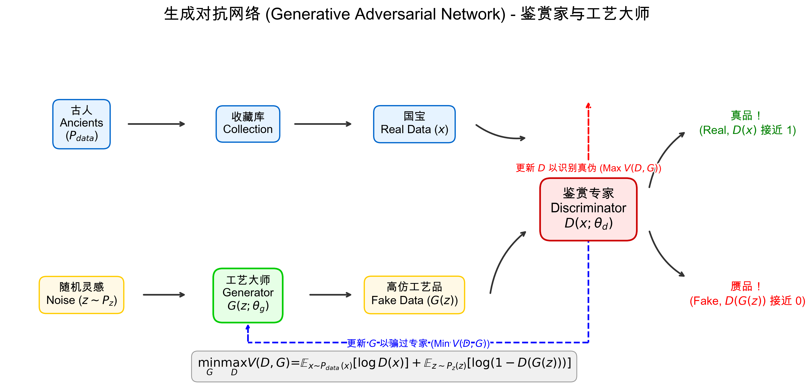
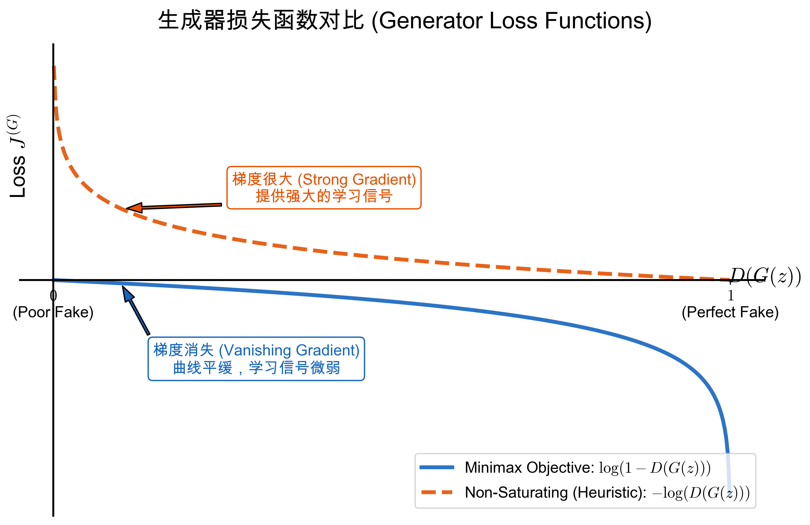

# 生成对抗网络 (Generative Adversarial Network)

## 1. 介绍 (Introduction)

生成对抗网络 (Generative Adversarial Network) 是由 Ian Goodfellow 等人在 2014 年提出的一种深度学习模型，属于生成模型的一种。其核心思想来源于博弈论中的纳什均衡，包含两个神经网络：一个是生成器 (Generator, $G$)，另一个是判别器 (Discriminator, $D$)。

它们之间的关系可以形象地比喻为“造假者”与“鉴赏家”（或工作坊的工艺大师与古董鉴赏专家）的对抗过程。
- **工艺大师 ($G$)**：目标是根据随机灵感（噪声 $z$）制造出可以以假乱真的“高仿工艺品” $G(z)$。
- **鉴赏专家 ($D$)**：目标是尽力区分出面前的物品是来自收藏库里的“真品国宝” $x$，还是工艺大师制造的“赝品” $G(z)$。

在不断的对抗和反馈中，双方的水平都会不断提高（双高）。最终目的是工艺大师的造假水平由于过高，使得鉴赏专家也无法分辨真伪（即 $D(G(z)) = 0.5$）。

<!-- Generated by scripts/generate_ch31_gan_concept.py -->

### 1.1 形式化数学定义与目标函数 (Formal Mathematical Definition and Objective)

为了更严谨地描述这个对抗过程（参考 Goodfellow et al., 2014），我们首先定义以下基本的数学符号：
- $x$: 真实数据样本。
- $p_{data}(x)$: 真实数据的概率分布 (对应于真实国宝的分布)。
- $z$: 输入给生成器的随机噪声 (通常采样自简单分布，如高斯分布或均匀分布)。
- $p_z(z)$: 噪声的先验分布。
- $G(z; \theta_g)$: 生成器函数 (工艺大师)，将噪声 $z$ 映射到数据空间，参数为 $\theta_g$。其生成的假数据分布记为 $p_g(x)$。
- $D(x; \theta_d)$: 判别器函数 (鉴赏专家)，输出一个 0 到 1 之间的标量，表示输入 $x$ 来自真实数据分布 $p_{data}$ 的概率。参数为 $\theta_d$。

#### 1.1.1 判别器 $D$ 的目标 (Binary Cross-Entropy)

对于判别器 $D$ 而言，它的任务是一个标准的**二分类问题 (Binary Classification)**：区分输入是真 ($y=1$) 还是假 ($y=0$)。
在二分类问题中，我们通常最大化对数似然，或者等价地，最小化二元交叉熵 (Binary Cross-Entropy, BCE) 损失。
由于 $D(x)$ 的目标是输出输入为“真”的概率，它希望：
1. 对于真实的 $x \sim p_{data}(x)$，$D(x)$ 尽可能接近 1，即最大化 $\log D(x)$。
2. 对于生成的 $G(z), z \sim p_z(z)$，$D(G(z))$ 尽可能接近 0，即最大化 $\log(1 - D(G(z)))$。

综合起来，判别器 $D$ 的价值函数 (Value Function) 是在最大化这两项的期望：
$$
\max_D V(D) = \mathbb{E}_{x \sim p_{data}(x)}[\log D(x)] + \mathbb{E}_{z \sim p_z(z)}[\log(1 - D(G(z)))]
$$

#### 1.1.2 极小极大博弈 (Minimax Game)

生成器 $G$ 的目标则恰恰相反：它希望**最小化判别器正确识别其生成物为假的概率**。也就是说，生成器希望 $D(G(z))$ 尽可能接近 1 (成功骗过判别器)，这等价于最小化 $\log(1 - D(G(z)))$。由于生成器无法影响真实数据那部分（公式的第一项），它的目标就是：
$$
\min_G V(G) = \mathbb{E}_{z \sim p_z(z)}[\log(1 - D(G(z)))]
$$

将 $D$ 和 $G$ 的目标结合起来，就形成了一个经典的**极小极大博弈 (Minimax Game)** 目标函数：

$$
\min_G \max_D V(D, G) = \mathbb{E}_{x \sim p_{data}(x)}[\log D(x)] + \mathbb{E}_{z \sim p_z(z)}[\log(1 - D(G(z)))]
$$

#### 1.1.3 理论最优点: 纳什均衡 (Nash Equilibrium)

如果赋予 $D$ 和 $G$ 足够强大的拟合能力（非参数极限），这个博弈最终会达到一个完美的平衡点，即**纳什均衡 (Nash Equilibrium)**：
1. 生成器完美地学会了真实数据的分布，即 $p_g = p_{data}$。
2. 面对真假难辨的数据，判别器 $D$ 只能靠“瞎猜”，对于任何输入，它判断为真的概率都是一半：$D(x) = \frac{1}{2}$。

#### 1.1.4 实际训练技巧: 非饱和损失 (Non-Saturating Loss)

虽然理论上的极小极大公式非常优雅，但在**实际训练 (Practical Training)**的初期，它会导致一个严重的问题：**梯度消失 (Vanishing Gradients)**。

- 在训练刚开始时，$G$ 生成的图片通常像一团乱码，而 $D$ 很容易就能区分真假，迅速把 $D(G(z))$ 推向 0。
- 当 $D(G(z)) \to 0$ 时，$1 - D(G(z)) \to 1$，那么 $\log(1 - D(G(z))) \to 0$。
- 如果画出 $y = \log(1 - x)$ 在 $x \to 0$ 附近的曲线，你会发现它的**斜率（梯度）非常平缓**。这意味着生成器 $G$ 这时候几乎接收不到指导它如何改进的强梯度信号（可以说是被判别器打击得体无完肤，不知道该怎么改了）。

> [!TIP]
> 为了解决这个问题，Goodfellow 等人提出了一种启发式（Heuristic）的替代方案：**非饱和损失 (Non-Saturating Loss)**。
> 我们不再让 $G$ 去**最小化** $\log(1 - D(G(z)))$（即不寻求“让自己不被看出的概率最小”），
> 而是让 $G$ 去**最大化** $\log(D(G(z)))$（即主动“最大化自己被判定为真的概率”）。

新的更实用的生成器目标变为：
$$
\max_G \mathbb{E}_{z \sim p_z(z)}[\log D(G(z))]
$$

这两种写法在理论上追求的极值点相同，但 $y = \log(x)$ 在 $x \to 0$ 时梯度非常大，能够为初期的生成器提供极强的学习信号，有效避免了梯度消失。这也是现今大多数标准 GAN 实现所采用损失函数的形式。

<!-- Generated by scripts/generate_ch31_gan_loss_curves.py -->

## 2. 全局最优解 (Global Optimal Solution)

在这一节中，我们将通过严格的数学推导，证明 GAN 的极小极大博弈确实存在一个全局最优解，且该最优解正好满足我们的直觉目标：**生成数据分布完美等同于真实数据分布，使得判别器以太极阴阳的五五开概率（0.5）“瞎猜”**。这也是一种隐式密度模型 (Implicit Density Model) 的求解过程。

我们将目标函数的推导分为两步：
1. **固定生成器 $G$**，求出能让当前价值函数 $V(D, G)$ 最大的**最优判别器 $D_G^*$**。
2. **将最优判别器 $D_G^*$ 代回原函数**，求出能让价值函数最小的**最优生成器 $G^*$**。

为了简化公式，我们接下来用 $p_d$ 代替 $p_{data}(x)$ 代表真实数据分布，用 $p_g$ 代表生成数据分布，且积分变量 $x$ 默认省略。

### 2.1 固定生成器 $G$，求解最优判别器 $D_G^*$

我们的目标是：在这个“以假乱真的大师”（$p_g \rightarrow p_{data}$）对抗中，对于**任意固定**的生成器 $G$，先求出判别器 $D$ 的最大化目标函数。

根据极小极大公式，固定 $G$ 时，我们需要求解：
$$
\max_D V(D, G) = \max_D \Big( \mathbb{E}_{x \sim p_{data}}[\log D(x)] + \mathbb{E}_{z \sim p_z}[\log(1 - D(G(z)))] \Big)
$$

由于 $x = G(z)$ 的分布就是 $p_g(x)$，我们可以将第二项对噪声 $z$ 的期望，改写为对生成数据 $x \sim p_g$ 的期望：
$$
V(D, G) = \mathbb{E}_{x \sim p_d}[\log D(x)] + \mathbb{E}_{x \sim p_g}[\log(1 - D(x))]
$$

由于期望就是连续概率密度函数的积分，展开可得：
$$
\max_D V(D, G) = \int p_d \cdot \log D \,dx + \int p_g \cdot \log(1 - D) \,dx
$$
$$
= \int \Big[ p_d \cdot \log D + p_g \cdot \log(1 - D) \Big] \,dx \qquad (1)
$$

为了最大化整个积分值，我们需要让被积函数在定义域（对于任意的 $x$）内都取最大值。此时，我们可以把 $D(x)$ 看作一个未知的单变量标量变元（记为 $D$）。我们将积分内的表达式（即积分核）对 $D$ 求偏导，并令其等于 $0$：

$$
\frac{\partial}{\partial D} \Big( \max V(D, G) \Big) = \int \frac{\partial}{\partial D} \Big[ p_d \cdot \log D + p_g \cdot \log(1 - D) \Big] \,dx
$$
$$
= \int \Big[ p_d \cdot \frac{1}{D} + p_g \cdot \frac{-1}{1 - D} \Big] \,dx \triangleq 0
$$

为了让积分为零，最优的方式是被积函数处处为零：
$$
p_d \cdot \frac{1}{D} - p_g \cdot \frac{1}{1 - D} = 0
$$

化简这个代数方程求 $D$：
$$
\frac{p_d}{D} = \frac{p_g}{1 - D}
$$
$$
p_d(1 - D) = p_g \cdot D
$$
$$
p_d - p_d \cdot D = p_g \cdot D
$$
$$
D(p_d + p_g) = p_d
$$

于是我们解得**给定生成器 $G$ 时的最优判别器** $D_G^*$ 为：
$$
D_G^*(x) = \frac{p_d}{p_d + p_g} \qquad (2)
$$

这个结果非常直观：当真实数据密度 $p_d$ 远大于生成数据密度 $p_g$ 时，$D_G^*$ 接近 1；反之则接近 0。

### 2.2 代入 $D_G^*$，求解最优生成器 $G^*$

接下来，我们将得到的最优判别器 $(2)$ 式代回极小极大博弈公式中，问题就变成了求 $G$ 的极小值：

$$
\min_G \max_D V(D, G) = \min_G V(D_G^*, G)
$$
$$
= \min_G \mathbb{E}_{x \sim p_d}\left[\log \frac{p_d}{p_d + p_g}\right] + \mathbb{E}_{x \sim p_g}\left[\log \frac{p_g}{p_d + p_g}\right]
$$

为了构造出数学中衡量分布距离的 KL散度 (Kullback-Leibler Divergence)，我们在对数内部的分子分母同乘（或提取）常数 $\frac{1}{2}$：

$$
= \min_G \mathbb{E}_{x \sim p_d}\left[\log \left( \frac{p_d}{(p_d + p_g)/2} \cdot \frac{1}{2} \right)\right] + \mathbb{E}_{x \sim p_g}\left[\log \left( \frac{p_g}{(p_d + p_g)/2} \cdot \frac{1}{2} \right)\right]
$$

利用对数性质 $\log(A \cdot B) = \log A + \log B$，把乘上的 $\frac{1}{2}$ 拆分成 $-\log 2$ 放在外面：

$$
= \min_G \mathbb{E}_{x \sim p_d}\left[\log \frac{p_d}{(p_d + p_g)/2} \right] - \log 2 + \mathbb{E}_{x \sim p_g}\left[\log \frac{p_g}{(p_d + p_g)/2} \right] - \log 2
$$

合并常数项，并回想 KL 散度的定义公式：$KL(P || Q) = \mathbb{E}_{x \sim P} \left[ \log \frac{P(x)}{Q(x)} \right]$。我们可以将上式转换为两个 KL 散度的和：

$$
= \min_G \left\{ KL\left( p_d \Big|\Big| \frac{p_d + p_g}{2} \right) + KL\left( p_g \Big|\Big| \frac{p_d + p_g}{2} \right) \right\} - 2\log 2
$$
$$
= \min_G \left\{ KL\left( p_d \Big|\Big| \frac{p_d + p_g}{2} \right) + KL\left( p_g \Big|\Big| \frac{p_d + p_g}{2} \right) \right\} - \log 4
$$

大括号内的这两项组合，在数学信息论中被称为 **Jensen-Shannon 散度 (JSD)**，其用来平滑且对称地衡量两个分布的差异。所以我们的目标函数化简为最终形式：

$$
= \min_G 2 \cdot JSD(p_d || p_g) - \log 4 \qquad (3)
$$

### 2.3 结论 (Conclusion)

由于距离度量（如 KL散度和 JSD散度）的非负性物理意义，即对于任何两个分布 $P$ 和 $Q$，永远有 $JSD(P || Q) \ge 0$。

因此，由式 $(3)$ 可知，整个目标函数 $V(D_G^*, G)$ 的全局下界是：
$$
V \ge -\log 4
$$

而这个极小值“$=$”当且仅当两个分布完全一致（散度为0）时才能取到。即：
$$
p_g = p_d
$$

**结论**：当且仅当工艺大师 (生成器) 完全掌握了真实国宝 (数据) 的生成规律，即生成概率分布 $p_g^*$ 完美等于真实数据概率分布 $p_d$ 时，达成全局最优。

此时，将 $p_g^* = p_d$ 代回最优判别器公式 $(2)$：
$$
D_G^*(x) = \frac{p_d}{p_d + p_d} = \frac{1}{2}
$$

这从数学上严格证明了：在训练的最理想终点，判别器对于所有输入的数据，都会给出 $0.5$ 的概率。这说明鉴赏专家已经完全无法分辨真伪（认为具有一半真一半假的可能），游戏达到纳什均衡！
