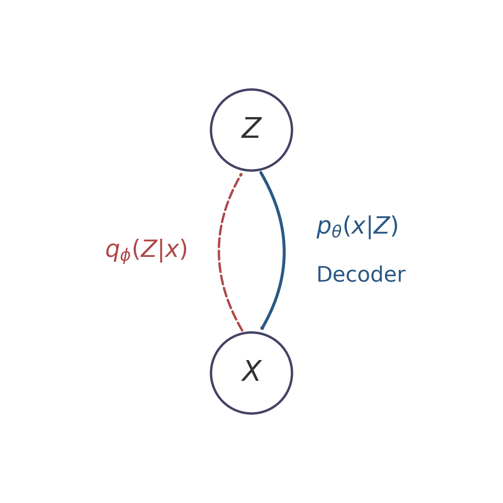

# 变分自编码器 (Variational Autoencoder)

## 1. 模型表示 (Model Representation)

变分自编码器 (VAE) 是一种隐变量模型 (Latent Variable Model)。我们可以用概率图模型来表示从隐变量到观测变量的生成过程：

$$
Z \longrightarrow X
$$

其中 $\mathbf{Z}$ 是隐变量，$\mathbf{X}$ 是观测数据。

为了更好地理解 VAE 的生成过程，我们可以将其与高斯混合模型 (Gaussian Mixture Model, GMM) 作为一个对比。

### 1.1 与 GMM 的对比

**GMM (有限个高斯分布混合)**:
在 GMM 中，隐变量 $Z$ 是离散的，服从类别分布 (Categorical Distribution)。它表示数据来自于 $K$ 个可能的高斯分布中的哪一个：

| $Z$ | $1$ | $2$ | $\dots$ | $K$ |
|---|---|---|---|---|
| $P$ | $p_1$ | $p_2$ | $\dots$ | $p_K$ |

满足 $\sum_{i=1}^K p_i = 1$。
给定 $Z=i$ 的条件，数据 $X$ 服从对应的高斯分布：
$$
X|Z=i \sim \mathcal{N}(\mu_i, \Sigma_i)
$$

**VAE (无限个高斯分布混合)**:
VAE 可以看作是无限个高斯分布的混合 (infinite Gaussian Dist 混合)。在 VAE 中，我们假设隐变量 $Z$ 是连续的，通常设定其先验分布为各向同性的标准正态分布：
$$
Z \sim \mathcal{N}(0, I)
$$

由于 $Z$ 是连续的，它可以取无限种可能的值。给定连续的 $Z$ 后，$X$ 的条件分布仍假设为高斯分布，但这时的均值和协方差矩阵都是由参数均为 $\theta$ 的神经网络计算得出：
$$
X|Z \sim \mathcal{N}(\mu_\theta(Z), \Sigma_\theta(Z))
$$

这也是深度学习与概率图模型结合的体现：用强大的神经网络来拟合极度复杂的非线性映射 $\mu_\theta(\cdot)$ 和 $\Sigma_\theta(\cdot)$。

### 1.2 为什么需要变分推断？

​	在 VAE 中，我们通过极大似然估计来优化参数，即最大化观测数据 $X$ 的边缘概率密度函数 $p_\theta(x)$。根据全概率公式，我们可以写出：
$$
p_\theta(x) = \int p_\theta(x, Z) dZ = \int p_\theta(Z) p_\theta(x|Z) dZ
$$

由于我们需要对连续变量 $Z$ 整个空间进行积分，并且 $p_\theta(x|Z)$ 的分布参数（均值和方差）是通过高度非线性的神经网络从 $Z$ 映射来的，这就导致上述**积分是不可解 (intractable) 的**。没有任何闭式解可以计算出这个积分的值。

进一步，如果我们想要求隐变量的后验分布，根据贝叶斯定理：
$$
p_\theta(Z|x) = \frac{p_\theta(Z) p_\theta(x|Z)}{p_\theta(x)}
$$

由于分母上的证据项 (evidence) $p_\theta(x)$ 是 intractable 的，这同样导致**真实的后验概率 $p_\theta(Z|x)$ 也是 intractable 的**。

既然真实的后验分布求不出来，我们就只能引入一个新的容易处理的分布 $q_\phi(Z|x)$ 来**近似**真实的后验分布 $p_\theta(Z|x)$，这就是变分推断的核心思想。

## 2. 变分推断 (Variational Inference)

回到我们的图模型，现在我们有两个方向的映射：
- $p_\theta(x|Z)$: **Decoder (解码器)**，也称作生成模型 (Generative Model)，由隐变量 $Z$ 还原出观测数据 $X$。
- $q_\phi(Z|x)$: **Encoder (编码器)**，也称作推断模型 (Inference Model)，由于真实后验不可解，我们用神经网络 $q_\phi$ 来近似给定真实数据 $X$ 时隐变量 $Z$ 的分布。

<!-- Generated by scripts/generate_ch32_vae_pgm.py -->

### 2.1 证据下界 (ELBO) 的推导

对于观测数据 $x$，对数似然 $\log p_\theta(x)$ 可以被拆解为两部分：证据下界 (Evidence Lower Bound, ELBO) 和 KL 散度 (Kullback-Leibler Divergence)：

$$
\log p_\theta(x) = \text{ELBO} + KL(q_\phi(Z|x) || p_\theta(Z|x))
$$

由于 KL 散度恒大于等于 0，即 $KL \ge 0$，因此 $\text{ELBO}$ 构成了 $\log p_\theta(x)$ 的下界（即 $\log p_\theta(x) \ge \text{ELBO}$）。

### 2.2 与 EM 算法的联系

我们可以用期望最大化 (Expectation-Maximization, EM) 算法的视角来理解这个过程：

- **E-step (期望步)**:
  当我们令近似分布完美贴合真实后验分布，即 $q = p_\theta(Z|x)$ 时，$KL(q_\phi(Z|x) || p_\theta(Z|x)) = 0$。此时 $\log p_\theta(x) = \text{ELBO}$（目标函数取到最严丝合缝的下界）。

- **M-step (最大化步)**:
  优化模型参数 $\theta$，即 $\theta = \arg\max \text{ELBO} = \arg\max \mathbb{E}_{p_\theta(Z|x)}[\log p_\theta(x, Z)]$。

### 2.3 目标函数最大化

在变分自编码器中，我们的最终目标是联合优化 $\theta$ 和 $\phi$，即最大化对数似然的下界 ELBO：

$$
\langle \hat{\theta}, \hat{\phi} \rangle = \arg\max \text{ELBO} = \arg\min KL(q_\phi(Z|x) || p_\theta(Z|x))
$$

我们可以一步步把 ELBO 展开，看看我们要优化的最终形态是什么：

$$
\begin{aligned}
\text{ELBO} &= \mathbb{E}_{q_\phi(Z|x)} \left[ \log \frac{p_\theta(x, Z)}{q_\phi(Z|x)} \right] \\
&= \mathbb{E}_{q_\phi(Z|x)} [ \log p_\theta(x, Z) ] - \mathbb{E}_{q_\phi(Z|x)} [ \log q_\phi(Z|x) ] \\
&= \mathbb{E}_{q_\phi(Z|x)} [ \log p_\theta(x, Z) ] + H[q_\phi] \\
&= \mathbb{E}_{q_\phi(Z|x)} [ \log p_\theta(x|Z) ] + \mathbb{E}_{q_\phi(Z|x)} [\log p_\theta(Z)] - \mathbb{E}_{q_\phi(Z|x)} [\log q_\phi(Z|x)]\\
&= \mathbb{E}_{q_\phi(Z|x)} [ \log p_\theta(x|Z) ] - KL(q_\phi(Z|x) || p_\theta(Z))
\end{aligned}
$$

最终目标函数包含两项：
1. **重构误差 (Reconstruction error)**: $\mathbb{E}_{q_\phi(Z|x)} [ \log p_\theta(x|Z) ]$，即在给定隐变量 $Z$ 时，解码器要尽可能逼真地还原 $x$。
2. **正则化项 (Regularization)**: $- KL(q_\phi(Z|x) || p_\theta(Z))$，即编码器得到的后验分布 $q_\phi(Z|x)$ 要尽可能接近先验分布 $p_\theta(Z) = \mathcal{N}(\mathbf{0}, \mathbf{I})$。

### 2.4 重参数化技巧 (Reparameterization Trick)

为了让梯度能够从 Decoder 反向传播通过由于采样造成的随机节点 $Z$ 回到 Encoder，在实现上我们采用了**SGVI (Stochastic Gradient Variational Inference)** 或称为 **SGVB / SVI / Amortized Inference**。

核心思想是不把 $Z$ 当作一个从分布里直接采样出来的黑盒节点，而是用以下重参数化方式改写：
假设输入 $x$ 经过编码网络后得到均值 $\mu_\phi$ 和方差 $\Sigma_\phi$，为了得到 $Z$，我们先从标准正态分布采样噪声 $\varepsilon$：
$$
\varepsilon \sim \mathcal{N}(0, I)
$$
然后把期望和方差通过乘加运算给这团噪声赋予含义：
$$
Z = \mu_\phi(x) + \Sigma_\phi(x)^{\frac{1}{2}} \cdot \varepsilon
$$
这样 $Z|x$ 同样满足 $\mathcal{N}(\mu_\phi(x), \Sigma_\phi(x|x))$，但关键点在于此时 $\varepsilon$ 成了随机的尽头，而关于参数 $\phi$ 的计算变成了确定的连续可导运算，梯度就可以顺利流传给神经网络 $\text{NN}_\phi$ 了。
