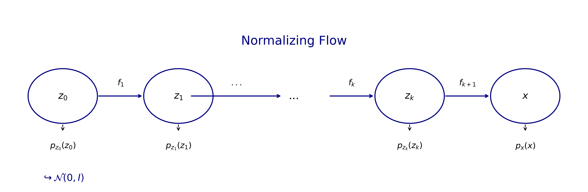
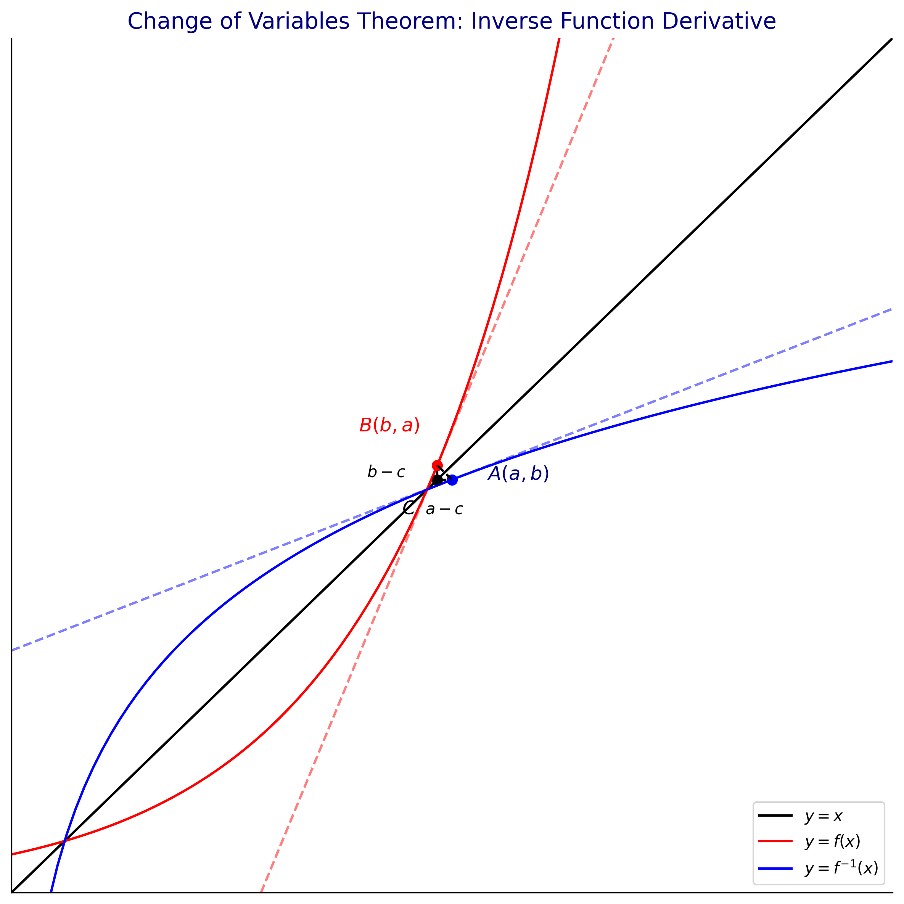

# 第三十三章：标准化流 (Normalizing Flow)

本章我们将介绍 Normalizing Flow (标准化流) 这一强大的生成模型概念，并深入推导其核心的数学基础：换元积分定理 (Change of Variables Theorem)。

## 1. 什么是 Normalizing Flow？

在机器学习中，我们经常需要对复杂的数据分布（例如图像的像素分布）进行建模。直接建模复杂的概率密度函数 $P_X(x)$ 非常困难。Normalizing Flow 提供了一种巧妙的解决思路：

我们从一个简单且易于采样的基础分布开始（通常是标准正态分布 $Z \sim \mathcal{N}(0, I)$），然后通过一系列**可逆**的、**连续**的非线性映射 $f_k$，将这个简单分布逐步“流动”（变换）成目标复杂分布 $X$。

整个变换序列可以表示为：

$$
z_0 \xrightarrow{f_1} z_1 \xrightarrow{f_2} \dots \xrightarrow{f_K} z_K \triangleq x
$$

其中，初始变量 $z_0$ 服从简单分布 $P_{z_0}(z_0)$，最终变量 $x$ 服从复杂分布 $P_X(x)$。

由于每一步映射 $f_k$ 都是可逆的，我们可以计算出变换后的概率密度分布。这主要依赖于微积分中的“换元积分定理”。

<!-- Generated by scripts/generate_ch33_transform_chain.py -->

## 2. 换元积分定理 (Change of Variables Theorem)

### 2.1 一维情况的推导

假设有两个连续随机变量 $z$ 和 $x$，它们都属于实数集 $\mathbb{R} \to \mathbb{R}$。
已知：
- $x = f(z)$，且映射函数 $f$ 是连续且**可逆**的（单调递增或递减）。
- $z \sim P_Z(z)$
- $x \sim P_X(x)$

我们要如何由 $P_Z(z)$ 求出 $P_X(x)$ 呢？

根据概率密度的性质，在变换过程中，概率的质量必须守恒。也就是说，变量 $z$ 落在整个定义域上的概率积分为1，映射后变量 $x$ 的概率积分也必须为1：

$$
\int_{Z} P_Z(z) \, dz = 1 = \int_{X} P_X(x) \, dx
$$

更局部地看，这寓意着：

$$
| P_Z(z) \, dz | = | P_X(x) \, dx |
$$

*(加绝对值是因为概率分布必须是非负的，而微分 $dx$ 的方向可能因为函数 $f$ 的单调性相反)*

对等式两边同除以 $|dx|$，我们可以得到 $x$ 的概率密度函数：

$$
P_X(x) = \left| \frac{dz}{dx} \right| \cdot P_Z(z)
$$

由于 $x = f(z)$，且函数 $f$ 是可逆的，我们可以将其写成反函数形式 $z = f^{-1}(x)$。此时 $\frac{dz}{dx}$ 就是反函数的导数 $\frac{\partial f^{-1}(x)}{\partial x}$。

或者，如果用原函数表示：

$$
P_X(x) = \left| \frac{\partial f(z)}{\partial z} \right|^{-1} \cdot P_Z(z)
$$

### 2.2 反函数导数的几何直观理解

根据反函数推导，为什么 $\frac{dz}{dx}$ 可以写成正向映射的导数倒数？我们可以通过几何图形上的点来直观理解：

假设原函数曲线为 $y = f(x)$，对应的反函数为关于 $y=x$ 对称的曲线 $y = f^{-1}(x)$。

设原函数曲线上有一点 $B(b, a)$。根据对称性，在反函数曲线上对应必然存在另一点 $A(a, b)$。

*   对于反函数，经过点 $A(a, b)$ 的导数记为 $(f^{-1})'(a)$，它等价于该点切线的斜率（即图中夹角为 $\theta$ 的正切）。我们可以用直角三角形近似为 $\tan \theta = \frac{b-c}{a-c}$。
*   对于原函数，经过点 $B(b, a)$ 的导数记为 $f'(b)$，对应的切线斜率（图中夹角为 $\theta'$ 的正切）。近似为 $\tan \theta' = \frac{a-c}{b-c}$。

显然，这两者互为倒数：

$$
(f^{-1})'(a) \cdot f'(b) = 1
$$

这意味着：

$$
\left| \frac{\partial f^{-1}(x)}{\partial x} \right| = \left| \frac{\partial f(z)}{\partial z} \right|^{-1}
$$

<!-- Generated by scripts/generate_ch33_inverse_derivative.py -->

### 2.3 多维空间推广：雅可比行列式 (Jacobian Determinant)

当随机变量 $z$ 和 $x$ 从一维扩展到多维（例如 $\mathbb{R}^D$）时，导数 $\frac{\partial f^{-1}(\mathbf{x})}{\partial \mathbf{x}}$ 就演变成了**雅可比矩阵 (Jacobian Matrix)**。

求导数绝对值的操作，就对应于计算这个雅可比矩阵的**行列式的绝对值** (Jacobian Determinant)。它代表了多维空间下积分变换造成的体积缩放比例。

那么多维形式的换元积分定理为：

$$
P_X(x) = \left| \det \left( \frac{\partial f^{-1}(x)}{\partial x} \right) \right| \cdot P_Z(z)
$$

如果用连续的变换序列（映射链）来表示，从 $z_0$ 到 $x$ 的完整概率密度为：

$$
P_X(x) = P_{Z_0}(z_0) \prod_{k=1}^{K} \left| \det \left( \frac{\partial f_k(z_{k-1})}{\partial z_{k-1}} \right) \right|^{-1}
$$

这也是 Normalizing Flow 模型设计的核心挑战：选择的变换结构 $f_k$ 必须**易于求逆**（计算 $z$），且其雅可比矩阵的**行列式能够被高效计算**（降低复杂度），这样才能快速求解复杂的概率分布 $P_X(x)$。
